# Design Document

## Overview

The Qt Quick 3D documentation system will be implemented as a collection of 38 structured Markdown documents, each following a standardized 7-section format. The system prioritizes consistency, practical usability, and comprehensive coverage of Qt Quick 3D components from basic elements to advanced rendering techniques.

The documentation architecture follows a modular approach where each component/concept gets its own dedicated file, enabling easy maintenance and targeted updates while maintaining cross-references between related topics.

## Architecture

```mermaid
graph TD
    A[docs/Quick3D/] --> B[Core Components]
    A --> C[Rendering Pipeline]
    A --> D[Animation System]
    A --> E[Integration Features]
    A --> F[Development Tools]
    A --> G[Optimization Guides]
    
    B --> B1[Model.md]
    B --> B2[Meshes.md]
    B --> B3[Camera.md]
    B --> B4[Lights.md]
    
    C --> C1[Scene-Rendering.md]
    C --> C2[Frontend-Backend-synchronization.md]
    C --> C3[Post-Processing-Effects.md]
    
    D --> D1[Animation.md]
    D --> D2[Skeletal-Animation.md]
    D --> D3[Morphing-Animation.md]
    
    E --> E1[2D-in-3D-integration-Direct-Path.md]
    E --> E2[3D-in-2D-integration.md]
    
    F --> F1[Balsam-Asset-Import-Tool.md]
    F --> F2[Shadergen-Tool.md]
    
    G --> G1[Optimizing-3D-Assets.md]
    G --> G2[Anti-Aliasing-Techniques.md]
```



## Components and Interfaces

### Document Structure Template

Each document follows this exact 7-section structure:

1. **是什么** - Definition and positioning with ASCII/Mermaid diagram
2. **常用属性一览表** - Standardized property table with performance hints
3. **属性详解** - Detailed explanation of high-frequency properties (marked with ★)
4. **最小可运行示例** - Complete runnable example with file structure
5. **踩坑与调试** - Common pitfalls and debugging guidance
6. **延伸阅读** - 1-2 external reference links with descriptions
7. **附录：完整属性清单** - Collapsible complete property listing

### Content Categories

**Core 3D Components (8 documents)**
- Model, Meshes, Camera, Lights, DirectionalLight, PointLight, SpotLight, CustomMaterial, PrincipledMaterial

**Scene Management (6 documents)**  
- Loader3D, Repeater3D, Scene-Manager, View3D-renderMode, Dynamic-Model-Creation

**Animation System (3 documents)**
- Animation, Skeletal-Animation, Morphing-Animation

**Rendering Pipeline (8 documents)**
- Frontend-Backend-synchronization, Scene-Rendering, Qt-Quick-Spatial-Scene-Graph, Set-up-Render-Target, Prepare-for-Render, High-Level-render-preparation, Low-Level-render-preparation, Post-Processing-Effects

**Integration Features (4 documents)**
- 2D-in-3D-integration-Direct-Path, 2D-in-3D-Integration-Texture-Path, 3D-in-2D-integration, Quick-3D

**Advanced Rendering (5 documents)**
- Instanced-Rendering, Post-Processing, Temporal-and-Progressive-Antialiasing, Super-Sampling-Antialiasing-SSAA, Physically-Based-Rendering

**Optimization & Tools (4 documents)**
- Optimizing-2D-Assets, Optimizing-3D-Assets, Anti-Aliasing-Techniques, Image-Based-Lighting, Balsam-Asset-Import-Tool, Shadergen-Tool

## Data Models

### Document Metadata Structure
```yaml
---
title: <Component Name>
tags:
- QtQuick3D
- <Category>
- 中文
---
```

### Property Table Schema
```markdown
| 属性名 | 类型 | 默认值 | 取值范围 | 作用 | 性能/质量提示 |
| ------ | ---- | ------ | -------- | ---- | -------------- |
| property★ | type | default | range/enum | description | performance note |
```

### Code Example Structure
```
文件树：
project/
├── main.qml
├── assets/
│   └── model.mesh
└── CMakeLists.txt

完整代码：
[Complete runnable QML code]

预期效果：
[20-word description of expected visual result]
```

## Error Handling

### Version Compatibility Handling
- Document Qt version differences inline with clear annotations
- Use format: `Qt 6.2: behavior A | Qt 6.5+: behavior B`
- Include migration guidance for breaking changes

### Code Validation Strategy
- All code examples must be syntactically correct
- Include disclaimer for AI-generated examples that cannot be runtime-tested
- Provide fallback explanations when code cannot be verified

### Missing Information Handling
- Use "待补充" placeholder for incomplete sections
- Maintain document structure even with missing content
- Include TODO comments for future updates

## Testing Strategy

### Content Validation
- Verify all 38 documents follow exact 7-section structure
- Check YAML front-matter consistency across all files
- Validate internal cross-references and external links

### Code Example Testing
- Syntax validation for all QML code snippets
- File structure verification for example projects
- Property table completeness checking

### Language and Style Consistency
- Chinese language consistency with preserved English technical terms
- Tone consistency (official + practical insights)
- Forbidden phrase detection ("首先、然后、接着")

## File Organization Strategy

### Directory Structure
```
docs/Quick3D/
├── Model.md
├── Meshes.md
├── Balsam-Asset-Import-Tool.md
├── Camera.md
├── CustomMaterial.md
├── PrincipledMaterial.md
├── Lights.md
├── DirectionalLight.md
├── Loader3D.md
├── Repeater3D.md
├── Animation.md
├── PointLight.md
├── SpotLight.md
├── Dynamic-Model-Creation.md
├── Instanced-Rendering.md
├── Morphing-Animation.md
├── Skeletal-Animation.md
├── 2D-in-3D-integration-Direct-Path.md
├── Quick-3D.md
├── 2D-in-3D-Integration-Texture-Path.md
├── 3D-in-2D-integration.md
├── Scene-Manager.md
├── View3D-renderMode.md
├── Frontend-Backend-synchronization.md
├── Scene-Rendering.md
├── Qt-Quick-Spatial-Scene-Graph.md
├── Set-up-Render-Target.md
├── Prepare-for-Render.md
├── High-Level-render-preparation.md
├── Low-Level-render-preparation.md
├── Post-Processing-Effects.md
├── Post-Processing.md
├── Temporal-and-Progressive-Antialiasing.md
├── Super-Sampling-Antialiasing-SSAA.md
├── Optimizing-2D-Assets.md
├── Optimizing-3D-Assets.md
├── Image-Based-Lighting.md
├── Physically-Based-Rendering.md
├── Anti-Aliasing-Techniques.md
└── Shadergen-Tool.md
```

### Naming Convention
- File names match document titles exactly
- Spaces replaced with hyphens
- Case-sensitive matching
- No special characters except hyphens

## Content Generation Workflow

### Phase 1: Core Components (Documents 1-9)
Model → Meshes → Balsam-Asset-Import-Tool → Camera → CustomMaterial → PrincipledMaterial → Lights → DirectionalLight → Loader3D

### Phase 2: Scene & Animation (Documents 10-18)  
Repeater3D → Animation → PointLight → SpotLight → Dynamic-Model-Creation → Instanced-Rendering → Morphing-Animation → Skeletal-Animation → 2D-in-3D-integration-Direct-Path

### Phase 3: Integration & Rendering (Documents 19-27)
Quick-3D → 2D-in-3D-Integration-Texture-Path → 3D-in-2D-integration → Scene-Manager → View3D-renderMode → Frontend-Backend-synchronization → Scene-Rendering → Qt-Quick-Spatial-Scene-Graph → Set-up-Render-Target

### Phase 4: Advanced Features (Documents 28-38)
Prepare-for-Render → High-Level-render-preparation → Low-Level-render-preparation → Post-Processing-Effects → Post-Processing → Temporal-and-Progressive-Antialiasing → Super-Sampling-Antialiasing-SSAA → Optimizing-2D-Assets → Optimizing-3D-Assets → Image-Based-Lighting → Physically-Based-Rendering → Anti-Aliasing-Techniques → Shadergen-Tool

## Quality Assurance

### Content Standards
- No placeholder text like "此处省略" or "..."
- No "详见官方文档" without explanation
- Complete property tables with all required columns
- Runnable code examples with full context

### Technical Accuracy
- Version-specific behavior documentation
- Correct property types and default values
- Valid QML syntax in all examples
- Accurate performance optimization guidance