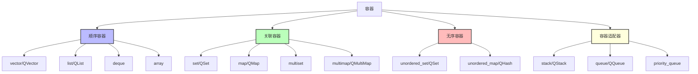
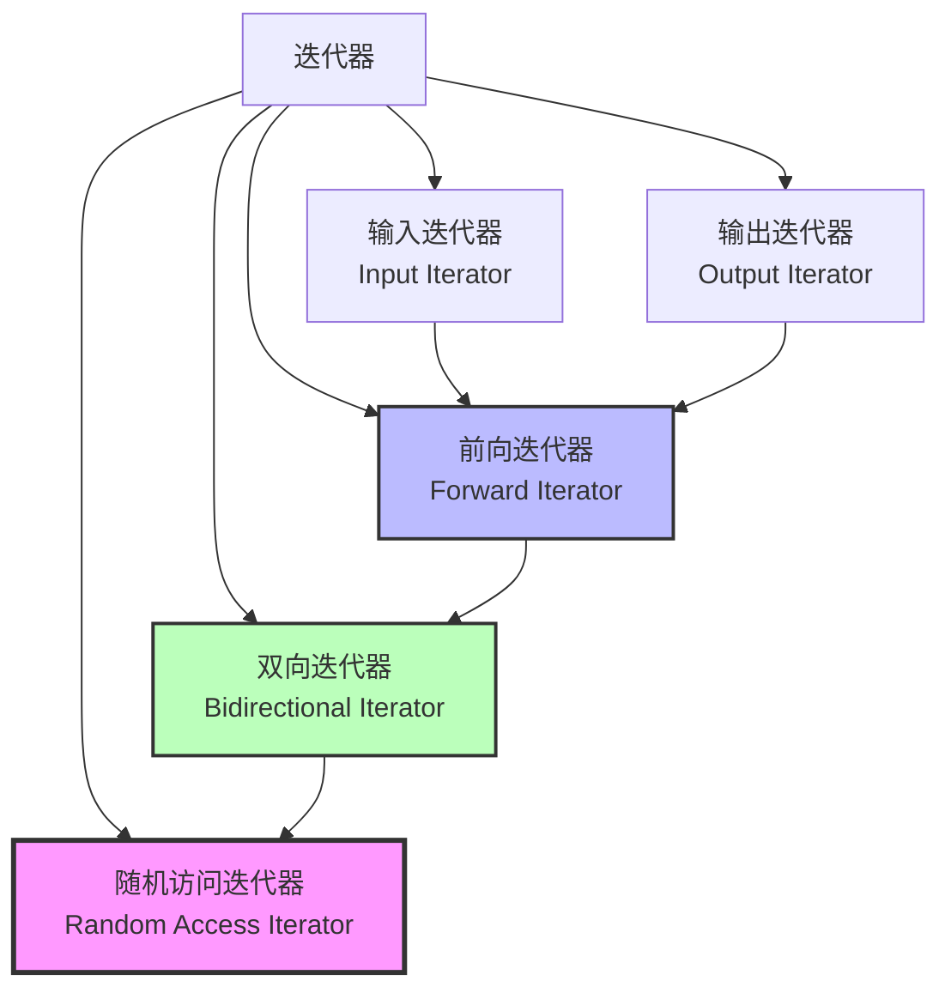
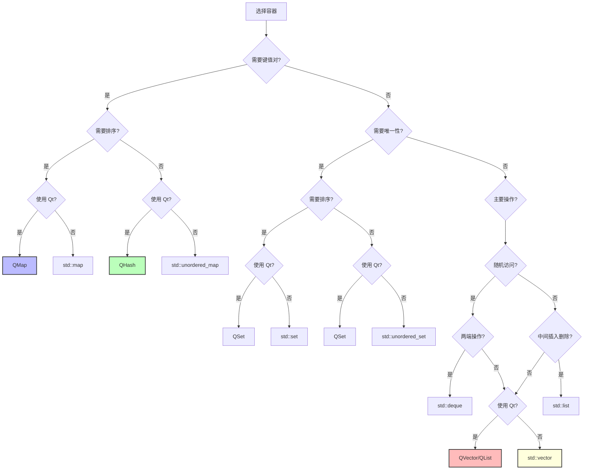

# C++ STL 容器与 Qt 容器深度解析

## 目录
1. [容器概述](#容器概述)
2. [STL 顺序容器](#stl-顺序容器)
3. [STL 关联容器](#stl-关联容器)
4. [STL 无序容器](#stl-无序容器)
5. [STL 容器适配器](#stl-容器适配器)
6. [STL 迭代器详解](#stl-迭代器详解)
7. [Qt 容器详解](#qt-容器详解)
8. [Qt 迭代器详解](#qt-迭代器详解)
9. [性能对比与选择指南](#性能对比与选择指南)
10. [最佳实践](#最佳实践)

---

## 容器概述

### 什么是容器？

容器是用于存储和管理对象集合的数据结构。C++ 提供了两套容器系统：
- **STL 容器**：C++ 标准库容器（`std::vector`, `std::map` 等）
- **Qt 容器**：Qt 框架提供的容器（`QVector`, `QMap` 等）

### 容器分类



---

## STL 顺序容器

顺序容器按照元素添加的顺序存储，支持位置访问。

### 1. std::vector

**特点**：动态数组，连续内存存储

**内存布局**：
```
[元素0][元素1][元素2][元素3]...[未使用空间]
 ↑                              ↑
begin()                        end()
```

**完整示例**：

```cpp
#include <vector>
#include <iostream>
#include <algorithm>

void vectorExample() {
    // 1. 创建和初始化
    std::vector<int> v1;                          // 空 vector
    std::vector<int> v2(10);                      // 10 个默认值（0）
    std::vector<int> v3(10, 5);                   // 10 个值为 5
    std::vector<int> v4 = {1, 2, 3, 4, 5};       // 初始化列表
    std::vector<int> v5(v4.begin(), v4.end());   // 范围构造
    
    // 2. 容量操作
    std::cout << "size: " << v4.size() << std::endl;           // 元素数量
    std::cout << "capacity: " << v4.capacity() << std::endl;   // 容量
    std::cout << "empty: " << v4.empty() << std::endl;         // 是否为空
    
    v4.reserve(100);      // 预留空间（不改变 size）
    v4.shrink_to_fit();   // 释放多余空间
    
    // 3. 元素访问
    int first = v4[0];              // 下标访问（不检查边界）
    int second = v4.at(1);          // at() 访问（检查边界，抛异常）
    int& front = v4.front();        // 第一个元素
    int& back = v4.back();          // 最后一个元素
    int* data = v4.data();          // 底层数组指针
    
    // 4. 修改操作
    v4.push_back(6);                // 尾部添加
    v4.pop_back();                  // 尾部删除
    v4.insert(v4.begin() + 2, 99);  // 在位置 2 插入 99
    v4.erase(v4.begin() + 2);       // 删除位置 2 的元素
    v4.clear();                     // 清空所有元素
    
    // 5. 迭代器遍历
    std::vector<int> v = {1, 2, 3, 4, 5};
    
    // 正向迭代器
    for (auto it = v.begin(); it != v.end(); ++it) {
        std::cout << *it << " ";
    }
    
    // 反向迭代器
    for (auto it = v.rbegin(); it != v.rend(); ++it) {
        std::cout << *it << " ";
    }
    
    // 范围 for（C++11）
    for (const auto& elem : v) {
        std::cout << elem << " ";
    }
    
    // 6. 算法操作
    std::sort(v.begin(), v.end());                    // 排序
    auto it = std::find(v.begin(), v.end(), 3);       // 查找
    std::reverse(v.begin(), v.end());                 // 反转
    
    // 7. emplace 操作（C++11，原地构造，避免拷贝）
    struct Point { int x, y; Point(int a, int b) : x(a), y(b) {} };
    std::vector<Point> points;
    points.emplace_back(1, 2);  // 直接构造，不需要临时对象
    // 等价于：points.push_back(Point(1, 2));  // 需要临时对象
}
```

**时间复杂度**：
- 随机访问：O(1)
- 尾部插入/删除：O(1) 均摊
- 中间插入/删除：O(n)
- 查找：O(n)

**适用场景**：
- 需要频繁随机访问
- 主要在尾部添加/删除
- 元素数量相对稳定

**注意事项**：
```cpp
// ⚠️ 迭代器失效问题
std::vector<int> v = {1, 2, 3, 4, 5};
auto it = v.begin();
v.push_back(6);  // 可能导致重新分配，it 失效！
// *it;  // 危险！未定义行为

// ✅ 正确做法
auto index = std::distance(v.begin(), it);
v.push_back(6);
it = v.begin() + index;  // 重新获取迭代器
```

---

### 2. std::list

**特点**：双向链表，非连续内存

**内存布局**：
```
[节点1] <-> [节点2] <-> [节点3] <-> [节点4]
  ↑                                    ↑
begin()                              end()

每个节点：[prev指针][数据][next指针]
```

**完整示例**：

```cpp
#include <list>
#include <iostream>

void listExample() {
    // 1. 创建和初始化
    std::list<int> l1;
    std::list<int> l2 = {1, 2, 3, 4, 5};
    std::list<int> l3(10, 5);  // 10 个值为 5
    
    // 2. 元素访问（没有随机访问！）
    int first = l2.front();
    int last = l2.back();
    // l2[0];  // ❌ 错误！list 不支持下标访问
    
    // 3. 修改操作
    l2.push_back(6);      // 尾部添加
    l2.push_front(0);     // 头部添加
    l2.pop_back();        // 尾部删除
    l2.pop_front();       // 头部删除
    
    // 4. 插入和删除（不会使迭代器失效）
    auto it = l2.begin();
    std::advance(it, 2);  // 移动到位置 2
    l2.insert(it, 99);    // 在 it 前插入 99
    l2.erase(it);         // 删除 it 位置的元素（it 失效）
    
    // 5. 链表特有操作
    std::list<int> l4 = {10, 20, 30};
    std::list<int> l5 = {40, 50};
    
    // splice：将 l5 的元素移动到 l4
    l4.splice(l4.end(), l5);  // l4: {10,20,30,40,50}, l5: {}
    
    // merge：合并两个有序链表
    std::list<int> l6 = {1, 3, 5};
    std::list<int> l7 = {2, 4, 6};
    l6.merge(l7);  // l6: {1,2,3,4,5,6}, l7: {}
    
    // remove：删除所有等于指定值的元素
    l6.remove(3);  // 删除所有值为 3 的元素
    
    // remove_if：删除满足条件的元素
    l6.remove_if([](int x) { return x % 2 == 0; });  // 删除偶数
    
    // unique：删除连续重复元素
    std::list<int> l8 = {1, 1, 2, 2, 3, 3};
    l8.unique();  // l8: {1, 2, 3}
    
    // sort：链表排序（不能使用 std::sort）
    l6.sort();
    
    // reverse：反转链表
    l6.reverse();
    
    // 6. 迭代器遍历
    for (auto it = l2.begin(); it != l2.end(); ++it) {
        std::cout << *it << " ";
    }
}
```

**时间复杂度**：
- 随机访问：不支持
- 头部/尾部插入删除：O(1)
- 中间插入删除：O(1)（如果已有迭代器）
- 查找：O(n)

**适用场景**：
- 频繁在中间插入/删除
- 不需要随机访问
- 需要稳定的迭代器（插入删除不会使其他迭代器失效）

---

### 3. std::deque

**特点**：双端队列，分段连续内存

**内存布局**：
```
中央控制数组：
[指针0][指针1][指针2][指针3]
   ↓      ↓      ↓      ↓
[块0]  [块1]  [块2]  [块3]
每个块是连续内存
```

**完整示例**：

```cpp
#include <deque>
#include <iostream>

void dequeExample() {
    // 1. 创建和初始化
    std::deque<int> d1;
    std::deque<int> d2 = {1, 2, 3, 4, 5};
    
    // 2. 元素访问（支持随机访问）
    int first = d2[0];
    int second = d2.at(1);
    int front = d2.front();
    int back = d2.back();
    
    // 3. 修改操作
    d2.push_back(6);      // 尾部添加 O(1)
    d2.push_front(0);     // 头部添加 O(1)
    d2.pop_back();        // 尾部删除 O(1)
    d2.pop_front();       // 头部删除 O(1)
    
    // 4. 插入和删除
    auto it = d2.begin() + 2;
    d2.insert(it, 99);    // 中间插入 O(n)
    d2.erase(it);         // 中间删除 O(n)
    
    // 5. 迭代器遍历
    for (const auto& elem : d2) {
        std::cout << elem << " ";
    }
}
```

**时间复杂度**：
- 随机访问：O(1)
- 头部/尾部插入删除：O(1)
- 中间插入删除：O(n)

**适用场景**：
- 需要在两端频繁插入/删除
- 需要随机访问
- 不需要连续内存（与 vector 的主要区别）

**vector vs deque vs list 对比**：

| 特性 | vector | deque | list |
|------|--------|-------|------|
| 内存布局 | 连续 | 分段连续 | 非连续（链表） |
| 随机访问 | O(1) | O(1) | 不支持 |
| 头部插入 | O(n) | O(1) | O(1) |
| 尾部插入 | O(1) | O(1) | O(1) |
| 中间插入 | O(n) | O(n) | O(1) |
| 迭代器稳定性 | 低 | 中 | 高 |
| 内存开销 | 低 | 中 | 高 |

---

### 4. std::array (C++11)

**特点**：固定大小数组，编译期确定大小

**完整示例**：

```cpp
#include <array>
#include <iostream>

void arrayExample() {
    // 1. 创建（大小必须是编译期常量）
    std::array<int, 5> arr1 = {1, 2, 3, 4, 5};
    std::array<int, 5> arr2{};  // 所有元素初始化为 0
    
    // 2. 元素访问
    int first = arr1[0];
    int second = arr1.at(1);
    int front = arr1.front();
    int back = arr1.back();
    int* data = arr1.data();
    
    // 3. 容量
    std::cout << "size: " << arr1.size() << std::endl;  // 编译期常量
    std::cout << "empty: " << arr1.empty() << std::endl;
    
    // 4. 填充
    arr2.fill(10);  // 所有元素设为 10
    
    // 5. 交换
    arr1.swap(arr2);
    
    // 6. 迭代器
    for (auto it = arr1.begin(); it != arr1.end(); ++it) {
        std::cout << *it << " ";
    }
    
    // 7. 与 C 数组的互操作
    int c_array[5] = {1, 2, 3, 4, 5};
    std::array<int, 5> cpp_array;
    std::copy(std::begin(c_array), std::end(c_array), cpp_array.begin());
}
```

**优势**：
- 零开销抽象（与 C 数组性能相同）
- 提供 STL 容器接口
- 边界检查（at() 方法）
- 可以作为函数返回值

**适用场景**：
- 大小固定且编译期已知
- 需要 STL 容器接口的数组
- 替代 C 风格数组


---

## STL 关联容器

关联容器通过键（key）来存储和访问元素，内部通常使用红黑树实现，元素自动排序。

### 1. std::set

**特点**：有序集合，元素唯一，自动排序

**内部结构**：红黑树（平衡二叉搜索树）

```
        [5]
       /   \
     [3]   [8]
    /  \   /  \
  [1] [4][7] [9]
```

**完整示例**：

```cpp
#include <set>
#include <iostream>

void setExample() {
    // 1. 创建和初始化
    std::set<int> s1;
    std::set<int> s2 = {5, 2, 8, 1, 9};  // 自动排序：{1, 2, 5, 8, 9}
    
    // 自定义比较器
    std::set<int, std::greater<int>> s3 = {5, 2, 8};  // 降序：{8, 5, 2}
    
    // 2. 插入元素
    s1.insert(10);
    s1.insert(5);
    s1.insert(5);  // 重复元素不会插入
    
    auto [it, success] = s1.insert(15);  // C++17 结构化绑定
    if (success) {
        std::cout << "插入成功: " << *it << std::endl;
    }
    
    // emplace：原地构造
    s1.emplace(20);
    
    // 3. 删除元素
    s1.erase(10);           // 删除值为 10 的元素
    s1.erase(s1.begin());   // 删除迭代器指向的元素
    
    size_t count = s1.erase(5);  // 返回删除的元素数量（0 或 1）
    
    // 4. 查找元素
    auto it = s1.find(15);
    if (it != s1.end()) {
        std::cout << "找到: " << *it << std::endl;
    }
    
    // count：检查元素是否存在（返回 0 或 1）
    if (s1.count(15)) {
        std::cout << "15 存在" << std::endl;
    }
    
    // contains (C++20)
    if (s1.contains(15)) {
        std::cout << "15 存在" << std::endl;
    }
    
    // 5. 范围查询
    std::set<int> s = {1, 3, 5, 7, 9, 11, 13};
    
    // lower_bound：第一个 >= 给定值的元素
    auto lb = s.lower_bound(6);  // 指向 7
    
    // upper_bound：第一个 > 给定值的元素
    auto ub = s.upper_bound(6);  // 指向 7
    
    // equal_range：返回 [lower_bound, upper_bound)
    auto [first, last] = s.equal_range(7);
    
    // 6. 集合操作
    std::set<int> a = {1, 2, 3, 4, 5};
    std::set<int> b = {4, 5, 6, 7, 8};
    
    // 并集
    std::set<int> union_set;
    std::set_union(a.begin(), a.end(), 
                   b.begin(), b.end(),
                   std::inserter(union_set, union_set.begin()));
    // {1, 2, 3, 4, 5, 6, 7, 8}
    
    // 交集
    std::set<int> intersection_set;
    std::set_intersection(a.begin(), a.end(),
                          b.begin(), b.end(),
                          std::inserter(intersection_set, intersection_set.begin()));
    // {4, 5}
    
    // 差集
    std::set<int> difference_set;
    std::set_difference(a.begin(), a.end(),
                        b.begin(), b.end(),
                        std::inserter(difference_set, difference_set.begin()));
    // {1, 2, 3}
    
    // 7. 迭代器遍历（有序）
    for (const auto& elem : s) {
        std::cout << elem << " ";  // 按升序输出
    }
}
```

**时间复杂度**：
- 插入：O(log n)
- 删除：O(log n)
- 查找：O(log n)
- 遍历：O(n)

**适用场景**：
- 需要元素唯一性
- 需要自动排序
- 需要快速查找

---

### 2. std::map

**特点**：键值对容器，键唯一，按键排序

**完整示例**：

```cpp
#include <map>
#include <iostream>
#include <string>

void mapExample() {
    // 1. 创建和初始化
    std::map<std::string, int> m1;
    std::map<std::string, int> m2 = {
        {"apple", 1},
        {"banana", 2},
        {"cherry", 3}
    };
    
    // 自定义比较器
    std::map<std::string, int, std::greater<std::string>> m3;  // 键降序
    
    // 2. 插入元素
    // 方式1：下标操作符（如果键不存在，会创建）
    m1["apple"] = 1;
    m1["banana"] = 2;
    
    // 方式2：insert
    m1.insert({"cherry", 3});
    m1.insert(std::make_pair("date", 4));
    
    auto [it, success] = m1.insert({"apple", 10});  // 键已存在，插入失败
    if (!success) {
        std::cout << "键已存在，值为: " << it->second << std::endl;
    }
    
    // 方式3：emplace
    m1.emplace("elderberry", 5);
    
    // 方式4：insert_or_assign (C++17)
    m1.insert_or_assign("apple", 10);  // 如果存在则更新
    
    // 方式5：try_emplace (C++17)
    m1.try_emplace("fig", 6);  // 如果不存在则插入
    
    // 3. 访问元素
    // 下标访问（如果键不存在，会创建默认值）
    int value1 = m1["apple"];
    
    // at() 访问（如果键不存在，抛出异常）
    try {
        int value2 = m1.at("grape");
    } catch (const std::out_of_range& e) {
        std::cout << "键不存在" << std::endl;
    }
    
    // 4. 查找元素
    auto it = m1.find("banana");
    if (it != m1.end()) {
        std::cout << "找到: " << it->first << " = " << it->second << std::endl;
    }
    
    // count：检查键是否存在
    if (m1.count("cherry")) {
        std::cout << "cherry 存在" << std::endl;
    }
    
    // contains (C++20)
    if (m1.contains("date")) {
        std::cout << "date 存在" << std::endl;
    }
    
    // 5. 删除元素
    m1.erase("apple");           // 按键删除
    m1.erase(m1.begin());        // 按迭代器删除
    
    // 6. 迭代器遍历（按键排序）
    for (const auto& [key, value] : m1) {  // C++17 结构化绑定
        std::cout << key << ": " << value << std::endl;
    }
    
    // 传统方式
    for (auto it = m1.begin(); it != m1.end(); ++it) {
        std::cout << it->first << ": " << it->second << std::endl;
    }
    
    // 7. 范围查询
    std::map<int, std::string> m = {
        {1, "one"}, {3, "three"}, {5, "five"}, {7, "seven"}
    };
    
    auto lb = m.lower_bound(4);  // 指向 {5, "five"}
    auto ub = m.upper_bound(4);  // 指向 {5, "five"}
    
    // 8. 自定义类型作为键
    struct Person {
        std::string name;
        int age;
        
        // 必须定义 < 运算符
        bool operator<(const Person& other) const {
            if (name != other.name) return name < other.name;
            return age < other.age;
        }
    };
    
    std::map<Person, std::string> personMap;
    personMap[{"Alice", 30}] = "Engineer";
    personMap[{"Bob", 25}] = "Designer";
}
```

**时间复杂度**：
- 插入：O(log n)
- 删除：O(log n)
- 查找：O(log n)
- 下标访问：O(log n)

**适用场景**：
- 需要键值对存储
- 需要按键排序
- 需要快速查找

**注意事项**：
```cpp
// ⚠️ 下标操作符的陷阱
std::map<std::string, int> m;

// 这会创建一个键为 "key"，值为 0 的元素！
if (m["key"] == 0) {  // 即使 "key" 不存在
    // ...
}

// ✅ 正确做法：使用 find 或 count
if (m.find("key") != m.end()) {
    // 键存在
}
```

---

### 3. std::multiset 和 std::multimap

**特点**：允许重复元素/键

```cpp
#include <set>
#include <map>
#include <iostream>

void multiContainerExample() {
    // multiset：允许重复元素
    std::multiset<int> ms = {1, 2, 2, 3, 3, 3};
    ms.insert(2);  // 可以插入重复元素
    
    // count：返回元素出现次数
    std::cout << "2 出现次数: " << ms.count(2) << std::endl;  // 3
    
    // equal_range：获取所有等于给定值的元素范围
    auto [first, last] = ms.equal_range(3);
    for (auto it = first; it != last; ++it) {
        std::cout << *it << " ";  // 3 3 3
    }
    
    // multimap：允许重复键
    std::multimap<std::string, int> mm;
    mm.insert({"apple", 1});
    mm.insert({"apple", 2});  // 同一个键可以有多个值
    mm.insert({"apple", 3});
    
    // 查找所有具有相同键的元素
    auto range = mm.equal_range("apple");
    for (auto it = range.first; it != range.second; ++it) {
        std::cout << it->first << ": " << it->second << std::endl;
    }
    // 输出：
    // apple: 1
    // apple: 2
    // apple: 3
}
```

---

## STL 无序容器

无序容器使用哈希表实现，不保证元素顺序，但查找速度更快。

### 1. std::unordered_set

**特点**：无序集合，元素唯一，哈希表实现

**内部结构**：哈希表 + 链表（处理冲突）

```
哈希表：
[0] -> nullptr
[1] -> [元素A] -> [元素B] -> nullptr
[2] -> [元素C] -> nullptr
[3] -> nullptr
[4] -> [元素D] -> nullptr
```

**完整示例**：

```cpp
#include <unordered_set>
#include <iostream>
#include <string>

void unorderedSetExample() {
    // 1. 创建和初始化
    std::unordered_set<int> us1;
    std::unordered_set<int> us2 = {5, 2, 8, 1, 9};  // 无序
    
    // 2. 插入元素
    us1.insert(10);
    us1.insert(5);
    us1.emplace(15);
    
    // 3. 查找元素（平均 O(1)）
    auto it = us1.find(10);
    if (it != us1.end()) {
        std::cout << "找到: " << *it << std::endl;
    }
    
    // 4. 删除元素
    us1.erase(10);
    
    // 5. 哈希表信息
    std::cout << "bucket_count: " << us1.bucket_count() << std::endl;  // 桶数量
    std::cout << "load_factor: " << us1.load_factor() << std::endl;    // 负载因子
    std::cout << "max_load_factor: " << us1.max_load_factor() << std::endl;
    
    // 6. 自定义哈希函数
    struct Person {
        std::string name;
        int age;
        
        bool operator==(const Person& other) const {
            return name == other.name && age == other.age;
        }
    };
    
    // 自定义哈希函数
    struct PersonHash {
        size_t operator()(const Person& p) const {
            return std::hash<std::string>()(p.name) ^ 
                   (std::hash<int>()(p.age) << 1);
        }
    };
    
    std::unordered_set<Person, PersonHash> personSet;
    personSet.insert({"Alice", 30});
    personSet.insert({"Bob", 25});
    
    // 7. 迭代器遍历（无序）
    for (const auto& elem : us2) {
        std::cout << elem << " ";  // 顺序不确定
    }
}
```

**时间复杂度**：
- 插入：O(1) 平均，O(n) 最坏
- 删除：O(1) 平均，O(n) 最坏
- 查找：O(1) 平均，O(n) 最坏

**set vs unordered_set 对比**：

| 特性 | set | unordered_set |
|------|-----|---------------|
| 内部实现 | 红黑树 | 哈希表 |
| 元素顺序 | 有序 | 无序 |
| 查找时间 | O(log n) | O(1) 平均 |
| 插入时间 | O(log n) | O(1) 平均 |
| 内存开销 | 低 | 高 |
| 迭代器稳定性 | 高 | 中 |

**选择建议**：
- 需要有序：使用 `set`
- 只需要快速查找：使用 `unordered_set`
- 元素数量小（< 100）：差异不大
- 元素数量大：`unordered_set` 更快

---

### 2. std::unordered_map

**特点**：无序键值对容器，哈希表实现

**完整示例**：

```cpp
#include <unordered_map>
#include <iostream>
#include <string>

void unorderedMapExample() {
    // 1. 创建和初始化
    std::unordered_map<std::string, int> um1;
    std::unordered_map<std::string, int> um2 = {
        {"apple", 1},
        {"banana", 2},
        {"cherry", 3}
    };
    
    // 2. 插入元素
    um1["apple"] = 1;
    um1.insert({"banana", 2});
    um1.emplace("cherry", 3);
    
    // 3. 访问元素（平均 O(1)）
    int value = um1["apple"];
    
    // 4. 查找元素
    auto it = um1.find("banana");
    if (it != um1.end()) {
        std::cout << it->first << ": " << it->second << std::endl;
    }
    
    // 5. 删除元素
    um1.erase("apple");
    
    // 6. 迭代器遍历（无序）
    for (const auto& [key, value] : um1) {
        std::cout << key << ": " << value << std::endl;
    }
    
    // 7. 实际应用：单词计数
    std::string text = "hello world hello cpp world";
    std::unordered_map<std::string, int> wordCount;
    
    std::istringstream iss(text);
    std::string word;
    while (iss >> word) {
        wordCount[word]++;  // 自动创建并递增
    }
    
    for (const auto& [word, count] : wordCount) {
        std::cout << word << ": " << count << std::endl;
    }
}
```

**map vs unordered_map 对比**：

| 特性 | map | unordered_map |
|------|-----|---------------|
| 内部实现 | 红黑树 | 哈希表 |
| 键顺序 | 有序 | 无序 |
| 查找时间 | O(log n) | O(1) 平均 |
| 插入时间 | O(log n) | O(1) 平均 |
| 内存开销 | 低 | 高 |
| 范围查询 | 支持 | 不支持 |

---

## STL 容器适配器

容器适配器是对底层容器的封装，提供特定的接口。

### 1. std::stack

**特点**：后进先出（LIFO），默认基于 deque

```cpp
#include <stack>
#include <iostream>

void stackExample() {
    // 1. 创建（默认基于 deque）
    std::stack<int> s1;
    
    // 指定底层容器
    std::stack<int, std::vector<int>> s2;  // 基于 vector
    std::stack<int, std::list<int>> s3;    // 基于 list
    
    // 2. 操作
    s1.push(1);
    s1.push(2);
    s1.push(3);
    
    std::cout << "top: " << s1.top() << std::endl;  // 3
    std::cout << "size: " << s1.size() << std::endl;
    
    s1.pop();  // 删除栈顶元素
    
    // 3. 遍历（需要弹出元素）
    while (!s1.empty()) {
        std::cout << s1.top() << " ";
        s1.pop();
    }
}
```

### 2. std::queue

**特点**：先进先出（FIFO），默认基于 deque

```cpp
#include <queue>
#include <iostream>

void queueExample() {
    // 1. 创建
    std::queue<int> q1;
    
    // 2. 操作
    q1.push(1);
    q1.push(2);
    q1.push(3);
    
    std::cout << "front: " << q1.front() << std::endl;  // 1
    std::cout << "back: " << q1.back() << std::endl;    // 3
    
    q1.pop();  // 删除队首元素
    
    // 3. 遍历
    while (!q1.empty()) {
        std::cout << q1.front() << " ";
        q1.pop();
    }
}
```

### 3. std::priority_queue

**特点**：优先队列，默认大顶堆

```cpp
#include <queue>
#include <iostream>
#include <vector>

void priorityQueueExample() {
    // 1. 创建（默认大顶堆）
    std::priority_queue<int> pq1;
    
    // 小顶堆
    std::priority_queue<int, std::vector<int>, std::greater<int>> pq2;
    
    // 2. 操作
    pq1.push(3);
    pq1.push(1);
    pq1.push(4);
    pq1.push(2);
    
    std::cout << "top: " << pq1.top() << std::endl;  // 4（最大值）
    
    pq1.pop();  // 删除最大值
    
    // 3. 遍历（按优先级）
    while (!pq1.empty()) {
        std::cout << pq1.top() << " ";  // 3 2 1
        pq1.pop();
    }
    
    // 4. 自定义比较器
    auto cmp = [](int a, int b) { return a > b; };  // 小顶堆
    std::priority_queue<int, std::vector<int>, decltype(cmp)> pq3(cmp);
}
```


---

## STL 迭代器详解

迭代器是连接容器和算法的桥梁，提供统一的访问接口。

### 迭代器分类



### 迭代器类型详解

```cpp
#include <vector>
#include <list>
#include <iostream>
#include <iterator>

void iteratorTypesExample() {
    // 1. 输入迭代器（Input Iterator）
    // - 只读，单次遍历
    // - 支持：++, *, ==, !=
    // - 例如：istream_iterator
    std::istringstream iss("1 2 3 4 5");
    std::istream_iterator<int> input_it(iss);
    std::istream_iterator<int> eof;
    
    while (input_it != eof) {
        std::cout << *input_it << " ";
        ++input_it;
    }
    
    // 2. 输出迭代器（Output Iterator）
    // - 只写，单次遍历
    // - 支持：++, *
    // - 例如：ostream_iterator
    std::vector<int> v = {1, 2, 3, 4, 5};
    std::ostream_iterator<int> output_it(std::cout, " ");
    std::copy(v.begin(), v.end(), output_it);
    
    // 3. 前向迭代器（Forward Iterator）
    // - 读写，多次遍历
    // - 支持：++, *, ==, !=
    // - 例如：forward_list 的迭代器
    std::forward_list<int> fl = {1, 2, 3};
    auto fl_it = fl.begin();
    ++fl_it;  // 只能前进
    
    // 4. 双向迭代器（Bidirectional Iterator）
    // - 读写，多次遍历，可前进和后退
    // - 支持：++, --, *, ==, !=
    // - 例如：list, set, map 的迭代器
    std::list<int> l = {1, 2, 3, 4, 5};
    auto l_it = l.begin();
    ++l_it;  // 前进
    --l_it;  // 后退
    
    // 5. 随机访问迭代器（Random Access Iterator）
    // - 读写，多次遍历，支持随机访问
    // - 支持：++, --, +, -, +=, -=, [], <, >, <=, >=
    // - 例如：vector, deque, array 的迭代器
    std::vector<int> vec = {1, 2, 3, 4, 5};
    auto vec_it = vec.begin();
    vec_it += 3;           // 跳转到位置 3
    int value = vec_it[1]; // 随机访问
    
    if (vec_it < vec.end()) {
        // 支持比较
    }
}
```

### 迭代器操作

```cpp
#include <vector>
#include <list>
#include <iterator>
#include <algorithm>

void iteratorOperationsExample() {
    std::vector<int> v = {1, 2, 3, 4, 5};
    
    // 1. 基本操作
    auto it = v.begin();
    ++it;                    // 前进
    --it;                    // 后退（双向迭代器）
    it += 2;                 // 跳转（随机访问迭代器）
    it = it + 3;             // 算术运算
    auto diff = v.end() - v.begin();  // 距离
    
    // 2. std::advance - 移动迭代器
    std::list<int> l = {1, 2, 3, 4, 5};
    auto l_it = l.begin();
    std::advance(l_it, 3);   // 移动 3 步（适用于所有迭代器）
    
    // 3. std::distance - 计算距离
    auto dist = std::distance(l.begin(), l_it);
    std::cout << "距离: " << dist << std::endl;
    
    // 4. std::next 和 std::prev
    auto next_it = std::next(l_it);      // 下一个位置
    auto prev_it = std::prev(l_it);      // 上一个位置
    auto next_n = std::next(l_it, 2);    // 向前 2 步
    
    // 5. 反向迭代器
    std::vector<int> vec = {1, 2, 3, 4, 5};
    
    // 正向遍历
    for (auto it = vec.begin(); it != vec.end(); ++it) {
        std::cout << *it << " ";  // 1 2 3 4 5
    }
    
    // 反向遍历
    for (auto it = vec.rbegin(); it != vec.rend(); ++it) {
        std::cout << *it << " ";  // 5 4 3 2 1
    }
    
    // 6. const 迭代器
    const std::vector<int> const_vec = {1, 2, 3};
    
    // const_iterator：不能修改元素
    for (auto it = const_vec.cbegin(); it != const_vec.cend(); ++it) {
        // *it = 10;  // ❌ 错误！不能修改
        std::cout << *it << " ";
    }
    
    // 7. 插入迭代器
    std::vector<int> src = {1, 2, 3};
    std::vector<int> dest;
    
    // back_inserter：尾部插入
    std::copy(src.begin(), src.end(), std::back_inserter(dest));
    
    // front_inserter：头部插入（需要支持 push_front）
    std::list<int> dest_list;
    std::copy(src.begin(), src.end(), std::front_inserter(dest_list));
    
    // inserter：指定位置插入
    std::vector<int> dest2 = {10, 20, 30};
    std::copy(src.begin(), src.end(), std::inserter(dest2, dest2.begin() + 1));
    // dest2: {10, 1, 2, 3, 20, 30}
}
```

### 迭代器失效

```cpp
#include <vector>
#include <list>
#include <iostream>

void iteratorInvalidationExample() {
    // 1. vector 迭代器失效
    std::vector<int> v = {1, 2, 3, 4, 5};
    
    // ❌ 错误：插入导致迭代器失效
    for (auto it = v.begin(); it != v.end(); ++it) {
        if (*it == 3) {
            v.insert(it, 99);  // 可能导致重新分配，所有迭代器失效
            // it 现在是悬空迭代器！
        }
    }
    
    // ✅ 正确：使用返回的迭代器
    for (auto it = v.begin(); it != v.end(); ) {
        if (*it == 3) {
            it = v.insert(it, 99);  // insert 返回新的有效迭代器
            ++it;  // 跳过插入的元素
        }
        ++it;
    }
    
    // ❌ 错误：删除导致迭代器失效
    for (auto it = v.begin(); it != v.end(); ++it) {
        if (*it == 3) {
            v.erase(it);  // it 失效
            // ++it;  // 未定义行为！
        }
    }
    
    // ✅ 正确：使用返回的迭代器
    for (auto it = v.begin(); it != v.end(); ) {
        if (*it == 3) {
            it = v.erase(it);  // erase 返回下一个有效迭代器
        } else {
            ++it;
        }
    }
    
    // 2. list 迭代器失效
    std::list<int> l = {1, 2, 3, 4, 5};
    
    // list 的插入和删除不会使其他迭代器失效
    auto it1 = l.begin();
    auto it2 = std::next(it1, 2);
    
    l.insert(it2, 99);  // it1 和 it2 仍然有效
    l.erase(it1);       // 只有 it1 失效，it2 仍然有效
    
    // 3. map/set 迭代器失效
    std::map<int, std::string> m = {{1, "one"}, {2, "two"}, {3, "three"}};
    
    auto m_it1 = m.find(1);
    auto m_it2 = m.find(2);
    
    m.erase(m_it1);  // 只有 m_it1 失效，m_it2 仍然有效
}
```

### 迭代器失效规则总结

| 容器 | 插入 | 删除 |
|------|------|------|
| vector | 所有迭代器失效（可能重新分配） | 删除点及之后的迭代器失效 |
| deque | 所有迭代器失效 | 删除点及之后的迭代器失效 |
| list | 不失效 | 只有被删除元素的迭代器失效 |
| set/map | 不失效 | 只有被删除元素的迭代器失效 |
| unordered_set/map | 可能失效（rehash） | 只有被删除元素的迭代器失效 |

---

## Qt 容器详解

Qt 提供了自己的容器类，与 STL 容器类似但有一些差异。

### Qt 容器特点

1. **隐式共享（Implicit Sharing）**：也称为写时复制（Copy-on-Write, COW）
2. **与 Qt 元对象系统集成**：支持 QVariant
3. **Java 风格迭代器**：除了 STL 风格，还提供 Java 风格迭代器

### 1. QVector (Qt 5) / QList (Qt 6)

**注意**：Qt 6 中 QVector 和 QList 合并为 QList

```cpp
#include <QVector>
#include <QDebug>

void qvectorExample() {
    // 1. 创建和初始化
    QVector<int> v1;
    QVector<int> v2(10);           // 10 个默认值
    QVector<int> v3(10, 5);        // 10 个值为 5
    QVector<int> v4 = {1, 2, 3, 4, 5};
    
    // 2. 隐式共享（浅拷贝）
    QVector<int> v5 = v4;  // 浅拷贝，共享数据
    v5[0] = 100;           // 写时复制，此时才真正复制数据
    
    qDebug() << v4[0];  // 1（v4 未改变）
    qDebug() << v5[0];  // 100
    
    // 3. 元素访问
    int first = v4[0];
    int second = v4.at(1);
    int front = v4.first();
    int back = v4.last();
    int* data = v4.data();
    
    // 4. 修改操作
    v4.append(6);           // 尾部添加（等价于 push_back）
    v4.prepend(0);          // 头部添加（等价于 push_front）
    v4.insert(2, 99);       // 在位置 2 插入
    v4.remove(2);           // 删除位置 2 的元素
    v4.removeAll(99);       // 删除所有值为 99 的元素
    v4.clear();             // 清空
    
    // 5. 查找
    QVector<int> v = {1, 2, 3, 4, 5};
    int index = v.indexOf(3);        // 返回索引，未找到返回 -1
    bool contains = v.contains(3);   // 是否包含
    int count = v.count(3);          // 元素出现次数
    
    // 6. STL 风格迭代器
    for (auto it = v.begin(); it != v.end(); ++it) {
        qDebug() << *it;
    }
    
    // 7. Java 风格迭代器
    QVectorIterator<int> it(v);
    while (it.hasNext()) {
        qDebug() << it.next();
    }
    
    // 可变迭代器
    QMutableVectorIterator<int> mut_it(v);
    while (mut_it.hasNext()) {
        int value = mut_it.next();
        if (value == 3) {
            mut_it.remove();  // 删除当前元素
        }
    }
    
    // 8. 范围 for
    for (const auto& elem : v) {
        qDebug() << elem;
    }
    
    // 9. Qt 特有方法
    v.fill(0);              // 所有元素填充为 0
    v.resize(10);           // 调整大小
    v.squeeze();            // 释放多余空间（类似 shrink_to_fit）
    
    QVector<int> v6 = {1, 2, 3};
    QVector<int> v7 = {4, 5, 6};
    v6 += v7;               // 连接两个 vector
    
    // 10. 与 STL 互操作
    std::vector<int> std_vec = v.toStdVector();
    QVector<int> qt_vec = QVector<int>::fromStdVector(std_vec);
}
```

### 2. QList (Qt 5)

**注意**：Qt 5 中的 QList 是特殊的容器，Qt 6 中已改变

```cpp
#include <QList>
#include <QDebug>

void qlistExample() {
    // Qt 5 中的 QList
    QList<int> list;
    
    // 操作与 QVector 类似
    list.append(1);
    list.prepend(0);
    list.insert(1, 99);
    list.removeAt(1);
    
    // QList 特点（Qt 5）：
    // - 对于小于指针大小的类型，直接存储值
    // - 对于大于指针大小的类型，存储指针
    
    // Qt 6 中：QList 就是 QVector
}
```

### 3. QLinkedList (已弃用)

**注意**：Qt 5.15 开始弃用，建议使用 std::list

```cpp
#include <QLinkedList>

void qlinkedListExample() {
    // Qt 5 中的双向链表
    QLinkedList<int> list;
    list.append(1);
    list.prepend(0);
    
    // Qt 6 中：使用 std::list 替代
    std::list<int> std_list;
}
```

### 4. QSet

```cpp
#include <QSet>
#include <QDebug>

void qsetExample() {
    // 1. 创建和初始化
    QSet<int> s1;
    QSet<int> s2 = {1, 2, 3, 4, 5};
    
    // 2. 插入元素
    s1.insert(10);
    s1.insert(5);
    s1 << 15 << 20;  // 流式插入
    
    // 3. 删除元素
    s1.remove(10);
    
    // 4. 查找
    bool contains = s1.contains(5);
    
    // 5. 集合操作
    QSet<int> a = {1, 2, 3, 4, 5};
    QSet<int> b = {4, 5, 6, 7, 8};
    
    QSet<int> union_set = a.unite(b);          // 并集
    QSet<int> intersect_set = a.intersect(b);  // 交集
    QSet<int> subtract_set = a.subtract(b);    // 差集
    
    // 或者使用运算符
    QSet<int> union_set2 = a | b;
    QSet<int> intersect_set2 = a & b;
    QSet<int> subtract_set2 = a - b;
    
    // 6. 迭代器
    for (const auto& elem : s2) {
        qDebug() << elem;
    }
    
    // 7. 与 STL 互操作
    std::set<int> std_set = s2.toStdSet();  // Qt 5
    // Qt 6: 使用 std::set 构造函数
}
```

### 5. QMap

```cpp
#include <QMap>
#include <QDebug>

void qmapExample() {
    // 1. 创建和初始化
    QMap<QString, int> m1;
    QMap<QString, int> m2 = {
        {"apple", 1},
        {"banana", 2},
        {"cherry", 3}
    };
    
    // 2. 插入元素
    m1["apple"] = 1;
    m1.insert("banana", 2);
    m1.insert("cherry", 3);
    
    // 3. 访问元素
    int value = m1["apple"];
    int value2 = m1.value("banana");           // 键不存在返回默认值
    int value3 = m1.value("grape", 0);         // 指定默认值
    
    // 4. 查找
    if (m1.contains("apple")) {
        qDebug() << "apple 存在";
    }
    
    auto it = m1.find("banana");
    if (it != m1.end()) {
        qDebug() << "找到:" << it.key() << "=" << it.value();
    }
    
    // 5. 删除
    m1.remove("apple");
    
    // 6. 迭代器（按键排序）
    for (auto it = m1.begin(); it != m1.end(); ++it) {
        qDebug() << it.key() << ":" << it.value();
    }
    
    // Java 风格迭代器
    QMapIterator<QString, int> it2(m1);
    while (it2.hasNext()) {
        it2.next();
        qDebug() << it2.key() << ":" << it2.value();
    }
    
    // 7. 获取所有键和值
    QList<QString> keys = m1.keys();
    QList<int> values = m1.values();
    
    // 8. 与 STL 互操作
    std::map<QString, int> std_map = m1.toStdMap();
}
```

### 6. QHash

```cpp
#include <QHash>
#include <QDebug>

void qhashExample() {
    // 1. 创建（无序，哈希表）
    QHash<QString, int> h1;
    QHash<QString, int> h2 = {
        {"apple", 1},
        {"banana", 2}
    };
    
    // 2. 操作与 QMap 类似
    h1["apple"] = 1;
    h1.insert("banana", 2);
    
    int value = h1.value("apple");
    bool contains = h1.contains("banana");
    
    // 3. 迭代器（无序）
    for (auto it = h1.begin(); it != h1.end(); ++it) {
        qDebug() << it.key() << ":" << it.value();
    }
    
    // 4. QMap vs QHash
    // QMap：有序，红黑树，O(log n)
    // QHash：无序，哈希表，O(1) 平均
}
```

### 7. QMultiMap 和 QMultiHash

```cpp
#include <QMultiMap>
#include <QMultiHash>
#include <QDebug>

void qmultiContainerExample() {
    // QMultiMap：允许重复键，有序
    QMultiMap<QString, int> mm;
    mm.insert("apple", 1);
    mm.insert("apple", 2);
    mm.insert("apple", 3);
    
    // 获取所有值
    QList<int> values = mm.values("apple");  // {1, 2, 3}
    
    // QMultiHash：允许重复键，无序
    QMultiHash<QString, int> mh;
    mh.insert("apple", 1);
    mh.insert("apple", 2);
}
```

### 8. QStack 和 QQueue

```cpp
#include <QStack>
#include <QQueue>
#include <QDebug>

void qstackQueueExample() {
    // QStack：基于 QVector
    QStack<int> stack;
    stack.push(1);
    stack.push(2);
    stack.push(3);
    
    int top = stack.top();
    stack.pop();
    
    // QQueue：基于 QList
    QQueue<int> queue;
    queue.enqueue(1);
    queue.enqueue(2);
    queue.enqueue(3);
    
    int front = queue.head();
    queue.dequeue();
}
```


---

## Qt 迭代器详解

Qt 提供两种风格的迭代器：STL 风格和 Java 风格。

### STL 风格迭代器

```cpp
#include <QVector>
#include <QMap>
#include <QDebug>

void qtStlIteratorExample() {
    // 1. QVector 迭代器
    QVector<int> v = {1, 2, 3, 4, 5};
    
    // 正向迭代器
    for (QVector<int>::iterator it = v.begin(); it != v.end(); ++it) {
        *it *= 2;  // 可修改
    }
    
    // const 迭代器
    for (QVector<int>::const_iterator it = v.constBegin(); it != v.constEnd(); ++it) {
        qDebug() << *it;  // 只读
    }
    
    // auto 简化
    for (auto it = v.begin(); it != v.end(); ++it) {
        qDebug() << *it;
    }
    
    // 2. QMap 迭代器
    QMap<QString, int> m = {{"a", 1}, {"b", 2}, {"c", 3}};
    
    for (auto it = m.begin(); it != m.end(); ++it) {
        qDebug() << it.key() << ":" << it.value();
        it.value() = 100;  // 可修改值
    }
    
    // 3. 反向迭代器（Qt 6）
    for (auto it = v.rbegin(); it != v.rend(); ++it) {
        qDebug() << *it;
    }
}
```

### Java 风格迭代器

Java 风格迭代器更安全，但稍慢。

```cpp
#include <QVector>
#include <QMap>
#include <QDebug>

void qtJavaIteratorExample() {
    // 1. 只读迭代器
    QVector<int> v = {1, 2, 3, 4, 5};
    
    QVectorIterator<int> it(v);
    while (it.hasNext()) {
        int value = it.next();
        qDebug() << value;
    }
    
    // 反向遍历
    while (it.hasPrevious()) {
        int value = it.previous();
        qDebug() << value;
    }
    
    // 2. 可变迭代器
    QMutableVectorIterator<int> mut_it(v);
    
    while (mut_it.hasNext()) {
        int value = mut_it.next();
        if (value % 2 == 0) {
            mut_it.remove();  // 删除偶数
        }
    }
    
    // 修改元素
    mut_it.toFront();  // 回到开头
    while (mut_it.hasNext()) {
        mut_it.next();
        mut_it.setValue(100);  // 修改当前元素
    }
    
    // 插入元素
    mut_it.toBack();  // 回到末尾
    mut_it.insert(999);
    
    // 3. QMap 的 Java 风格迭代器
    QMap<QString, int> m = {{"a", 1}, {"b", 2}, {"c", 3}};
    
    // 只读
    QMapIterator<QString, int> map_it(m);
    while (map_it.hasNext()) {
        map_it.next();
        qDebug() << map_it.key() << ":" << map_it.value();
    }
    
    // 可变
    QMutableMapIterator<QString, int> mut_map_it(m);
    while (mut_map_it.hasNext()) {
        mut_map_it.next();
        if (mut_map_it.key() == "b") {
            mut_map_it.remove();
        }
    }
}
```

### Qt 迭代器类型对照表

| 容器 | STL 风格迭代器 | Java 风格只读迭代器 | Java 风格可变迭代器 |
|------|----------------|---------------------|---------------------|
| QVector | QVector::iterator | QVectorIterator | QMutableVectorIterator |
| QList | QList::iterator | QListIterator | QMutableListIterator |
| QSet | QSet::iterator | QSetIterator | QMutableSetIterator |
| QMap | QMap::iterator | QMapIterator | QMutableMapIterator |
| QHash | QHash::iterator | QHashIterator | QMutableHashIterator |

### STL 风格 vs Java 风格对比

```cpp
#include <QVector>
#include <QDebug>

void iteratorStyleComparison() {
    QVector<int> v = {1, 2, 3, 4, 5};
    
    // STL 风格：更快，更灵活
    for (auto it = v.begin(); it != v.end(); ) {
        if (*it % 2 == 0) {
            it = v.erase(it);  // 需要处理返回的迭代器
        } else {
            ++it;
        }
    }
    
    // Java 风格：更安全，更易用
    QMutableVectorIterator<int> it(v);
    while (it.hasNext()) {
        if (it.next() % 2 == 0) {
            it.remove();  // 自动处理迭代器
        }
    }
}
```

**选择建议**：
- **STL 风格**：性能关键代码，需要与 STL 算法配合
- **Java 风格**：一般业务代码，更安全易用

---

## 性能对比与选择指南

### 1. 顺序容器性能对比

```cpp
#include <vector>
#include <list>
#include <deque>
#include <QVector>
#include <chrono>
#include <iostream>

void performanceComparison() {
    const int N = 1000000;
    
    // 测试 vector
    auto start = std::chrono::high_resolution_clock::now();
    std::vector<int> vec;
    for (int i = 0; i < N; ++i) {
        vec.push_back(i);
    }
    auto end = std::chrono::high_resolution_clock::now();
    auto duration = std::chrono::duration_cast<std::chrono::milliseconds>(end - start);
    std::cout << "std::vector push_back: " << duration.count() << "ms" << std::endl;
    
    // 测试 list
    start = std::chrono::high_resolution_clock::now();
    std::list<int> lst;
    for (int i = 0; i < N; ++i) {
        lst.push_back(i);
    }
    end = std::chrono::high_resolution_clock::now();
    duration = std::chrono::duration_cast<std::chrono::milliseconds>(end - start);
    std::cout << "std::list push_back: " << duration.count() << "ms" << std::endl;
    
    // 测试 QVector
    start = std::chrono::high_resolution_clock::now();
    QVector<int> qvec;
    for (int i = 0; i < N; ++i) {
        qvec.append(i);
    }
    end = std::chrono::high_resolution_clock::now();
    duration = std::chrono::duration_cast<std::chrono::milliseconds>(end - start);
    std::cout << "QVector append: " << duration.count() << "ms" << std::endl;
}
```

**典型结果**（仅供参考）：
- std::vector: ~10ms
- std::list: ~50ms
- QVector: ~12ms

### 2. 关联容器性能对比

```cpp
void associativePerformanceComparison() {
    const int N = 100000;
    
    // std::map (红黑树)
    auto start = std::chrono::high_resolution_clock::now();
    std::map<int, int> m;
    for (int i = 0; i < N; ++i) {
        m[i] = i;
    }
    auto end = std::chrono::high_resolution_clock::now();
    auto duration = std::chrono::duration_cast<std::chrono::milliseconds>(end - start);
    std::cout << "std::map insert: " << duration.count() << "ms" << std::endl;
    
    // std::unordered_map (哈希表)
    start = std::chrono::high_resolution_clock::now();
    std::unordered_map<int, int> um;
    for (int i = 0; i < N; ++i) {
        um[i] = i;
    }
    end = std::chrono::high_resolution_clock::now();
    duration = std::chrono::duration_cast<std::chrono::milliseconds>(end - start);
    std::cout << "std::unordered_map insert: " << duration.count() << "ms" << std::endl;
    
    // QMap (红黑树)
    start = std::chrono::high_resolution_clock::now();
    QMap<int, int> qm;
    for (int i = 0; i < N; ++i) {
        qm[i] = i;
    }
    end = std::chrono::high_resolution_clock::now();
    duration = std::chrono::duration_cast<std::chrono::milliseconds>(end - start);
    std::cout << "QMap insert: " << duration.count() << "ms" << std::endl;
    
    // QHash (哈希表)
    start = std::chrono::high_resolution_clock::now();
    QHash<int, int> qh;
    for (int i = 0; i < N; ++i) {
        qh[i] = i;
    }
    end = std::chrono::high_resolution_clock::now();
    duration = std::chrono::duration_cast<std::chrono::milliseconds>(end - start);
    std::cout << "QHash insert: " << duration.count() << "ms" << std::endl;
}
```

**典型结果**：
- std::map: ~30ms
- std::unordered_map: ~15ms
- QMap: ~35ms
- QHash: ~18ms

### 3. 容器选择决策树



### 4. 容器选择指南表

| 需求 | 推荐容器 | 原因 |
|------|----------|------|
| 频繁随机访问 | std::vector, QVector | O(1) 随机访问 |
| 频繁尾部插入删除 | std::vector, QVector | O(1) 均摊 |
| 频繁头部插入删除 | std::deque, QList | O(1) |
| 频繁中间插入删除 | std::list | O(1) |
| 需要元素唯一且有序 | std::set, QSet | 自动排序去重 |
| 需要元素唯一且快速查找 | std::unordered_set, QSet | O(1) 查找 |
| 需要键值对且有序 | std::map, QMap | 按键排序 |
| 需要键值对且快速查找 | std::unordered_map, QHash | O(1) 查找 |
| 需要 LIFO | std::stack, QStack | 栈操作 |
| 需要 FIFO | std::queue, QQueue | 队列操作 |
| 需要优先级队列 | std::priority_queue | 堆操作 |
| 固定大小数组 | std::array | 零开销 |
| 与 Qt 元对象系统集成 | Qt 容器 | 支持 QVariant |

---

## 最佳实践

### 1. 预留空间

```cpp
// ❌ 不好：频繁重新分配
std::vector<int> v;
for (int i = 0; i < 1000000; ++i) {
    v.push_back(i);  // 可能多次重新分配
}

// ✅ 好：预留空间
std::vector<int> v;
v.reserve(1000000);  // 一次分配
for (int i = 0; i < 1000000; ++i) {
    v.push_back(i);
}
```

### 2. 使用 emplace 而非 push

```cpp
struct Point {
    int x, y;
    Point(int a, int b) : x(a), y(b) {}
};

// ❌ 不好：创建临时对象
std::vector<Point> v;
v.push_back(Point(1, 2));  // 创建临时对象，然后拷贝/移动

// ✅ 好：原地构造
std::vector<Point> v;
v.emplace_back(1, 2);  // 直接在容器中构造，无临时对象
```

### 3. 避免不必要的拷贝

```cpp
// ❌ 不好：拷贝整个容器
void processVector(std::vector<int> v) {  // 拷贝
    // ...
}

// ✅ 好：传递引用
void processVector(const std::vector<int>& v) {  // 引用
    // ...
}

// ✅ 好：需要修改时传递非 const 引用
void modifyVector(std::vector<int>& v) {
    // ...
}

// ✅ 好：需要所有权时使用移动
void takeOwnership(std::vector<int>&& v) {  // 右值引用
    std::vector<int> local = std::move(v);
    // ...
}
```

### 4. 选择合适的查找方法

```cpp
std::vector<int> v = {1, 2, 3, 4, 5};

// ❌ 不好：线性查找
auto it = std::find(v.begin(), v.end(), 3);  // O(n)

// ✅ 好：如果需要频繁查找，使用 set 或 unordered_set
std::unordered_set<int> s = {1, 2, 3, 4, 5};
auto it = s.find(3);  // O(1) 平均
```

### 5. 使用范围 for 循环

```cpp
std::vector<int> v = {1, 2, 3, 4, 5};

// ❌ 不好：传统循环
for (size_t i = 0; i < v.size(); ++i) {
    std::cout << v[i] << " ";
}

// ✅ 好：范围 for（C++11）
for (const auto& elem : v) {
    std::cout << elem << " ";
}

// ✅ 好：需要修改时去掉 const
for (auto& elem : v) {
    elem *= 2;
}
```

### 6. 正确处理迭代器失效

```cpp
std::vector<int> v = {1, 2, 3, 4, 5};

// ❌ 错误：迭代器失效
for (auto it = v.begin(); it != v.end(); ++it) {
    if (*it == 3) {
        v.erase(it);  // it 失效
        // ++it;  // 未定义行为
    }
}

// ✅ 正确：使用返回的迭代器
for (auto it = v.begin(); it != v.end(); ) {
    if (*it == 3) {
        it = v.erase(it);  // 获取新的有效迭代器
    } else {
        ++it;
    }
}

// ✅ 更好：使用算法
v.erase(std::remove(v.begin(), v.end(), 3), v.end());
```

### 7. Qt 容器的隐式共享

```cpp
// Qt 容器使用隐式共享（COW）
QVector<int> v1 = {1, 2, 3, 4, 5};
QVector<int> v2 = v1;  // 浅拷贝，共享数据

// ⚠️ 注意：修改会触发深拷贝
v2[0] = 100;  // 此时才真正复制数据

// ✅ 如果需要独立副本，使用 detach
QVector<int> v3 = v1;
v3.detach();  // 强制深拷贝
```

### 8. STL vs Qt 容器选择

**使用 STL 容器的场景**：
- 纯 C++ 项目
- 性能关键代码
- 需要与 STL 算法配合
- 跨平台且不依赖 Qt

**使用 Qt 容器的场景**：
- Qt 项目
- 需要与 Qt 元对象系统集成
- 需要 QVariant 支持
- 需要隐式共享特性
- 使用 Qt 的信号槽传递容器

```cpp
// Qt 信号槽中传递容器
class MyClass : public QObject {
    Q_OBJECT
signals:
    void dataChanged(const QVector<int>& data);  // Qt 容器
    // void dataChanged(const std::vector<int>& data);  // 也可以，但需要注册元类型
};

// 注册 STL 容器到 Qt 元对象系统
Q_DECLARE_METATYPE(std::vector<int>)
qRegisterMetaType<std::vector<int>>("std::vector<int>");
```

---

## 总结

### 容器特性对比总结表

| 容器 | 内存布局 | 随机访问 | 插入 | 删除 | 查找 | 排序 | 适用场景 |
|------|----------|----------|------|------|------|------|----------|
| vector | 连续 | O(1) | O(n) | O(n) | O(n) | 否 | 随机访问，尾部操作 |
| list | 链表 | 不支持 | O(1) | O(1) | O(n) | 否 | 中间插入删除 |
| deque | 分段 | O(1) | O(n) | O(n) | O(n) | 否 | 两端操作 |
| set | 红黑树 | 不支持 | O(log n) | O(log n) | O(log n) | 是 | 有序唯一集合 |
| map | 红黑树 | 不支持 | O(log n) | O(log n) | O(log n) | 是 | 有序键值对 |
| unordered_set | 哈希表 | 不支持 | O(1) | O(1) | O(1) | 否 | 快速查找集合 |
| unordered_map | 哈希表 | 不支持 | O(1) | O(1) | O(1) | 否 | 快速查找键值对 |

### 关键要点

1. **选择合适的容器**：根据操作特点选择
2. **预留空间**：避免频繁重新分配
3. **使用 emplace**：减少临时对象
4. **避免拷贝**：使用引用或移动语义
5. **注意迭代器失效**：插入删除后更新迭代器
6. **STL vs Qt**：根据项目需求选择
7. **性能测试**：实际测试验证选择

### 学习建议

1. **熟练掌握 vector 和 map**：最常用的容器
2. **理解迭代器**：容器和算法的桥梁
3. **实践性能对比**：亲自测试不同容器的性能
4. **阅读源码**：深入理解容器实现
5. **使用 STL 算法**：配合容器使用

希望这份文档能帮助你深入理解 C++ STL 容器和 Qt 容器！
