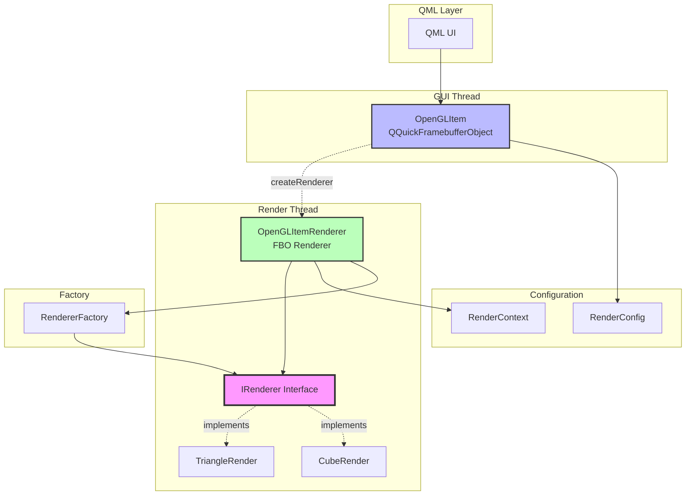

# 设计文档（基于 QQuickFramebufferObject）

## 概述

本设计文档描述了如何使用 **QQuickFramebufferObject** 创建自定义 OpenGL 组件，并通过引入抽象层、设计模式和现代 C++ 实践来实现松耦合、易测试、易扩展的渲染架构。

### 核心设计原则

1. **依赖倒置原则（DIP）**：高层模块不依赖低层模块，两者都依赖抽象（IRenderer）
2. **单一职责原则（SRP）**：每个类只负责一个明确的职责
3. **开闭原则（OCP）**：对扩展开放，对修改关闭
4. **依赖注入（DI）**：通过构造函数或 setter 注入依赖

### 关键技术选择

✅ **使用 QQuickFramebufferObject**：Qt Quick 中创建自定义 OpenGL 组件的正确方式
- 渲染到独立的 FBO（Framebuffer Object）
- 与 Qt Quick 场景图完美集成
- 支持所有 QML 特性（透明度、变换、裁剪等）
- 线程安全的渲染架构

---

## 架构

### 整体架构图




### 分层架构

```
┌─────────────────────────────────────────┐
│         QML/UI Layer                    │
└─────────────────────────────────────────┘
                  ↓
┌─────────────────────────────────────────┐
│  Presentation Layer (OpenGLItem)        │
│  - QQuickFramebufferObject              │
│  - 配置管理                              │
│  - 属性暴露                              │
│  [GUI Thread]                           │
└─────────────────────────────────────────┘
                  ↓ createRenderer()
┌─────────────────────────────────────────┐
│  Rendering Layer (OpenGLItemRenderer)   │
│  - FBO 管理                              │
│  - 渲染循环                              │
│  - 数据同步                              │
│  [Render Thread]                        │
└─────────────────────────────────────────┘
                  ↓
┌─────────────────────────────────────────┐
│    Abstraction Layer (IRenderer)        │
│  - 渲染器接口定义                        │
│  - 回调接口定义                          │
└─────────────────────────────────────────┘
                  ↓
┌─────────────────────────────────────────┐
│  Implementation Layer (TriangleRender)  │
│  - OpenGL 调用                           │
│  - 着色器管理                            │
│  - 缓冲区管理                            │
└─────────────────────────────────────────┘
                  ↓
┌─────────────────────────────────────────┐
│         OpenGL API                      │
└─────────────────────────────────────────┘
```

### 线程模型

```
GUI Thread                          Render Thread
-----------                         -------------
OpenGLItem                          OpenGLItemRenderer
    |                                      |
    | createRenderer() -------------------> 创建
    |                                      |
    | update() -------------------------> synchronize()
    |                                      |
    |                                      render()
    |                                      ↓
    |                                   IRenderer::render()
    |                                      |
    | update() -------------------------> synchronize()
    |                                      |
    |                                      render()
```

**关键点**：
- OpenGLItem 在 GUI 线程，负责配置和属性
- OpenGLItemRenderer 在渲染线程，负责 OpenGL 调用
- 通过 `synchronize()` 方法同步数据
- 渲染到独立的 FBO，不影响场景图

---

## 组件和接口

### 1. IRenderer 接口（核心抽象）

**职责**：定义所有渲染器必须实现的标准接口

**设计决策**：
- 不继承 QObject，保持纯 C++ 接口
- 使用虚析构函数确保正确的多态销毁
- 返回布尔值表示操作成功/失败
- 接受上下文对象而不是原始参数

```cpp
// IRenderer.h
#ifndef IRENDERER_H
#define IRENDERER_H

#include <memory>
#include <functional>
#include <string>

// 前向声明
class RenderContext;
class RenderConfig;

// 渲染错误枚举
enum class RenderError {
    None = 0,
    InitializationFailed,
    ShaderCompilationFailed,
    BufferCreationFailed,
    RenderingFailed
};

// 回调函数类型定义
using ErrorCallback = std::function<void(RenderError, const std::string&)>;
using StateCallback = std::function<void(const std::string&)>;

// 渲染器接口
class IRenderer {
public:
    virtual ~IRenderer() = default;
    
    // 初始化渲染器
    virtual bool initialize(const RenderConfig& config) = 0;
    
    // 执行渲染
    virtual bool render(const RenderContext& context) = 0;
    
    // 调整视口大小
    virtual bool resize(int width, int height) = 0;
    
    // 清理资源
    virtual void cleanup() = 0;
    
    // 设置错误回调
    virtual void setErrorCallback(ErrorCallback callback) = 0;
    
    // 获取渲染器名称（用于调试）
    virtual std::string getName() const = 0;
};

#endif // IRENDERER_H
```

**接口设计原理**：
- **initialize()**: 接受配置对象，支持不同的初始化参数
- **render()**: 接受上下文对象，包含所有渲染所需的动态信息
- **resize()**: 独立的尺寸调整方法，简化接口
- **cleanup()**: 显式资源清理，确保 OpenGL 资源在正确的上下文中释放
- **setErrorCallback()**: 回调机制替代信号槽，降低对 Qt 的依赖

---

### 2. RenderContext 类（上下文封装）

**职责**：封装渲染过程中需要的所有上下文信息

**设计决策**：
- 值语义，可以安全复制
- 不可变对象，线程安全
- 包含所有渲染所需的动态数据

```cpp
// RenderContext.h
#ifndef RENDERCONTEXT_H
#define RENDERCONTEXT_H

#include <QMatrix4x4>
#include <QSize>

class RenderContext {
public:
    RenderContext(const QSize& viewportSize = QSize(800, 600), 
                  const QMatrix4x4& projectionMatrix = QMatrix4x4(),
                  float deltaTime = 0.0f)
        : m_viewportSize(viewportSize)
        , m_projectionMatrix(projectionMatrix)
        , m_deltaTime(deltaTime)
        , m_frameNumber(0)
    {}
    
    // Getters
    QSize viewportSize() const { return m_viewportSize; }
    int width() const { return m_viewportSize.width(); }
    int height() const { return m_viewportSize.height(); }
    QMatrix4x4 projectionMatrix() const { return m_projectionMatrix; }
    float deltaTime() const { return m_deltaTime; }
    quint64 frameNumber() const { return m_frameNumber; }
    
    // 创建新的上下文（不可变模式）
    RenderContext withFrameNumber(quint64 frame) const {
        RenderContext ctx = *this;
        ctx.m_frameNumber = frame;
        return ctx;
    }
    
    RenderContext withDeltaTime(float dt) const {
        RenderContext ctx = *this;
        ctx.m_deltaTime = dt;
        return ctx;
    }

private:
    QSize m_viewportSize;
    QMatrix4x4 m_projectionMatrix;
    float m_deltaTime;
    quint64 m_frameNumber;
};

#endif // RENDERCONTEXT_H
```

**上下文设计原理**：
- **不可变性**：一旦创建，内容不可修改，避免并发问题
- **值语义**：可以安全复制和传递
- **完整性**：包含渲染所需的所有信息，渲染器不需要访问外部状态


### 3. RenderConfig 类（配置封装）

**职责**：封装渲染器的静态配置信息

**设计决策**：
- 使用 Builder 模式构建配置
- 支持链式调用
- 提供合理的默认值

```cpp
// RenderConfig.h
#ifndef RENDERCONFIG_H
#define RENDERCONFIG_H

#include <QString>
#include <QVector3D>
#include <QVector4D>
#include <vector>

// 顶点数据结构
struct VertexData {
    QVector3D position;
    QVector3D color;
    
    VertexData() = default;
    VertexData(const QVector3D& pos, const QVector3D& col)
        : position(pos), color(col) {}
};

class RenderConfig {
public:
    RenderConfig() = default;
    
    // Builder 模式 - 链式调用
    RenderConfig& setVertexShaderPath(const QString& path) {
        m_vertexShaderPath = path;
        return *this;
    }
    
    RenderConfig& setFragmentShaderPath(const QString& path) {
        m_fragmentShaderPath = path;
        return *this;
    }
    
    RenderConfig& setVertexData(const std::vector<VertexData>& data) {
        m_vertexData = data;
        return *this;
    }
    
    RenderConfig& setClearColor(float r, float g, float b, float a = 1.0f) {
        m_clearColor = QVector4D(r, g, b, a);
        return *this;
    }
    
    RenderConfig& setRotationSpeed(float speed) {
        m_rotationSpeed = speed;
        return *this;
    }
    
    // Getters
    QString vertexShaderPath() const { return m_vertexShaderPath; }
    QString fragmentShaderPath() const { return m_fragmentShaderPath; }
    const std::vector<VertexData>& vertexData() const { return m_vertexData; }
    QVector4D clearColor() const { return m_clearColor; }
    float rotationSpeed() const { return m_rotationSpeed; }
    
    // 静态工厂方法：创建默认三角形配置
    static RenderConfig createTriangleConfig();

private:
    QString m_vertexShaderPath;
    QString m_fragmentShaderPath;
    std::vector<VertexData> m_vertexData;
    QVector4D m_clearColor{0.0f, 0.0f, 0.0f, 1.0f};
    float m_rotationSpeed{1.0f};
};

#endif // RENDERCONFIG_H
```

```cpp
// RenderConfig.cpp
#include "RenderConfig.h"

RenderConfig RenderConfig::createTriangleConfig() {
    RenderConfig config;
    
#ifdef Q_OS_WIN
    config.setVertexShaderPath(":/GLSL/vertex_glsl.vert")
          .setFragmentShaderPath(":/GLSL/fragment_glsl.frag");
#else
    config.setVertexShaderPath(":/GLSL/vertex_glsl_es.vert")
          .setFragmentShaderPath(":/GLSL/fragment_glsl_es.frag");
#endif
    
    std::vector<VertexData> vertices = {
        VertexData(QVector3D(-0.5f, -0.5f, 0.0f), QVector3D(1.0f, 0.0f, 0.0f)),
        VertexData(QVector3D(0.0f, 0.5f, 0.0f),   QVector3D(0.0f, 1.0f, 0.0f)),
        VertexData(QVector3D(0.5f, -0.5f, 0.0f),  QVector3D(0.0f, 0.0f, 1.0f))
    };
    
    config.setVertexData(vertices)
          .setClearColor(0.2f, 0.3f, 0.3f, 1.0f)
          .setRotationSpeed(1.0f);
    
    return config;
}
```

**配置设计原理**：
- **Builder 模式**：链式调用，易于构建复杂配置
- **静态工厂**：提供预定义配置，简化常见用例
- **分离关注点**：配置与实现分离，易于修改和测试


### 4. Shader 代码（三角形渲染）

#### 顶点着色器（Desktop OpenGL 3.3）

```glsl
// vertex_glsl.vert
#version 330 core

layout(location = 0) in vec3 position;
layout(location = 1) in vec3 color;

out vec3 fragColor;

uniform mat4 mvp;

void main()
{
    gl_Position = mvp * vec4(position, 1.0);
    fragColor = color;
}
```

#### 片段着色器（Desktop OpenGL 3.3）

```glsl
// fragment_glsl.frag
#version 330 core

in vec3 fragColor;
out vec4 finalColor;

void main()
{
    finalColor = vec4(fragColor, 1.0);
}
```

#### 顶点着色器（OpenGL ES）

```glsl
// vertex_glsl_es.vert
attribute vec3 position;
attribute vec3 color0;

varying vec3 fragColor;

uniform mat4 mvp;

void main()
{
    gl_Position = mvp * vec4(position, 1.0);
    fragColor = color0;
}
```

#### 片段着色器（OpenGL ES）

```glsl
// fragment_glsl_es.frag
varying vec3 fragColor;

void main()
{
    gl_FragColor = vec4(fragColor, 1.0);
}
```

**Shader 说明**：
- **position**：顶点位置（3D 坐标）
- **color/color0**：顶点颜色（RGB）
- **mvp**：模型-视图-投影矩阵（Model-View-Projection）
- **fragColor**：传递给片段着色器的颜色（插值）
- Desktop 版本使用 `layout(location = ...)` 指定属性位置
- ES 版本使用 `attribute` 和 `varying` 关键字


### 5. TriangleRender、RendererFactory 等类

这些类的实现与之前相同，请参考原 design_backup.md 文件。

关键点：
- TriangleRender 实现 IRenderer 接口
- RendererFactory 创建渲染器实例
- 这些类不需要修改，因为它们不涉及 Qt Quick 集成

---

## 关键组件：OpenGLItem 和 OpenGLItemRenderer

### 6. OpenGLItem 类（基于 QQuickFramebufferObject）

**职责**：Qt Quick 组件，管理配置和属性

**设计决策**：
- 继承 `QQuickFramebufferObject`（正确的方式）
- 实现 `createRenderer()` 方法
- 在 GUI 线程运行
- 不包含任何 OpenGL 代码

```cpp
// OpenGLItem.h
#ifndef OPENGLITEM_H
#define OPENGLITEM_H

#include <QQuickFramebufferObject>
#include <QTime>
#include "RenderConfig.h"

class OpenGLItem : public QQuickFramebufferObject {
    Q_OBJECT
    Q_PROPERTY(int fps READ fps NOTIFY fpsChanged)
    Q_PROPERTY(QString rendererType READ rendererType WRITE setRendererType NOTIFY rendererTypeChanged)

public:
    OpenGLItem();
    ~OpenGLItem() override;
    
    // QQuickFramebufferObject 接口
    Renderer* createRenderer() const override;
    
    // 属性访问
    int fps() const { return m_fps; }
    QString rendererType() const { return m_rendererType; }
    void setRendererType(const QString& type);
    
    // 配置接口
    RenderConfig config() const { return m_config; }
    void setRenderConfig(const RenderConfig& config);

signals:
    void fpsChanged();
    void rendererTypeChanged();
    void renderError(const QString& message);

private:
    RenderConfig m_config;
    QString m_rendererType;
    int m_fps;
    QTime m_lastTime;
    
    friend class OpenGLItemRenderer;
};

#endif // OPENGLITEM_H
```

```cpp
// OpenGLItem.cpp
#include "OpenGLItem.h"
#include "OpenGLItemRenderer.h"

OpenGLItem::OpenGLItem()
    : m_rendererType("triangle")
    , m_fps(0)
    , m_lastTime(QTime::currentTime())
{
    m_config = RenderConfig::createTriangleConfig();
    setMirrorVertically(true);  // FBO 纹理需要垂直翻转
}

OpenGLItem::~OpenGLItem()
{
}

QQuickFramebufferObject::Renderer* OpenGLItem::createRenderer() const
{
    return new OpenGLItemRenderer(const_cast<OpenGLItem*>(this));
}

void OpenGLItem::setRendererType(const QString& type)
{
    if (type == m_rendererType) return;
    m_rendererType = type;
    emit rendererTypeChanged();
    update();
}

void OpenGLItem::setRenderConfig(const RenderConfig& config)
{
    m_config = config;
    update();
}
```

**关键点**：
- 继承 `QQuickFramebufferObject`
- `createRenderer()` 返回 `OpenGLItemRenderer`
- 使用 `update()` 触发重新渲染
- 非常简单，没有 OpenGL 代码

---

### 7. OpenGLItemRenderer 类（FBO 渲染器）

**职责**：在渲染线程中执行 OpenGL 渲染

**设计决策**：
- 继承 `QQuickFramebufferObject::Renderer`
- 在渲染线程运行
- 包含所有 OpenGL 代码
- 通过 `synchronize()` 从 GUI 线程同步数据

```cpp
// OpenGLItemRenderer.h
#ifndef OPENGLITEMRENDERER_H
#define OPENGLITEMRENDERER_H

#include <QQuickFramebufferObject>
#include <QOpenGLFunctions>
#include <QMatrix4x4>
#include <memory>
#include "IRenderer.h"
#include "RenderContext.h"
#include "RenderConfig.h"

class OpenGLItem;

class OpenGLItemRenderer : public QQuickFramebufferObject::Renderer, protected QOpenGLFunctions {
public:
    OpenGLItemRenderer(OpenGLItem* item);
    ~OpenGLItemRenderer() override;
    
    // QQuickFramebufferObject::Renderer 接口
    void render() override;
    QOpenGLFramebufferObject* createFramebufferObject(const QSize &size) override;
    void synchronize(QQuickFramebufferObject *item) override;

private:
    void initializeRenderer();
    void updateProjectionMatrix(const QSize& size);
    void handleRenderError(RenderError error, const std::string& message);
    
    OpenGLItem* m_item;
    std::unique_ptr<IRenderer> m_renderer;
    RenderConfig m_config;
    QMatrix4x4 m_projectionMatrix;
    quint64 m_frameNumber;
    bool m_rendererInitialized;
    QString m_currentRendererType;
};

#endif // OPENGLITEMRENDERER_H
```


```cpp
// OpenGLItemRenderer.cpp
#include "OpenGLItemRenderer.h"
#include "OpenGLItem.h"
#include "RendererFactory.h"
#include <QOpenGLFramebufferObject>
#include <QDebug>

OpenGLItemRenderer::OpenGLItemRenderer(OpenGLItem* item)
    : m_item(item)
    , m_frameNumber(0)
    , m_rendererInitialized(false)
{
    initializeOpenGLFunctions();
    
    // 初始化时同步配置和渲染器类型
    m_config = item->config();
    m_currentRendererType = item->rendererType();
}

OpenGLItemRenderer::~OpenGLItemRenderer()
{
    if (m_renderer) {
        m_renderer->cleanup();
    }
}

void OpenGLItemRenderer::render()
{
    // 每帧调用（在渲染线程中）
    
    if (!m_renderer) {
        m_renderer = RendererFactory::create(m_currentRendererType.toStdString());
        if (m_renderer) {
            initializeRenderer();
        }
    }
    
    if (m_renderer && m_rendererInitialized) {
        QSize fboSize = framebufferObject()->size();
        
        RenderContext context(fboSize, m_projectionMatrix, 0.0f);
        context = context.withFrameNumber(m_frameNumber++);
        
        m_renderer->render(context);
    }
    
    update();  // 触发下一帧
}

QOpenGLFramebufferObject* OpenGLItemRenderer::createFramebufferObject(const QSize &size)
{
    // 创建 FBO（当尺寸改变时调用）
    
    QOpenGLFramebufferObjectFormat format;
    format.setAttachment(QOpenGLFramebufferObject::CombinedDepthStencil);
    format.setSamples(4);  // 4x MSAA
    
    updateProjectionMatrix(size);
    
    if (m_renderer && m_rendererInitialized) {
        m_renderer->resize(size.width(), size.height());
    }
    
    return new QOpenGLFramebufferObject(size, format);
}

void OpenGLItemRenderer::synchronize(QQuickFramebufferObject *item)
{
    // 从 GUI 线程同步数据到渲染线程
    
    OpenGLItem* glItem = static_cast<OpenGLItem*>(item);
    
    // 同步渲染器类型（优先检查，因为类型变化需要重新创建渲染器）
    if (m_currentRendererType != glItem->rendererType()) {
        m_currentRendererType = glItem->rendererType();
        
        // 清理旧渲染器
        if (m_renderer) {
            m_renderer->cleanup();
            m_renderer.reset();
        }
        m_rendererInitialized = false;
        
        // 同步配置（新渲染器需要配置）
        m_config = glItem->config();
    }
    // 同步配置（即使渲染器类型没变，配置也可能改变）
    else {
        RenderConfig newConfig = glItem->config();
        
        // 检查配置是否真的改变了
        if (m_config.vertexShaderPath() != newConfig.vertexShaderPath() ||
            m_config.fragmentShaderPath() != newConfig.fragmentShaderPath() ||
            m_config.vertexData().size() != newConfig.vertexData().size()) {
            
            m_config = newConfig;
            
            // 配置改变，需要重新初始化渲染器
            if (m_renderer) {
                m_renderer->cleanup();
                m_rendererInitialized = false;
                initializeRenderer();
            }
        }
    }
}

void OpenGLItemRenderer::initializeRenderer()
{
    if (!m_renderer) return;
    
    m_renderer->setErrorCallback([this](RenderError error, const std::string& msg) {
        handleRenderError(error, msg);
    });
    
    if (!m_renderer->initialize(m_config)) {
        qWarning() << "Failed to initialize renderer";
        m_renderer.reset();
        m_rendererInitialized = false;
    } else {
        m_rendererInitialized = true;
    }
}

void OpenGLItemRenderer::updateProjectionMatrix(const QSize& size)
{
    if (size.width() <= 0 || size.height() <= 0) return;
    
    qreal aspect = qreal(size.width()) / qreal(size.height());
    m_projectionMatrix.setToIdentity();
    m_projectionMatrix.perspective(30.0f, aspect, 3.0f, 10.0f);
}

void OpenGLItemRenderer::handleRenderError(RenderError error, const std::string& message)
{
    QString errorMsg = QString::fromStdString(message);
    qWarning() << "Render error:" << errorMsg;
    
    // 跨线程发射信号
    QMetaObject::invokeMethod(m_item, "renderError", 
                              Qt::QueuedConnection,
                              Q_ARG(QString, errorMsg));
}
```

**关键点**：
- `render()` - 每帧调用，执行渲染
- `createFramebufferObject()` - 创建 FBO，处理尺寸变化
- `synchronize()` - 从 GUI 线程同步数据
- 所有 OpenGL 代码都在渲染线程

---

## 总结

### 架构优势

使用 QQuickFramebufferObject 的架构：

✅ **正确性**：Qt 官方推荐的方式
✅ **集成性**：与 Qt Quick 场景图完美集成
✅ **功能性**：支持所有 QML 特性（透明度、变换、裁剪等）
✅ **性能**：FBO 缓存，并行渲染
✅ **线程安全**：清晰的线程模型
✅ **可复用**：可以有多个实例

### 文件清单

#### 核心接口和配置
1. IRenderer.h
2. RenderContext.h
3. RenderConfig.h / .cpp
4. RendererFactory.h / .cpp

#### 渲染器实现
5. TriangleRender.h / .cpp
6. CubeRender.h / .cpp（可选）

#### Qt Quick 集成（关键）
7. **OpenGLItem.h / .cpp** - QQuickFramebufferObject
8. **OpenGLItemRenderer.h / .cpp** - FBO Renderer

#### Shader 文件
9. vertex_glsl.vert / fragment_glsl.frag
10. vertex_glsl_es.vert / fragment_glsl_es.frag

### QML 使用

```qml
import QtQuick 2.15

Window {
    visible: true
    width: 800
    height: 600
    
    OpenGLItem {
        width: 400
        height: 300
        anchors.centerIn: parent
        rendererType: "triangle"
        
        // 支持所有 QML 特性
        opacity: 0.8
        rotation: 45
        scale: 1.5
    }
}
```

---

## 参考资源

- Qt 文档：[QQuickFramebufferObject](https://doc.qt.io/qt-5/qquickframebufferobject.html)
- Qt 示例：`examples/quick/scenegraph/openglunderqml`
- 详细修正指南：`FIX_FRAMEBUFFER_OBJECT.md`
