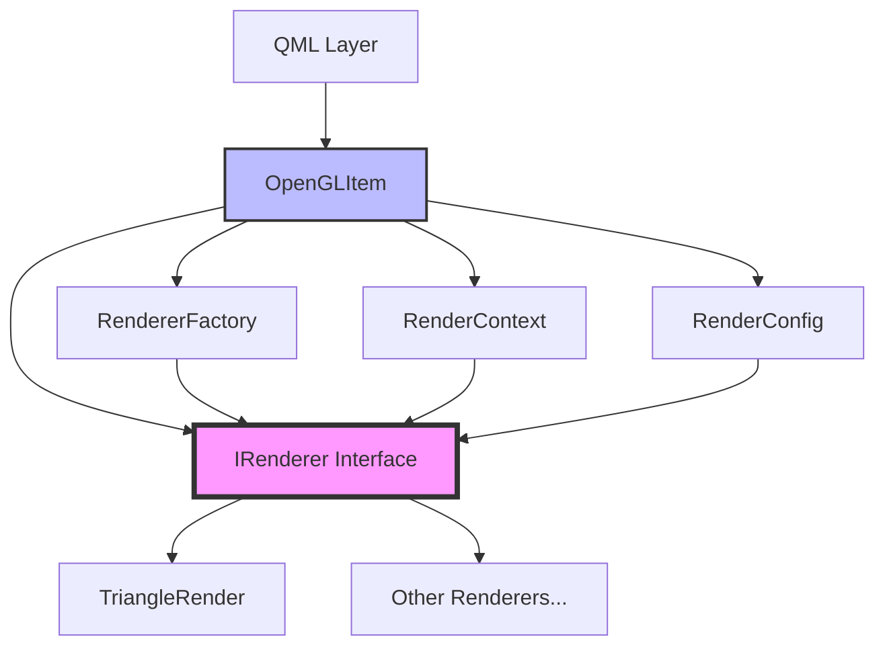
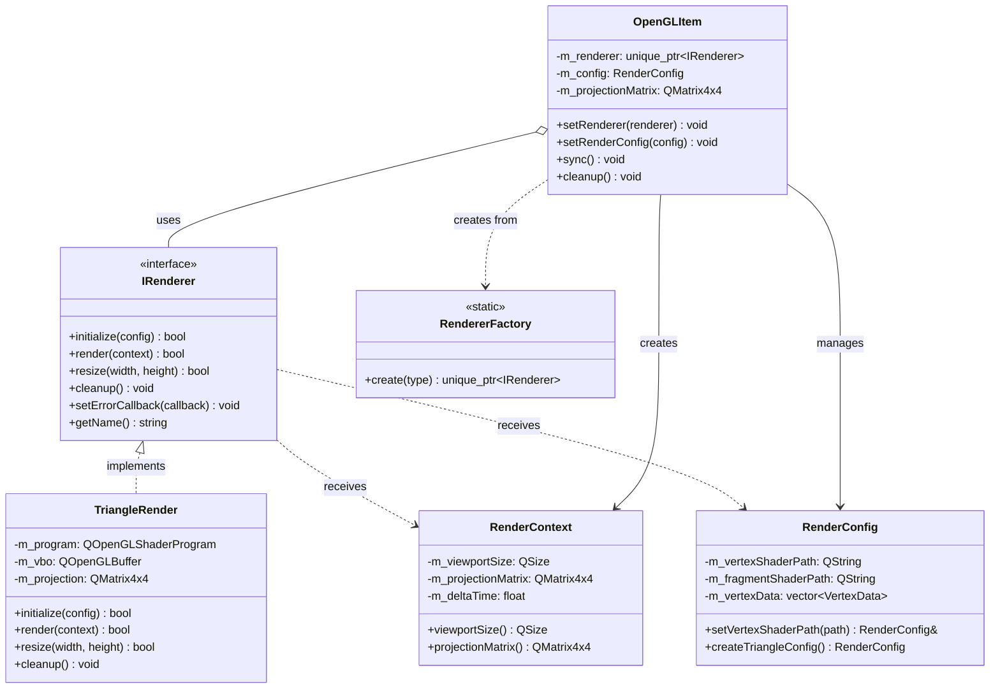

# 设计文档

## 概述

本设计文档描述了如何通过引入抽象层、设计模式和现代 C++ 实践来解耦 `TriangleRender` 和 `OpenGLItem` 类。核心思想是：

1. **依赖倒置原则（DIP）**：高层模块（OpenGLItem）不依赖低层模块（TriangleRender），两者都依赖抽象（IRenderer）
2. **单一职责原则（SRP）**：每个类只负责一个明确的职责
3. **开闭原则（OCP）**：对扩展开放，对修改关闭
4. **依赖注入（DI）**：通过构造函数或 setter 注入依赖，而不是在类内部创建

通过这些原则，我们将实现一个松耦合、易测试、易扩展的渲染架构。

## 架构

### 整体架构图



### 分层架构

```
┌─────────────────────────────────────────┐
│         QML/UI Layer                    │
└─────────────────────────────────────────┘
                  ↓
┌─────────────────────────────────────────┐
│    Presentation Layer (OpenGLItem)      │
│  - 生命周期管理                          │
│  - 事件处理                              │
│  - FPS 计算                              │
└─────────────────────────────────────────┘
                  ↓
┌─────────────────────────────────────────┐
│    Abstraction Layer (IRenderer)        │
│  - 渲染器接口定义                        │
│  - 回调接口定义                          │
└─────────────────────────────────────────┘
                  ↓
┌─────────────────────────────────────────┐
│  Implementation Layer (TriangleRender)  │
│  - OpenGL 调用                           │
│  - 着色器管理                            │
│  - 缓冲区管理                            │
└─────────────────────────────────────────┘
                  ↓
┌─────────────────────────────────────────┐
│         OpenGL API                      │
└─────────────────────────────────────────┘
```

## 组件和接口

### 1. IRenderer 接口（核心抽象）

**职责**：定义所有渲染器必须实现的标准接口

**设计决策**：
- 不继承 QObject，保持纯 C++ 接口
- 使用虚析构函数确保正确的多态销毁
- 返回布尔值表示操作成功/失败
- 接受上下文对象而不是原始参数

```cpp
// IRenderer.h
#pragma once
#include <memory>
#include <functional>
#include <string>

class RenderContext;
class RenderConfig;

enum class RenderError {
    None = 0,
    InitializationFailed,
    ShaderCompilationFailed,
    BufferCreationFailed,
    RenderingFailed
};

// 回调函数类型定义
using ErrorCallback = std::function<void(RenderError, const std::string&)>;
using StateCallback = std::function<void(const std::string&)>;

class IRenderer {
public:
    virtual ~IRenderer() = default;
    
    // 初始化渲染器
    virtual bool initialize(const RenderConfig& config) = 0;
    
    // 执行渲染
    virtual bool render(const RenderContext& context) = 0;
    
    // 调整视口大小
    virtual bool resize(int width, int height) = 0;

    
    // 清理资源
    virtual void cleanup() = 0;
    
    // 设置错误回调
    virtual void setErrorCallback(ErrorCallback callback) = 0;
    
    // 获取渲染器名称（用于调试）
    virtual std::string getName() const = 0;
};
```

**接口设计原理**：
- **initialize()**: 接受配置对象，支持不同的初始化参数
- **render()**: 接受上下文对象，包含所有渲染所需的动态信息
- **resize()**: 独立的尺寸调整方法，简化接口
- **cleanup()**: 显式资源清理，确保 OpenGL 资源在正确的上下文中释放
- **setErrorCallback()**: 回调机制替代信号槽，降低对 Qt 的依赖

### 2. RenderContext 类（上下文封装）

**职责**：封装渲染过程中需要的所有上下文信息

**设计决策**：
- 值语义，可以安全复制
- 不可变对象，线程安全
- 包含所有渲染所需的动态数据

```cpp
// RenderContext.h
#pragma once
#include <QMatrix4x4>
#include <QSize>

class RenderContext {
public:
    RenderContext(const QSize& viewportSize, 
                  const QMatrix4x4& projectionMatrix,
                  float deltaTime = 0.0f)
        : m_viewportSize(viewportSize)
        , m_projectionMatrix(projectionMatrix)
        , m_deltaTime(deltaTime)
        , m_frameNumber(0)
    {}
    
    // Getters
    QSize viewportSize() const { return m_viewportSize; }
    int width() const { return m_viewportSize.width(); }
    int height() const { return m_viewportSize.height(); }
    QMatrix4x4 projectionMatrix() const { return m_projectionMatrix; }
    float deltaTime() const { return m_deltaTime; }
    quint64 frameNumber() const { return m_frameNumber; }
    
    // 创建新的上下文（不可变模式）
    RenderContext withFrameNumber(quint64 frame) const {
        RenderContext ctx = *this;
        ctx.m_frameNumber = frame;
        return ctx;
    }
    
    RenderContext withDeltaTime(float dt) const {
        RenderContext ctx = *this;
        ctx.m_deltaTime = dt;
        return ctx;
    }

private:
    QSize m_viewportSize;
    QMatrix4x4 m_projectionMatrix;
    float m_deltaTime;
    quint64 m_frameNumber;
};
```

**上下文设计原理**：
- **不可变性**：一旦创建，内容不可修改，避免并发问题
- **值语义**：可以安全复制和传递
- **完整性**：包含渲染所需的所有信息，渲染器不需要访问外部状态


### 3. RenderConfig 类（配置封装）

**职责**：封装渲染器的静态配置信息

**设计决策**：
- 使用 Builder 模式构建配置
- 支持链式调用
- 提供合理的默认值

```cpp
// RenderConfig.h
#pragma once
#include <QString>
#include <QVector3D>
#include <vector>

struct VertexData {
    QVector3D position;
    QVector3D color;
};

class RenderConfig {
public:
    RenderConfig() = default;
    
    // Builder 模式
    RenderConfig& setVertexShaderPath(const QString& path) {
        m_vertexShaderPath = path;
        return *this;
    }
    
    RenderConfig& setFragmentShaderPath(const QString& path) {
        m_fragmentShaderPath = path;
        return *this;
    }
    
    RenderConfig& setVertexData(const std::vector<VertexData>& data) {
        m_vertexData = data;
        return *this;
    }
    
    RenderConfig& setClearColor(float r, float g, float b, float a = 1.0f) {
        m_clearColor = QVector4D(r, g, b, a);
        return *this;
    }
    
    RenderConfig& setRotationSpeed(float speed) {
        m_rotationSpeed = speed;
        return *this;
    }
    
    // Getters
    QString vertexShaderPath() const { return m_vertexShaderPath; }
    QString fragmentShaderPath() const { return m_fragmentShaderPath; }
    const std::vector<VertexData>& vertexData() const { return m_vertexData; }
    QVector4D clearColor() const { return m_clearColor; }
    float rotationSpeed() const { return m_rotationSpeed; }
    
    // 静态工厂方法：创建默认三角形配置
    static RenderConfig createTriangleConfig() {
        RenderConfig config;
        
#ifdef Q_OS_WIN
        config.setVertexShaderPath(":/GLSL/vertex_glsl.vert")
              .setFragmentShaderPath(":/GLSL/fragment_glsl.frag");
#else
        config.setVertexShaderPath(":/GLSL/vertex_glsl_es.vert")
              .setFragmentShaderPath(":/GLSL/fragment_glsl_es.frag");
#endif
        
        std::vector<VertexData> vertices = {
            { QVector3D(-0.5f, -0.5f, 0.0f), QVector3D(1.0, 0.0, 0.0) },
            { QVector3D(0.0f, 0.5f, 0.0f),   QVector3D(0.0, 1.0, 0.0) },
            { QVector3D(0.5f, -0.5f, 0.0f),  QVector3D(0.0, 0.0, 1.0) }
        };
        
        config.setVertexData(vertices)
              .setClearColor(0.2f, 0.3f, 0.3f, 1.0f)
              .setRotationSpeed(1.0f);
        
        return config;
    }

private:
    QString m_vertexShaderPath;
    QString m_fragmentShaderPath;
    std::vector<VertexData> m_vertexData;
    QVector4D m_clearColor{0.0f, 0.0f, 0.0f, 1.0f};
    float m_rotationSpeed{1.0f};
};
```

**配置设计原理**：
- **Builder 模式**：链式调用，易于构建复杂配置
- **静态工厂**：提供预定义配置，简化常见用例
- **分离关注点**：配置与实现分离，易于修改和测试


### 4. TriangleRender 类（重构后）

**职责**：实现 IRenderer 接口，执行具体的三角形渲染逻辑

**设计决策**：
- 实现 IRenderer 接口
- 不再继承 QObject
- 移除 slots 和 signals
- 从配置和上下文对象获取数据

```cpp
// TriangleRender.h
#pragma once
#include "IRenderer.h"
#include <QOpenGLBuffer>
#include <QOpenGLFunctions>
#include <QOpenGLShaderProgram>
#include <QMatrix4x4>

class TriangleRender : public IRenderer, protected QOpenGLFunctions {
public:
    TriangleRender();
    ~TriangleRender() override;
    
    // IRenderer 接口实现
    bool initialize(const RenderConfig& config) override;
    bool render(const RenderContext& context) override;
    bool resize(int width, int height) override;
    void cleanup() override;
    void setErrorCallback(ErrorCallback callback) override;
    std::string getName() const override { return "TriangleRender"; }

private:
    bool initializeShader(const QString& vertexPath, const QString& fragmentPath);
    bool initializeGeometry(const std::vector<VertexData>& vertices);
    void reportError(RenderError error, const std::string& message);
    
    QOpenGLShaderProgram m_program;
    QOpenGLBuffer m_vbo;
    QMatrix4x4 m_projection;
    QVector4D m_clearColor;
    float m_rotationSpeed;
    float m_currentAngle;
    
    ErrorCallback m_errorCallback;
    bool m_initialized;
};
```

**重构要点**：
- **移除 QObject 继承**：不再使用信号槽，使用回调函数
- **接口实现**：实现 IRenderer 的所有纯虚函数
- **状态管理**：内部维护必要的状态（角度、配置等）
- **错误处理**：通过回调报告错误，而不是 qDebug

### 5. RendererFactory 类（工厂模式）

**职责**：创建不同类型的渲染器实例

**设计决策**：
- 使用枚举标识渲染器类型
- 返回智能指针，明确所有权转移
- 支持扩展新的渲染器类型

```cpp
// RendererFactory.h
#pragma once
#include "IRenderer.h"
#include <memory>

enum class RendererType {
    Triangle,
    Cube,
    Custom
    // 未来可以添加更多类型
};

class RendererFactory {
public:
    // 创建指定类型的渲染器
    static std::unique_ptr<IRenderer> create(RendererType type) {
        switch (type) {
            case RendererType::Triangle:
                return std::make_unique<TriangleRender>();
            // case RendererType::Cube:
            //     return std::make_unique<CubeRender>();
            default:
                return nullptr;
        }
    }
    
    // 通过字符串创建（用于配置文件）
    static std::unique_ptr<IRenderer> create(const std::string& typeName) {
        if (typeName == "triangle") {
            return create(RendererType::Triangle);
        }
        // 添加更多类型映射
        return nullptr;
    }
    
private:
    RendererFactory() = delete;  // 禁止实例化
};
```

**工厂设计原理**：
- **静态工厂方法**：无需实例化工厂类
- **智能指针返回**：自动管理内存，明确所有权
- **类型安全**：使用枚举而不是字符串（主要接口）
- **扩展性**：添加新渲染器只需修改工厂类


### 6. OpenGLItem 类（重构后）

**职责**：管理 Qt Quick 集成、生命周期和用户交互

**设计决策**：
- 依赖 IRenderer 接口而不是具体类
- 使用智能指针管理渲染器生命周期
- 支持依赖注入
- 负责创建和管理上下文对象

```cpp
// OpenGLItem.h
#pragma once
#include <QQuickItem>
#include <QBasicTimer>
#include <QTime>
#include <memory>
#include "IRenderer.h"
#include "RenderContext.h"
#include "RenderConfig.h"

class OpenGLItem : public QQuickItem {
    Q_OBJECT
    Q_PROPERTY(int fps READ fps WRITE setFps NOTIFY fpsChanged)
    Q_PROPERTY(QString rendererType READ rendererType WRITE setRendererType NOTIFY rendererTypeChanged)

public:
    OpenGLItem();
    ~OpenGLItem() override;
    
    // 属性访问
    int fps() const { return m_fps; }
    void setFps(int fps);
    
    QString rendererType() const { return m_rendererType; }
    void setRendererType(const QString& type);
    
    // 依赖注入接口
    void setRenderer(std::unique_ptr<IRenderer> renderer);
    
    // 配置接口
    void setRenderConfig(const RenderConfig& config);

signals:
    void fpsChanged();
    void rendererTypeChanged();
    void renderError(const QString& message);

public slots:
    void sync();
    void cleanup();

protected:
    void timerEvent(QTimerEvent *event) override;

private:
    void createRenderer();
    void initializeRenderer();
    void updateProjectionMatrix();
    void handleRenderError(RenderError error, const std::string& message);
    
    std::unique_ptr<IRenderer> m_renderer;
    RenderConfig m_config;
    QMatrix4x4 m_projectionMatrix;
    
    int m_fps;
    QTime m_lastTime;
    QBasicTimer m_timer;
    QString m_rendererType;
    quint64 m_frameNumber;
    
    bool m_rendererInitialized;
};
```

**重构要点**：
- **接口依赖**：`std::unique_ptr<IRenderer>` 而不是 `TriangleRender*`
- **依赖注入**：`setRenderer()` 方法支持外部注入
- **配置管理**：持有 `RenderConfig` 对象
- **错误处理**：通过信号向 QML 层报告错误
- **灵活性**：支持通过属性切换渲染器类型

## 数据模型

### 类关系图




### 依赖关系分析

**重构前的依赖**：
```
OpenGLItem --> TriangleRender (直接依赖具体类)
TriangleRender --> QObject (继承依赖)
OpenGLItem 直接管理 TriangleRender 的生命周期
```

**重构后的依赖**：
```
OpenGLItem --> IRenderer (依赖抽象接口)
TriangleRender --|> IRenderer (实现接口)
OpenGLItem --> RendererFactory (创建渲染器)
IRenderer <-- RenderContext (接收上下文)
IRenderer <-- RenderConfig (接收配置)
```

**依赖倒置的好处**：
- OpenGLItem 不知道具体的渲染器实现
- 可以在运行时切换不同的渲染器
- 易于单元测试（可以注入 Mock 渲染器）
- 渲染器可以独立开发和测试

## 错误处理

### 错误处理策略

1. **初始化错误**：
   - 着色器编译失败
   - 缓冲区创建失败
   - OpenGL 上下文不可用

2. **运行时错误**：
   - 渲染调用失败
   - 资源不足

3. **错误传播机制**：

```cpp
// 在 TriangleRender 中
bool TriangleRender::initialize(const RenderConfig& config) {
    initializeOpenGLFunctions();
    
    if (!initializeShader(config.vertexShaderPath(), config.fragmentShaderPath())) {
        reportError(RenderError::ShaderCompilationFailed, 
                   "Failed to compile shaders");
        return false;
    }
    
    if (!initializeGeometry(config.vertexData())) {
        reportError(RenderError::BufferCreationFailed, 
                   "Failed to create vertex buffer");
        return false;
    }
    
    m_clearColor = config.clearColor();
    m_rotationSpeed = config.rotationSpeed();
    m_initialized = true;
    return true;
}

void TriangleRender::reportError(RenderError error, const std::string& message) {
    if (m_errorCallback) {
        m_errorCallback(error, message);
    }
}

// 在 OpenGLItem 中
void OpenGLItem::initializeRenderer() {
    if (!m_renderer) return;
    
    // 设置错误回调
    m_renderer->setErrorCallback([this](RenderError error, const std::string& msg) {
        handleRenderError(error, msg);
    });
    
    // 初始化渲染器
    if (!m_renderer->initialize(m_config)) {
        qWarning() << "Failed to initialize renderer";
        m_renderer.reset();  // 释放失败的渲染器
    } else {
        m_rendererInitialized = true;
    }
}

void OpenGLItem::handleRenderError(RenderError error, const std::string& message) {
    QString errorMsg = QString::fromStdString(message);
    qWarning() << "Render error:" << errorMsg;
    emit renderError(errorMsg);
}
```

### 错误恢复策略

- **初始化失败**：不创建渲染器，显示错误信息
- **渲染失败**：跳过当前帧，继续尝试下一帧
- **资源清理**：确保在析构函数中调用 cleanup()

## 测试策略

### 单元测试

#### 1. Mock 渲染器

```cpp
// MockRenderer.h
class MockRenderer : public IRenderer {
public:
    bool initialize(const RenderConfig& config) override {
        initializeCalled = true;
        lastConfig = config;
        return shouldSucceed;
    }
    
    bool render(const RenderContext& context) override {
        renderCalled = true;
        renderCount++;
        lastContext = context;
        return shouldSucceed;
    }
    
    bool resize(int width, int height) override {
        resizeCalled = true;
        lastWidth = width;
        lastHeight = height;
        return shouldSucceed;
    }
    
    void cleanup() override {
        cleanupCalled = true;
    }
    
    void setErrorCallback(ErrorCallback callback) override {
        errorCallback = callback;
    }
    
    std::string getName() const override { return "MockRenderer"; }
    
    // 测试辅助字段
    bool shouldSucceed = true;
    bool initializeCalled = false;
    bool renderCalled = false;
    bool resizeCalled = false;
    bool cleanupCalled = false;
    int renderCount = 0;
    int lastWidth = 0;
    int lastHeight = 0;
    RenderConfig lastConfig;
    RenderContext lastContext;
    ErrorCallback errorCallback;
};
```


#### 2. OpenGLItem 测试

```cpp
// 测试依赖注入
TEST(OpenGLItemTest, CanInjectRenderer) {
    OpenGLItem item;
    auto mockRenderer = std::make_unique<MockRenderer>();
    auto* mockPtr = mockRenderer.get();
    
    item.setRenderer(std::move(mockRenderer));
    item.sync();  // 触发初始化
    
    EXPECT_TRUE(mockPtr->initializeCalled);
}

// 测试渲染调用
TEST(OpenGLItemTest, CallsRenderOnSync) {
    OpenGLItem item;
    auto mockRenderer = std::make_unique<MockRenderer>();
    auto* mockPtr = mockRenderer.get();
    
    item.setRenderer(std::move(mockRenderer));
    item.sync();
    
    // 模拟渲染循环
    // ...
    
    EXPECT_TRUE(mockPtr->renderCalled);
    EXPECT_GT(mockPtr->renderCount, 0);
}

// 测试错误处理
TEST(OpenGLItemTest, HandlesInitializationFailure) {
    OpenGLItem item;
    auto mockRenderer = std::make_unique<MockRenderer>();
    mockRenderer->shouldSucceed = false;
    
    QSignalSpy errorSpy(&item, &OpenGLItem::renderError);
    
    item.setRenderer(std::move(mockRenderer));
    item.sync();
    
    EXPECT_EQ(errorSpy.count(), 1);
}
```

#### 3. TriangleRender 测试

```cpp
// 测试初始化
TEST(TriangleRenderTest, InitializeWithValidConfig) {
    TriangleRender renderer;
    RenderConfig config = RenderConfig::createTriangleConfig();
    
    // 需要 OpenGL 上下文
    QOpenGLContext context;
    // ... 设置上下文
    
    EXPECT_TRUE(renderer.initialize(config));
}

// 测试错误回调
TEST(TriangleRenderTest, CallsErrorCallbackOnFailure) {
    TriangleRender renderer;
    RenderConfig config;  // 空配置，应该失败
    
    bool errorCalled = false;
    RenderError capturedError;
    
    renderer.setErrorCallback([&](RenderError error, const std::string& msg) {
        errorCalled = true;
        capturedError = error;
    });
    
    EXPECT_FALSE(renderer.initialize(config));
    EXPECT_TRUE(errorCalled);
}
```

### 集成测试

测试 OpenGLItem 与真实 TriangleRender 的集成：

```cpp
TEST(IntegrationTest, OpenGLItemWithTriangleRender) {
    // 创建 OpenGL 上下文
    QOpenGLContext context;
    // ... 设置上下文
    
    OpenGLItem item;
    item.setRendererType("triangle");
    
    // 触发初始化
    item.sync();
    
    // 验证渲染器已创建并初始化
    // 模拟几帧渲染
    for (int i = 0; i < 10; ++i) {
        item.sync();
    }
    
    // 验证 FPS 计算
    EXPECT_GT(item.fps(), 0);
}
```

## 设计模式应用总结

### 1. 策略模式（Strategy Pattern）
- **应用**：IRenderer 接口定义渲染策略
- **好处**：可以在运行时切换不同的渲染算法

### 2. 工厂模式（Factory Pattern）
- **应用**：RendererFactory 创建渲染器实例
- **好处**：集中管理对象创建逻辑，易于扩展

### 3. 依赖注入（Dependency Injection）
- **应用**：OpenGLItem::setRenderer() 方法
- **好处**：提高可测试性，降低耦合

### 4. 建造者模式（Builder Pattern）
- **应用**：RenderConfig 的链式调用
- **好处**：灵活构建复杂配置对象

### 5. 观察者模式（Observer Pattern）
- **应用**：错误回调机制
- **好处**：松耦合的事件通知

### 6. 模板方法模式（Template Method）
- **应用**：IRenderer 定义渲染流程框架
- **好处**：统一渲染器的行为规范

## 迁移路径

### 阶段 1：创建抽象层
1. 定义 IRenderer 接口
2. 创建 RenderContext 和 RenderConfig 类
3. 不修改现有代码

### 阶段 2：重构 TriangleRender
1. 实现 IRenderer 接口
2. 移除 QObject 继承
3. 修改方法签名以接受配置和上下文对象
4. 保持向后兼容（可选）

### 阶段 3：重构 OpenGLItem
1. 修改成员变量为 `std::unique_ptr<IRenderer>`
2. 添加 setRenderer() 方法
3. 使用 RendererFactory 创建默认渲染器
4. 更新渲染循环以传递上下文对象

### 阶段 4：测试和验证
1. 编写单元测试
2. 编写集成测试
3. 性能测试
4. 清理旧代码

## 性能考虑

### 1. 对象创建开销
- **问题**：每帧创建 RenderContext 对象
- **解决**：RenderContext 是轻量级值对象，复制开销小
- **优化**：如果需要，可以使用对象池

### 2. 虚函数调用开销
- **问题**：IRenderer 的虚函数调用
- **影响**：现代 CPU 的分支预测可以很好地处理虚函数调用
- **测量**：实际开销通常可以忽略不计（相比 OpenGL 调用）

### 3. 智能指针开销
- **问题**：unique_ptr 的解引用
- **影响**：与裸指针相同，无额外开销
- **好处**：自动内存管理，避免内存泄漏

### 4. 回调函数开销
- **问题**：std::function 的调用开销
- **影响**：仅在错误发生时调用，不影响正常渲染路径
- **优化**：错误路径不是性能关键路径

## 扩展性示例

### 添加新的渲染器

```cpp
// CubeRender.h
class CubeRender : public IRenderer {
public:
    bool initialize(const RenderConfig& config) override {
        // 立方体特定的初始化
    }
    
    bool render(const RenderContext& context) override {
        // 立方体渲染逻辑
    }
    
    // ... 其他方法实现
};

// 在 RendererFactory 中添加
case RendererType::Cube:
    return std::make_unique<CubeRender>();
```

### 在 QML 中切换渲染器

```qml
OpenGLItem {
    id: glItem
    rendererType: "triangle"  // 或 "cube"
    
    MouseArea {
        anchors.fill: parent
        onClicked: {
            glItem.rendererType = glItem.rendererType === "triangle" 
                                  ? "cube" 
                                  : "triangle"
        }
    }
}
```

## 总结

通过引入抽象层和应用设计模式，我们实现了：

1. **低耦合**：OpenGLItem 和 TriangleRender 通过接口解耦
2. **高内聚**：每个类职责单一明确
3. **易测试**：支持依赖注入和 Mock 对象
4. **易扩展**：添加新渲染器无需修改现有代码
5. **易维护**：清晰的职责划分和接口定义
6. **类型安全**：使用智能指针和强类型接口
7. **错误处理**：统一的错误处理机制

这个设计遵循了 SOLID 原则，应用了多种设计模式，为项目的长期维护和扩展奠定了良好的基础。
