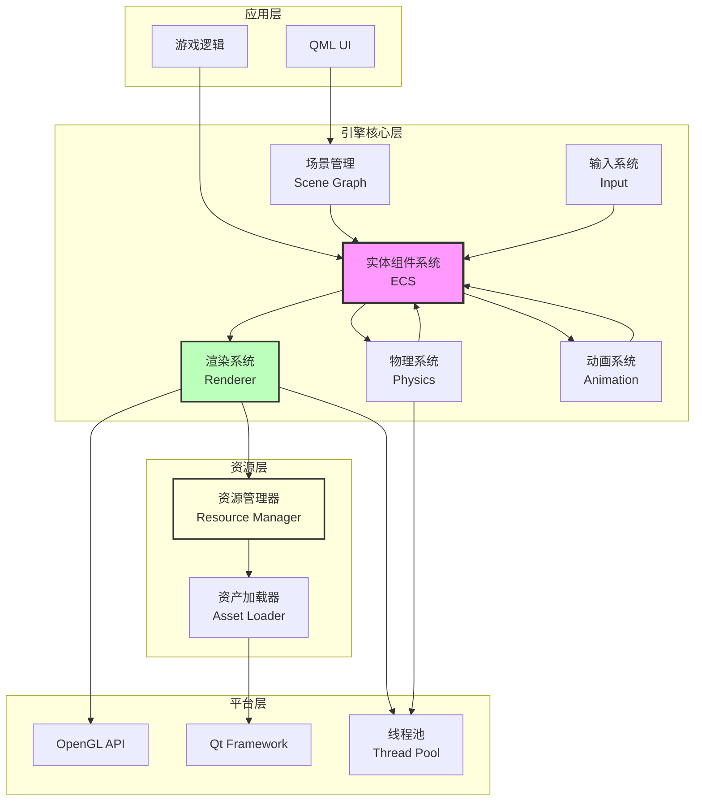
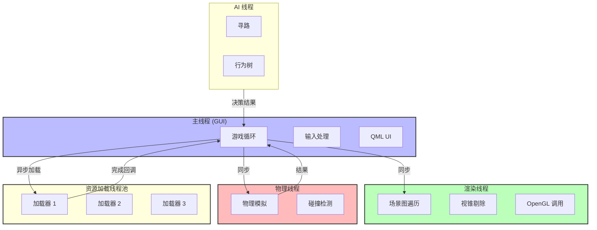

# Qt + OpenGL 3D 引擎架构优化建议与设计指南

## 目录
1. [当前架构分析与优化建议](#当前架构分析与优化建议)
2. [3D 引擎核心架构设计](#3d-引擎核心架构设计)
3. [面向对象设计深化](#面向对象设计深化)
4. [设计模式应用](#设计模式应用)
5. [多线程架构设计](#多线程架构设计)
6. [性能优化策略](#性能优化策略)

---

## 当前架构分析与优化建议

### 优点分析

你的当前架构已经展现了很好的设计思维：

✅ **接口抽象**：`IRenderer` 接口实现了依赖倒置
✅ **配置分离**：`RenderConfig` 和 `RenderContext` 分离静态/动态数据
✅ **工厂模式**：`RenderFactory` 支持运行时切换渲染器
✅ **线程安全**：正确使用 `QQuickFramebufferObject` 的线程模型
✅ **资源管理**：使用智能指针管理生命周期

### 需要优化的问题

#### 1. TriangleRender 的职责过重

**问题**：
```cpp
class TriangleRender : protected QOpenGLFunctions, public IRenderer {
    // 混合了：着色器管理、几何体管理、变换计算、渲染逻辑
    QOpenGLShaderProgram m_program;
    QOpenGLBuffer m_vbo;
    QMatrix4x4 m_projection;
    float m_currentAngle;
};
```

**优化建议**：拆分职责

```cpp
// 着色器管理器
class ShaderManager {
public:
    bool load(const QString& vertPath, const QString& fragPath);
    void bind();
    void setUniform(const QString& name, const QMatrix4x4& value);
    void setUniform(const QString& name, const QVector3D& value);
private:
    QOpenGLShaderProgram m_program;
    std::unordered_map<QString, int> m_uniformLocations;  // 缓存 uniform 位置
};

// 几何体（网格）
class Mesh {
public:
    void setVertices(const std::vector<VertexData>& vertices);
    void setIndices(const std::vector<uint32_t>& indices);
    void draw();
private:
    QOpenGLBuffer m_vbo;
    QOpenGLBuffer m_ibo;
    QOpenGLVertexArrayObject m_vao;  // 使用 VAO
    int m_vertexCount;
    int m_indexCount;
};

// 材质
class Material {
public:
    void setShader(std::shared_ptr<ShaderManager> shader);
    void setTexture(const QString& name, std::shared_ptr<Texture> texture);
    void apply();  // 应用材质（绑定着色器和纹理）
private:
    std::shared_ptr<ShaderManager> m_shader;
    std::unordered_map<QString, std::shared_ptr<Texture>> m_textures;
};

// 重构后的渲染器
class TriangleRender : public IRenderer {
public:
    bool initialize(const RenderConfig& config) override;
    bool render(const RenderContext& context) override;
private:
    std::shared_ptr<Mesh> m_mesh;
    std::shared_ptr<Material> m_material;
    Transform m_transform;  // 变换组件
};
```

**优势**：
- 每个类职责单一，易于测试
- 组件可复用（多个渲染器共享同一个 Mesh 或 Material）
- 易于扩展（添加新的材质类型、网格类型）


#### 2. RenderFactory 扩展性不足

**问题**：
```cpp
static std::unique_ptr<IRenderer> create(const std::string& typeName) {
    if (typeName == "triangle") {
        return create(RenderType::Triangle);
    } else {
        return nullptr;  // 每次添加新类型都要修改这里
    }
}
```

**优化建议**：使用注册机制

```cpp
class RenderFactory {
public:
    using CreatorFunc = std::function<std::unique_ptr<IRenderer>()>;
    
    // 注册渲染器类型
    static void registerRenderer(const std::string& type, CreatorFunc creator) {
        getRegistry()[type] = creator;
    }
    
    // 创建渲染器
    static std::unique_ptr<IRenderer> create(const std::string& type) {
        auto& registry = getRegistry();
        auto it = registry.find(type);
        if (it != registry.end()) {
            return it->second();
        }
        return nullptr;
    }
    
private:
    static std::unordered_map<std::string, CreatorFunc>& getRegistry() {
        static std::unordered_map<std::string, CreatorFunc> registry;
        return registry;
    }
};

// 自动注册宏
#define REGISTER_RENDERER(Type, Name) \
    namespace { \
        struct Type##Registrar { \
            Type##Registrar() { \
                RenderFactory::registerRenderer(Name, []() { \
                    return std::make_unique<Type>(); \
                }); \
            } \
        }; \
        static Type##Registrar g_##Type##Registrar; \
    }

// 使用示例
// triangle_render.cpp
REGISTER_RENDERER(TriangleRender, "triangle")

// cube_render.cpp
REGISTER_RENDERER(CubeRender, "cube")
```

**优势**：
- 添加新渲染器无需修改工厂代码
- 支持插件式扩展
- 符合开闭原则

#### 3. 错误处理机制不完善

**问题**：
```cpp
void reportError(RenderError error, const std::string& message) {
    if (m_errorCallback) {
        m_errorCallback(error, message);
    }
    // 错误后继续执行？没有恢复机制
}
```

**优化建议**：引入 Result 类型

```cpp
// Result 类型（类似 Rust 的 Result<T, E>）
template<typename T, typename E = std::string>
class Result {
public:
    static Result Ok(T value) {
        return Result(std::move(value), true);
    }
    
    static Result Err(E error) {
        return Result(std::move(error), false);
    }
    
    bool isOk() const { return m_isOk; }
    bool isErr() const { return !m_isOk; }
    
    T& unwrap() { return m_value; }
    const T& unwrap() const { return m_value; }
    
    E& error() { return m_error; }
    const E& error() const { return m_error; }
    
    // 链式调用
    template<typename F>
    auto andThen(F&& func) -> Result<decltype(func(m_value)), E> {
        if (isOk()) {
            return func(m_value);
        }
        return Result<decltype(func(m_value)), E>::Err(m_error);
    }
    
private:
    Result(T value, bool ok) : m_value(std::move(value)), m_isOk(ok) {}
    Result(E error, bool ok) : m_error(std::move(error)), m_isOk(ok) {}
    
    T m_value;
    E m_error;
    bool m_isOk;
};

// 使用示例
class IRenderer {
public:
    virtual Result<void, RenderError> initialize(const RenderConfig& config) = 0;
    virtual Result<void, RenderError> render(const RenderContext& context) = 0;
};

// 实现
Result<void, RenderError> TriangleRender::initialize(const RenderConfig& config) {
    if (!initializeShader(config.vertexShaderPath(), config.fragmentShaderPath())) {
        return Result<void, RenderError>::Err(
            RenderError{RenderError::ShaderCompilationFailed, "Shader compilation failed"}
        );
    }
    
    if (!initializeGeometry(config.vertexData())) {
        return Result<void, RenderError>::Err(
            RenderError{RenderError::BufferCreationFailed, "Buffer creation failed"}
        );
    }
    
    return Result<void, RenderError>::Ok({});
}
```

**优势**：
- 强制错误处理
- 类型安全
- 支持链式调用
- 易于追踪错误传播路径


#### 4. 缺少资源管理系统

**问题**：每个渲染器独立管理资源，导致：
- 重复加载相同的着色器/纹理
- 无法统一管理资源生命周期
- 内存浪费

**优化建议**：资源管理器

```cpp
// 资源句柄（轻量级）
template<typename T>
class ResourceHandle {
public:
    ResourceHandle() : m_id(0) {}
    explicit ResourceHandle(uint64_t id) : m_id(id) {}
    
    uint64_t id() const { return m_id; }
    bool isValid() const { return m_id != 0; }
    
private:
    uint64_t m_id;
};

// 资源管理器基类
template<typename T>
class ResourceManager {
public:
    ResourceHandle<T> load(const QString& path) {
        // 检查是否已加载
        auto it = m_pathToHandle.find(path);
        if (it != m_pathToHandle.end()) {
            return it->second;
        }
        
        // 加载资源
        auto resource = loadImpl(path);
        if (!resource) {
            return ResourceHandle<T>();
        }
        
        // 存储资源
        uint64_t id = m_nextId++;
        m_resources[id] = std::move(resource);
        m_pathToHandle[path] = ResourceHandle<T>(id);
        
        return ResourceHandle<T>(id);
    }
    
    std::shared_ptr<T> get(ResourceHandle<T> handle) {
        auto it = m_resources.find(handle.id());
        if (it != m_resources.end()) {
            return it->second;
        }
        return nullptr;
    }
    
    void unload(ResourceHandle<T> handle) {
        m_resources.erase(handle.id());
        // 清理 path 映射
        for (auto it = m_pathToHandle.begin(); it != m_pathToHandle.end(); ++it) {
            if (it->second.id() == handle.id()) {
                m_pathToHandle.erase(it);
                break;
            }
        }
    }
    
protected:
    virtual std::shared_ptr<T> loadImpl(const QString& path) = 0;
    
private:
    std::unordered_map<uint64_t, std::shared_ptr<T>> m_resources;
    std::unordered_map<QString, ResourceHandle<T>> m_pathToHandle;
    uint64_t m_nextId = 1;
};

// 具体的资源管理器
class ShaderManager : public ResourceManager<QOpenGLShaderProgram> {
protected:
    std::shared_ptr<QOpenGLShaderProgram> loadImpl(const QString& path) override;
};

class TextureManager : public ResourceManager<Texture> {
protected:
    std::shared_ptr<Texture> loadImpl(const QString& path) override;
};

class MeshManager : public ResourceManager<Mesh> {
protected:
    std::shared_ptr<Mesh> loadImpl(const QString& path) override;
};

// 统一的资源系统
class ResourceSystem {
public:
    static ResourceSystem& instance() {
        static ResourceSystem inst;
        return inst;
    }
    
    ShaderManager& shaders() { return m_shaderManager; }
    TextureManager& textures() { return m_textureManager; }
    MeshManager& meshes() { return m_meshManager; }
    
private:
    ShaderManager m_shaderManager;
    TextureManager m_textureManager;
    MeshManager m_meshManager;
};

// 使用示例
auto shaderHandle = ResourceSystem::instance().shaders().load(":/shaders/basic.vert");
auto shader = ResourceSystem::instance().shaders().get(shaderHandle);
```

**优势**：
- 避免重复加载
- 统一管理资源生命周期
- 支持资源热重载
- 内存占用优化

---

## 3D 引擎核心架构设计

### 整体架构图



### 核心系统设计

#### 1. 实体组件系统（ECS）

ECS 是现代游戏引擎的核心架构，将数据（Component）和逻辑（System）分离。

```cpp
// 实体 ID（轻量级）
using EntityID = uint64_t;

// 组件基类（纯数据）
struct Component {
    virtual ~Component() = default;
};

// 具体组件
struct TransformComponent : Component {
    QVector3D position{0, 0, 0};
    QQuaternion rotation;
    QVector3D scale{1, 1, 1};
    
    QMatrix4x4 getMatrix() const {
        QMatrix4x4 mat;
        mat.translate(position);
        mat.rotate(rotation);
        mat.scale(scale);
        return mat;
    }
};

struct MeshComponent : Component {
    ResourceHandle<Mesh> mesh;
    ResourceHandle<Material> material;
};

struct CameraComponent : Component {
    float fov = 60.0f;
    float nearPlane = 0.1f;
    float farPlane = 1000.0f;
    
    QMatrix4x4 getProjectionMatrix(float aspect) const {
        QMatrix4x4 proj;
        proj.perspective(fov, aspect, nearPlane, farPlane);
        return proj;
    }
};

struct LightComponent : Component {
    enum Type { Directional, Point, Spot };
    Type type = Directional;
    QVector3D color{1, 1, 1};
    float intensity = 1.0f;
};

// 实体管理器
class EntityManager {
public:
    EntityID createEntity() {
        return m_nextEntityId++;
    }
    
    void destroyEntity(EntityID entity) {
        // 移除所有组件
        for (auto& [type, storage] : m_componentStorages) {
            storage->remove(entity);
        }
    }
    
    template<typename T>
    T* addComponent(EntityID entity) {
        auto& storage = getComponentStorage<T>();
        return storage.add(entity, T{});
    }
    
    template<typename T>
    T* getComponent(EntityID entity) {
        auto& storage = getComponentStorage<T>();
        return storage.get(entity);
    }
    
    template<typename T>
    void removeComponent(EntityID entity) {
        auto& storage = getComponentStorage<T>();
        storage.remove(entity);
    }
    
    // 查询所有拥有特定组件的实体
    template<typename... Components>
    std::vector<EntityID> getEntitiesWith() {
        std::vector<EntityID> result;
        // 实现组件查询逻辑
        return result;
    }
    
private:
    EntityID m_nextEntityId = 1;
    
    // 组件存储（按类型分组）
    template<typename T>
    struct ComponentStorage {
        std::unordered_map<EntityID, T> components;
        
        T* add(EntityID entity, T component) {
            components[entity] = std::move(component);
            return &components[entity];
        }
        
        T* get(EntityID entity) {
            auto it = components.find(entity);
            return it != components.end() ? &it->second : nullptr;
        }
        
        void remove(EntityID entity) {
            components.erase(entity);
        }
    };
    
    template<typename T>
    ComponentStorage<T>& getComponentStorage() {
        static ComponentStorage<T> storage;
        return storage;
    }
    
    std::unordered_map<std::type_index, std::unique_ptr<void>> m_componentStorages;
};
```


#### 2. 系统（System）设计

系统负责处理逻辑，操作组件数据。

```cpp
// 系统基类
class System {
public:
    virtual ~System() = default;
    virtual void update(float deltaTime, EntityManager& entityManager) = 0;
    virtual void initialize() {}
    virtual void shutdown() {}
};

// 渲染系统
class RenderSystem : public System {
public:
    void update(float deltaTime, EntityManager& entityManager) override {
        // 获取相机
        auto cameraEntities = entityManager.getEntitiesWith<CameraComponent, TransformComponent>();
        if (cameraEntities.empty()) return;
        
        auto* camera = entityManager.getComponent<CameraComponent>(cameraEntities[0]);
        auto* cameraTransform = entityManager.getComponent<TransformComponent>(cameraEntities[0]);
        
        // 计算视图矩阵和投影矩阵
        QMatrix4x4 viewMatrix = cameraTransform->getMatrix().inverted();
        QMatrix4x4 projMatrix = camera->getProjectionMatrix(m_aspectRatio);
        
        // 渲染所有可见对象
        auto renderableEntities = entityManager.getEntitiesWith<MeshComponent, TransformComponent>();
        
        for (auto entity : renderableEntities) {
            auto* mesh = entityManager.getComponent<MeshComponent>(entity);
            auto* transform = entityManager.getComponent<TransformComponent>(entity);
            
            // 获取资源
            auto meshRes = ResourceSystem::instance().meshes().get(mesh->mesh);
            auto materialRes = ResourceSystem::instance().materials().get(mesh->material);
            
            if (!meshRes || !materialRes) continue;
            
            // 计算 MVP 矩阵
            QMatrix4x4 modelMatrix = transform->getMatrix();
            QMatrix4x4 mvp = projMatrix * viewMatrix * modelMatrix;
            
            // 渲染
            materialRes->bind();
            materialRes->setUniform("mvp", mvp);
            materialRes->setUniform("model", modelMatrix);
            meshRes->draw();
        }
    }
    
    void setAspectRatio(float aspect) { m_aspectRatio = aspect; }
    
private:
    float m_aspectRatio = 16.0f / 9.0f;
};

// 物理系统
class PhysicsSystem : public System {
public:
    void update(float deltaTime, EntityManager& entityManager) override {
        auto entities = entityManager.getEntitiesWith<TransformComponent, RigidBodyComponent>();
        
        for (auto entity : entities) {
            auto* transform = entityManager.getComponent<TransformComponent>(entity);
            auto* rigidBody = entityManager.getComponent<RigidBodyComponent>(entity);
            
            // 应用重力
            rigidBody->velocity += QVector3D(0, -9.8f, 0) * deltaTime;
            
            // 更新位置
            transform->position += rigidBody->velocity * deltaTime;
            
            // 简单的地面碰撞
            if (transform->position.y() < 0) {
                transform->position.setY(0);
                rigidBody->velocity.setY(0);
            }
        }
    }
};

// 动画系统
class AnimationSystem : public System {
public:
    void update(float deltaTime, EntityManager& entityManager) override {
        auto entities = entityManager.getEntitiesWith<TransformComponent, AnimationComponent>();
        
        for (auto entity : entities) {
            auto* transform = entityManager.getComponent<TransformComponent>(entity);
            auto* animation = entityManager.getComponent<AnimationComponent>(entity);
            
            animation->currentTime += deltaTime;
            
            // 简单的旋转动画
            if (animation->type == AnimationType::Rotate) {
                float angle = animation->currentTime * animation->speed;
                transform->rotation = QQuaternion::fromAxisAndAngle(
                    animation->axis, angle
                );
            }
        }
    }
};

// 系统管理器
class SystemManager {
public:
    template<typename T, typename... Args>
    T* addSystem(Args&&... args) {
        auto system = std::make_unique<T>(std::forward<Args>(args)...);
        T* ptr = system.get();
        m_systems.push_back(std::move(system));
        return ptr;
    }
    
    void initialize() {
        for (auto& system : m_systems) {
            system->initialize();
        }
    }
    
    void update(float deltaTime, EntityManager& entityManager) {
        for (auto& system : m_systems) {
            system->update(deltaTime, entityManager);
        }
    }
    
    void shutdown() {
        for (auto& system : m_systems) {
            system->shutdown();
        }
    }
    
private:
    std::vector<std::unique_ptr<System>> m_systems;
};
```

#### 3. 场景图（Scene Graph）

场景图管理实体的层级关系。

```cpp
class SceneNode {
public:
    SceneNode(EntityID entity) : m_entity(entity) {}
    
    void addChild(std::shared_ptr<SceneNode> child) {
        child->m_parent = shared_from_this();
        m_children.push_back(child);
    }
    
    void removeChild(std::shared_ptr<SceneNode> child) {
        auto it = std::find(m_children.begin(), m_children.end(), child);
        if (it != m_children.end()) {
            (*it)->m_parent.reset();
            m_children.erase(it);
        }
    }
    
    // 获取世界变换（考虑父节点）
    QMatrix4x4 getWorldTransform(EntityManager& entityManager) const {
        auto* transform = entityManager.getComponent<TransformComponent>(m_entity);
        if (!transform) return QMatrix4x4();
        
        QMatrix4x4 localTransform = transform->getMatrix();
        
        if (auto parent = m_parent.lock()) {
            return parent->getWorldTransform(entityManager) * localTransform;
        }
        
        return localTransform;
    }
    
    EntityID entity() const { return m_entity; }
    const std::vector<std::shared_ptr<SceneNode>>& children() const { return m_children; }
    
private:
    EntityID m_entity;
    std::weak_ptr<SceneNode> m_parent;
    std::vector<std::shared_ptr<SceneNode>> m_children;
};

class Scene {
public:
    std::shared_ptr<SceneNode> createNode(EntityID entity) {
        auto node = std::make_shared<SceneNode>(entity);
        m_nodes[entity] = node;
        return node;
    }
    
    std::shared_ptr<SceneNode> getNode(EntityID entity) {
        auto it = m_nodes.find(entity);
        return it != m_nodes.end() ? it->second : nullptr;
    }
    
    void setRoot(std::shared_ptr<SceneNode> root) {
        m_root = root;
    }
    
    std::shared_ptr<SceneNode> root() const { return m_root; }
    
    // 遍历场景图
    void traverse(std::function<void(SceneNode&)> visitor) {
        if (m_root) {
            traverseNode(m_root, visitor);
        }
    }
    
private:
    void traverseNode(std::shared_ptr<SceneNode> node, 
                      std::function<void(SceneNode&)>& visitor) {
        visitor(*node);
        for (auto& child : node->children()) {
            traverseNode(child, visitor);
        }
    }
    
    std::shared_ptr<SceneNode> m_root;
    std::unordered_map<EntityID, std::shared_ptr<SceneNode>> m_nodes;
};
```

---

## 面向对象设计深化

### SOLID 原则在引擎中的应用

#### 1. 单一职责原则（SRP）

**反例**：
```cpp
class GameObject {
    void update();
    void render();
    void handleInput();
    void playSound();
    void checkCollision();
    // 职责过多！
};
```

**正例**：
```cpp
// 每个类只负责一件事
class Transform { /* 只管理位置、旋转、缩放 */ };
class Renderer { /* 只负责渲染 */ };
class InputHandler { /* 只处理输入 */ };
class AudioSource { /* 只播放音频 */ };
class Collider { /* 只检测碰撞 */ };
```

#### 2. 开闭原则（OCP）

**设计可扩展的渲染管线**：

```cpp
// 渲染通道接口
class RenderPass {
public:
    virtual ~RenderPass() = default;
    virtual void execute(RenderContext& context) = 0;
    virtual void resize(int width, int height) {}
};

// 具体的渲染通道
class GeometryPass : public RenderPass {
public:
    void execute(RenderContext& context) override {
        // 渲染几何体到 G-Buffer
    }
};

class LightingPass : public RenderPass {
public:
    void execute(RenderContext& context) override {
        // 延迟光照计算
    }
};

class PostProcessPass : public RenderPass {
public:
    void execute(RenderContext& context) override {
        // 后处理效果（HDR、Bloom 等）
    }
};

// 渲染管线（对扩展开放，对修改关闭）
class RenderPipeline {
public:
    void addPass(std::unique_ptr<RenderPass> pass) {
        m_passes.push_back(std::move(pass));
    }
    
    void execute(RenderContext& context) {
        for (auto& pass : m_passes) {
            pass->execute(context);
        }
    }
    
private:
    std::vector<std::unique_ptr<RenderPass>> m_passes;
};

// 使用示例
RenderPipeline pipeline;
pipeline.addPass(std::make_unique<GeometryPass>());
pipeline.addPass(std::make_unique<LightingPass>());
pipeline.addPass(std::make_unique<PostProcessPass>());
// 添加新的通道无需修改 RenderPipeline 代码
```

#### 3. 里氏替换原则（LSP）

**正确的继承关系**：

```cpp
// 基类
class Collider {
public:
    virtual bool intersects(const Collider& other) const = 0;
    virtual QVector3D getCenter() const = 0;
};

// 派生类必须能替换基类
class SphereCollider : public Collider {
public:
    bool intersects(const Collider& other) const override {
        // 球体碰撞检测
        return true;
    }
    
    QVector3D getCenter() const override {
        return m_center;
    }
    
private:
    QVector3D m_center;
    float m_radius;
};

class BoxCollider : public Collider {
public:
    bool intersects(const Collider& other) const override {
        // 盒体碰撞检测
        return true;
    }
    
    QVector3D getCenter() const override {
        return m_center;
    }
    
private:
    QVector3D m_center;
    QVector3D m_halfExtents;
};

// 使用时可以互相替换
void checkCollision(const Collider& a, const Collider& b) {
    if (a.intersects(b)) {
        // 处理碰撞
    }
}
```

#### 4. 接口隔离原则（ISP）

**拆分大接口**：

```cpp
// 反例：大而全的接口
class IGameObject {
    virtual void update() = 0;
    virtual void render() = 0;
    virtual void onCollision() = 0;
    virtual void playAnimation() = 0;
    // 不是所有对象都需要这些方法
};

// 正例：小而专的接口
class IUpdatable {
public:
    virtual void update(float deltaTime) = 0;
};

class IRenderable {
public:
    virtual void render(RenderContext& context) = 0;
};

class ICollidable {
public:
    virtual void onCollision(const CollisionInfo& info) = 0;
};

class IAnimatable {
public:
    virtual void playAnimation(const QString& name) = 0;
};

// 对象只实现需要的接口
class Player : public IUpdatable, public IRenderable, public ICollidable {
    // 只实现需要的方法
};

class StaticProp : public IRenderable {
    // 静态物体只需要渲染
};
```


#### 5. 依赖倒置原则（DIP）

**高层模块不依赖低层模块**：

```cpp
// 抽象接口
class IPhysicsEngine {
public:
    virtual ~IPhysicsEngine() = default;
    virtual void simulate(float deltaTime) = 0;
    virtual void addRigidBody(RigidBody* body) = 0;
    virtual void removeRigidBody(RigidBody* body) = 0;
};

// 具体实现（可以是 Bullet、PhysX 等）
class BulletPhysicsEngine : public IPhysicsEngine {
public:
    void simulate(float deltaTime) override {
        // Bullet 物理模拟
    }
    
    void addRigidBody(RigidBody* body) override {
        // 添加到 Bullet 世界
    }
    
    void removeRigidBody(RigidBody* body) override {
        // 从 Bullet 世界移除
    }
};

// 高层模块依赖抽象
class PhysicsSystem : public System {
public:
    PhysicsSystem(std::unique_ptr<IPhysicsEngine> engine)
        : m_engine(std::move(engine)) {}
    
    void update(float deltaTime, EntityManager& entityManager) override {
        m_engine->simulate(deltaTime);
    }
    
private:
    std::unique_ptr<IPhysicsEngine> m_engine;
};

// 使用时注入具体实现
auto physicsEngine = std::make_unique<BulletPhysicsEngine>();
auto physicsSystem = std::make_unique<PhysicsSystem>(std::move(physicsEngine));
```

---

## 设计模式应用

### 1. 对象池模式（Object Pool）

用于频繁创建/销毁的对象（粒子、子弹等）。

```cpp
template<typename T>
class ObjectPool {
public:
    ObjectPool(size_t initialSize = 100) {
        m_pool.reserve(initialSize);
        for (size_t i = 0; i < initialSize; ++i) {
            m_pool.push_back(std::make_unique<T>());
        }
    }
    
    T* acquire() {
        if (m_pool.empty()) {
            return new T();
        }
        
        T* obj = m_pool.back().release();
        m_pool.pop_back();
        return obj;
    }
    
    void release(T* obj) {
        if (obj) {
            obj->reset();  // 重置对象状态
            m_pool.push_back(std::unique_ptr<T>(obj));
        }
    }
    
    size_t size() const { return m_pool.size(); }
    
private:
    std::vector<std::unique_ptr<T>> m_pool;
};

// 使用示例
class Particle {
public:
    void reset() {
        position = QVector3D(0, 0, 0);
        velocity = QVector3D(0, 0, 0);
        lifetime = 0;
    }
    
    QVector3D position;
    QVector3D velocity;
    float lifetime;
};

class ParticleSystem {
public:
    void emit(const QVector3D& position) {
        Particle* particle = m_pool.acquire();
        particle->position = position;
        particle->velocity = QVector3D(
            randomFloat(-1, 1),
            randomFloat(0, 2),
            randomFloat(-1, 1)
        );
        particle->lifetime = 2.0f;
        m_activeParticles.push_back(particle);
    }
    
    void update(float deltaTime) {
        for (auto it = m_activeParticles.begin(); it != m_activeParticles.end();) {
            Particle* p = *it;
            p->lifetime -= deltaTime;
            
            if (p->lifetime <= 0) {
                m_pool.release(p);
                it = m_activeParticles.erase(it);
            } else {
                p->position += p->velocity * deltaTime;
                ++it;
            }
        }
    }
    
private:
    ObjectPool<Particle> m_pool;
    std::vector<Particle*> m_activeParticles;
};
```

### 2. 命令模式（Command Pattern）

用于实现撤销/重做、输入映射等。

```cpp
// 命令接口
class Command {
public:
    virtual ~Command() = default;
    virtual void execute() = 0;
    virtual void undo() = 0;
};

// 具体命令
class MoveCommand : public Command {
public:
    MoveCommand(EntityID entity, const QVector3D& delta, EntityManager& em)
        : m_entity(entity), m_delta(delta), m_entityManager(em) {}
    
    void execute() override {
        auto* transform = m_entityManager.getComponent<TransformComponent>(m_entity);
        if (transform) {
            transform->position += m_delta;
        }
    }
    
    void undo() override {
        auto* transform = m_entityManager.getComponent<TransformComponent>(m_entity);
        if (transform) {
            transform->position -= m_delta;
        }
    }
    
private:
    EntityID m_entity;
    QVector3D m_delta;
    EntityManager& m_entityManager;
};

class RotateCommand : public Command {
public:
    RotateCommand(EntityID entity, const QQuaternion& rotation, EntityManager& em)
        : m_entity(entity), m_rotation(rotation), m_entityManager(em) {}
    
    void execute() override {
        auto* transform = m_entityManager.getComponent<TransformComponent>(m_entity);
        if (transform) {
            m_oldRotation = transform->rotation;
            transform->rotation = m_rotation * transform->rotation;
        }
    }
    
    void undo() override {
        auto* transform = m_entityManager.getComponent<TransformComponent>(m_entity);
        if (transform) {
            transform->rotation = m_oldRotation;
        }
    }
    
private:
    EntityID m_entity;
    QQuaternion m_rotation;
    QQuaternion m_oldRotation;
    EntityManager& m_entityManager;
};

// 命令管理器
class CommandManager {
public:
    void execute(std::unique_ptr<Command> command) {
        command->execute();
        m_undoStack.push(std::move(command));
        
        // 清空重做栈
        while (!m_redoStack.empty()) {
            m_redoStack.pop();
        }
    }
    
    void undo() {
        if (!m_undoStack.empty()) {
            auto command = std::move(m_undoStack.top());
            m_undoStack.pop();
            
            command->undo();
            m_redoStack.push(std::move(command));
        }
    }
    
    void redo() {
        if (!m_redoStack.empty()) {
            auto command = std::move(m_redoStack.top());
            m_redoStack.pop();
            
            command->execute();
            m_undoStack.push(std::move(command));
        }
    }
    
    bool canUndo() const { return !m_undoStack.empty(); }
    bool canRedo() const { return !m_redoStack.empty(); }
    
private:
    std::stack<std::unique_ptr<Command>> m_undoStack;
    std::stack<std::unique_ptr<Command>> m_redoStack;
};

// 使用示例
CommandManager cmdManager;

// 执行移动命令
auto moveCmd = std::make_unique<MoveCommand>(entityId, QVector3D(1, 0, 0), entityManager);
cmdManager.execute(std::move(moveCmd));

// 撤销
cmdManager.undo();

// 重做
cmdManager.redo();
```

### 3. 观察者模式（Observer Pattern）

用于事件系统。

```cpp
// 事件基类
class Event {
public:
    virtual ~Event() = default;
};

// 具体事件
class CollisionEvent : public Event {
public:
    CollisionEvent(EntityID a, EntityID b) : entityA(a), entityB(b) {}
    EntityID entityA;
    EntityID entityB;
};

class InputEvent : public Event {
public:
    enum Type { KeyPress, KeyRelease, MouseMove, MouseClick };
    Type type;
    int key;
    QPoint mousePos;
};

// 事件监听器
class EventListener {
public:
    virtual ~EventListener() = default;
    virtual void onEvent(const Event& event) = 0;
};

// 事件总线
class EventBus {
public:
    static EventBus& instance() {
        static EventBus inst;
        return inst;
    }
    
    void subscribe(const std::type_index& eventType, EventListener* listener) {
        m_listeners[eventType].push_back(listener);
    }
    
    void unsubscribe(const std::type_index& eventType, EventListener* listener) {
        auto& listeners = m_listeners[eventType];
        listeners.erase(
            std::remove(listeners.begin(), listeners.end(), listener),
            listeners.end()
        );
    }
    
    template<typename T>
    void publish(const T& event) {
        auto it = m_listeners.find(std::type_index(typeid(T)));
        if (it != m_listeners.end()) {
            for (auto* listener : it->second) {
                listener->onEvent(event);
            }
        }
    }
    
private:
    std::unordered_map<std::type_index, std::vector<EventListener*>> m_listeners;
};

// 使用示例
class CollisionHandler : public EventListener {
public:
    void onEvent(const Event& event) override {
        if (auto* collisionEvent = dynamic_cast<const CollisionEvent*>(&event)) {
            qDebug() << "Collision between" << collisionEvent->entityA 
                     << "and" << collisionEvent->entityB;
        }
    }
};

// 订阅事件
CollisionHandler handler;
EventBus::instance().subscribe(std::type_index(typeid(CollisionEvent)), &handler);

// 发布事件
EventBus::instance().publish(CollisionEvent(entity1, entity2));
```

### 4. 状态模式（State Pattern）

用于游戏状态管理、AI 状态机等。

```cpp
// 状态接口
class State {
public:
    virtual ~State() = default;
    virtual void enter() {}
    virtual void exit() {}
    virtual void update(float deltaTime) = 0;
};

// 具体状态
class IdleState : public State {
public:
    void enter() override {
        qDebug() << "Entering Idle State";
    }
    
    void update(float deltaTime) override {
        // 空闲状态逻辑
    }
};

class WalkState : public State {
public:
    void enter() override {
        qDebug() << "Entering Walk State";
    }
    
    void update(float deltaTime) override {
        // 行走状态逻辑
    }
};

class RunState : public State {
public:
    void enter() override {
        qDebug() << "Entering Run State";
    }
    
    void update(float deltaTime) override {
        // 奔跑状态逻辑
    }
};

// 状态机
class StateMachine {
public:
    void changeState(std::unique_ptr<State> newState) {
        if (m_currentState) {
            m_currentState->exit();
        }
        
        m_currentState = std::move(newState);
        
        if (m_currentState) {
            m_currentState->enter();
        }
    }
    
    void update(float deltaTime) {
        if (m_currentState) {
            m_currentState->update(deltaTime);
        }
    }
    
private:
    std::unique_ptr<State> m_currentState;
};

// 使用示例
StateMachine playerStateMachine;
playerStateMachine.changeState(std::make_unique<IdleState>());

// 切换到行走状态
playerStateMachine.changeState(std::make_unique<WalkState>());
```


---

## 多线程架构设计

### 为什么需要多线程？

在 3D 引擎中，多线程可以显著提升性能：

1. **渲染线程**：执行 OpenGL 调用（Qt Quick 已提供）
2. **物理线程**：物理模拟计算密集，可独立运行
3. **资源加载线程**：异步加载模型、纹理，避免卡顿
4. **AI 线程**：复杂的 AI 计算（寻路、决策树）
5. **音频线程**：音频处理和混音
6. **网络线程**：多人游戏的网络通信

### 线程架构图



### 1. 任务系统（Task System）

使用任务系统而非直接创建线程，更灵活、更高效。

```cpp
// 任务接口
class Task {
public:
    virtual ~Task() = default;
    virtual void execute() = 0;
};

// 任务包装器（支持 Lambda）
template<typename Func>
class LambdaTask : public Task {
public:
    LambdaTask(Func&& func) : m_func(std::forward<Func>(func)) {}
    
    void execute() override {
        m_func();
    }
    
private:
    Func m_func;
};

// 线程池
class ThreadPool {
public:
    ThreadPool(size_t numThreads = std::thread::hardware_concurrency()) {
        m_workers.reserve(numThreads);
        for (size_t i = 0; i < numThreads; ++i) {
            m_workers.emplace_back([this] { workerThread(); });
        }
    }
    
    ~ThreadPool() {
        {
            std::unique_lock<std::mutex> lock(m_queueMutex);
            m_stop = true;
        }
        m_condition.notify_all();
        
        for (auto& worker : m_workers) {
            if (worker.joinable()) {
                worker.join();
            }
        }
    }
    
    // 提交任务
    template<typename Func>
    std::future<void> submit(Func&& func) {
        auto task = std::make_shared<std::packaged_task<void()>>(
            std::forward<Func>(func)
        );
        
        std::future<void> result = task->get_future();
        
        {
            std::unique_lock<std::mutex> lock(m_queueMutex);
            m_tasks.emplace([task]() { (*task)(); });
        }
        
        m_condition.notify_one();
        return result;
    }
    
    size_t queueSize() const {
        std::unique_lock<std::mutex> lock(m_queueMutex);
        return m_tasks.size();
    }
    
private:
    void workerThread() {
        while (true) {
            std::function<void()> task;
            
            {
                std::unique_lock<std::mutex> lock(m_queueMutex);
                m_condition.wait(lock, [this] {
                    return m_stop || !m_tasks.empty();
                });
                
                if (m_stop && m_tasks.empty()) {
                    return;
                }
                
                task = std::move(m_tasks.front());
                m_tasks.pop();
            }
            
            task();
        }
    }
    
    std::vector<std::thread> m_workers;
    std::queue<std::function<void()>> m_tasks;
    
    mutable std::mutex m_queueMutex;
    std::condition_variable m_condition;
    bool m_stop = false;
};

// 全局线程池
class TaskSystem {
public:
    static TaskSystem& instance() {
        static TaskSystem inst;
        return inst;
    }
    
    template<typename Func>
    std::future<void> submit(Func&& func) {
        return m_threadPool.submit(std::forward<Func>(func));
    }
    
    ThreadPool& threadPool() { return m_threadPool; }
    
private:
    ThreadPool m_threadPool;
};
```

### 2. 异步资源加载

```cpp
// 资源加载请求
struct ResourceLoadRequest {
    QString path;
    std::function<void(std::shared_ptr<void>)> onComplete;
    std::function<void(const QString&)> onError;
};

// 异步资源加载器
class AsyncResourceLoader {
public:
    template<typename T>
    void loadAsync(const QString& path,
                   std::function<void(std::shared_ptr<T>)> onComplete,
                   std::function<void(const QString&)> onError = nullptr) {
        
        TaskSystem::instance().submit([=]() {
            try {
                // 在工作线程中加载资源
                auto resource = loadResourceImpl<T>(path);
                
                // 回调必须在主线程执行
                QMetaObject::invokeMethod(qApp, [=]() {
                    if (onComplete) {
                        onComplete(resource);
                    }
                }, Qt::QueuedConnection);
                
            } catch (const std::exception& e) {
                QMetaObject::invokeMethod(qApp, [=]() {
                    if (onError) {
                        onError(QString::fromStdString(e.what()));
                    }
                }, Qt::QueuedConnection);
            }
        });
    }
    
private:
    template<typename T>
    std::shared_ptr<T> loadResourceImpl(const QString& path) {
        // 实际的加载逻辑
        // 这里运行在工作线程，不能调用 OpenGL
        return std::make_shared<T>();
    }
};

// 使用示例
AsyncResourceLoader loader;

loader.loadAsync<Mesh>("models/character.obj",
    [](std::shared_ptr<Mesh> mesh) {
        qDebug() << "Mesh loaded successfully";
        // 在主线程中使用 mesh
    },
    [](const QString& error) {
        qWarning() << "Failed to load mesh:" << error;
    }
);
```

### 3. 物理线程

```cpp
class PhysicsThread {
public:
    PhysicsThread() : m_running(false) {}
    
    void start() {
        m_running = true;
        m_thread = std::thread([this]() { run(); });
    }
    
    void stop() {
        m_running = false;
        if (m_thread.joinable()) {
            m_thread.join();
        }
    }
    
    void setPhysicsWorld(std::shared_ptr<PhysicsWorld> world) {
        std::lock_guard<std::mutex> lock(m_worldMutex);
        m_physicsWorld = world;
    }
    
    // 获取物理模拟结果
    std::vector<PhysicsResult> getResults() {
        std::lock_guard<std::mutex> lock(m_resultsMutex);
        auto results = std::move(m_results);
        m_results.clear();
        return results;
    }
    
private:
    void run() {
        const float fixedTimeStep = 1.0f / 60.0f;  // 固定 60Hz
        
        while (m_running) {
            auto startTime = std::chrono::high_resolution_clock::now();
            
            // 物理模拟
            {
                std::lock_guard<std::mutex> lock(m_worldMutex);
                if (m_physicsWorld) {
                    m_physicsWorld->step(fixedTimeStep);
                    
                    // 收集结果
                    std::lock_guard<std::mutex> resultLock(m_resultsMutex);
                    m_results = m_physicsWorld->getResults();
                }
            }
            
            // 保持固定帧率
            auto endTime = std::chrono::high_resolution_clock::now();
            auto elapsed = std::chrono::duration<float>(endTime - startTime).count();
            
            if (elapsed < fixedTimeStep) {
                std::this_thread::sleep_for(
                    std::chrono::duration<float>(fixedTimeStep - elapsed)
                );
            }
        }
    }
    
    std::thread m_thread;
    std::atomic<bool> m_running;
    
    std::shared_ptr<PhysicsWorld> m_physicsWorld;
    std::mutex m_worldMutex;
    
    std::vector<PhysicsResult> m_results;
    std::mutex m_resultsMutex;
};

// 在主线程中使用
class PhysicsSystem : public System {
public:
    PhysicsSystem() {
        m_physicsThread.setPhysicsWorld(m_physicsWorld);
        m_physicsThread.start();
    }
    
    ~PhysicsSystem() {
        m_physicsThread.stop();
    }
    
    void update(float deltaTime, EntityManager& entityManager) override {
        // 获取物理模拟结果
        auto results = m_physicsThread.getResults();
        
        // 应用到实体
        for (const auto& result : results) {
            auto* transform = entityManager.getComponent<TransformComponent>(result.entityId);
            if (transform) {
                transform->position = result.position;
                transform->rotation = result.rotation;
            }
        }
    }
    
private:
    std::shared_ptr<PhysicsWorld> m_physicsWorld;
    PhysicsThread m_physicsThread;
};
```

### 4. 线程安全的数据结构

```cpp
// 线程安全队列
template<typename T>
class ThreadSafeQueue {
public:
    void push(T value) {
        std::lock_guard<std::mutex> lock(m_mutex);
        m_queue.push(std::move(value));
        m_condition.notify_one();
    }
    
    bool tryPop(T& value) {
        std::lock_guard<std::mutex> lock(m_mutex);
        if (m_queue.empty()) {
            return false;
        }
        value = std::move(m_queue.front());
        m_queue.pop();
        return true;
    }
    
    void waitAndPop(T& value) {
        std::unique_lock<std::mutex> lock(m_mutex);
        m_condition.wait(lock, [this] { return !m_queue.empty(); });
        value = std::move(m_queue.front());
        m_queue.pop();
    }
    
    bool empty() const {
        std::lock_guard<std::mutex> lock(m_mutex);
        return m_queue.empty();
    }
    
private:
    mutable std::mutex m_mutex;
    std::queue<T> m_queue;
    std::condition_variable m_condition;
};

// 双缓冲（用于主线程和渲染线程之间的数据交换）
template<typename T>
class DoubleBuffer {
public:
    // 写入端（主线程）
    T& getWriteBuffer() {
        return m_buffers[m_writeIndex];
    }
    
    void swap() {
        std::lock_guard<std::mutex> lock(m_mutex);
        m_writeIndex = 1 - m_writeIndex;
    }
    
    // 读取端（渲染线程）
    const T& getReadBuffer() const {
        std::lock_guard<std::mutex> lock(m_mutex);
        return m_buffers[1 - m_writeIndex];
    }
    
private:
    T m_buffers[2];
    int m_writeIndex = 0;
    mutable std::mutex m_mutex;
};

// 使用示例
struct RenderData {
    std::vector<EntityID> visibleEntities;
    QMatrix4x4 viewMatrix;
    QMatrix4x4 projectionMatrix;
};

DoubleBuffer<RenderData> renderDataBuffer;

// 主线程写入
void updateRenderData() {
    auto& writeBuffer = renderDataBuffer.getWriteBuffer();
    writeBuffer.visibleEntities = getVisibleEntities();
    writeBuffer.viewMatrix = camera.getViewMatrix();
    writeBuffer.projectionMatrix = camera.getProjectionMatrix();
    
    renderDataBuffer.swap();
}

// 渲染线程读取
void render() {
    const auto& readBuffer = renderDataBuffer.getReadBuffer();
    for (auto entity : readBuffer.visibleEntities) {
        // 渲染实体
    }
}
```

### 5. 任务依赖图（高级）

对于复杂的多线程任务，可以使用任务依赖图。

```cpp
class TaskGraph {
public:
    struct TaskNode {
        std::function<void()> task;
        std::vector<TaskNode*> dependencies;
        std::atomic<int> remainingDependencies{0};
    };
    
    TaskNode* addTask(std::function<void()> task) {
        auto node = std::make_unique<TaskNode>();
        node->task = std::move(task);
        TaskNode* ptr = node.get();
        m_nodes.push_back(std::move(node));
        return ptr;
    }
    
    void addDependency(TaskNode* dependent, TaskNode* dependency) {
        dependent->dependencies.push_back(dependency);
    }
    
    void execute() {
        // 初始化依赖计数
        for (auto& node : m_nodes) {
            node->remainingDependencies = node->dependencies.size();
        }
        
        // 找到所有没有依赖的任务
        std::vector<TaskNode*> readyTasks;
        for (auto& node : m_nodes) {
            if (node->remainingDependencies == 0) {
                readyTasks.push_back(node.get());
            }
        }
        
        // 执行任务
        std::atomic<int> completedTasks{0};
        int totalTasks = m_nodes.size();
        
        while (completedTasks < totalTasks) {
            // 并行执行所有就绪的任务
            std::vector<std::future<void>> futures;
            for (auto* task : readyTasks) {
                futures.push_back(TaskSystem::instance().submit([=, &completedTasks]() {
                    task->task();
                    completedTasks++;
                    
                    // 通知依赖此任务的其他任务
                    for (auto& node : m_nodes) {
                        for (auto* dep : node->dependencies) {
                            if (dep == task) {
                                if (--node->remainingDependencies == 0) {
                                    // 任务就绪
                                }
                            }
                        }
                    }
                }));
            }
            
            // 等待当前批次完成
            for (auto& future : futures) {
                future.wait();
            }
            
            // 找到新的就绪任务
            readyTasks.clear();
            for (auto& node : m_nodes) {
                if (node->remainingDependencies == 0 && !node->task) {
                    readyTasks.push_back(node.get());
                }
            }
        }
    }
    
private:
    std::vector<std::unique_ptr<TaskNode>> m_nodes;
};

// 使用示例
TaskGraph graph;

auto* loadMesh = graph.addTask([]() { /* 加载网格 */ });
auto* loadTexture = graph.addTask([]() { /* 加载纹理 */ });
auto* createMaterial = graph.addTask([]() { /* 创建材质 */ });

// createMaterial 依赖于 loadTexture
graph.addDependency(createMaterial, loadTexture);

// 执行任务图
graph.execute();
```


---

## 性能优化策略

### 1. 内存管理优化

#### 自定义内存分配器

```cpp
// 线性分配器（适合临时数据）
class LinearAllocator {
public:
    LinearAllocator(size_t size) : m_size(size), m_offset(0) {
        m_buffer = static_cast<char*>(std::malloc(size));
    }
    
    ~LinearAllocator() {
        std::free(m_buffer);
    }
    
    void* allocate(size_t size, size_t alignment = 8) {
        size_t padding = (alignment - (m_offset % alignment)) % alignment;
        size_t allocSize = size + padding;
        
        if (m_offset + allocSize > m_size) {
            return nullptr;  // 内存不足
        }
        
        void* ptr = m_buffer + m_offset + padding;
        m_offset += allocSize;
        return ptr;
    }
    
    void reset() {
        m_offset = 0;
    }
    
private:
    char* m_buffer;
    size_t m_size;
    size_t m_offset;
};

// 栈分配器（适合帧数据）
class StackAllocator {
public:
    StackAllocator(size_t size) : m_size(size), m_offset(0) {
        m_buffer = static_cast<char*>(std::malloc(size));
    }
    
    ~StackAllocator() {
        std::free(m_buffer);
    }
    
    struct Marker {
        size_t offset;
    };
    
    Marker getMarker() const {
        return Marker{m_offset};
    }
    
    void* allocate(size_t size, size_t alignment = 8) {
        size_t padding = (alignment - (m_offset % alignment)) % alignment;
        size_t allocSize = size + padding;
        
        if (m_offset + allocSize > m_size) {
            return nullptr;
        }
        
        void* ptr = m_buffer + m_offset + padding;
        m_offset += allocSize;
        return ptr;
    }
    
    void freeToMarker(Marker marker) {
        m_offset = marker.offset;
    }
    
private:
    char* m_buffer;
    size_t m_size;
    size_t m_offset;
};

// 使用示例
class FrameAllocator {
public:
    FrameAllocator() : m_allocator(1024 * 1024 * 10) {}  // 10MB
    
    void beginFrame() {
        m_marker = m_allocator.getMarker();
    }
    
    void endFrame() {
        m_allocator.freeToMarker(m_marker);
    }
    
    template<typename T, typename... Args>
    T* allocate(Args&&... args) {
        void* mem = m_allocator.allocate(sizeof(T), alignof(T));
        return new (mem) T(std::forward<Args>(args)...);
    }
    
private:
    StackAllocator m_allocator;
    StackAllocator::Marker m_marker;
};
```

#### 数据局部性优化（Data-Oriented Design）

```cpp
// 反例：面向对象（缓存不友好）
struct GameObject {
    Transform transform;
    Mesh* mesh;
    Material* material;
    RigidBody* rigidBody;
    // 数据分散在内存中
};

std::vector<GameObject*> objects;  // 指针跳转，缓存未命中

// 正例：数据导向（缓存友好）
struct TransformArray {
    std::vector<QVector3D> positions;
    std::vector<QQuaternion> rotations;
    std::vector<QVector3D> scales;
};

struct MeshArray {
    std::vector<ResourceHandle<Mesh>> meshes;
    std::vector<ResourceHandle<Material>> materials;
};

// 连续内存，缓存友好
void updateTransforms(TransformArray& transforms, float deltaTime) {
    for (size_t i = 0; i < transforms.positions.size(); ++i) {
        // 数据连续访问，CPU 缓存命中率高
        transforms.positions[i] += QVector3D(0, 1, 0) * deltaTime;
    }
}
```

### 2. 渲染优化

#### 批处理（Batching）

```cpp
class RenderBatch {
public:
    struct DrawCall {
        ResourceHandle<Mesh> mesh;
        ResourceHandle<Material> material;
        QMatrix4x4 transform;
    };
    
    void addDrawCall(const DrawCall& call) {
        // 按材质分组
        m_batches[call.material].push_back(call);
    }
    
    void render() {
        for (auto& [material, calls] : m_batches) {
            auto materialRes = ResourceSystem::instance().materials().get(material);
            if (!materialRes) continue;
            
            materialRes->bind();
            
            // 批量渲染相同材质的对象
            for (const auto& call : calls) {
                auto meshRes = ResourceSystem::instance().meshes().get(call.mesh);
                if (!meshRes) continue;
                
                materialRes->setUniform("model", call.transform);
                meshRes->draw();
            }
        }
        
        m_batches.clear();
    }
    
private:
    std::unordered_map<ResourceHandle<Material>, std::vector<DrawCall>> m_batches;
};
```

#### 实例化渲染（Instancing）

```cpp
class InstancedRenderer {
public:
    void addInstance(ResourceHandle<Mesh> mesh, const QMatrix4x4& transform) {
        m_instances[mesh].push_back(transform);
    }
    
    void render() {
        for (auto& [mesh, transforms] : m_instances) {
            auto meshRes = ResourceSystem::instance().meshes().get(mesh);
            if (!meshRes) continue;
            
            // 上传实例数据到 GPU
            updateInstanceBuffer(transforms);
            
            // 一次绘制所有实例
            glDrawArraysInstanced(GL_TRIANGLES, 0, meshRes->vertexCount(), transforms.size());
        }
        
        m_instances.clear();
    }
    
private:
    void updateInstanceBuffer(const std::vector<QMatrix4x4>& transforms) {
        // 更新实例缓冲区
        glBindBuffer(GL_ARRAY_BUFFER, m_instanceVBO);
        glBufferData(GL_ARRAY_BUFFER, 
                     transforms.size() * sizeof(QMatrix4x4),
                     transforms.data(),
                     GL_DYNAMIC_DRAW);
    }
    
    std::unordered_map<ResourceHandle<Mesh>, std::vector<QMatrix4x4>> m_instances;
    GLuint m_instanceVBO;
};
```

#### 视锥剔除（Frustum Culling）

```cpp
class Frustum {
public:
    void update(const QMatrix4x4& viewProjection) {
        // 提取视锥体的 6 个平面
        // 左、右、上、下、近、远
        extractPlanes(viewProjection);
    }
    
    bool contains(const BoundingBox& box) const {
        for (const auto& plane : m_planes) {
            if (plane.distance(box.center()) < -box.radius()) {
                return false;  // 完全在平面外
            }
        }
        return true;
    }
    
private:
    void extractPlanes(const QMatrix4x4& vp) {
        // 从 MVP 矩阵提取平面方程
        // 详细实现略
    }
    
    std::array<Plane, 6> m_planes;
};

class CullingSystem : public System {
public:
    void update(float deltaTime, EntityManager& entityManager) override {
        // 更新视锥体
        auto cameraEntity = getCameraEntity(entityManager);
        auto* camera = entityManager.getComponent<CameraComponent>(cameraEntity);
        auto* cameraTransform = entityManager.getComponent<TransformComponent>(cameraEntity);
        
        QMatrix4x4 vp = camera->getProjectionMatrix(m_aspectRatio) * 
                        cameraTransform->getMatrix().inverted();
        m_frustum.update(vp);
        
        // 剔除不可见对象
        auto entities = entityManager.getEntitiesWith<MeshComponent, TransformComponent, BoundsComponent>();
        
        for (auto entity : entities) {
            auto* bounds = entityManager.getComponent<BoundsComponent>(entity);
            auto* visibility = entityManager.getComponent<VisibilityComponent>(entity);
            
            if (visibility) {
                visibility->isVisible = m_frustum.contains(bounds->boundingBox);
            }
        }
    }
    
private:
    Frustum m_frustum;
    float m_aspectRatio = 16.0f / 9.0f;
};
```

#### LOD（Level of Detail）

```cpp
struct LODComponent : Component {
    std::vector<ResourceHandle<Mesh>> lodMeshes;  // 不同细节级别的网格
    std::vector<float> lodDistances;              // 切换距离
};

class LODSystem : public System {
public:
    void update(float deltaTime, EntityManager& entityManager) override {
        auto cameraEntity = getCameraEntity(entityManager);
        auto* cameraTransform = entityManager.getComponent<TransformComponent>(cameraEntity);
        QVector3D cameraPos = cameraTransform->position;
        
        auto entities = entityManager.getEntitiesWith<LODComponent, TransformComponent, MeshComponent>();
        
        for (auto entity : entities) {
            auto* lod = entityManager.getComponent<LODComponent>(entity);
            auto* transform = entityManager.getComponent<TransformComponent>(entity);
            auto* mesh = entityManager.getComponent<MeshComponent>(entity);
            
            // 计算距离
            float distance = (transform->position - cameraPos).length();
            
            // 选择合适的 LOD 级别
            int lodLevel = 0;
            for (size_t i = 0; i < lod->lodDistances.size(); ++i) {
                if (distance > lod->lodDistances[i]) {
                    lodLevel = i + 1;
                }
            }
            
            // 更新网格
            if (lodLevel < lod->lodMeshes.size()) {
                mesh->mesh = lod->lodMeshes[lodLevel];
            }
        }
    }
};
```

### 3. 性能分析工具

```cpp
// 简单的性能计时器
class ScopedTimer {
public:
    ScopedTimer(const QString& name) 
        : m_name(name)
        , m_start(std::chrono::high_resolution_clock::now()) {}
    
    ~ScopedTimer() {
        auto end = std::chrono::high_resolution_clock::now();
        auto duration = std::chrono::duration<double, std::milli>(end - m_start).count();
        qDebug() << m_name << "took" << duration << "ms";
    }
    
private:
    QString m_name;
    std::chrono::high_resolution_clock::time_point m_start;
};

// 使用示例
void renderScene() {
    ScopedTimer timer("RenderScene");
    
    {
        ScopedTimer timer("Culling");
        performCulling();
    }
    
    {
        ScopedTimer timer("Rendering");
        performRendering();
    }
}

// 性能统计
class PerformanceStats {
public:
    static PerformanceStats& instance() {
        static PerformanceStats inst;
        return inst;
    }
    
    void recordFrameTime(float time) {
        m_frameTimes.push_back(time);
        if (m_frameTimes.size() > 100) {
            m_frameTimes.erase(m_frameTimes.begin());
        }
    }
    
    float getAverageFrameTime() const {
        if (m_frameTimes.empty()) return 0;
        float sum = std::accumulate(m_frameTimes.begin(), m_frameTimes.end(), 0.0f);
        return sum / m_frameTimes.size();
    }
    
    float getFPS() const {
        float avgTime = getAverageFrameTime();
        return avgTime > 0 ? 1000.0f / avgTime : 0;
    }
    
private:
    std::vector<float> m_frameTimes;
};
```

---

## 实践建议与最佳实践

### 1. 项目结构建议

```
YourEngine/
├── src/
│   ├── Core/              # 核心系统
│   │   ├── Engine.hpp
│   │   ├── Application.hpp
│   │   └── Time.hpp
│   ├── ECS/               # 实体组件系统
│   │   ├── Entity.hpp
│   │   ├── Component.hpp
│   │   ├── System.hpp
│   │   └── EntityManager.hpp
│   ├── Rendering/         # 渲染系统
│   │   ├── Renderer.hpp
│   │   ├── Mesh.hpp
│   │   ├── Material.hpp
│   │   ├── Shader.hpp
│   │   └── RenderPipeline.hpp
│   ├── Resources/         # 资源管理
│   │   ├── ResourceManager.hpp
│   │   ├── AssetLoader.hpp
│   │   └── ResourceHandle.hpp
│   ├── Scene/             # 场景管理
│   │   ├── Scene.hpp
│   │   ├── SceneNode.hpp
│   │   └── Camera.hpp
│   ├── Physics/           # 物理系统
│   │   ├── PhysicsWorld.hpp
│   │   ├── RigidBody.hpp
│   │   └── Collider.hpp
│   ├── Threading/         # 多线程
│   │   ├── ThreadPool.hpp
│   │   ├── TaskSystem.hpp
│   │   └── ThreadSafeQueue.hpp
│   └── Utils/             # 工具类
│       ├── Math.hpp
│       ├── Logger.hpp
│       └── Profiler.hpp
├── shaders/               # 着色器
│   ├── basic.vert
│   ├── basic.frag
│   └── ...
├── assets/                # 资产
│   ├── models/
│   ├── textures/
│   └── materials/
├── tests/                 # 单元测试
└── docs/                  # 文档
```

### 2. 开发流程建议

1. **迭代开发**：
   - 先实现核心功能（渲染、ECS）
   - 逐步添加高级功能（物理、动画）
   - 持续重构和优化

2. **测试驱动**：
   - 为核心组件编写单元测试
   - 使用性能测试验证优化效果

3. **文档先行**：
   - 设计阶段先写设计文档
   - 代码中添加详细注释
   - 维护 API 文档

4. **版本控制**：
   - 使用 Git 管理代码
   - 合理使用分支（feature、develop、main）
   - 编写清晰的 commit message

### 3. 学习路径建议

1. **基础阶段**（1-2 个月）：
   - 深入学习 OpenGL（LearnOpenGL.com）
   - 掌握 Qt Quick 和 QML
   - 理解渲染管线

2. **进阶阶段**（2-3 个月）：
   - 实现 ECS 架构
   - 学习资源管理
   - 实现基础渲染功能

3. **高级阶段**（3-6 个月）：
   - 添加物理引擎集成
   - 实现高级渲染技术（PBR、阴影）
   - 优化性能

4. **专家阶段**（持续）：
   - 研究现代引擎架构（Unity、Unreal）
   - 学习图形学论文
   - 贡献开源项目

### 4. 推荐资源

**书籍**：
- 《Game Engine Architecture》- Jason Gregory
- 《Real-Time Rendering》- Tomas Akenine-Möller
- 《Effective C++》- Scott Meyers
- 《C++ Concurrency in Action》- Anthony Williams

**在线资源**：
- LearnOpenGL.com - OpenGL 教程
- Qt Documentation - Qt 官方文档
- Game Programming Patterns - 游戏编程模式
- Gamasutra - 游戏开发文章

**开源引擎参考**：
- Godot Engine（C++）
- O3DE（Amazon 开源引擎）
- Hazel Engine（教学引擎）

---

## 总结

### 当前架构的优化方向

1. **拆分职责**：将 `TriangleRender` 拆分为 `Mesh`、`Material`、`Shader` 等独立组件
2. **扩展工厂**：使用注册机制替代硬编码的类型判断
3. **完善错误处理**：引入 `Result` 类型，强制错误处理
4. **添加资源管理**：统一管理资源，避免重复加载

### 3D 引擎核心要素

1. **ECS 架构**：数据和逻辑分离，易于扩展和优化
2. **场景图**：管理实体层级关系
3. **渲染管线**：可配置的渲染通道
4. **资源系统**：统一的资源加载和管理
5. **多线程**：充分利用多核 CPU

### 设计原则

1. **SOLID 原则**：指导类的设计
2. **数据导向**：优化缓存性能
3. **接口抽象**：降低耦合，提高可测试性
4. **性能优先**：在保证可维护性的前提下优化性能

### 下一步行动

1. **重构现有代码**：应用本文档中的优化建议
2. **实现 ECS**：作为引擎的核心架构
3. **添加资源管理**：统一管理着色器、纹理、网格
4. **实现基础功能**：相机控制、光照、材质系统
5. **性能优化**：批处理、剔除、LOD

记住：**好的架构是迭代出来的，不是一次设计完美的**。从简单开始，逐步重构和优化，保持代码的可维护性和可扩展性。

祝你的 3D 引擎开发顺利！🚀
