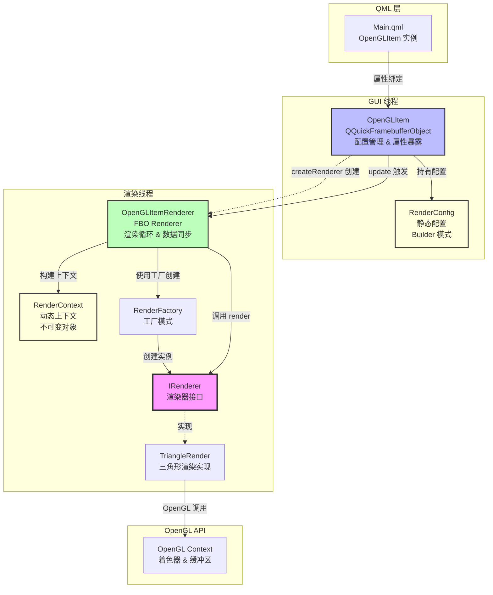
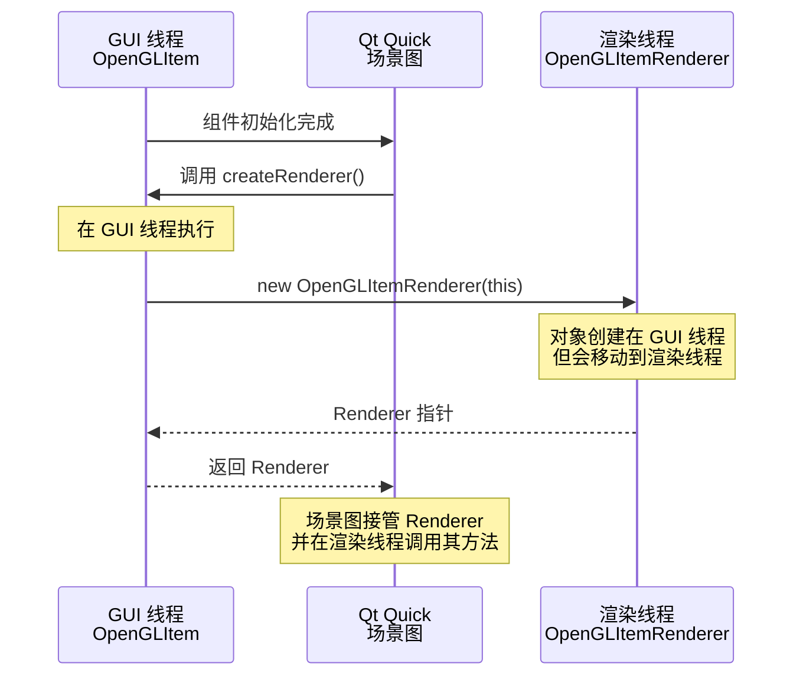
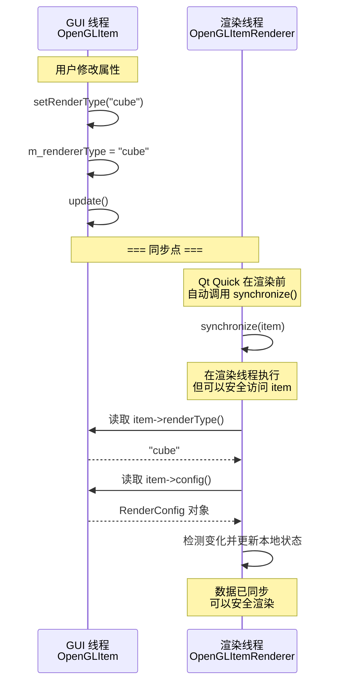
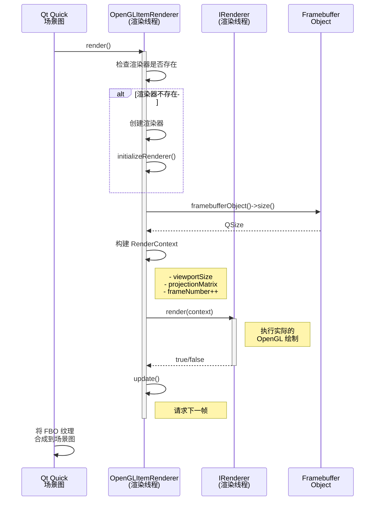
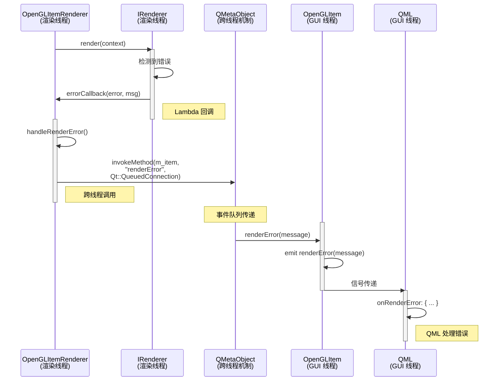

# 基于 QQuickFramebufferObject 的 OpenGL QML 组件架构总结

## 项目概述

本项目实现了一个高度自定义的基于 OpenGL 的 QML 组件，采用现代 C++ 设计模式和 Qt Quick 的 FBO（Framebuffer Object）渲染机制，实现了松耦合、易扩展、线程安全的渲染架构。

## 核心设计原则

- **依赖倒置原则（DIP）**：通过 `IRenderer` 接口实现抽象依赖
- **单一职责原则（SRP）**：每个类职责明确，互不干扰
- **开闭原则（OCP）**：通过工厂模式支持扩展新渲染器
- **依赖注入（DI）**：通过配置对象和上下文对象传递依赖

---

## 整体架构图



---

## 分层架构

```
┌─────────────────────────────────────────────────────┐
│                   QML/UI 层                         │
│  - Main.qml                                         │
│  - OpenGLItem 组件实例                               │
│  - 属性绑定（rendererType, fps 等）                  │
└─────────────────────────────────────────────────────┘
                         ↓
┌─────────────────────────────────────────────────────┐
│              表现层 (GUI 线程)                       │
│  - OpenGLItem (QQuickFramebufferObject)             │
│  - 配置管理 (RenderConfig)                           │
│  - 属性暴露 (Q_PROPERTY)                             │
│  - 信号发射 (fpsChanged, renderError)                │
└─────────────────────────────────────────────────────┘
                         ↓ createRenderer()
┌─────────────────────────────────────────────────────┐
│              渲染层 (渲染线程)                       │
│  - OpenGLItemRenderer (FBO Renderer)                │
│  - FBO 管理 (createFramebufferObject)                │
│  - 渲染循环 (render)                                 │
│  - 数据同步 (synchronize)                            │
└─────────────────────────────────────────────────────┘
                         ↓
┌─────────────────────────────────────────────────────┐
│              抽象层                                  │
│  - IRenderer 接口                                    │
│  - RenderContext (不可变上下文)                      │
│  - RenderConfig (Builder 配置)                       │
│  - RenderFactory (工厂模式)                          │
└─────────────────────────────────────────────────────┘
                         ↓
┌─────────────────────────────────────────────────────┐
│              实现层                                  │
│  - TriangleRender (具体渲染器)                       │
│  - 着色器管理 (QOpenGLShaderProgram)                 │
│  - 缓冲区管理 (VBO/VAO)                              │
│  - OpenGL 调用                                       │
└─────────────────────────────────────────────────────┘
                         ↓
┌─────────────────────────────────────────────────────┐
│              OpenGL API                             │
│  - glDrawArrays, glClear, etc.                      │
└─────────────────────────────────────────────────────┘
```

---

## 线程模型与时序图

### 完整生命周期时序图

```mermaid
sequenceDiagram
    participant QML as QML 层<br/>(Main.qml)
    participant Item as OpenGLItem<br/>(GUI 线程)
    participant Renderer as OpenGLItemRenderer<br/>(渲染线程)
    participant IRenderer as IRenderer<br/>(渲染线程)
    participant Factory as RenderFactory<br/>(渲染线程)
    participant GL as OpenGL API<br/>(渲染线程)
    
    Note over QML,GL: === 初始化阶段 ===
    
    QML->>Item: 创建 OpenGLItem 实例
    activate Item
    Item->>Item: 构造函数<br/>- 初始化配置<br/>- createTriangleConfig()
    Item->>Item: setMirrorVertically(true)
    Note right of Item: FBO 纹理需要垂直翻转
    
    QML->>Item: 组件完成加载
    Item->>Renderer: createRenderer()
    Note right of Item: Qt Quick 场景图调用
    activate Renderer
    
    Renderer->>Renderer: 构造函数<br/>- initializeOpenGLFunctions()<br/>- 同步初始配置
    Renderer-->>Item: 返回 Renderer 实例
    deactivate Renderer
    deactivate Item
    
    Note over QML,GL: === 首次渲染阶段 ===
    
    activate Renderer
    Renderer->>Renderer: createFramebufferObject(size)
    Note right of Renderer: 创建 FBO 和 MSAA
    Renderer->>Renderer: updateProjectMatrix(size)
    Note right of Renderer: 计算透视投影矩阵
    Renderer->>GL: new QOpenGLFramebufferObject
    GL-->>Renderer: FBO 对象
    
    Renderer->>Renderer: render()
    Note right of Renderer: 第一帧渲染
    
    Renderer->>Factory: create("triangle")
    activate Factory
    Factory->>IRenderer: new TriangleRender()
    activate IRenderer
    IRenderer-->>Factory: 渲染器实例
    Factory-->>Renderer: unique_ptr<IRenderer>
    deactivate Factory
    
    Renderer->>Renderer: initializeRenderer()
    Renderer->>IRenderer: setErrorCallback(lambda)
    Renderer->>IRenderer: initialize(config)
    
    IRenderer->>GL: 编译着色器
    GL-->>IRenderer: 着色器程序
    IRenderer->>GL: 创建 VBO/VAO
    GL-->>IRenderer: 缓冲区对象
    IRenderer-->>Renderer: true (初始化成功)
    
    Renderer->>Renderer: 构建 RenderContext
    Note right of Renderer: - viewportSize<br/>- projectionMatrix<br/>- frameNumber
    
    Renderer->>IRenderer: render(context)
    IRenderer->>GL: glClear()
    IRenderer->>GL: glUseProgram()
    IRenderer->>GL: glBindVertexArray()
    IRenderer->>GL: glDrawArrays()
    IRenderer-->>Renderer: true
    
    Renderer->>Renderer: update()
    Note right of Renderer: 触发下一帧
    deactivate Renderer
    
    Note over QML,GL: === 持续渲染阶段 ===
    
    loop 每一帧
        activate Renderer
        Renderer->>Renderer: render()
        Renderer->>Renderer: 构建 RenderContext<br/>frameNumber++
        Renderer->>IRenderer: render(context)
        activate IRenderer
        IRenderer->>GL: OpenGL 绘制调用
        IRenderer-->>Renderer: true
        deactivate IRenderer
        Renderer->>Renderer: update()
        deactivate Renderer
    end
    
    Note over QML,GL: === 属性变化阶段 ===
    
    QML->>Item: setRenderType("cube")
    activate Item
    Item->>Item: m_rendererType = "cube"
    Item->>Item: emit rendererTypeChanged()
    Item->>Item: update()
    Note right of Item: 触发重新渲染
    deactivate Item
    
    activate Renderer
    Renderer->>Renderer: synchronize(item)
    Note right of Renderer: GUI 线程 → 渲染线程<br/>数据同步点
    
    Renderer->>Renderer: 检测类型变化
    Renderer->>IRenderer: cleanup()
    activate IRenderer
    IRenderer->>GL: 释放 OpenGL 资源
    deactivate IRenderer
    Renderer->>Renderer: m_renderer.reset()
    Renderer->>Renderer: m_rendererInitialized = false
    deactivate Renderer
    
    activate Renderer
    Renderer->>Renderer: render()
    Renderer->>Factory: create("cube")
    activate Factory
    Factory->>IRenderer: new CubeRender()
    IRenderer-->>Factory: 新渲染器实例
    Factory-->>Renderer: unique_ptr<IRenderer>
    deactivate Factory
    
    Renderer->>Renderer: initializeRenderer()
    Renderer->>IRenderer: initialize(config)
    IRenderer->>GL: 初始化新渲染器
    IRenderer-->>Renderer: true
    
    Renderer->>IRenderer: render(context)
    IRenderer->>GL: 绘制新内容
    deactivate Renderer
    
    Note over QML,GL: === 尺寸变化阶段 ===
    
    QML->>Item: 窗口尺寸改变
    activate Item
    Item->>Item: update()
    deactivate Item
    
    activate Renderer
    Renderer->>Renderer: createFramebufferObject(newSize)
    Renderer->>Renderer: updateProjectMatrix(newSize)
    Renderer->>IRenderer: resize(width, height)
    activate IRenderer
    IRenderer->>GL: glViewport(width, height)
    deactivate IRenderer
    Renderer->>GL: new QOpenGLFramebufferObject
    GL-->>Renderer: 新 FBO
    deactivate Renderer
    
    Note over QML,GL: === 错误处理阶段 ===
    
    activate Renderer
    Renderer->>IRenderer: render(context)
    activate IRenderer
    IRenderer->>IRenderer: 检测到错误
    IRenderer->>Renderer: errorCallback(error, msg)
    deactivate IRenderer
    
    Renderer->>Renderer: handleRenderError()
    Renderer->>Item: QMetaObject::invokeMethod<br/>"renderError"<br/>Qt::QueuedConnection
    Note right of Renderer: 跨线程信号发射
    deactivate Renderer
    
    activate Item
    Item->>Item: emit renderError(message)
    Item->>QML: 信号传递到 QML
    deactivate Item
    
    QML->>QML: onRenderError 处理
    
    Note over QML,GL: === 销毁阶段 ===
    
    QML->>Item: 组件销毁
    activate Item
    Item->>Item: ~OpenGLItem()
    deactivate Item
    
    activate Renderer
    Renderer->>Renderer: ~OpenGLItemRenderer()
    Renderer->>IRenderer: cleanup()
    activate IRenderer
    IRenderer->>GL: 释放所有 OpenGL 资源
    deactivate IRenderer
    Renderer->>Renderer: m_renderer.reset()
    deactivate Renderer
```



---

## 关键线程交互点

### 1. 创建阶段（GUI 线程 → 渲染线程）



### 2. 同步阶段（GUI 线程 → 渲染线程）



### 3. 渲染阶段（渲染线程）



### 4. 错误处理（渲染线程 → GUI 线程）



---

## 核心类职责

### OpenGLItem（GUI 线程）

**继承**：`QQuickFramebufferObject`

**职责**：
- 作为 QML 组件暴露给 QML 层
- 管理渲染配置（RenderConfig）
- 暴露属性给 QML（fps, rendererType）
- 发射信号通知 QML（fpsChanged, renderError）
- 创建渲染器实例（createRenderer）

**关键方法**：
```cpp
Renderer* createRenderer() const override;  // 创建 OpenGLItemRenderer
void setRenderType(const QString& type);    // 切换渲染器类型
void setRenderConfig(const RenderConfig&);  // 更新配置
```

**线程安全**：
- 所有方法在 GUI 线程调用
- 通过 `update()` 触发渲染线程的 `synchronize()`

---

### OpenGLItemRenderer（渲染线程）

**继承**：`QQuickFramebufferObject::Renderer`, `QOpenGLFunctions`

**职责**：
- 管理 FBO 的创建和销毁
- 执行每帧渲染循环
- 从 GUI 线程同步数据
- 管理 IRenderer 实例的生命周期
- 构建 RenderContext 并传递给 IRenderer

**关键方法**：
```cpp
void render() override;                                    // 每帧渲染
QOpenGLFramebufferObject* createFramebufferObject(...);   // 创建 FBO
void synchronize(QQuickFramebufferObject* item) override; // 同步数据
```

**线程安全**：
- 所有方法在渲染线程调用
- `synchronize()` 中可以安全访问 OpenGLItem 的数据
- 使用 `QMetaObject::invokeMethod` 跨线程发射信号

---

### IRenderer（接口）

**职责**：
- 定义渲染器的标准接口
- 解耦渲染逻辑和 Qt Quick 集成
- 支持多种渲染器实现（三角形、立方体等）

**关键方法**：
```cpp
virtual bool initialize(const RenderConfig& config) = 0;  // 初始化
virtual bool render(const RenderContext& context) = 0;    // 渲染
virtual bool resize(int width, int height) = 0;           // 尺寸变化
virtual void cleanup() = 0;                               // 清理资源
```

**设计优势**：
- 纯虚接口，不依赖 QObject
- 使用回调而非信号槽，降低 Qt 依赖
- 支持工厂模式创建不同实现

---

### RenderConfig（配置类）

**职责**：
- 封装渲染器的静态配置
- 使用 Builder 模式支持链式调用
- 提供预定义配置（createTriangleConfig）

**关键特性**：
```cpp
RenderConfig& setVertexShaderPath(const QString& path);
RenderConfig& setFragmentShaderPath(const QString& path);
RenderConfig& setVertexData(const std::vector<VertexData>& data);
static RenderConfig createTriangleConfig();  // 工厂方法
```

**设计优势**：
- Builder 模式，易于构建复杂配置
- 值语义，可以安全复制
- 配置与实现分离

---

### RenderContext（上下文类）

**职责**：
- 封装渲染过程中的动态信息
- 提供不可变的上下文对象
- 支持函数式风格的上下文构建

**关键特性**：
```cpp
RenderContext withFrameNumber(quint64 frame) const;  // 不可变更新
RenderContext withDeltaTime(float dt) const;
```

**设计优势**：
- 不可变对象，线程安全
- 值语义，可以安全传递
- 包含所有渲染所需信息

---

### RenderFactory（工厂类）

**职责**：
- 根据类型字符串创建渲染器实例
- 支持扩展新的渲染器类型

**关键方法**：
```cpp
static std::unique_ptr<IRenderer> create(const std::string& type);
```

**设计优势**：
- 工厂模式，支持运行时切换渲染器
- 易于扩展新类型
- 返回智能指针，自动管理生命周期

---

## 数据流向

### 配置数据流（GUI → 渲染线程）

```
QML 属性
    ↓
OpenGLItem::setRenderType()
    ↓
OpenGLItem::m_rendererType (GUI 线程)
    ↓
OpenGLItem::update() 触发
    ↓
OpenGLItemRenderer::synchronize() (渲染线程)
    ↓
OpenGLItemRenderer::m_currentRendererType (渲染线程副本)
    ↓
RenderFactory::create()
    ↓
IRenderer 实例
```

### 渲染数据流（渲染线程内部）

```
OpenGLItemRenderer::render()
    ↓
构建 RenderContext
    ↓
IRenderer::render(context)
    ↓
TriangleRender::render()
    ↓
OpenGL API 调用
    ↓
FBO 纹理
    ↓
Qt Quick 场景图合成
    ↓
屏幕显示
```

### 错误信息流（渲染线程 → GUI 线程）

```
IRenderer::render() 检测错误
    ↓
errorCallback(error, msg) (Lambda)
    ↓
OpenGLItemRenderer::handleRenderError()
    ↓
QMetaObject::invokeMethod (跨线程)
    ↓
OpenGLItem::renderError() 信号 (GUI 线程)
    ↓
QML onRenderError 处理
```

---

## 线程安全机制

### 1. 数据同步

- **synchronize() 方法**：Qt Quick 保证在渲染前调用，此时可以安全访问 GUI 线程的数据
- **数据复制**：将 GUI 线程的配置复制到渲染线程的本地变量
- **不可变对象**：RenderContext 使用不可变模式，避免并发修改

### 2. 跨线程通信

- **QMetaObject::invokeMethod**：使用 `Qt::QueuedConnection` 从渲染线程发射信号到 GUI 线程
- **回调机制**：使用 Lambda 回调而非直接信号槽，降低耦合

### 3. 资源管理

- **智能指针**：使用 `std::unique_ptr` 管理 IRenderer 生命周期
- **显式清理**：在渲染线程中调用 `cleanup()` 释放 OpenGL 资源
- **FBO 管理**：Qt Quick 自动管理 FBO 的创建和销毁

---

## 扩展性设计

### 添加新渲染器

1. 实现 `IRenderer` 接口
2. 在 `RenderFactory::create()` 中注册新类型
3. 在 QML 中设置 `rendererType` 属性

示例：
```cpp
// CubeRender.hpp
class CubeRender : public IRenderer {
public:
    bool initialize(const RenderConfig& config) override;
    bool render(const RenderContext& context) override;
    bool resize(int width, int height) override;
    void cleanup() override;
    void setErrorCallback(ErrorCallback callback) override;
    std::string getName() const override { return "Cube"; }
};

// RenderFactory.cpp
std::unique_ptr<IRenderer> RenderFactory::create(const std::string& type) {
    if (type == "triangle") return std::make_unique<TriangleRender>();
    if (type == "cube") return std::make_unique<CubeRender>();  // 新增
    return nullptr;
}
```

### 添加新配置

在 `RenderConfig` 中添加新的 Builder 方法和静态工厂：

```cpp
class RenderConfig {
public:
    RenderConfig& setWireframeMode(bool enabled);
    RenderConfig& setLineWidth(float width);
    
    static RenderConfig createCubeConfig();
};
```

---

## 性能优化

### 1. FBO 缓存
- Qt Quick 自动缓存 FBO，避免每帧重新创建
- 只在尺寸变化时重新创建 FBO

### 2. MSAA 抗锯齿
```cpp
format.setSamples(4);  // 4x MSAA
```

### 3. 并行渲染
- OpenGL 渲染在独立的渲染线程
- 不阻塞 GUI 线程的事件处理

### 4. 智能更新
- 只在配置真正变化时重新初始化渲染器
- 使用 `update()` 而非定时器触发渲染

---

## 总结

本架构通过以下设计实现了高质量的 OpenGL QML 组件：

1. **正确使用 QQuickFramebufferObject**：遵循 Qt 官方推荐方式
2. **清晰的线程模型**：GUI 线程和渲染线程职责分明
3. **松耦合设计**：通过接口和配置对象解耦各层
4. **易于扩展**：工厂模式支持添加新渲染器
5. **线程安全**：使用同步点和跨线程机制保证安全
6. **现代 C++**：智能指针、Lambda、不可变对象等

这种架构适用于需要高度自定义 OpenGL 渲染的 Qt Quick 应用，如游戏引擎、数据可视化、CAD 软件等。
