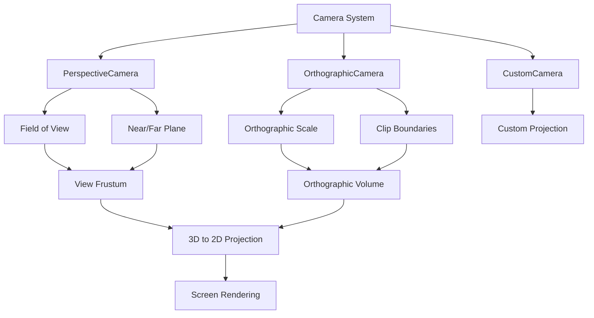

# Camera

## 是什么

Camera是Qt Quick 3D中定义观察视点的核心组件，决定了3D场景如何投影到2D屏幕上。相机系统包括透视相机（PerspectiveCamera）、正交相机（OrthographicCamera）和自定义相机，每种类型适用于不同的渲染需求。



相机不仅控制视角和投影方式，还影响深度缓冲、视锥体剔除和LOD计算。正确配置相机参数对于获得理想的视觉效果和渲染性能至关重要。

## 常用属性一览表

| 属性名 | 类型 | 默认值 | 取值范围 | 作用 | 性能/质量提示 |
| ------ | ---- | ------ | -------- | ---- | -------------- |
| position★ | vector3d | (0,0,0) | 3D坐标 | 相机世界位置 | 频繁修改会触发视图矩阵更新 |
| eulerRotation★ | vector3d | (0,0,0) | 角度值 | 相机朝向 | 使用lookAtNode可简化设置 |
| fieldOfView★ | real | 60.0 | 1-179度 | 视野角度(透视) | 过大会产生鱼眼效果 |
| nearPlane★ | real | 10.0 | 正数 | 近裁剪面 | 过小会降低深度精度 |
| farPlane★ | real | 10000.0 | 正数 | 远裁剪面 | 过大会降低深度精度 |
| lookAtNode | Node | null | 3D节点 | 注视目标 | 自动计算相机朝向 |
| clipNear | real | 1.0 | 正数 | 近裁剪距离 | 影响阴影质量 |
| clipFar | real | 1000.0 | 正数 | 远裁剪距离 | 影响渲染范围 |
| horizontalMagnification | real | 1.0 | 正数 | 水平放大(正交) | 正交相机专用 |
| verticalMagnification | real | 1.0 | 正数 | 垂直放大(正交) | 正交相机专用 |
| frustumCullingEnabled | bool | true | true/false | 视锥体剔除 | 关闭会影响性能 |

★ 标记表示高频使用属性

## 属性详解

### position★ (高频属性)

position定义相机在3D世界中的位置坐标，是确定观察视点的基础属性。

**使用场景：**

- 第一人称视角游戏的玩家位置
- 建筑漫游中的观察点设置
- 产品展示的最佳观察角度

**注意事项：**

- 频繁修改position会触发视图矩阵重新计算
- 与lookAtNode结合使用可简化相机控制
- 考虑使用动画平滑相机移动
- 避免相机位置与几何体重叠

### fieldOfView★ (高频属性)

fieldOfView控制透视相机的视野角度，影响场景的可见范围和透视效果。

**视野角度效果：**

- 30-50度: 长焦镜头效果，适合人像和细节展示
- 60-90度: 标准视角，接近人眼视觉
- 90-120度: 广角效果，适合建筑和风景
- 120度以上: 鱼眼效果，产生明显畸变

**使用场景：**

- 游戏中的变焦功能
- 建筑可视化的空间感控制
- VR应用的沉浸感调节

**注意事项：**

- 过大的FOV会产生不自然的畸变
- 移动设备建议使用较小的FOV节省性能
- FOV变化会影响视锥体剔除效率

### nearPlane和farPlane★ (高频属性)

nearPlane和farPlane定义相机的可见深度范围，直接影响深度缓冲精度和渲染性能。

**深度精度关系：**

- 深度精度 ∝ nearPlane / (farPlane - nearPlane)
- nearPlane过小会导致Z-fighting问题
- farPlane过大会浪费深度精度

**使用场景：**

- 室内场景：nearPlane=0.1, farPlane=100
- 室外场景：nearPlane=1.0, farPlane=1000
- 太空场景：nearPlane=10, farPlane=100000

**注意事项：**

- 根据场景规模合理设置范围
- 避免nearPlane设置为0
- 考虑使用多层深度缓冲处理大范围场景

## 最小可运行示例

**文件树：**

```text
camera-example/
├── main.qml
├── CameraController.qml
├── assets/
│   └── scene.mesh
└── CMakeLists.txt
```

**完整代码：**

main.qml:
```qml
import QtQuick
import QtQuick3D

Window {
    width: 1200
    height: 800
    visible: true
    title: "Camera System Example"

    View3D {
        id: view3D
        anchors.fill: parent
        
        // 透视相机 - 主相机
        PerspectiveCamera {
            id: perspectiveCamera
            position: Qt.vector3d(0, 5, 10)
            eulerRotation: Qt.vector3d(-20, 0, 0)
            fieldOfView: 60
            nearPlane: 0.1
            farPlane: 1000
            
            // 相机动画
            SequentialAnimation on position {
                loops: Animation.Infinite
                PropertyAnimation {
                    to: Qt.vector3d(10, 5, 10)
                    duration: 4000
                    easing.type: Easing.InOutSine
                }
                PropertyAnimation {
                    to: Qt.vector3d(0, 5, 10)
                    duration: 4000
                    easing.type: Easing.InOutSine
                }
            }
        }
        
        // 正交相机 - 备用相机
        OrthographicCamera {
            id: orthographicCamera
            position: Qt.vector3d(0, 10, 0)
            eulerRotation: Qt.vector3d(-90, 0, 0)
            horizontalMagnification: 0.1
            verticalMagnification: 0.1
            nearPlane: 0.1
            farPlane: 100
        }
        
        // 使用lookAtNode的相机
        PerspectiveCamera {
            id: lookAtCamera
            position: Qt.vector3d(8, 3, 8)
            lookAtNode: centerCube
            fieldOfView: 45
        }
        
        // 场景内容
        Model {
            id: centerCube
            source: "#Cube"
            position: Qt.vector3d(0, 0, 0)
            materials: PrincipledMaterial {
                baseColor: "red"
                metalness: 0.5
                roughness: 0.3
            }
            
            SequentialAnimation on eulerRotation {
                loops: Animation.Infinite
                PropertyAnimation {
                    to: Qt.vector3d(0, 360, 0)
                    duration: 5000
                }
            }
        }
        
        // 参考网格
        Repeater3D {
            model: 21
            Model {
                source: "#Cube"
                position: Qt.vector3d((index - 10) * 2, -2, 0)
                scale: Qt.vector3d(0.1, 0.1, 0.1)
                materials: PrincipledMaterial {
                    baseColor: index % 2 ? "white" : "gray"
                }
            }
        }
        
        // 光照
        DirectionalLight {
            eulerRotation.x: -45
            eulerRotation.y: 45
            brightness: 1.0
            castsShadow: true
        }
        
        environment: SceneEnvironment {
            clearColor: "#87CEEB"
            backgroundMode: SceneEnvironment.Color
        }
    }
    
    // 相机切换控制
    Row {
        anchors.bottom: parent.bottom
        anchors.horizontalCenter: parent.horizontalCenter
        anchors.margins: 20
        spacing: 10
        
        Button {
            text: "透视相机"
            onClicked: view3D.camera = perspectiveCamera
        }
        
        Button {
            text: "正交相机"
            onClicked: view3D.camera = orthographicCamera
        }
        
        Button {
            text: "注视相机"
            onClicked: view3D.camera = lookAtCamera
        }
    }
    
    // FOV控制
    Column {
        anchors.right: parent.right
        anchors.top: parent.top
        anchors.margins: 20
        spacing: 10
        
        Text {
            text: "视野角度: " + Math.round(fovSlider.value) + "°"
            color: "white"
        }
        
        Slider {
            id: fovSlider
            from: 30
            to: 120
            value: 60
            onValueChanged: {
                if (view3D.camera === perspectiveCamera) {
                    perspectiveCamera.fieldOfView = value
                }
            }
        }
    }
}
```

CameraController.qml:
```qml
import QtQuick
import QtQuick3D

Item {
    id: controller
    
    property Camera camera
    property real moveSpeed: 5.0
    property real rotateSpeed: 2.0
    
    focus: true
    
    Keys.onPressed: (event) => {
        if (!camera) return
        
        var deltaTime = 0.016 // 假设60fps
        var moveDistance = moveSpeed * deltaTime
        
        switch (event.key) {
        case Qt.Key_W:
            camera.position = camera.position.plus(
                camera.forward.times(moveDistance))
            break
        case Qt.Key_S:
            camera.position = camera.position.minus(
                camera.forward.times(moveDistance))
            break
        case Qt.Key_A:
            camera.position = camera.position.minus(
                camera.right.times(moveDistance))
            break
        case Qt.Key_D:
            camera.position = camera.position.plus(
                camera.right.times(moveDistance))
            break
        case Qt.Key_Q:
            camera.position = camera.position.plus(
                camera.up.times(moveDistance))
            break
        case Qt.Key_E:
            camera.position = camera.position.minus(
                camera.up.times(moveDistance))
            break
        }
    }
    
    MouseArea {
        anchors.fill: parent
        acceptedButtons: Qt.RightButton
        
        property point lastPos
        
        onPressed: (mouse) => {
            lastPos = Qt.point(mouse.x, mouse.y)
        }
        
        onPositionChanged: (mouse) => {
            if (!camera || !pressed) return
            
            var deltaX = mouse.x - lastPos.x
            var deltaY = mouse.y - lastPos.y
            
            camera.eulerRotation.y += deltaX * rotateSpeed * 0.1
            camera.eulerRotation.x -= deltaY * rotateSpeed * 0.1
            
            // 限制俯仰角
            camera.eulerRotation.x = Math.max(-89, 
                Math.min(89, camera.eulerRotation.x))
            
            lastPos = Qt.point(mouse.x, mouse.y)
        }
    }
}
```

CMakeLists.txt:
```cmake
cmake_minimum_required(VERSION 3.16)
project(CameraExample)

find_package(Qt6 REQUIRED COMPONENTS Core Quick Quick3D)

qt_add_executable(CameraExample main.cpp)
qt_add_qml_module(CameraExample
    URI CameraExample
    VERSION 1.0
    QML_FILES 
        main.qml
        CameraController.qml
)

target_link_libraries(CameraExample Qt6::Core Qt6::Quick Qt6::Quick3D)
```

main.cpp:
```cpp
#include <QGuiApplication>
#include <QQmlApplicationEngine>

int main(int argc, char *argv[])
{
    QGuiApplication app(argc, argv);
    QQmlApplicationEngine engine;
    engine.load(QUrl(QStringLiteral("qrc:/main.qml")));
    return app.exec();
}
```

**预期效果：**
显示3D场景，支持透视/正交相机切换，包含相机动画、视野角度调节和键鼠控制功能。

## 踩坑与调试

### 常见错误

**错误1：场景不可见或显示异常**
```
Console Warning: Camera near/far plane configuration may cause precision issues
```
**解决方案：**
1. 检查nearPlane和farPlane的比值，避免过大差距
2. 确认相机位置不在几何体内部
3. 验证相机朝向是否正确
4. 检查fieldOfView是否在合理范围内

**错误2：深度冲突（Z-fighting）**
```
Console Warning: Z-fighting detected, consider adjusting near plane
```
**解决方案：**
1. 增大nearPlane值改善深度精度
2. 减小farPlane范围
3. 使用深度偏移（depthBias）分离重叠表面
4. 考虑使用多层深度缓冲

**错误3：相机控制不响应**
```
Console Warning: Camera transform updates ignored
```
**解决方案：**
1. 确认相机对象已正确绑定到View3D
2. 检查动画是否与手动控制冲突
3. 验证lookAtNode设置是否覆盖了手动旋转
4. 确保相机属性绑定没有循环依赖

### 调试技巧

1. **视锥体可视化**
   - 使用辅助线显示相机视锥体
   - 检查近远裁剪面的位置
   - 验证视野角度的实际效果

2. **相机参数监控**
   - 实时显示相机位置和旋转
   - 监控视图矩阵和投影矩阵
   - 检查相机移动的平滑性

3. **性能分析**
   - 监控视锥体剔除的效果
   - 检查相机变换的更新频率
   - 分析不同FOV对渲染性能的影响

### 性能优化建议

- 合理设置近远裁剪面，避免过大的深度范围
- 使用lookAtNode简化相机朝向计算
- 避免频繁修改相机参数，使用动画平滑过渡
- 启用视锥体剔除提高大场景渲染性能
- 根据场景规模选择合适的相机类型

## 延伸阅读

1. **Qt Quick 3D Camera QML Types**  
   官方文档详细介绍了各种相机类型的属性和用法，包括高级相机控制技巧。  
   链接：https://doc.qt.io/qt-6/qml-qtquick3d-camera.html

2. **3D Graphics Camera Systems**  
   深入解释3D图形学中相机系统的数学原理，包括视图变换和投影变换。  
   链接：https://learnopengl.com/Getting-started/Camera

## 附录：完整属性清单

<details>
<summary>点击展开完整属性列表</summary>

| 属性名 | 类型 | 默认值 | 取值范围 | 作用 | 版本支持 |
| ------ | ---- | ------ | -------- | ---- | -------- |
| position | vector3d | (0,0,0) | 3D坐标 | 相机位置 | Qt 6.0+ |
| rotation | quaternion | (1,0,0,0) | 四元数 | 相机旋转 | Qt 6.0+ |
| eulerRotation | vector3d | (0,0,0) | 角度值 | 欧拉角旋转 | Qt 6.0+ |
| scale | vector3d | (1,1,1) | 缩放因子 | 相机缩放 | Qt 6.0+ |
| pivot | vector3d | (0,0,0) | 3D坐标 | 变换中心 | Qt 6.0+ |
| lookAtNode | Node | null | 3D节点 | 注视目标 | Qt 6.0+ |
| fieldOfView | real | 60.0 | 1-179度 | 视野角度 | Qt 6.0+ |
| nearPlane | real | 10.0 | 正数 | 近裁剪面 | Qt 6.0+ |
| farPlane | real | 10000.0 | 正数 | 远裁剪面 | Qt 6.0+ |
| clipNear | real | 1.0 | 正数 | 近裁剪距离 | Qt 6.0+ |
| clipFar | real | 1000.0 | 正数 | 远裁剪距离 | Qt 6.0+ |
| horizontalMagnification | real | 1.0 | 正数 | 水平放大 | Qt 6.0+ |
| verticalMagnification | real | 1.0 | 正数 | 垂直放大 | Qt 6.0+ |
| frustumCullingEnabled | bool | true | true/false | 视锥体剔除 | Qt 6.0+ |
| isFieldOfViewHorizontal | bool | false | true/false | FOV方向 | Qt 6.2+ |
| projectionMatrix | matrix4x4 | auto | 4x4矩阵 | 投影矩阵 | Qt 6.0+ |
| viewMatrix | matrix4x4 | auto | 4x4矩阵 | 视图矩阵 | Qt 6.0+ |
| forward | vector3d | auto | 单位向量 | 前向向量 | Qt 6.0+ |
| up | vector3d | auto | 单位向量 | 上向向量 | Qt 6.0+ |
| right | vector3d | auto | 单位向量 | 右向向量 | Qt 6.0+ |

**相机类型特有属性：**

**PerspectiveCamera:**
- fieldOfView: 视野角度
- isFieldOfViewHorizontal: FOV计算方向

**OrthographicCamera:**
- horizontalMagnification: 水平放大倍数
- verticalMagnification: 垂直放大倍数

**CustomCamera:**
- projectionMatrix: 自定义投影矩阵

**版本差异说明：**
- Qt 6.0-6.1: 基础相机功能，支持透视和正交投影
- Qt 6.2: 新增FOV方向控制和改进的相机控制
- Qt 6.5: 优化相机变换性能和内存使用
- Qt 6.7: 新增高级相机效果和VR支持

</details>