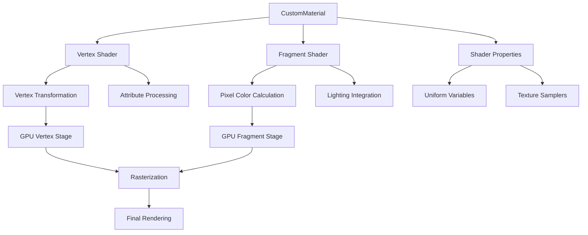

# CustomMaterial

## 是什么

CustomMaterial是Qt Quick 3D中用于创建自定义着色器材质的组件，允许开发者编写自定义的顶点和片段着色器来实现特殊的视觉效果。它提供了完全的着色器控制权，是实现高级渲染效果的核心工具。



CustomMaterial通过GLSL着色器语言提供了无限的创意可能性，从简单的颜色变换到复杂的程序化纹理、动画效果和后处理都可以实现。它是连接Qt Quick 3D高级API与底层GPU渲染能力的桥梁。

## 常用属性一览表

| 属性名 | 类型 | 默认值 | 取值范围 | 作用 | 性能/质量提示 |
| ------ | ---- | ------ | -------- | ---- | -------------- |
| vertexShader★ | url | "" | 着色器文件路径 | 顶点着色器源码 | 复杂计算会影响顶点处理性能 |
| fragmentShader★ | url | "" | 着色器文件路径 | 片段着色器源码 | 复杂计算会影响填充率 |
| sourceBlend★ | enum | NoBlend | 混合模式 | 源混合因子 | 透明混合影响渲染顺序 |
| destinationBlend★ | enum | NoBlend | 混合模式 | 目标混合因子 | 影响透明度渲染性能 |
| cullMode | enum | BackFaceCulling | 剔除模式 | 面剔除设置 | 关闭剔除会降低性能 |
| depthDrawMode | enum | OpaqueOnlyDepthDraw | 深度模式 | 深度缓冲写入 | 影响深度测试和透明度 |
| shadingMode | enum | Shaded | 着色模式 | 光照计算模式 | Unshaded跳过光照计算 |
| lineWidth | real | 1.0 | 正数 | 线宽(线框模式) | 粗线条可能不被所有GPU支持 |
| pointSize | real | 1.0 | 正数 | 点大小 | 大点可能影响填充率 |

★ 标记表示高频使用属性

## 属性详解

### vertexShader★ (高频属性)

vertexShader指定顶点着色器的源码文件，负责处理每个顶点的变换和属性计算。

**主要功能：**

- 顶点位置变换（模型-视图-投影变换）
- 顶点属性插值准备（法线、UV坐标等）
- 自定义顶点动画和变形
- 光照计算的预处理

**使用场景：**

- 顶点动画（波浪、旗帜飘动）
- 程序化变形（噪声位移）
- 自定义坐标变换
- 顶点级光照计算

**注意事项：**

- 顶点着色器在每个顶点上执行，复杂计算会影响性能
- 必须输出gl_Position作为最终顶点位置
- 使用varying变量向片段着色器传递数据
- 避免在顶点着色器中进行纹理采样

### fragmentShader★ (高频属性)

fragmentShader指定片段着色器的源码文件，负责计算每个像素的最终颜色。

**主要功能：**

- 像素颜色计算
- 纹理采样和混合
- 光照模型实现
- 特殊效果渲染

**使用场景：**

- 自定义光照模型
- 程序化纹理生成
- 后处理效果
- 透明度和混合效果

**注意事项：**

- 片段着色器在每个像素上执行，对性能影响最大
- 避免复杂的循环和分支语句
- 合理使用纹理采样，避免过多的texture()调用
- 注意精度设置，移动设备建议使用mediump

### sourceBlend和destinationBlend★ (高频属性)

这两个属性控制材质的混合模式，决定新渲染的像素如何与已有的像素混合。

**常用混合模式组合：**

- 不透明：`sourceBlend: NoBlend, destinationBlend: NoBlend`
- 标准透明：`sourceBlend: SrcAlpha, destinationBlend: OneMinusSrcAlpha`
- 加法混合：`sourceBlend: SrcAlpha, destinationBlend: One`
- 乘法混合：`sourceBlend: DstColor, destinationBlend: Zero`

**使用场景：**

- 透明材质（玻璃、水面）
- 发光效果（粒子、光晕）
- 叠加效果（贴花、UI元素）

**注意事项：**

- 透明对象需要从后往前渲染
- 混合会禁用深度写入
- 复杂混合模式会影响性能

## 最小可运行示例

**文件树：**

```text
custom-material-example/
├── main.qml
├── shaders/
│   ├── wave.vert
│   ├── wave.frag
│   ├── dissolve.vert
│   └── dissolve.frag
├── textures/
│   ├── noise.png
│   └── dissolve_mask.png
└── CMakeLists.txt
```

**完整代码：**

main.qml:
```qml
import QtQuick
import QtQuick3D

Window {
    width: 1200
    height: 800
    visible: true
    title: "CustomMaterial Example"

    View3D {
        anchors.fill: parent
        
        PerspectiveCamera {
            position: Qt.vector3d(0, 2, 8)
            eulerRotation: Qt.vector3d(-10, 0, 0)
        }
        
        // 波浪效果材质
        Model {
            source: "#Rectangle"
            position: Qt.vector3d(-3, 0, 0)
            scale: Qt.vector3d(2, 2, 1)
            
            materials: CustomMaterial {
                id: waveMaterial
                vertexShader: "qrc:/shaders/wave.vert"
                fragmentShader: "qrc:/shaders/wave.frag"
                
                property real time: 0.0
                property real amplitude: 0.5
                property real frequency: 2.0
                property color baseColor: "cyan"
                
                NumberAnimation on time {
                    from: 0
                    to: 10
                    duration: 10000
                    loops: Animation.Infinite
                }
            }
        }
        
        // 溶解效果材质
        Model {
            source: "#Cube"
            position: Qt.vector3d(3, 0, 0)
            
            materials: CustomMaterial {
                id: dissolveMaterial
                vertexShader: "qrc:/shaders/dissolve.vert"
                fragmentShader: "qrc:/shaders/dissolve.frag"
                
                property real dissolveAmount: 0.0
                property color dissolveColor: "orange"
                property color baseColor: "red"
                property Texture dissolveTexture: Texture {
                    source: "qrc:/textures/noise.png"
                }
                
                SequentialAnimation on dissolveAmount {
                    loops: Animation.Infinite
                    PropertyAnimation { to: 1.0; duration: 3000 }
                    PropertyAnimation { to: 0.0; duration: 3000 }
                }
            }
        }
        
        // 发光效果材质
        Model {
            source: "#Sphere"
            position: Qt.vector3d(0, 0, 0)
            
            materials: CustomMaterial {
                vertexShader: "qrc:/shaders/glow.vert"
                fragmentShader: "qrc:/shaders/glow.frag"
                
                sourceBlend: CustomMaterial.SrcAlpha
                destinationBlend: CustomMaterial.One
                depthDrawMode: CustomMaterial.NeverDepthDraw
                
                property real glowIntensity: 2.0
                property color glowColor: "yellow"
                
                SequentialAnimation on glowIntensity {
                    loops: Animation.Infinite
                    PropertyAnimation { to: 4.0; duration: 1500 }
                    PropertyAnimation { to: 1.0; duration: 1500 }
                }
            }
        }
        
        DirectionalLight {
            eulerRotation.x: -45
            brightness: 0.5
        }
        
        environment: SceneEnvironment {
            clearColor: "#111111"
            backgroundMode: SceneEnvironment.Color
        }
    }
    
    // 材质参数控制
    Column {
        anchors.left: parent.left
        anchors.top: parent.top
        anchors.margins: 20
        spacing: 10
        
        Text {
            text: "波浪振幅: " + waveMaterial.amplitude.toFixed(2)
            color: "white"
        }
        
        Slider {
            from: 0.1
            to: 2.0
            value: 0.5
            onValueChanged: waveMaterial.amplitude = value
        }
        
        Text {
            text: "溶解程度: " + dissolveMaterial.dissolveAmount.toFixed(2)
            color: "white"
        }
        
        Slider {
            from: 0.0
            to: 1.0
            value: dissolveMaterial.dissolveAmount
            onValueChanged: dissolveMaterial.dissolveAmount = value
        }
    }
}
```

shaders/wave.vert:
```glsl
#version 440

layout(location = 0) in vec3 qt_Vertex;
layout(location = 1) in vec3 qt_Normal;
layout(location = 2) in vec2 qt_TexCoord0;

layout(std140, binding = 0) uniform buf {
    mat4 qt_Matrix;
    mat4 qt_ModelMatrix;
    mat4 qt_ViewMatrix;
    mat4 qt_ProjectionMatrix;
    mat4 qt_NormalMatrix;
    float qt_Opacity;
    
    // 自定义属性
    float time;
    float amplitude;
    float frequency;
};

out vec3 worldPos;
out vec3 normal;
out vec2 texCoord;

void main() {
    texCoord = qt_TexCoord0;
    
    // 计算波浪位移
    vec3 pos = qt_Vertex;
    float wave = sin(pos.x * frequency + time) * amplitude;
    pos.y += wave;
    
    // 计算修正后的法线
    float dx = cos(pos.x * frequency + time) * frequency * amplitude;
    vec3 tangent = normalize(vec3(1.0, dx, 0.0));
    normal = normalize(cross(tangent, vec3(0.0, 0.0, 1.0)));
    
    worldPos = (qt_ModelMatrix * vec4(pos, 1.0)).xyz;
    gl_Position = qt_Matrix * vec4(pos, 1.0);
}
```

shaders/wave.frag:
```glsl
#version 440

layout(std140, binding = 0) uniform buf {
    mat4 qt_Matrix;
    mat4 qt_ModelMatrix;
    mat4 qt_ViewMatrix;
    mat4 qt_ProjectionMatrix;
    mat4 qt_NormalMatrix;
    float qt_Opacity;
    
    // 自定义属性
    float time;
    float amplitude;
    float frequency;
    vec4 baseColor;
};

in vec3 worldPos;
in vec3 normal;
in vec2 texCoord;

out vec4 fragColor;

void main() {
    // 简单的光照计算
    vec3 lightDir = normalize(vec3(1.0, 1.0, 1.0));
    float NdotL = max(dot(normal, lightDir), 0.0);
    
    // 基于高度的颜色变化
    float height = worldPos.y;
    vec3 color = mix(baseColor.rgb * 0.5, baseColor.rgb, height + 0.5);
    
    fragColor = vec4(color * (0.3 + 0.7 * NdotL), qt_Opacity);
}
```

shaders/dissolve.vert:
```glsl
#version 440

layout(location = 0) in vec3 qt_Vertex;
layout(location = 1) in vec3 qt_Normal;
layout(location = 2) in vec2 qt_TexCoord0;

layout(std140, binding = 0) uniform buf {
    mat4 qt_Matrix;
    mat4 qt_ModelMatrix;
    mat4 qt_ViewMatrix;
    mat4 qt_ProjectionMatrix;
    mat4 qt_NormalMatrix;
    float qt_Opacity;
};

out vec3 normal;
out vec2 texCoord;

void main() {
    texCoord = qt_TexCoord0;
    normal = normalize((qt_NormalMatrix * vec4(qt_Normal, 0.0)).xyz);
    gl_Position = qt_Matrix * vec4(qt_Vertex, 1.0);
}
```

shaders/dissolve.frag:
```glsl
#version 440

layout(std140, binding = 0) uniform buf {
    mat4 qt_Matrix;
    mat4 qt_ModelMatrix;
    mat4 qt_ViewMatrix;
    mat4 qt_ProjectionMatrix;
    mat4 qt_NormalMatrix;
    float qt_Opacity;
    
    // 自定义属性
    float dissolveAmount;
    vec4 dissolveColor;
    vec4 baseColor;
};

layout(binding = 1) uniform sampler2D dissolveTexture;

in vec3 normal;
in vec2 texCoord;

out vec4 fragColor;

void main() {
    // 采样噪声纹理
    float noise = texture(dissolveTexture, texCoord).r;
    
    // 溶解效果
    if (noise < dissolveAmount) {
        discard;
    }
    
    // 边缘发光效果
    float edge = smoothstep(dissolveAmount, dissolveAmount + 0.1, noise);
    vec3 color = mix(dissolveColor.rgb, baseColor.rgb, edge);
    
    // 简单光照
    vec3 lightDir = normalize(vec3(1.0, 1.0, 1.0));
    float NdotL = max(dot(normal, lightDir), 0.0);
    
    fragColor = vec4(color * (0.3 + 0.7 * NdotL), qt_Opacity);
}
```

CMakeLists.txt:
```cmake
cmake_minimum_required(VERSION 3.16)
project(CustomMaterialExample)

find_package(Qt6 REQUIRED COMPONENTS Core Quick Quick3D)

qt_add_executable(CustomMaterialExample main.cpp)
qt_add_qml_module(CustomMaterialExample
    URI CustomMaterialExample
    VERSION 1.0
    QML_FILES main.qml
    RESOURCES
        shaders/wave.vert
        shaders/wave.frag
        shaders/dissolve.vert
        shaders/dissolve.frag
        textures/noise.png
)

target_link_libraries(CustomMaterialExample Qt6::Core Qt6::Quick Qt6::Quick3D)
```

**预期效果：**
显示三个不同的自定义材质效果：波浪动画平面、溶解效果立方体和发光球体。

## 踩坑与调试

### 常见错误

**错误1：着色器编译失败**
```
Console Warning: Fragment shader compilation failed: syntax error
```
**解决方案：**
1. 检查GLSL语法，确保版本声明正确
2. 验证uniform变量声明与QML属性匹配
3. 确认所有变量都有正确的精度修饰符
4. 检查纹理采样器的绑定点设置

**错误2：材质不显示或显示为黑色**
```
Console Warning: CustomMaterial has invalid shader configuration
```
**解决方案：**
1. 确保顶点着色器输出gl_Position
2. 检查片段着色器输出fragColor
3. 验证uniform缓冲区布局正确
4. 确认纹理绑定和采样设置

**错误3：性能问题**
```
Console Warning: Complex fragment shader may impact performance
```
**解决方案：**
1. 减少片段着色器中的复杂计算
2. 避免动态分支和循环
3. 优化纹理采样次数
4. 使用合适的精度修饰符

### 调试技巧

1. **着色器调试**
   - 使用简单的颜色输出测试着色器基本功能
   - 逐步添加复杂功能，定位问题所在
   - 使用GPU调试工具分析着色器性能

2. **属性绑定调试**
   - 在QML中输出属性值验证绑定
   - 使用简单的uniform变量测试数据传递
   - 检查纹理加载和绑定状态

3. **渲染状态调试**
   - 使用线框模式检查几何体
   - 测试不同的混合模式和深度设置
   - 验证剔除模式的正确性

### 性能优化建议

- 将复杂计算移到顶点着色器或CPU端
- 使用纹理存储预计算数据
- 避免在片段着色器中使用discard
- 合理使用精度修饰符（highp/mediump/lowp）
- 减少varying变量的数量和精度

## 延伸阅读

1. **Qt Quick 3D CustomMaterial QML Type**  
   官方文档详细介绍了CustomMaterial的所有属性和着色器集成方法。  
   链接：https://doc.qt.io/qt-6/qml-qtquick3d-custommaterial.html

2. **OpenGL Shading Language Specification**  
   GLSL官方规范，深入了解着色器语言的语法和功能特性。  
   链接：https://www.khronos.org/registry/OpenGL/specs/gl/GLSLangSpec.4.60.pdf

## 附录：完整属性清单

<details>
<summary>点击展开完整属性列表</summary>

| 属性名 | 类型 | 默认值 | 取值范围 | 作用 | 版本支持 |
| ------ | ---- | ------ | -------- | ---- | -------- |
| vertexShader | url | "" | 文件路径 | 顶点着色器 | Qt 6.0+ |
| fragmentShader | url | "" | 文件路径 | 片段着色器 | Qt 6.0+ |
| sourceBlend | enum | NoBlend | 混合因子枚举 | 源混合因子 | Qt 6.0+ |
| destinationBlend | enum | NoBlend | 混合因子枚举 | 目标混合因子 | Qt 6.0+ |
| cullMode | enum | BackFaceCulling | 剔除模式枚举 | 面剔除模式 | Qt 6.0+ |
| depthDrawMode | enum | OpaqueOnlyDepthDraw | 深度模式枚举 | 深度写入模式 | Qt 6.0+ |
| shadingMode | enum | Shaded | 着色模式枚举 | 光照模式 | Qt 6.0+ |
| lineWidth | real | 1.0 | 正数 | 线宽 | Qt 6.0+ |
| pointSize | real | 1.0 | 正数 | 点大小 | Qt 6.0+ |
| alwaysDirty | bool | false | true/false | 强制更新 | Qt 6.2+ |

**混合因子枚举值：**
- `CustomMaterial.NoBlend`: 不混合
- `CustomMaterial.Zero`: 0
- `CustomMaterial.One`: 1
- `CustomMaterial.SrcColor`: 源颜色
- `CustomMaterial.OneMinusSrcColor`: 1-源颜色
- `CustomMaterial.DstColor`: 目标颜色
- `CustomMaterial.OneMinusDstColor`: 1-目标颜色
- `CustomMaterial.SrcAlpha`: 源透明度
- `CustomMaterial.OneMinusSrcAlpha`: 1-源透明度
- `CustomMaterial.DstAlpha`: 目标透明度
- `CustomMaterial.OneMinusDstAlpha`: 1-目标透明度

**剔除模式枚举值：**
- `CustomMaterial.BackFaceCulling`: 背面剔除
- `CustomMaterial.FrontFaceCulling`: 正面剔除
- `CustomMaterial.NoCulling`: 不剔除

**深度模式枚举值：**
- `CustomMaterial.OpaqueOnlyDepthDraw`: 仅不透明深度写入
- `CustomMaterial.AlwaysDepthDraw`: 总是深度写入
- `CustomMaterial.NeverDepthDraw`: 从不深度写入
- `CustomMaterial.OpaquePrePassDepthDraw`: 不透明预通道深度写入

**着色模式枚举值：**
- `CustomMaterial.Shaded`: 标准着色
- `CustomMaterial.Unshaded`: 无光照着色

**版本差异说明：**
- Qt 6.0-6.1: 基础CustomMaterial功能，支持基本着色器
- Qt 6.2: 新增alwaysDirty属性和改进的着色器热重载
- Qt 6.5: 优化着色器编译和缓存机制
- Qt 6.7: 新增计算着色器支持和高级渲染特性

</details>