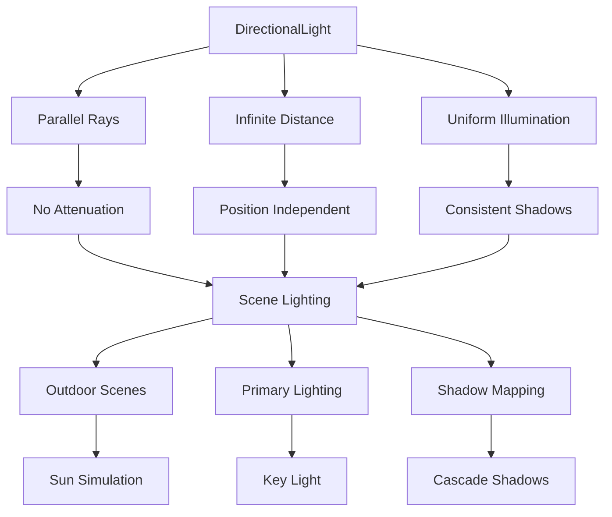

# DirectionalLight

## 是什么

DirectionalLight（方向光）是Qt Quick 3D中模拟无限远光源的组件，如太阳光。它发出平行光线，不受距离影响，是最常用的主光源类型。方向光适合模拟大范围的环境光照，为整个场景提供一致的照明效果。



方向光的核心特征是光线方向一致且强度不随距离衰减，这使得它非常适合模拟太阳、月亮等天体光源。在3D渲染中，方向光通常作为主光源使用，为场景建立基本的明暗关系和空间层次。

## 常用属性一览表

| 属性名 | 类型 | 默认值 | 取值范围 | 作用 | 性能/质量提示 |
| ------ | ---- | ------ | -------- | ---- | -------------- |
| eulerRotation★ | vector3d | (0,0,0) | 角度值 | 光照方向 | 决定光线入射角度 |
| brightness★ | real | 1.0 | 正数 | 光照强度 | 过高会导致过曝 |
| color★ | color | white | 颜色值 | 光照颜色 | 影响整体色调 |
| castsShadow★ | bool | false | true/false | 是否投射阴影 | 显著影响渲染性能 |
| shadowMapFar | real | 5000.0 | 正数 | 阴影距离 | 影响阴影范围和精度 |
| shadowBias | real | 0.0 | 浮点数 | 阴影偏移 | 解决阴影痤疮问题 |
| shadowFactor | real | 5.0 | 正数 | 阴影强度 | 控制阴影深度 |
| shadowMapQuality | enum | Medium | 质量级别 | 阴影贴图质量 | 高质量消耗更多内存 |
| shadowFilter | real | 35.0 | 正数 | 阴影滤波 | 软化阴影边缘 |
| csmNumSplits | int | 4 | 1-4 | 级联阴影分割数 | 影响远距离阴影质量 |

★ 标记表示高频使用属性

## 属性详解

### eulerRotation★ (高频属性)

eulerRotation定义方向光的照射方向，是控制光照效果的核心属性。通过调整欧拉角来改变光线的入射角度。

**角度含义：**

- X轴旋转：控制光线的俯仰角（上下方向）
- Y轴旋转：控制光线的方位角（左右方向）  
- Z轴旋转：控制光线的滚转角（通常保持为0）

**使用场景：**

- 模拟一天中太阳的位置变化
- 创建不同时间的光照氛围
- 调整阴影的投射方向和长度

**注意事项：**

- X轴-45°到-60°通常产生自然的光照效果
- Y轴旋转影响阴影的投射方向
- 避免光线完全垂直（90°或-90°）以防止阴影异常

### castsShadow★ (高频属性)

castsShadow控制方向光是否投射阴影，对视觉质量和性能都有重大影响。

**阴影特性：**

- 平行阴影：所有阴影边缘平行
- 一致深度：阴影深度不随距离变化
- 级联阴影：支持多级距离的阴影质量

**使用场景：**

- 室外场景的太阳光阴影
- 建筑物和地形的阴影投射
- 创建戏剧性的光影对比

**注意事项：**

- 方向光阴影覆盖范围大，性能开销显著
- 使用级联阴影映射(CSM)优化远距离阴影
- 合理设置shadowMapFar避免不必要的阴影计算

### shadowMapFar (重要属性)

shadowMapFar定义阴影的最大投射距离，直接影响阴影的覆盖范围和精度。

**距离设置原则：**

- 根据场景大小合理设置
- 过大会降低阴影精度
- 过小会导致远处物体无阴影

**使用场景：**

- 大型室外场景需要较大值（1000-5000）
- 室内场景可以使用较小值（50-200）
- 根据相机视距动态调整

**注意事项：**

- 与级联阴影分割配合使用
- 影响阴影贴图的纹素密度
- 需要平衡质量和性能

## 最小可运行示例

**文件树：**

```text
directional-light-example/
├── main.qml
├── SunSystem.qml
├── assets/
│   ├── terrain.mesh
│   └── building.mesh
└── CMakeLists.txt
```

**完整代码：**

main.qml:
```qml
import QtQuick
import QtQuick3D

Window {
    width: 1400
    height: 900
    visible: true
    title: "DirectionalLight - Sun Simulation"

    View3D {
        id: view3D
        anchors.fill: parent
        
        PerspectiveCamera {
            position: Qt.vector3d(0, 8, 20)
            eulerRotation: Qt.vector3d(-25, 0, 0)
        }
        
        // 主太阳光 - 动态方向光
        DirectionalLight {
            id: sunLight
            eulerRotation: Qt.vector3d(-30, 45, 0)
            color: "#FFF8DC"
            brightness: 1.5
            castsShadow: true
            shadowMapQuality: Light.ShadowMapQualityHigh
            shadowMapFar: 200
            shadowBias: 0.001
            shadowFactor: 15
            shadowFilter: 25
            csmNumSplits: 4
            
            // 太阳轨迹动画 - 模拟一天的光照变化
            SequentialAnimation on eulerRotation.x {
                id: sunAnimation
                loops: Animation.Infinite
                
                // 日出 (6:00)
                PropertyAnimation { 
                    to: -10
                    duration: 3000
                    easing.type: Easing.InOutSine
                }
                // 正午 (12:00)
                PropertyAnimation { 
                    to: -60
                    duration: 6000
                    easing.type: Easing.InOutSine
                }
                // 日落 (18:00)
                PropertyAnimation { 
                    to: -10
                    duration: 6000
                    easing.type: Easing.InOutSine
                }
                // 夜晚 (0:00)
                PropertyAnimation { 
                    to: 30
                    duration: 3000
                    easing.type: Easing.InOutSine
                }
            }
            
            // 颜色温度变化 - 模拟不同时间的光色
            SequentialAnimation on color {
                loops: Animation.Infinite
                
                ColorAnimation { to: "#FFE4B5"; duration: 3000 } // 日出暖色
                ColorAnimation { to: "#FFFFFF"; duration: 6000 } // 正午白色
                ColorAnimation { to: "#FFA500"; duration: 6000 } // 日落橙色
                ColorAnimation { to: "#4169E1"; duration: 3000 } // 夜晚蓝色
            }
            
            // 亮度变化 - 模拟光照强度变化
            SequentialAnimation on brightness {
                loops: Animation.Infinite
                
                PropertyAnimation { to: 0.8; duration: 3000 }  // 日出
                PropertyAnimation { to: 2.0; duration: 6000 }  // 正午
                PropertyAnimation { to: 1.2; duration: 6000 }  // 日落
                PropertyAnimation { to: 0.1; duration: 3000 }  // 夜晚
            }
        }
        
        // 辅助月光 - 夜晚补光
        DirectionalLight {
            id: moonLight
            eulerRotation: Qt.vector3d(-120, -30, 0)
            color: "#B0C4DE"
            brightness: 0.3
            castsShadow: false
        }
        
        // 场景对象
        // 地面
        Model {
            source: "#Rectangle"
            position: Qt.vector3d(0, 0, 0)
            eulerRotation: Qt.vector3d(-90, 0, 0)
            scale: Qt.vector3d(30, 30, 1)
            materials: PrincipledMaterial {
                baseColor: "#8FBC8F"
                metalness: 0.0
                roughness: 0.9
                normalMap: Texture {
                    source: "qrc:/textures/grass_normal.jpg"
                }
            }
        }
        
        // 建筑物群
        Repeater3D {
            model: 8
            Model {
                source: "#Cube"
                position: Qt.vector3d(
                    (index % 4 - 1.5) * 6,
                    Math.random() * 3 + 1.5,
                    Math.floor(index / 4) * 8 - 4
                )
                scale: Qt.vector3d(
                    1 + Math.random(),
                    2 + Math.random() * 2,
                    1 + Math.random()
                )
                materials: PrincipledMaterial {
                    baseColor: Qt.hsla(Math.random() * 0.1 + 0.05, 0.3, 0.7, 1.0)
                    metalness: 0.0
                    roughness: 0.8
                }
            }
        }
        
        // 树木
        Repeater3D {
            model: 12
            Model {
                source: "#Cylinder"
                position: Qt.vector3d(
                    (Math.random() - 0.5) * 25,
                    1.5,
                    (Math.random() - 0.5) * 25
                )
                scale: Qt.vector3d(0.3, 3, 0.3)
                materials: PrincipledMaterial {
                    baseColor: "#8B4513"
                    metalness: 0.0
                    roughness: 0.9
                }
                
                // 树冠
                Model {
                    source: "#Sphere"
                    position: Qt.vector3d(0, 1.2, 0)
                    scale: Qt.vector3d(2, 1.5, 2)
                    materials: PrincipledMaterial {
                        baseColor: "#228B22"
                        metalness: 0.0
                        roughness: 0.8
                    }
                }
            }
        }
        
        // 中心雕塑 - 用于观察阴影效果
        Model {
            source: "#Sphere"
            position: Qt.vector3d(0, 2, 0)
            scale: Qt.vector3d(1.5, 1.5, 1.5)
            materials: PrincipledMaterial {
                baseColor: "#DC143C"
                metalness: 0.8
                roughness: 0.2
            }
            
            // 底座
            Model {
                source: "#Cylinder"
                position: Qt.vector3d(0, -1.5, 0)
                scale: Qt.vector3d(1.2, 0.5, 1.2)
                materials: PrincipledMaterial {
                    baseColor: "#696969"
                    metalness: 0.0
                    roughness: 0.6
                }
            }
        }
        
        // 天空盒环境
        environment: SceneEnvironment {
            clearColor: "#87CEEB"
            backgroundMode: SceneEnvironment.Color
            antialiasingMode: SceneEnvironment.MSAA
            antialiasingQuality: SceneEnvironment.High
            
            // 根据太阳位置调整天空颜色
            SequentialAnimation on clearColor {
                loops: Animation.Infinite
                ColorAnimation { to: "#FFE4E1"; duration: 3000 } // 日出
                ColorAnimation { to: "#87CEEB"; duration: 6000 } // 正午
                ColorAnimation { to: "#FF6347"; duration: 6000 } // 日落
                ColorAnimation { to: "#191970"; duration: 3000 } // 夜晚
            }
        }
    }
    
    // 太阳光控制面板
    Rectangle {
        anchors.right: parent.right
        anchors.top: parent.top
        anchors.margins: 20
        width: 300
        height: 500
        color: "#33000000"
        radius: 10
        
        Column {
            anchors.fill: parent
            anchors.margins: 15
            spacing: 15
            
            Text {
                text: "太阳光控制"
                color: "white"
                font.bold: true
                font.pixelSize: 18
            }
            
            // 光照方向控制
            Rectangle {
                width: parent.width
                height: 120
                color: "#22FFFFFF"
                radius: 5
                
                Column {
                    anchors.fill: parent
                    anchors.margins: 10
                    spacing: 8
                    
                    Text {
                        text: "光照方向"
                        color: "white"
                        font.bold: true
                    }
                    
                    Row {
                        spacing: 10
                        Text { text: "俯仰角:"; color: "white"; width: 60 }
                        Slider {
                            width: 150
                            from: -90; to: 30
                            value: sunLight.eulerRotation.x
                            onValueChanged: {
                                sunAnimation.stop()
                                sunLight.eulerRotation.x = value
                            }
                        }
                        Text { 
                            text: Math.round(sunLight.eulerRotation.x) + "°"
                            color: "white"; width: 40
                        }
                    }
                    
                    Row {
                        spacing: 10
                        Text { text: "方位角:"; color: "white"; width: 60 }
                        Slider {
                            width: 150
                            from: -180; to: 180
                            value: sunLight.eulerRotation.y
                            onValueChanged: sunLight.eulerRotation.y = value
                        }
                        Text { 
                            text: Math.round(sunLight.eulerRotation.y) + "°"
                            color: "white"; width: 40
                        }
                    }
                }
            }
            
            // 光照属性控制
            Rectangle {
                width: parent.width
                height: 150
                color: "#22FFFFFF"
                radius: 5
                
                Column {
                    anchors.fill: parent
                    anchors.margins: 10
                    spacing: 8
                    
                    Text {
                        text: "光照属性"
                        color: "white"
                        font.bold: true
                    }
                    
                    Row {
                        spacing: 10
                        Text { text: "强度:"; color: "white"; width: 60 }
                        Slider {
                            width: 150
                            from: 0.0; to: 3.0
                            value: sunLight.brightness
                            onValueChanged: sunLight.brightness = value
                        }
                        Text { 
                            text: sunLight.brightness.toFixed(1)
                            color: "white"; width: 40
                        }
                    }
                    
                    Row {
                        spacing: 10
                        Text { text: "阴影:"; color: "white"; width: 60 }
                        CheckBox {
                            checked: sunLight.castsShadow
                            onCheckedChanged: sunLight.castsShadow = checked
                        }
                    }
                    
                    Row {
                        spacing: 10
                        Text { text: "阴影距离:"; color: "white"; width: 60 }
                        Slider {
                            width: 120
                            from: 50; to: 500
                            value: sunLight.shadowMapFar
                            onValueChanged: sunLight.shadowMapFar = value
                        }
                        Text { 
                            text: Math.round(sunLight.shadowMapFar)
                            color: "white"; width: 40
                        }
                    }
                }
            }
            
            // 阴影质量控制
            Rectangle {
                width: parent.width
                height: 120
                color: "#22FFFFFF"
                radius: 5
                
                Column {
                    anchors.fill: parent
                    anchors.margins: 10
                    spacing: 8
                    
                    Text {
                        text: "阴影质量"
                        color: "white"
                        font.bold: true
                    }
                    
                    Row {
                        spacing: 10
                        Text { text: "质量:"; color: "white"; width: 60 }
                        ComboBox {
                            width: 120
                            model: ["Low", "Medium", "High", "VeryHigh"]
                            currentIndex: 2
                            onCurrentTextChanged: {
                                switch(currentText) {
                                case "Low": sunLight.shadowMapQuality = Light.ShadowMapQualityLow; break
                                case "Medium": sunLight.shadowMapQuality = Light.ShadowMapQualityMedium; break
                                case "High": sunLight.shadowMapQuality = Light.ShadowMapQualityHigh; break
                                case "VeryHigh": sunLight.shadowMapQuality = Light.ShadowMapQualityVeryHigh; break
                                }
                            }
                        }
                    }
                    
                    Row {
                        spacing: 10
                        Text { text: "级联数:"; color: "white"; width: 60 }
                        Slider {
                            width: 120
                            from: 1; to: 4; stepSize: 1
                            value: sunLight.csmNumSplits
                            onValueChanged: sunLight.csmNumSplits = value
                        }
                        Text { 
                            text: Math.round(sunLight.csmNumSplits)
                            color: "white"; width: 40
                        }
                    }
                }
            }
            
            // 动画控制
            Row {
                spacing: 10
                Button {
                    text: sunAnimation.running ? "暂停动画" : "开始动画"
                    onClicked: {
                        if (sunAnimation.running) {
                            sunAnimation.stop()
                        } else {
                            sunAnimation.start()
                        }
                    }
                }
            }
        }
    }
    
    // 时间指示器
    Rectangle {
        anchors.bottom: parent.bottom
        anchors.horizontalCenter: parent.horizontalCenter
        anchors.margins: 20
        width: 400
        height: 60
        color: "#33000000"
        radius: 10
        
        Row {
            anchors.centerIn: parent
            spacing: 30
            
            Column {
                Text { text: "日出"; color: "#FFE4B5"; font.bold: true }
                Text { text: "6:00"; color: "lightgray"; font.pixelSize: 12 }
            }
            
            Column {
                Text { text: "正午"; color: "#FFFFFF"; font.bold: true }
                Text { text: "12:00"; color: "lightgray"; font.pixelSize: 12 }
            }
            
            Column {
                Text { text: "日落"; color: "#FFA500"; font.bold: true }
                Text { text: "18:00"; color: "lightgray"; font.pixelSize: 12 }
            }
            
            Column {
                Text { text: "夜晚"; color: "#4169E1"; font.bold: true }
                Text { text: "0:00"; color: "lightgray"; font.pixelSize: 12 }
            }
        }
    }
}
```

CMakeLists.txt:
```cmake
cmake_minimum_required(VERSION 3.16)
project(DirectionalLightExample)

find_package(Qt6 REQUIRED COMPONENTS Core Quick Quick3D)

qt_add_executable(DirectionalLightExample main.cpp)
qt_add_qml_module(DirectionalLightExample
    URI DirectionalLightExample
    VERSION 1.0
    QML_FILES 
        main.qml
        SunSystem.qml
    RESOURCES
        textures/grass_normal.jpg
)

target_link_libraries(DirectionalLightExample Qt6::Core Qt6::Quick Qt6::Quick3D)
```

main.cpp:
```cpp
#include <QGuiApplication>
#include <QQmlApplicationEngine>

int main(int argc, char *argv[])
{
    QGuiApplication app(argc, argv);
    QQmlApplicationEngine engine;
    engine.load(QUrl(QStringLiteral("qrc:/main.qml")));
    return app.exec();
}
```

**预期效果：**
模拟完整的太阳光照系统，包括一天中光照方向、颜色和强度的变化，以及高质量的级联阴影效果。

## 踩坑与调试

### 常见错误

**错误1：阴影出现条纹或痤疮**
```
Console Warning: Shadow acne detected, adjust shadow bias
```
**解决方案：**
1. 增加shadowBias值（通常0.001-0.01）
2. 调整光照角度避免过于平行的入射
3. 提高阴影贴图分辨率
4. 使用合适的shadowFilter值软化阴影

**错误2：远距离阴影质量差**
```
Console Warning: Shadow resolution insufficient for distance
```
**解决方案：**
1. 启用级联阴影映射(CSM)
2. 增加csmNumSplits数量
3. 调整shadowMapFar到合适范围
4. 提高shadowMapQuality级别

**错误3：性能问题**
```
Console Warning: High-resolution shadow maps may impact performance
```
**解决方案：**
1. 降低shadowMapQuality到Medium或Low
2. 减少csmNumSplits数量
3. 缩小shadowMapFar范围
4. 考虑使用静态阴影烘焙

### 调试技巧

1. **阴影可视化**
   - 使用简单几何体测试阴影效果
   - 调整相机角度观察阴影细节
   - 使用不同的shadowBias值对比效果

2. **光照方向调试**
   - 创建参考对象观察光照方向
   - 使用实时控制滑块调整角度
   - 观察阴影长度和方向的变化

3. **性能监控**
   - 监控不同阴影质量设置的帧率
   - 测试级联阴影的性能影响
   - 使用GPU分析器检查阴影渲染开销

### 性能优化建议

- 根据目标平台选择合适的阴影质量
- 使用级联阴影优化远距离阴影效果
- 合理设置shadowMapFar避免过大范围
- 考虑使用光照烘焙处理静态场景
- 在移动设备上限制阴影质量和范围

## 延伸阅读

1. **Qt Quick 3D DirectionalLight QML Type**  
   官方文档详细介绍了DirectionalLight的所有属性和阴影配置。  
   链接：https://doc.qt.io/qt-6/qml-qtquick3d-directionallight.html

2. **Cascaded Shadow Maps**  
   深入了解级联阴影映射技术，这是处理大范围阴影的标准方法。  
   链接：https://docs.microsoft.com/en-us/windows/win32/dxtecharts/cascaded-shadow-maps

## 附录：完整属性清单

<details>
<summary>点击展开完整属性列表</summary>

| 属性名 | 类型 | 默认值 | 取值范围 | 作用 | 版本支持 |
| ------ | ---- | ------ | -------- | ---- | -------- |
| eulerRotation | vector3d | (0,0,0) | 角度值 | 光照方向 | Qt 6.0+ |
| brightness | real | 1.0 | 正数 | 光照强度 | Qt 6.0+ |
| color | color | white | 颜色值 | 光照颜色 | Qt 6.0+ |
| castsShadow | bool | false | true/false | 投射阴影 | Qt 6.0+ |
| shadowMapFar | real | 5000.0 | 正数 | 阴影距离 | Qt 6.0+ |
| shadowBias | real | 0.0 | 浮点数 | 阴影偏移 | Qt 6.0+ |
| shadowFactor | real | 5.0 | 正数 | 阴影强度 | Qt 6.0+ |
| shadowMapQuality | enum | Medium | 质量级别 | 阴影贴图质量 | Qt 6.0+ |
| shadowFilter | real | 35.0 | 正数 | 阴影滤波 | Qt 6.0+ |
| csmNumSplits | int | 4 | 1-4 | 级联阴影分割数 | Qt 6.2+ |
| csmSplitViewDepthScale | real | 3.0 | 正数 | 级联深度缩放 | Qt 6.2+ |
| scope | Node | null | 3D节点 | 光照范围 | Qt 6.0+ |
| bakeMode | enum | Disabled | 烘焙模式 | 光照烘焙 | Qt 6.5+ |

**阴影质量枚举值：**
- `Light.ShadowMapQualityLow`: 256x256
- `Light.ShadowMapQualityMedium`: 512x512  
- `Light.ShadowMapQualityHigh`: 1024x1024
- `Light.ShadowMapQualityVeryHigh`: 2048x2048

**烘焙模式枚举值：**
- `Light.BakeModeDisabled`: 禁用烘焙
- `Light.BakeModeIndirect`: 间接光烘焙
- `Light.BakeModeAll`: 全部光照烘焙

**级联阴影映射(CSM)参数：**
- csmNumSplits: 级联分割数量，影响远距离阴影质量
- csmSplitViewDepthScale: 控制级联分割的深度分布

**光照方向计算：**
- X轴旋转：-90°(垂直向下) 到 90°(垂直向上)
- Y轴旋转：-180° 到 180°(水平方向)
- Z轴旋转：通常保持为0°

**版本差异说明：**
- Qt 6.0-6.1: 基础方向光功能，支持基本阴影映射
- Qt 6.2: 新增级联阴影映射(CSM)支持
- Qt 6.5: 新增光照烘焙和改进的阴影质量
- Qt 6.7: 优化阴影性能和内存使用

</details>