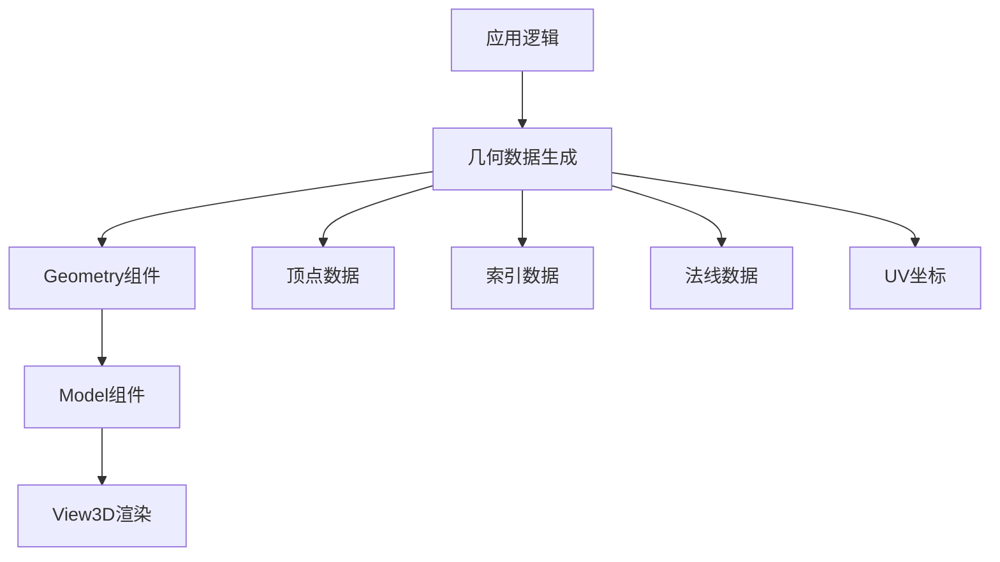

# Dynamic Model Creation

## 是什么

动态模型创建是指在运行时通过代码生成3D几何体的技术，而不是从预制的3D文件中加载模型。在Qt Quick 3D中，这主要通过自定义Geometry组件和程序化算法来实现，允许开发者根据实时数据或用户交互动态生成复杂的3D内容。



动态模型创建在游戏开发、数据可视化、CAD应用和实时内容生成等场景中具有重要作用，能够根据算法或数据实时生成各种几何形状。

## 常用属性一览表

| 属性名 | 类型 | 默认值 | 取值范围 | 作用 | 性能/质量提示 |
| ------ | ---- | ------ | -------- | ---- | -------------- |
| vertexData★ | QByteArray | null | 顶点数组 | 存储顶点位置、法线、UV等数据 | 数据量直接影响渲染性能 |
| indexData★ | QByteArray | null | 索引数组 | 定义三角形面的顶点连接关系 | 使用索引可减少重复顶点 |
| stride★ | int | 0 | >0 | 每个顶点的字节大小 | 必须与顶点数据结构匹配 |
| primitiveType | PrimitiveType | Triangles | Points/Lines/Triangles | 图元渲染类型 | Triangles性能最优 |
| bounds | QQuick3DBounds | auto | 3D边界框 | 几何体的包围盒 | 影响视锥剔除效率 |

★ 标记表示高频使用属性

## 属性详解

### vertexData★ (高频属性)

vertexData是存储所有顶点信息的字节数组，包含位置、法线、纹理坐标等数据。每个顶点的数据必须按照固定的结构排列。

**使用场景：**
- 程序化生成地形网格
- 实时创建粒子系统几何体
- 根据数学函数生成曲面

**注意事项：**
- 数据必须按照指定的stride大小对齐
- 坐标系统使用右手坐标系（Y轴向上）
- 法线向量必须归一化以确保正确光照

### indexData★ (高频属性)

indexData定义了如何将顶点连接成三角形面，通过索引引用vertexData中的顶点，避免重复存储相同顶点。

**使用场景：**
- 创建共享顶点的网格结构
- 优化内存使用和渲染性能
- 实现复杂的拓扑结构

**注意事项：**
- 索引值不能超过顶点数量
- 三角形顶点顺序影响面的朝向（逆时针为正面）
- 使用16位或32位索引根据顶点数量选择

### stride★ (高频属性)

stride定义了每个顶点数据的字节大小，必须与vertexData中的数据结构完全匹配。

**计算公式：**
- 位置(3 floats) + 法线(3 floats) + UV(2 floats) = 8 * 4 = 32字节

## 最小可运行示例

**文件树：**
```
project/
├── main.qml
├── DynamicGeometry.qml
├── main.cpp
└── CMakeLists.txt
```

**完整代码：**

main.qml:
```qml
import QtQuick
import QtQuick3D

Window {
    width: 800
    height: 600
    visible: true
    title: "Dynamic Model Creation Example"

    View3D {
        anchors.fill: parent
        
        PerspectiveCamera {
            position: Qt.vector3d(0, 2, 5)
            eulerRotation.x: -20
        }
        
        DirectionalLight {
            eulerRotation.x: -45
            eulerRotation.y: 45
        }
        
        Model {
            geometry: DynamicGeometry {
                id: dynamicGeometry
            }
            
            materials: PrincipledMaterial {
                baseColor: "lightblue"
                metalness: 0.1
                roughness: 0.3
            }
            
            Component.onCompleted: {
                dynamicGeometry.generatePlane(2, 2, 10, 10)
            }
        }
    }
}
```

DynamicGeometry.qml:
```qml
import QtQuick
import QtQuick3D

Geometry {
    id: root
    
    function generatePlane(width, height, segmentsX, segmentsY) {
        var vertices = []
        var indices = []
        
        // 生成顶点数据
        for (var y = 0; y <= segmentsY; y++) {
            for (var x = 0; x <= segmentsX; x++) {
                var u = x / segmentsX
                var v = y / segmentsY
                
                // 位置
                vertices.push((u - 0.5) * width)  // x
                vertices.push(0)                  // y
                vertices.push((v - 0.5) * height) // z
                
                // 法线
                vertices.push(0)  // nx
                vertices.push(1)  // ny
                vertices.push(0)  // nz
                
                // UV坐标
                vertices.push(u)  // u
                vertices.push(v)  // v
            }
        }
        
        // 生成索引数据
        for (var y = 0; y < segmentsY; y++) {
            for (var x = 0; x < segmentsX; x++) {
                var i = y * (segmentsX + 1) + x
                
                // 第一个三角形
                indices.push(i)
                indices.push(i + segmentsX + 1)
                indices.push(i + 1)
                
                // 第二个三角形
                indices.push(i + 1)
                indices.push(i + segmentsX + 1)
                indices.push(i + segmentsX + 2)
            }
        }
        
        // 转换为字节数组
        var vertexBuffer = new ArrayBuffer(vertices.length * 4)
        var vertexView = new Float32Array(vertexBuffer)
        for (var i = 0; i < vertices.length; i++) {
            vertexView[i] = vertices[i]
        }
        
        var indexBuffer = new ArrayBuffer(indices.length * 2)
        var indexView = new Uint16Array(indexBuffer)
        for (var i = 0; i < indices.length; i++) {
            indexView[i] = indices[i]
        }
        
        // 设置几何数据
        vertexData = vertexBuffer
        indexData = indexBuffer
        stride = 32  // 8 floats * 4 bytes
        
        addAttribute(Geometry.Attribute.PositionSemantic, 0, Geometry.Attribute.F32Type)
        addAttribute(Geometry.Attribute.NormalSemantic, 12, Geometry.Attribute.F32Type)
        addAttribute(Geometry.Attribute.TexCoordSemantic, 24, Geometry.Attribute.F32Type)
    }
}
```

CMakeLists.txt:
```cmake
cmake_minimum_required(VERSION 3.16)
project(DynamicModelExample)

find_package(Qt6 REQUIRED COMPONENTS Core Quick Quick3D)

qt_add_executable(DynamicModelExample main.cpp)
qt_add_qml_module(DynamicModelExample
    URI DynamicModelExample
    VERSION 1.0
    QML_FILES 
        main.qml
        DynamicGeometry.qml
)

target_link_libraries(DynamicModelExample Qt6::Core Qt6::Quick Qt6::Quick3D)
```

**预期效果：**
显示一个动态生成的蓝色平面网格，具有正确的光照和材质效果，可以作为地形或其他程序化内容的基础。

## 踩坑与调试

### 常见错误

**错误1：几何体不显示或显示异常**
```
Console Warning: QQuick3DGeometry: Invalid vertex data
```
**解决方案：**
1. 检查stride值是否与顶点数据结构匹配
2. 确认vertexData和indexData不为空
3. 验证addAttribute调用的偏移量和类型正确

**错误2：光照效果异常**
```
Console Warning: Normal vectors not normalized
```
**解决方案：**
1. 确保所有法线向量都已归一化
2. 检查法线计算是否正确
3. 验证坐标系统的一致性（右手坐标系）

**错误3：纹理映射错误**
```
Console Warning: UV coordinates out of range
```
**解决方案：**
1. 确保UV坐标在[0,1]范围内
2. 检查纹理坐标的计算逻辑
3. 验证addAttribute中UV坐标的偏移量

### 调试技巧

1. **可视化顶点数据**
   - 使用wireframe材质查看网格结构
   - 通过颜色编码显示法线方向

2. **分步验证**
   - 先创建简单的三角形验证基础功能
   - 逐步增加复杂度和顶点数量

3. **性能监控**
   - 监控顶点数量对帧率的影响
   - 使用Qt Quick 3D的性能分析工具

### 性能优化建议

- 合理控制顶点数量，避免过度细分
- 使用索引缓冲区减少重复顶点
- 考虑使用LOD（细节层次）技术
- 对于静态几何体，避免频繁重新生成
- 使用适当的数据类型（16位vs32位索引）

## 延伸阅读

1. **Qt Quick 3D Geometry API Reference**  
   官方API文档详细介绍了Geometry组件的所有属性和方法，包括高级用法和最佳实践。  
   链接：https://doc.qt.io/qt-6/qml-qtquick3d-geometry.html

2. **Real-Time Rendering Techniques**  
   深入讲解实时渲染中的几何处理技术，包括网格生成、优化算法和GPU编程相关内容。  
   链接：https://www.realtimerendering.com/

## 附录：完整属性清单

<details>
<summary>点击展开完整属性列表</summary>

| 属性名 | 类型 | 默认值 | 取值范围 | 作用 | 版本支持 |
| ------ | ---- | ------ | -------- | ---- | -------- |
| vertexData | QByteArray | null | 顶点字节数组 | 存储所有顶点数据 | Qt 6.2+ |
| indexData | QByteArray | null | 索引字节数组 | 定义三角形连接关系 | Qt 6.2+ |
| stride | int | 0 | >0 | 每个顶点的字节大小 | Qt 6.2+ |
| primitiveType | PrimitiveType | Triangles | Points/Lines/Triangles | 图元类型 | Qt 6.2+ |
| bounds | QQuick3DBounds | auto | 3D边界框 | 几何体包围盒 | Qt 6.2+ |

**版本差异说明：**
- Qt 6.2: 基础动态几何创建功能
- Qt 6.5: 增强了性能和内存管理
- Qt 6.7: 添加了更多几何体生成辅助函数

</details>