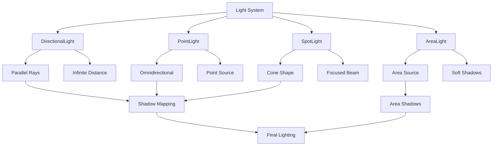

# Lights

## 是什么

Lights（光照）是Qt Quick 3D中模拟真实世界光源的组件系统，负责为3D场景提供照明效果。光照系统包括方向光、点光源、聚光灯等多种类型，每种光源都有其特定的物理特性和适用场景。



光照系统基于物理渲染原理，支持阴影投射、光照衰减、颜色温度等真实光照特性。正确的光照设置是创建逼真3D场景的关键，直接影响材质的视觉表现和整体氛围。

## 常用属性一览表

| 属性名 | 类型 | 默认值 | 取值范围 | 作用 | 性能/质量提示 |
| ------ | ---- | ------ | -------- | ---- | -------------- |
| brightness★ | real | 1.0 | 正数 | 光照强度 | 过高会导致过曝 |
| color★ | color | white | 颜色值 | 光照颜色 | 影响整体色调 |
| castsShadow★ | bool | false | true/false | 是否投射阴影 | 显著影响渲染性能 |
| shadowBias | real | 0.0 | 浮点数 | 阴影偏移 | 解决阴影痤疮问题 |
| shadowFactor | real | 5.0 | 正数 | 阴影强度 | 控制阴影深度 |
| shadowMapQuality | enum | Medium | 质量级别 | 阴影贴图质量 | 高质量消耗更多内存 |
| shadowMapFar | real | 5000.0 | 正数 | 阴影距离 | 影响阴影范围和精度 |
| shadowFilter | real | 35.0 | 正数 | 阴影滤波 | 软化阴影边缘 |
| scope | Node | null | 3D节点 | 光照范围 | 限制光照影响的对象 |
| bakeMode | enum | Disabled | 烘焙模式 | 光照烘焙设置 | 静态光照可提升性能 |

★ 标记表示高频使用属性

## 属性详解

### brightness★ (高频属性)

brightness控制光源的发光强度，是调节场景整体亮度的核心参数。

**物理意义：**

- 模拟真实光源的发光功率
- 影响所有受光照影响的材质
- 与距离衰减共同决定最终照度

**使用场景：**

- 调节场景的整体明暗
- 模拟不同时间的光照强度
- 创建戏剧性的光照效果

**注意事项：**

- 过高的brightness会导致过曝和细节丢失
- 结合HDR渲染可以处理更大的亮度范围
- 不同类型光源的brightness含义略有不同

### color★ (高频属性)

color定义光源发出的光线颜色，直接影响被照亮物体的色彩表现。

**颜色特性：**

- 影响漫反射和镜面反射的颜色
- 与材质颜色相乘产生最终颜色
- 支持色温设置模拟真实光源

**使用场景：**

- 模拟不同类型光源（日光、白炽灯、LED）
- 创建特殊氛围（暖色调、冷色调）
- 实现彩色光照效果

**注意事项：**

- 避免使用过饱和的颜色
- 考虑光源的物理真实性
- 多光源时注意颜色的协调性

### castsShadow★ (高频属性)

castsShadow控制光源是否投射阴影，是影响视觉质量和性能的重要开关。

**阴影类型：**

- 硬阴影：清晰的阴影边缘
- 软阴影：模糊的阴影边缘（需要shadowFilter）
- 级联阴影：多级距离的阴影质量

**使用场景：**

- 增强场景的深度感和真实感
- 提供视觉锚点和空间关系
- 创建戏剧性的光影效果

**注意事项：**

- 阴影渲染消耗大量GPU资源
- 移动设备建议限制阴影光源数量
- 合理设置阴影距离和质量

## 最小可运行示例

**文件树：**

```text
lighting-example/
├── main.qml
├── LightingDemo.qml
├── assets/
│   ├── scene.mesh
│   └── ground.mesh
└── CMakeLists.txt
```

**完整代码：**

main.qml:
```qml
import QtQuick
import QtQuick3D

Window {
    width: 1400
    height: 900
    visible: true
    title: "Qt Quick 3D Lighting System"

    View3D {
        id: view3D
        anchors.fill: parent
        
        PerspectiveCamera {
            position: Qt.vector3d(0, 5, 15)
            eulerRotation: Qt.vector3d(-20, 0, 0)
        }
        
        // 主方向光 - 模拟太阳光
        DirectionalLight {
            id: sunLight
            eulerRotation: Qt.vector3d(-45, 30, 0)
            color: "#FFF8DC"
            brightness: 1.2
            castsShadow: true
            shadowMapQuality: Light.ShadowMapQualityHigh
            shadowBias: 0.001
            shadowFactor: 25
            shadowMapFar: 100
            
            // 太阳光动画
            SequentialAnimation on eulerRotation.x {
                loops: Animation.Infinite
                PropertyAnimation { to: -60; duration: 8000 }
                PropertyAnimation { to: -30; duration: 8000 }
            }
        }
        
        // 点光源 - 模拟灯泡
        PointLight {
            id: pointLight
            position: Qt.vector3d(-3, 3, 2)
            color: "#FFB347"
            brightness: 2.0
            castsShadow: true
            shadowBias: 0.01
            constantFade: 1.0
            linearFade: 0.1
            quadraticFade: 0.05
            
            // 点光源移动动画
            SequentialAnimation on position {
                loops: Animation.Infinite
                PropertyAnimation { 
                    to: Qt.vector3d(3, 3, 2)
                    duration: 4000
                    easing.type: Easing.InOutSine
                }
                PropertyAnimation { 
                    to: Qt.vector3d(-3, 3, 2)
                    duration: 4000
                    easing.type: Easing.InOutSine
                }
            }
        }
        
        // 聚光灯 - 模拟手电筒
        SpotLight {
            id: spotLight
            position: Qt.vector3d(0, 6, 5)
            eulerRotation: Qt.vector3d(-60, 0, 0)
            color: "#87CEEB"
            brightness: 3.0
            castsShadow: true
            coneAngle: 30
            innerConeAngle: 15
            constantFade: 1.0
            linearFade: 0.05
            quadraticFade: 0.02
            
            // 聚光灯扫描动画
            SequentialAnimation on eulerRotation.y {
                loops: Animation.Infinite
                PropertyAnimation { to: 45; duration: 3000 }
                PropertyAnimation { to: -45; duration: 6000 }
                PropertyAnimation { to: 0; duration: 3000 }
            }
        }
        
        // 区域光 - 模拟窗户光
        AreaLight {
            id: areaLight
            position: Qt.vector3d(5, 2, 0)
            eulerRotation: Qt.vector3d(0, -90, 0)
            color: "#E6E6FA"
            brightness: 1.5
            width: 2
            height: 3
            castsShadow: true
        }
        
        // 场景对象
        // 中心球体
        Model {
            source: "#Sphere"
            position: Qt.vector3d(0, 1, 0)
            materials: PrincipledMaterial {
                baseColor: "#FF6B6B"
                metalness: 0.2
                roughness: 0.3
            }
        }
        
        // 左侧立方体
        Model {
            source: "#Cube"
            position: Qt.vector3d(-4, 1, 0)
            materials: PrincipledMaterial {
                baseColor: "#4ECDC4"
                metalness: 0.8
                roughness: 0.2
            }
        }
        
        // 右侧圆柱体
        Model {
            source: "#Cylinder"
            position: Qt.vector3d(4, 1, 0)
            materials: PrincipledMaterial {
                baseColor: "#45B7D1"
                metalness: 0.0
                roughness: 0.6
            }
        }
        
        // 后方墙面
        Model {
            source: "#Rectangle"
            position: Qt.vector3d(0, 2, -5)
            scale: Qt.vector3d(12, 6, 1)
            materials: PrincipledMaterial {
                baseColor: "#F5F5F5"
                metalness: 0.0
                roughness: 0.8
            }
        }
        
        // 地面
        Model {
            source: "#Rectangle"
            position: Qt.vector3d(0, 0, 0)
            eulerRotation: Qt.vector3d(-90, 0, 0)
            scale: Qt.vector3d(15, 15, 1)
            materials: PrincipledMaterial {
                baseColor: "#D3D3D3"
                metalness: 0.0
                roughness: 0.9
            }
        }
        
        // 光源可视化
        // 点光源指示器
        Model {
            source: "#Sphere"
            position: pointLight.position
            scale: Qt.vector3d(0.1, 0.1, 0.1)
            materials: PrincipledMaterial {
                baseColor: pointLight.color
                emissiveColor: pointLight.color
                emissiveFactor: 2.0
            }
        }
        
        // 聚光灯指示器
        Model {
            source: "#Cone"
            position: spotLight.position
            eulerRotation: spotLight.eulerRotation
            scale: Qt.vector3d(0.2, 0.2, 0.2)
            materials: PrincipledMaterial {
                baseColor: spotLight.color
                emissiveColor: spotLight.color
                emissiveFactor: 1.5
            }
        }
        
        environment: SceneEnvironment {
            clearColor: "#2C3E50"
            backgroundMode: SceneEnvironment.Color
            antialiasingMode: SceneEnvironment.MSAA
            antialiasingQuality: SceneEnvironment.High
        }
    }
    
    // 光照控制面板
    Rectangle {
        anchors.right: parent.right
        anchors.top: parent.top
        anchors.margins: 20
        width: 280
        height: 600
        color: "#33000000"
        radius: 10
        
        Column {
            anchors.fill: parent
            anchors.margins: 15
            spacing: 15
            
            Text {
                text: "光照控制面板"
                color: "white"
                font.bold: true
                font.pixelSize: 16
            }
            
            // 太阳光控制
            Rectangle {
                width: parent.width
                height: 120
                color: "#22FFFFFF"
                radius: 5
                
                Column {
                    anchors.fill: parent
                    anchors.margins: 10
                    spacing: 8
                    
                    Text {
                        text: "方向光 (太阳)"
                        color: "white"
                        font.bold: true
                    }
                    
                    Row {
                        spacing: 10
                        Text { text: "强度:"; color: "white"; width: 40 }
                        Slider {
                            width: 150
                            from: 0.0; to: 3.0; value: sunLight.brightness
                            onValueChanged: sunLight.brightness = value
                        }
                        Text { 
                            text: sunLight.brightness.toFixed(1)
                            color: "white"; width: 30
                        }
                    }
                    
                    Row {
                        spacing: 10
                        Text { text: "阴影:"; color: "white"; width: 40 }
                        CheckBox {
                            checked: sunLight.castsShadow
                            onCheckedChanged: sunLight.castsShadow = checked
                        }
                    }
                }
            }
            
            // 点光源控制
            Rectangle {
                width: parent.width
                height: 120
                color: "#22FFFFFF"
                radius: 5
                
                Column {
                    anchors.fill: parent
                    anchors.margins: 10
                    spacing: 8
                    
                    Text {
                        text: "点光源"
                        color: "white"
                        font.bold: true
                    }
                    
                    Row {
                        spacing: 10
                        Text { text: "强度:"; color: "white"; width: 40 }
                        Slider {
                            width: 150
                            from: 0.0; to: 5.0; value: pointLight.brightness
                            onValueChanged: pointLight.brightness = value
                        }
                        Text { 
                            text: pointLight.brightness.toFixed(1)
                            color: "white"; width: 30
                        }
                    }
                    
                    Row {
                        spacing: 10
                        Text { text: "衰减:"; color: "white"; width: 40 }
                        Slider {
                            width: 150
                            from: 0.0; to: 0.5; value: pointLight.quadraticFade
                            onValueChanged: pointLight.quadraticFade = value
                        }
                        Text { 
                            text: pointLight.quadraticFade.toFixed(2)
                            color: "white"; width: 30
                        }
                    }
                }
            }
            
            // 聚光灯控制
            Rectangle {
                width: parent.width
                height: 120
                color: "#22FFFFFF"
                radius: 5
                
                Column {
                    anchors.fill: parent
                    anchors.margins: 10
                    spacing: 8
                    
                    Text {
                        text: "聚光灯"
                        color: "white"
                        font.bold: true
                    }
                    
                    Row {
                        spacing: 10
                        Text { text: "角度:"; color: "white"; width: 40 }
                        Slider {
                            width: 150
                            from: 10; to: 90; value: spotLight.coneAngle
                            onValueChanged: spotLight.coneAngle = value
                        }
                        Text { 
                            text: Math.round(spotLight.coneAngle) + "°"
                            color: "white"; width: 30
                        }
                    }
                    
                    Row {
                        spacing: 10
                        Text { text: "强度:"; color: "white"; width: 40 }
                        Slider {
                            width: 150
                            from: 0.0; to: 5.0; value: spotLight.brightness
                            onValueChanged: spotLight.brightness = value
                        }
                        Text { 
                            text: spotLight.brightness.toFixed(1)
                            color: "white"; width: 30
                        }
                    }
                }
            }
            
            // 全局设置
            Rectangle {
                width: parent.width
                height: 80
                color: "#22FFFFFF"
                radius: 5
                
                Column {
                    anchors.fill: parent
                    anchors.margins: 10
                    spacing: 8
                    
                    Text {
                        text: "全局设置"
                        color: "white"
                        font.bold: true
                    }
                    
                    Row {
                        spacing: 10
                        Text { text: "环境光:"; color: "white"; width: 60 }
                        Slider {
                            width: 120
                            from: 0.0; to: 1.0; value: 0.1
                            onValueChanged: {
                                // 这里可以设置环境光强度
                            }
                        }
                    }
                }
            }
        }
    }
    
    // 光源类型说明
    Row {
        anchors.bottom: parent.bottom
        anchors.left: parent.left
        anchors.margins: 20
        spacing: 30
        
        Column {
            Text { text: "方向光"; color: "white"; font.bold: true }
            Text { text: "平行光线，模拟太阳"; color: "lightgray"; font.pixelSize: 12 }
        }
        
        Column {
            Text { text: "点光源"; color: "white"; font.bold: true }
            Text { text: "全方向发光，有衰减"; color: "lightgray"; font.pixelSize: 12 }
        }
        
        Column {
            Text { text: "聚光灯"; color: "white"; font.bold: true }
            Text { text: "锥形光束，可调角度"; color: "lightgray"; font.pixelSize: 12 }
        }
        
        Column {
            Text { text: "区域光"; color: "white"; font.bold: true }
            Text { text: "面光源，柔和阴影"; color: "lightgray"; font.pixelSize: 12 }
        }
    }
}
```

CMakeLists.txt:
```cmake
cmake_minimum_required(VERSION 3.16)
project(LightingExample)

find_package(Qt6 REQUIRED COMPONENTS Core Quick Quick3D)

qt_add_executable(LightingExample main.cpp)
qt_add_qml_module(LightingExample
    URI LightingExample
    VERSION 1.0
    QML_FILES 
        main.qml
        LightingDemo.qml
)

target_link_libraries(LightingExample Qt6::Core Qt6::Quick Qt6::Quick3D)
```

main.cpp:
```cpp
#include <QGuiApplication>
#include <QQmlApplicationEngine>

int main(int argc, char *argv[])
{
    QGuiApplication app(argc, argv);
    QQmlApplicationEngine engine;
    engine.load(QUrl(QStringLiteral("qrc:/main.qml")));
    return app.exec();
}
```

**预期效果：**
展示多种光源类型的效果，包括动态光照、阴影投射和交互式光照参数调节。

## 踩坑与调试

### 常见错误

**错误1：阴影显示异常或缺失**
```
Console Warning: Shadow map resolution may be insufficient
```
**解决方案：**
1. 检查castsShadow属性是否启用
2. 调整shadowMapQuality提高阴影质量
3. 设置合适的shadowBias避免阴影痤疮
4. 确认shadowMapFar范围覆盖所有需要阴影的对象

**错误2：光照过亮或过暗**
```
Console Warning: Light brightness may cause overexposure
```
**解决方案：**
1. 调整brightness值到合理范围
2. 检查多个光源的累积效果
3. 考虑使用HDR渲染处理高动态范围
4. 验证材质的反射属性设置

**错误3：性能问题**
```
Console Warning: Multiple shadow-casting lights detected
```
**解决方案：**
1. 限制同时投射阴影的光源数量
2. 降低阴影贴图质量或分辨率
3. 使用光照烘焙处理静态光源
4. 合理设置光源的影响范围

### 调试技巧

1. **光源可视化**
   - 使用发光材质标记光源位置
   - 显示光源的影响范围和方向
   - 使用线框模式检查阴影投射

2. **阴影调试**
   - 单独测试每个光源的阴影效果
   - 调整阴影偏移解决自阴影问题
   - 检查阴影贴图的分辨率和质量

3. **性能监控**
   - 监控光源数量和阴影开销
   - 测试不同质量设置的性能影响
   - 使用GPU分析器检查渲染瓶颈

### 性能优化建议

- 限制同时活跃的光源数量（建议<8个）
- 仅在必要时启用阴影投射
- 使用合适的阴影贴图分辨率
- 考虑使用光照烘焙处理静态场景
- 根据距离动态调整光源质量

## 延伸阅读

1. **Qt Quick 3D Lights Overview**  
   官方文档详细介绍了各种光源类型的属性和使用方法。  
   链接：https://doc.qt.io/qt-6/quick3d-lights.html

2. **Real-Time Rendering: Lighting and Shading**  
   深入了解实时渲染中的光照理论和阴影技术。  
   链接：https://www.realtimerendering.com/

## 附录：完整属性清单

<details>
<summary>点击展开完整属性列表</summary>

| 属性名 | 类型 | 默认值 | 取值范围 | 作用 | 版本支持 |
| ------ | ---- | ------ | -------- | ---- | -------- |
| brightness | real | 1.0 | 正数 | 光照强度 | Qt 6.0+ |
| color | color | white | 颜色值 | 光照颜色 | Qt 6.0+ |
| castsShadow | bool | false | true/false | 投射阴影 | Qt 6.0+ |
| shadowBias | real | 0.0 | 浮点数 | 阴影偏移 | Qt 6.0+ |
| shadowFactor | real | 5.0 | 正数 | 阴影强度 | Qt 6.0+ |
| shadowMapQuality | enum | Medium | 质量级别 | 阴影贴图质量 | Qt 6.0+ |
| shadowMapFar | real | 5000.0 | 正数 | 阴影距离 | Qt 6.0+ |
| shadowFilter | real | 35.0 | 正数 | 阴影滤波 | Qt 6.0+ |
| scope | Node | null | 3D节点 | 光照范围 | Qt 6.0+ |
| bakeMode | enum | Disabled | 烘焙模式 | 光照烘焙 | Qt 6.5+ |

**各光源类型特有属性：**

**DirectionalLight:**
- eulerRotation: 光照方向
- shadowMapFar: 阴影距离

**PointLight:**
- position: 光源位置
- constantFade: 常数衰减
- linearFade: 线性衰减
- quadraticFade: 二次衰减

**SpotLight:**
- position: 光源位置
- eulerRotation: 光照方向
- coneAngle: 光锥外角
- innerConeAngle: 光锥内角
- constantFade: 常数衰减
- linearFade: 线性衰减
- quadraticFade: 二次衰减

**AreaLight:**
- position: 光源位置
- eulerRotation: 光照方向
- width: 区域宽度
- height: 区域高度

**阴影质量枚举值：**
- `Light.ShadowMapQualityLow`: 低质量 (256x256)
- `Light.ShadowMapQualityMedium`: 中等质量 (512x512)
- `Light.ShadowMapQualityHigh`: 高质量 (1024x1024)
- `Light.ShadowMapQualityVeryHigh`: 极高质量 (2048x2048)

**烘焙模式枚举值：**
- `Light.BakeModeDisabled`: 禁用烘焙
- `Light.BakeModeIndirect`: 间接光烘焙
- `Light.BakeModeAll`: 全部光照烘焙

**版本差异说明：**
- Qt 6.0-6.1: 基础光照功能，支持主要光源类型
- Qt 6.2: 改进阴影质量和性能优化
- Qt 6.5: 新增光照烘焙和区域光支持
- Qt 6.7: 优化多光源渲染和动态阴影

</details>