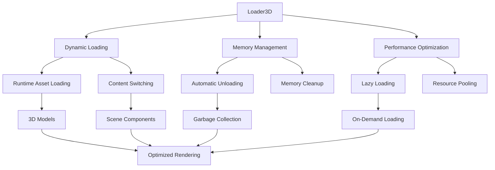

# Loader3D

## 是什么

Loader3D是Qt Quick 3D中用于动态加载和卸载3D内容的组件，类似于QML中的Loader但专门针对3D场景优化。它允许在运行时按需加载3D对象，实现内存管理、性能优化和动态内容切换。



Loader3D在大型3D应用中扮演关键角色，通过智能的资源管理避免内存溢出，提供流畅的用户体验。它支持异步加载、进度监控和错误处理，是构建可扩展3D应用的重要工具。

## 常用属性一览表

| 属性名 | 类型 | 默认值 | 取值范围 | 作用 | 性能/质量提示 |
| ------ | ---- | ------ | -------- | ---- | -------------- |
| source★ | url | "" | 文件路径/组件 | 加载源 | 影响加载时间和内存使用 |
| active★ | bool | true | true/false | 是否激活加载 | 控制资源的加载和卸载 |
| asynchronous★ | bool | false | true/false | 异步加载 | 避免阻塞主线程 |
| sourceComponent | Component | null | QML组件 | 内联组件定义 | 避免外部文件依赖 |
| item | Object | null | 加载的对象 | 当前加载项 | 只读属性，用于访问加载内容 |
| progress | real | 0.0 | 0.0-1.0 | 加载进度 | 用于显示加载状态 |
| status | enum | Null | 状态枚举 | 加载状态 | 用于错误处理和状态监控 |

★ 标记表示高频使用属性

## 属性详解

### source★ (高频属性)

source指定要加载的3D内容源，可以是外部QML文件或资源路径。

**支持的源类型：**

- QML文件路径：`"qrc:/models/Character.qml"`
- 相对路径：`"./components/Building.qml"`
- 网络URL：`"https://example.com/model.qml"`
- 空字符串：卸载当前内容

**使用场景：**

- 动态切换不同的3D模型
- 按需加载大型场景组件
- 实现模块化的3D内容管理

**注意事项：**

- 路径变化会触发重新加载
- 网络资源需要考虑加载时间
- 使用相对路径时注意当前上下文

### active★ (高频属性)

active控制Loader3D是否处于激活状态，影响内容的加载和卸载。

**状态行为：**

- `true`: 加载source指定的内容
- `false`: 卸载当前内容并释放内存
- 状态切换会触发加载/卸载过程

**使用场景：**

- 实现内容的显示/隐藏切换
- 基于条件的动态加载
- 内存管理和性能优化

**注意事项：**

- 设置为false会立即卸载内容
- 重新激活会重新加载内容
- 频繁切换可能影响性能

### asynchronous★ (高频属性)

asynchronous控制是否使用异步加载模式，避免阻塞主线程。

**加载模式：**

- `false`: 同步加载，可能阻塞UI
- `true`: 异步加载，保持UI响应性
- 异步模式下可以监控progress属性

**使用场景：**

- 加载大型3D模型文件
- 网络资源的加载
- 需要显示加载进度的场景

**注意事项：**

- 异步加载期间item为null
- 需要监听status变化处理加载完成
- 可能存在加载顺序问题

## 最小可运行示例

**文件树：**

```text
loader3d-example/
├── main.qml
├── components/
│   ├── Character.qml
│   ├── Vehicle.qml
│   ├── Building.qml
│   └── Environment.qml
├── assets/
│   ├── character.mesh
│   ├── car.mesh
│   └── house.mesh
└── CMakeLists.txt
```

**完整代码：**

main.qml:
```qml
import QtQuick
import QtQuick3D

Window {
    width: 1400
    height: 900
    visible: true
    title: "Loader3D Dynamic Content Loading"

    property int currentScene: 0
    property var sceneList: [
        "qrc:/components/Character.qml",
        "qrc:/components/Vehicle.qml", 
        "qrc:/components/Building.qml",
        "qrc:/components/Environment.qml"
    ]
    
    property var sceneNames: [
        "角色场景", "载具场景", "建筑场景", "环境场景"
    ]

    View3D {
        id: view3D
        anchors.fill: parent
        
        PerspectiveCamera {
            position: Qt.vector3d(0, 5, 15)
            eulerRotation: Qt.vector3d(-20, 0, 0)
        }
        
        // 主要内容加载器
        Loader3D {
            id: mainLoader
            source: sceneList[currentScene]
            active: true
            asynchronous: true
            
            onStatusChanged: {
                console.log("Loading status:", status)
                if (status === Loader.Error) {
                    console.log("Failed to load:", source)
                }
            }
            
            onProgressChanged: {
                console.log("Loading progress:", Math.round(progress * 100) + "%")
            }
            
            onLoaded: {
                console.log("Successfully loaded:", source)
                if (item) {
                    // 可以访问加载的内容
                    console.log("Loaded item:", item)
                }
            }
        }
        
        // 背景加载器 - 预加载下一个场景
        Loader3D {
            id: backgroundLoader
            active: false
            asynchronous: true
            visible: false
            
            function preloadNext() {
                var nextIndex = (currentScene + 1) % sceneList.length
                source = sceneList[nextIndex]
                active = true
            }
        }
        
        // 条件加载器 - 基于距离的LOD
        Loader3D {
            id: lodLoader
            active: view3D.camera.position.length() > 20
            asynchronous: true
            
            sourceComponent: Component {
                Model {
                    source: "#Sphere"
                    position: Qt.vector3d(10, 0, 0)
                    scale: Qt.vector3d(0.5, 0.5, 0.5)
                    materials: PrincipledMaterial {
                        baseColor: "yellow"
                        emissiveColor: "yellow"
                        emissiveFactor: 0.5
                    }
                }
            }
        }
        
        // 动态内容加载器 - 用户交互触发
        Loader3D {
            id: dynamicLoader
            active: false
            asynchronous: true
            
            property var dynamicContent: [
                Component {
                    Model {
                        source: "#Cube"
                        materials: PrincipledMaterial { baseColor: "red" }
                        SequentialAnimation on eulerRotation {
                            loops: Animation.Infinite
                            PropertyAnimation { to: Qt.vector3d(0, 360, 0); duration: 2000 }
                        }
                    }
                },
                Component {
                    Model {
                        source: "#Sphere"
                        materials: PrincipledMaterial { baseColor: "blue" }
                        SequentialAnimation on position {
                            loops: Animation.Infinite
                            PropertyAnimation { to: Qt.vector3d(0, 2, 0); duration: 1000 }
                            PropertyAnimation { to: Qt.vector3d(0, 0, 0); duration: 1000 }
                        }
                    }
                }
            ]
            
            function loadDynamic(index) {
                sourceComponent = dynamicContent[index]
                active = true
            }
        }
        
        // 基础光照
        DirectionalLight {
            eulerRotation.x: -45
            eulerRotation.y: 45
            brightness: 1.0
            castsShadow: true
        }
        
        environment: SceneEnvironment {
            clearColor: "#2C3E50"
            backgroundMode: SceneEnvironment.Color
        }
    }
    
    // 场景切换控制
    Rectangle {
        anchors.left: parent.left
        anchors.top: parent.top
        anchors.margins: 20
        width: 250
        height: 400
        color: "#33000000"
        radius: 10
        
        Column {
            anchors.fill: parent
            anchors.margins: 15
            spacing: 15
            
            Text {
                text: "场景管理"
                color: "white"
                font.bold: true
                font.pixelSize: 16
            }
            
            // 当前场景信息
            Rectangle {
                width: parent.width
                height: 80
                color: "#22FFFFFF"
                radius: 5
                
                Column {
                    anchors.centerIn: parent
                    spacing: 5
                    
                    Text {
                        text: "当前场景"
                        color: "white"
                        font.bold: true
                        anchors.horizontalCenter: parent.horizontalCenter
                    }
                    
                    Text {
                        text: sceneNames[currentScene]
                        color: "lightblue"
                        font.pixelSize: 14
                        anchors.horizontalCenter: parent.horizontalCenter
                    }
                }
            }
            
            // 加载状态
            Rectangle {
                width: parent.width
                height: 60
                color: "#22FFFFFF"
                radius: 5
                
                Column {
                    anchors.centerIn: parent
                    spacing: 5
                    
                    Text {
                        text: "加载状态: " + getStatusText(mainLoader.status)
                        color: "white"
                        font.pixelSize: 12
                        anchors.horizontalCenter: parent.horizontalCenter
                    }
                    
                    ProgressBar {
                        width: 180
                        value: mainLoader.progress
                        visible: mainLoader.status === Loader.Loading
                    }
                }
            }
            
            // 场景切换按钮
            Column {
                spacing: 8
                width: parent.width
                
                Repeater {
                    model: sceneNames.length
                    
                    Button {
                        width: parent.width
                        text: sceneNames[index]
                        enabled: index !== currentScene && mainLoader.status !== Loader.Loading
                        
                        onClicked: {
                            currentScene = index
                            // 预加载下一个场景
                            backgroundLoader.preloadNext()
                        }
                    }
                }
            }
            
            // 动态内容控制
            Rectangle {
                width: parent.width
                height: 80
                color: "#22FFFFFF"
                radius: 5
                
                Column {
                    anchors.fill: parent
                    anchors.margins: 10
                    spacing: 8
                    
                    Text {
                        text: "动态内容"
                        color: "white"
                        font.bold: true
                    }
                    
                    Row {
                        spacing: 10
                        
                        Button {
                            text: "立方体"
                            onClicked: dynamicLoader.loadDynamic(0)
                        }
                        
                        Button {
                            text: "球体"
                            onClicked: dynamicLoader.loadDynamic(1)
                        }
                        
                        Button {
                            text: "清除"
                            onClicked: dynamicLoader.active = false
                        }
                    }
                }
            }
        }
    }
    
    // 内存管理控制
    Rectangle {
        anchors.right: parent.right
        anchors.top: parent.top
        anchors.margins: 20
        width: 200
        height: 300
        color: "#33000000"
        radius: 10
        
        Column {
            anchors.fill: parent
            anchors.margins: 15
            spacing: 15
            
            Text {
                text: "内存管理"
                color: "white"
                font.bold: true
                font.pixelSize: 16
            }
            
            Button {
                width: parent.width
                text: "强制垃圾回收"
                onClicked: gc()
            }
            
            Button {
                width: parent.width
                text: "卸载当前场景"
                onClicked: mainLoader.active = false
            }
            
            Button {
                width: parent.width
                text: "重新加载场景"
                onClicked: {
                    mainLoader.active = false
                    mainLoader.active = true
                }
            }
            
            CheckBox {
                text: "异步加载"
                checked: mainLoader.asynchronous
                onCheckedChanged: mainLoader.asynchronous = checked
            }
            
            CheckBox {
                text: "LOD加载器"
                checked: lodLoader.active
                onCheckedChanged: lodLoader.active = checked
            }
        }
    }
    
    // 帮助函数
    function getStatusText(status) {
        switch(status) {
        case Loader.Null: return "空闲"
        case Loader.Ready: return "就绪"
        case Loader.Loading: return "加载中"
        case Loader.Error: return "错误"
        default: return "未知"
        }
    }
}
```

components/Character.qml:
```qml
import QtQuick3D

Node {
    // 角色模型
    Model {
        source: "#Sphere"
        position: Qt.vector3d(0, 1, 0)
        scale: Qt.vector3d(1.5, 2, 1.5)
        materials: PrincipledMaterial {
            baseColor: "#FFB6C1"
            metalness: 0.0
            roughness: 0.6
        }
        
        // 头部
        Model {
            source: "#Sphere"
            position: Qt.vector3d(0, 1.5, 0)
            scale: Qt.vector3d(0.6, 0.6, 0.6)
            materials: PrincipledMaterial {
                baseColor: "#FDBCB4"
                metalness: 0.0
                roughness: 0.8
            }
        }
        
        // 手臂
        Repeater3D {
            model: 2
            Model {
                source: "#Cylinder"
                position: Qt.vector3d(index === 0 ? -1.2 : 1.2, 0.5, 0)
                scale: Qt.vector3d(0.2, 1, 0.2)
                materials: PrincipledMaterial {
                    baseColor: "#FDBCB4"
                    metalness: 0.0
                    roughness: 0.8
                }
            }
        }
    }
    
    // 地面
    Model {
        source: "#Rectangle"
        position: Qt.vector3d(0, 0, 0)
        eulerRotation: Qt.vector3d(-90, 0, 0)
        scale: Qt.vector3d(10, 10, 1)
        materials: PrincipledMaterial {
            baseColor: "#90EE90"
            metalness: 0.0
            roughness: 0.9
        }
    }
}
```

components/Vehicle.qml:
```qml
import QtQuick3D

Node {
    // 车身
    Model {
        source: "#Cube"
        position: Qt.vector3d(0, 0.5, 0)
        scale: Qt.vector3d(3, 1, 1.5)
        materials: PrincipledMaterial {
            baseColor: "#FF4500"
            metalness: 0.8
            roughness: 0.2
        }
    }
    
    // 车轮
    Repeater3D {
        model: 4
        Model {
            source: "#Cylinder"
            position: Qt.vector3d(
                index < 2 ? -1.2 : 1.2,
                0,
                index % 2 === 0 ? -0.8 : 0.8
            )
            eulerRotation: Qt.vector3d(0, 0, 90)
            scale: Qt.vector3d(0.6, 0.2, 0.6)
            materials: PrincipledMaterial {
                baseColor: "#2F4F4F"
                metalness: 0.0
                roughness: 0.8
            }
        }
    }
    
    // 道路
    Model {
        source: "#Rectangle"
        position: Qt.vector3d(0, -0.1, 0)
        eulerRotation: Qt.vector3d(-90, 0, 0)
        scale: Qt.vector3d(15, 8, 1)
        materials: PrincipledMaterial {
            baseColor: "#696969"
            metalness: 0.0
            roughness: 0.9
        }
    }
}
```

components/Building.qml:
```qml
import QtQuick3D

Node {
    // 主建筑
    Model {
        source: "#Cube"
        position: Qt.vector3d(0, 2, 0)
        scale: Qt.vector3d(3, 4, 3)
        materials: PrincipledMaterial {
            baseColor: "#D2B48C"
            metalness: 0.0
            roughness: 0.7
        }
    }
    
    // 屋顶
    Model {
        source: "#Cone"
        position: Qt.vector3d(0, 4.5, 0)
        scale: Qt.vector3d(3.5, 1, 3.5)
        materials: PrincipledMaterial {
            baseColor: "#8B4513"
            metalness: 0.0
            roughness: 0.8
        }
    }
    
    // 窗户
    Repeater3D {
        model: 8
        Model {
            source: "#Cube"
            position: Qt.vector3d(
                (index % 4 < 2) ? -1.2 : 1.2,
                1 + Math.floor(index / 4) * 2,
                index % 2 === 0 ? 1.51 : -1.51
            )
            scale: Qt.vector3d(0.6, 0.8, 0.02)
            materials: PrincipledMaterial {
                baseColor: "#87CEEB"
                metalness: 0.0
                roughness: 0.1
                opacity: 0.7
                alphaMode: PrincipledMaterial.Blend
            }
        }
    }
    
    // 地面
    Model {
        source: "#Rectangle"
        position: Qt.vector3d(0, 0, 0)
        eulerRotation: Qt.vector3d(-90, 0, 0)
        scale: Qt.vector3d(12, 12, 1)
        materials: PrincipledMaterial {
            baseColor: "#F5DEB3"
            metalness: 0.0
            roughness: 0.9
        }
    }
}
```

components/Environment.qml:
```qml
import QtQuick3D

Node {
    // 地形
    Model {
        source: "#Rectangle"
        position: Qt.vector3d(0, 0, 0)
        eulerRotation: Qt.vector3d(-90, 0, 0)
        scale: Qt.vector3d(20, 20, 1)
        materials: PrincipledMaterial {
            baseColor: "#228B22"
            metalness: 0.0
            roughness: 0.9
        }
    }
    
    // 树木
    Repeater3D {
        model: 15
        Node {
            position: Qt.vector3d(
                (Math.random() - 0.5) * 18,
                0,
                (Math.random() - 0.5) * 18
            )
            
            // 树干
            Model {
                source: "#Cylinder"
                position: Qt.vector3d(0, 1, 0)
                scale: Qt.vector3d(0.2, 2, 0.2)
                materials: PrincipledMaterial {
                    baseColor: "#8B4513"
                    metalness: 0.0
                    roughness: 0.9
                }
            }
            
            // 树冠
            Model {
                source: "#Sphere"
                position: Qt.vector3d(0, 2.5, 0)
                scale: Qt.vector3d(1.5, 1.5, 1.5)
                materials: PrincipledMaterial {
                    baseColor: "#006400"
                    metalness: 0.0
                    roughness: 0.8
                }
            }
        }
    }
    
    // 山脉背景
    Repeater3D {
        model: 5
        Model {
            source: "#Cone"
            position: Qt.vector3d(
                (index - 2) * 8,
                3,
                -15
            )
            scale: Qt.vector3d(4, 6, 4)
            materials: PrincipledMaterial {
                baseColor: "#708090"
                metalness: 0.0
                roughness: 0.8
            }
        }
    }
}
```

CMakeLists.txt:
```cmake
cmake_minimum_required(VERSION 3.16)
project(Loader3DExample)

find_package(Qt6 REQUIRED COMPONENTS Core Quick Quick3D)

qt_add_executable(Loader3DExample main.cpp)
qt_add_qml_module(Loader3DExample
    URI Loader3DExample
    VERSION 1.0
    QML_FILES 
        main.qml
        components/Character.qml
        components/Vehicle.qml
        components/Building.qml
        components/Environment.qml
    RESOURCES
        assets/character.mesh
        assets/car.mesh
        assets/house.mesh
)

target_link_libraries(Loader3DExample Qt6::Core Qt6::Quick Qt6::Quick3D)
```

main.cpp:
```cpp
#include <QGuiApplication>
#include <QQmlApplicationEngine>

int main(int argc, char *argv[])
{
    QGuiApplication app(argc, argv);
    QQmlApplicationEngine engine;
    engine.load(QUrl(QStringLiteral("qrc:/main.qml")));
    return app.exec();
}
```

**预期效果：**
展示动态场景切换、异步加载、内存管理和条件加载等Loader3D的核心功能。

## 踩坑与调试

### 常见错误

**错误1：加载失败或内容不显示**
```
Console Warning: Loader3D failed to load source
```
**解决方案：**
1. 检查source路径是否正确和文件是否存在
2. 验证QML文件语法是否正确
3. 确认资源文件是否正确添加到项目中
4. 检查网络连接（如果是网络资源）

**错误2：内存泄漏**
```
Console Warning: Memory usage continues to grow
```
**解决方案：**
1. 确保设置active为false时正确卸载内容
2. 避免循环引用导致的内存泄漏
3. 定期调用垃圾回收机制
4. 监控item属性的生命周期

**错误3：加载性能问题**
```
Console Warning: Synchronous loading blocking main thread
```
**解决方案：**
1. 启用asynchronous属性使用异步加载
2. 实现预加载机制减少等待时间
3. 优化加载的内容大小和复杂度
4. 使用进度指示器改善用户体验

### 调试技巧

1. **加载状态监控**
   - 监听status属性变化
   - 使用progress属性显示加载进度
   - 记录加载时间和内存使用

2. **内容验证**
   - 检查item属性是否正确设置
   - 验证加载的内容是否符合预期
   - 测试不同source类型的加载

3. **性能分析**
   - 监控内存使用情况
   - 测试异步vs同步加载的性能差异
   - 分析加载时间和资源消耗

### 性能优化建议

- 使用异步加载避免阻塞主线程
- 实现预加载机制提升用户体验
- 及时卸载不需要的内容释放内存
- 使用条件加载实现LOD系统
- 合理设计组件结构减少加载开销

## 延伸阅读

1. **Qt Quick 3D Loader3D QML Type**  
   官方文档详细介绍了Loader3D的所有属性和使用方法。  
   链接：https://doc.qt.io/qt-6/qml-qtquick3d-loader3d.html

2. **QML Dynamic Object Creation**  
   深入了解QML中的动态对象创建和内存管理最佳实践。  
   链接：https://doc.qt.io/qt-6/qtqml-javascript-dynamicobjectcreation.html

## 附录：完整属性清单

<details>
<summary>点击展开完整属性列表</summary>

| 属性名 | 类型 | 默认值 | 取值范围 | 作用 | 版本支持 |
| ------ | ---- | ------ | -------- | ---- | -------- |
| source | url | "" | 文件路径 | 加载源 | Qt 6.0+ |
| sourceComponent | Component | null | QML组件 | 内联组件 | Qt 6.0+ |
| active | bool | true | true/false | 激活状态 | Qt 6.0+ |
| asynchronous | bool | false | true/false | 异步加载 | Qt 6.0+ |
| item | Object | null | 加载的对象 | 当前加载项 | Qt 6.0+ |
| progress | real | 0.0 | 0.0-1.0 | 加载进度 | Qt 6.0+ |
| status | enum | Null | 状态枚举 | 加载状态 | Qt 6.0+ |

**状态枚举值：**
- `Loader.Null`: 未加载状态
- `Loader.Ready`: 加载完成状态
- `Loader.Loading`: 正在加载状态
- `Loader.Error`: 加载错误状态

**信号：**
- `loaded()`: 加载完成时触发
- `sourceChanged()`: 源改变时触发
- `statusChanged()`: 状态改变时触发
- `progressChanged()`: 进度改变时触发
- `activeChanged()`: 激活状态改变时触发
- `asynchronousChanged()`: 异步模式改变时触发
- `itemChanged()`: 加载项改变时触发

**方法：**
- `setSource(url, properties)`: 设置源并传递属性
- `reload()`: 重新加载当前源

**使用模式：**

**文件加载模式：**
```qml
Loader3D {
    source: "MyComponent.qml"
    active: true
    asynchronous: true
}
```

**组件加载模式：**
```qml
Loader3D {
    sourceComponent: Component {
        Model { source: "#Cube" }
    }
    active: true
}
```

**条件加载模式：**
```qml
Loader3D {
    active: someCondition
    source: someCondition ? "ComponentA.qml" : ""
}
```

**版本差异说明：**
- Qt 6.0-6.1: 基础Loader3D功能，支持基本的动态加载
- Qt 6.2: 改进异步加载性能和内存管理
- Qt 6.5: 新增预加载和缓存机制
- Qt 6.7: 优化加载性能和错误处理

</details>