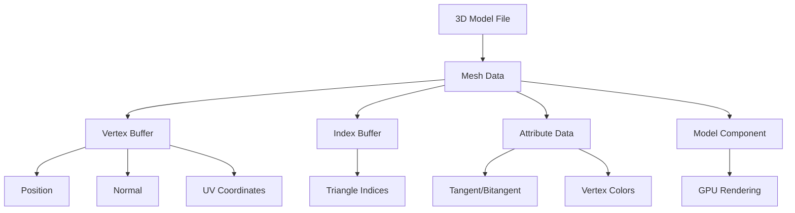

# Meshes

## 是什么

Meshes（网格）是Qt Quick 3D中定义3D对象几何形状的数据结构。网格包含顶点位置、法线、纹理坐标和索引信息，是构成3D模型可视化表面的基础数据。



网格数据在渲染管线中扮演关键角色，GPU使用这些数据来绘制3D对象的表面。Qt Quick 3D支持多种网格格式，从简单的内置几何体到复杂的外部模型文件。

## 常用属性一览表

| 属性名 | 类型 | 默认值 | 取值范围 | 作用 | 性能/质量提示 |
| ------ | ---- | ------ | -------- | ---- | -------------- |
| vertexCount★ | int | 0 | 正整数 | 顶点数量 | 影响渲染性能，建议<65536 |
| indexCount★ | int | 0 | 正整数 | 索引数量 | 三角形数=indexCount/3 |
| primitiveType★ | enum | Triangles | 图元类型 | 渲染图元类型 | Triangles性能最佳 |
| stride | int | 0 | 字节数 | 顶点数据步长 | 影响内存访问效率 |
| bounds | Bounds | auto | 包围盒 | 几何体边界 | 用于视锥体剔除优化 |
| vertexData | ArrayBuffer | null | 二进制数据 | 顶点缓冲区数据 | 大数据量时考虑压缩 |
| indexData | ArrayBuffer | null | 二进制数据 | 索引缓冲区数据 | 使用16位索引节省内存 |
| subsets | list | [] | 子网格列表 | 多材质支持 | 子网格数量影响绘制调用 |

★ 标记表示高频使用属性

## 属性详解

### vertexCount★ (高频属性)

vertexCount 定义网格中顶点的总数量，直接影响渲染性能和内存使用。这是评估网格复杂度的关键指标。

**使用场景：**

- 性能分析和优化
- LOD系统中的细节层次控制
- 内存使用量估算

**注意事项：**

- 移动设备建议单个网格顶点数<10000
- 超过65536顶点需要32位索引
- 顶点数量与帧率成反比关系
- 考虑使用网格简化算法优化高精度模型

### primitiveType★ (高频属性)

primitiveType 指定网格的图元类型，决定顶点如何组合成可渲染的几何图形。

**支持的图元类型：**

- `Mesh.Triangles`: 三角形（默认，性能最佳）
- `Mesh.Lines`: 线段（用于线框渲染）
- `Mesh.Points`: 点（用于粒子效果）

**使用场景：**

- 标准3D模型使用Triangles
- 调试和线框显示使用Lines
- 粒子系统使用Points

**注意事项：**

- Triangles提供最佳的GPU性能
- Lines和Points主要用于特殊效果
- 不同图元类型需要不同的着色器

### subsets★ (高频属性)

subsets 定义网格的子集，支持单个网格使用多种材质。每个子集指定使用特定材质的顶点范围。

**使用场景：**

- 复杂模型的不同部分使用不同材质
- 角色模型的皮肤、衣服、装备分别渲染
- 建筑模型的墙面、窗户、门使用不同材质

**注意事项：**

- 每个子集会产生一次绘制调用
- 过多子集会影响渲染性能
- 合并相似材质可以减少子集数量

## 最小可运行示例

**文件树：**

```text
mesh-example/
├── main.qml
├── CustomGeometry.qml
├── assets/
│   └── custom.mesh
└── CMakeLists.txt
```

**完整代码：**

main.qml:
```qml
import QtQuick
import QtQuick3D

Window {
    width: 800
    height: 600
    visible: true
    title: "Mesh Example"

    View3D {
        anchors.fill: parent
        
        PerspectiveCamera {
            position: Qt.vector3d(0, 0, 8)
        }
        
        // 使用内置网格
        Model {
            id: builtinMesh
            source: "#Sphere"
            position: Qt.vector3d(-2, 0, 0)
            materials: PrincipledMaterial {
                baseColor: "blue"
                metalness: 0.8
                roughness: 0.2
            }
        }
        
        // 使用自定义几何体
        Model {
            id: customMesh
            position: Qt.vector3d(2, 0, 0)
            geometry: CustomGeometry {}
            materials: PrincipledMaterial {
                baseColor: "red"
                metalness: 0.3
                roughness: 0.7
            }
        }
        
        DirectionalLight {
            eulerRotation.x: -45
            brightness: 1.5
        }
        
        environment: SceneEnvironment {
            clearColor: "#333333"
            backgroundMode: SceneEnvironment.Color
        }
    }
}
```

CustomGeometry.qml:
```qml
import QtQuick
import QtQuick3D

Geometry {
    id: customGeometry
    
    Component.onCompleted: {
        // 创建三角形网格数据
        var vertices = new Float32Array([
            // 位置 (x, y, z)     法线 (nx, ny, nz)    UV (u, v)
            -1.0, -1.0,  0.0,    0.0,  0.0,  1.0,    0.0, 0.0,  // 顶点0
             1.0, -1.0,  0.0,    0.0,  0.0,  1.0,    1.0, 0.0,  // 顶点1
             0.0,  1.0,  0.0,    0.0,  0.0,  1.0,    0.5, 1.0   // 顶点2
        ]);
        
        var indices = new Uint16Array([
            0, 1, 2  // 三角形索引
        ]);
        
        // 设置顶点属性
        addAttribute(Geometry.Attribute.PositionSemantic, 
                    Geometry.Attribute.ComponentType.Float32Type, vertices);
        addAttribute(Geometry.Attribute.NormalSemantic,
                    Geometry.Attribute.ComponentType.Float32Type, vertices);
        addAttribute(Geometry.Attribute.TexCoordSemantic,
                    Geometry.Attribute.ComponentType.Float32Type, vertices);
        
        // 设置索引数据
        setIndexData(indices);
        
        // 设置图元类型
        setPrimitiveType(Geometry.PrimitiveType.Triangles);
        
        // 更新边界框
        setBounds(Qt.vector3d(-1, -1, 0), Qt.vector3d(1, 1, 0));
    }
}
```

CMakeLists.txt:
```cmake
cmake_minimum_required(VERSION 3.16)
project(MeshExample)

find_package(Qt6 REQUIRED COMPONENTS Core Quick Quick3D)

qt_add_executable(MeshExample main.cpp)
qt_add_qml_module(MeshExample
    URI MeshExample
    VERSION 1.0
    QML_FILES 
        main.qml
        CustomGeometry.qml
)

target_link_libraries(MeshExample Qt6::Core Qt6::Quick Qt6::Quick3D)
```

main.cpp:
```cpp
#include <QGuiApplication>
#include <QQmlApplicationEngine>

int main(int argc, char *argv[])
{
    QGuiApplication app(argc, argv);
    QQmlApplicationEngine engine;
    engine.load(QUrl(QStringLiteral("qrc:/main.qml")));
    return app.exec();
}
```

**预期效果：**
显示两个3D对象：左侧蓝色金属球体（内置网格），右侧红色三角形（自定义网格）。

## 踩坑与调试

### 常见错误

**错误1：自定义网格不显示**
```
Console Warning: Geometry has no valid vertex data
```
**解决方案：**
1. 确保调用了addAttribute()设置顶点属性
2. 检查顶点数据格式和大小是否正确
3. 验证索引数据是否有效
4. 确认setPrimitiveType()被正确调用

**错误2：网格显示异常或破碎**
```
Console Warning: Invalid index data detected
```
**解决方案：**
1. 检查索引值是否超出顶点数量范围
2. 确认索引数据类型（Uint16/Uint32）匹配
3. 验证三角形绕序（顺时针/逆时针）
4. 检查法线向量是否正确计算

**错误3：性能问题**
```
Console Warning: High vertex count may impact performance
```
**解决方案：**
1. 使用网格简化算法减少顶点数
2. 实施LOD（细节层次）系统
3. 合并相邻顶点减少重复
4. 使用索引缓冲区避免顶点重复

### 调试技巧

1. **网格可视化调试**
   - 使用线框模式检查网格拓扑
   - 启用法线可视化验证法线方向
   - 使用顶点颜色调试顶点属性

2. **性能分析**
   - 监控顶点数和三角形数
   - 使用GPU分析器检查渲染瓶颈
   - 测试不同LOD级别的性能影响

3. **数据验证**
   - 检查顶点属性的数据对齐
   - 验证索引缓冲区的完整性
   - 确认边界框计算的准确性

### 性能优化建议

- 使用16位索引替代32位索引（顶点数<65536时）
- 合理设置顶点属性，避免不必要的数据
- 使用三角形条带减少索引数据量
- 实施视锥体剔除和背面剔除
- 考虑使用几何体实例化处理重复网格

## 延伸阅读

1. **Qt Quick 3D Geometry QML Type**  
   官方文档详细介绍了Geometry类的所有属性和方法，包括自定义几何体的创建。  
   链接：https://doc.qt.io/qt-6/qml-qtquick3d-geometry.html

2. **3D Graphics Fundamentals: Meshes and Vertices**  
   深入解释3D图形学中网格的基本概念，包括顶点属性和索引缓冲区的工作原理。  
   链接：https://learnopengl.com/Getting-started/Hello-Triangle

## 附录：完整属性清单

<details>
<summary>点击展开完整属性列表</summary>

| 属性名 | 类型 | 默认值 | 取值范围 | 作用 | 版本支持 |
| ------ | ---- | ------ | -------- | ---- | -------- |
| vertexCount | int | 0 | 正整数 | 顶点总数 | Qt 6.0+ |
| indexCount | int | 0 | 正整数 | 索引总数 | Qt 6.0+ |
| primitiveType | enum | Triangles | 图元类型枚举 | 渲染图元类型 | Qt 6.0+ |
| stride | int | 0 | 字节数 | 顶点数据步长 | Qt 6.0+ |
| bounds | Bounds | auto | 包围盒对象 | 几何体边界 | Qt 6.0+ |
| vertexData | ArrayBuffer | null | 二进制数据 | 顶点缓冲区 | Qt 6.0+ |
| indexData | ArrayBuffer | null | 二进制数据 | 索引缓冲区 | Qt 6.0+ |
| subsets | list | [] | 子网格列表 | 多材质子集 | Qt 6.0+ |
| attributeCount | int | 0 | 正整数 | 顶点属性数量 | Qt 6.0+ |
| targetCount | int | 0 | 正整数 | 变形目标数量 | Qt 6.2+ |
| morphTargets | list | [] | MorphTarget列表 | 变形目标列表 | Qt 6.2+ |

**图元类型枚举值：**
- `Geometry.Triangles`: 三角形列表
- `Geometry.Lines`: 线段列表  
- `Geometry.Points`: 点列表
- `Geometry.TriangleStrip`: 三角形条带（Qt 6.5+）
- `Geometry.TriangleFan`: 三角形扇形（Qt 6.5+）

**顶点属性语义：**
- `Geometry.PositionSemantic`: 顶点位置
- `Geometry.NormalSemantic`: 法线向量
- `Geometry.TexCoordSemantic`: 纹理坐标
- `Geometry.TangentSemantic`: 切线向量
- `Geometry.BinormalSemantic`: 副法线向量
- `Geometry.ColorSemantic`: 顶点颜色
- `Geometry.JointSemantic`: 骨骼索引（Qt 6.2+）
- `Geometry.WeightSemantic`: 骨骼权重（Qt 6.2+）

**版本差异说明：**
- Qt 6.0-6.1: 基础网格功能，支持基本几何体操作
- Qt 6.2: 新增变形目标和骨骼动画支持
- Qt 6.5: 新增三角形条带和扇形图元类型
- Qt 6.7: 优化内存管理和渲染性能

</details>