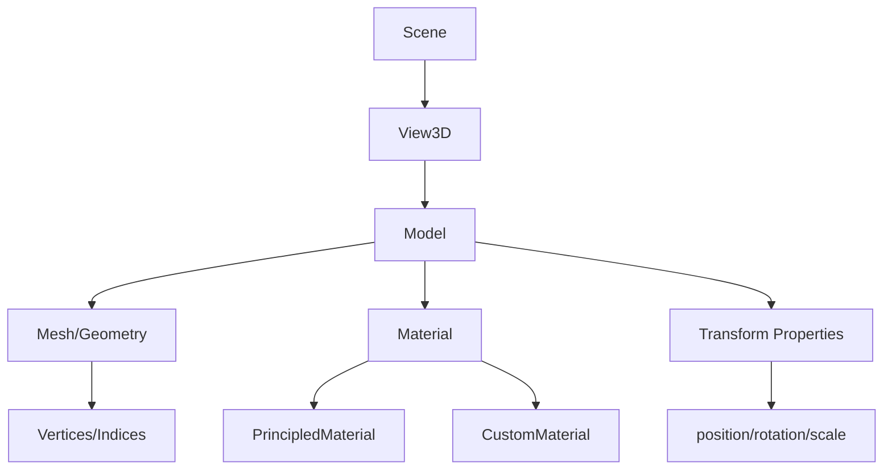

# Model

## 是什么

Model 是 Qt Quick 3D 中最基础的3D对象组件，用于在3D场景中显示几何体。它是场景图中的核心节点，负责将网格数据（Mesh）与材质（Material）结合，形成可见的3D对象。



Model 在场景图中承担着连接几何数据和渲染材质的桥梁作用，是构建3D场景的基本单元。每个 Model 实例代表场景中的一个独立3D对象，可以拥有自己的变换属性、材质和几何体。

## 常用属性一览表

| 属性名 | 类型 | 默认值 | 取值范围 | 作用 | 性能/质量提示 |
| ------ | ---- | ------ | -------- | ---- | -------------- |
| source★ | url | "" | 文件路径/.mesh | 指定几何体数据源 | 使用.mesh格式获得最佳性能 |
| materials★ | list | [] | Material列表 | 设置渲染材质 | 材质数量影响渲染性能 |
| geometry★ | Geometry | null | Geometry对象 | 程序化几何体 | 动态几何体比静态网格消耗更多CPU |
| position | vector3d | (0,0,0) | 3D坐标 | 模型世界位置 | 频繁修改会触发场景图更新 |
| eulerRotation | vector3d | (0,0,0) | 角度值 | 欧拉角旋转 | 避免万向锁，考虑使用quaternion |
| scale | vector3d | (1,1,1) | 缩放因子 | 模型缩放 | 非均匀缩放可能影响光照计算 |
| visible | bool | true | true/false | 可见性控制 | 隐藏对象仍参与包围盒计算 |
| opacity | real | 1.0 | 0.0-1.0 | 透明度 | 透明对象需要深度排序，影响性能 |
| castsShadows | bool | true | true/false | 是否投射阴影 | 关闭可提升阴影渲染性能 |
| receivesShadows | bool | true | true/false | 是否接收阴影 | 关闭可减少片段着色器计算 |

★ 标记表示高频使用属性

## 属性详解

### source★ (高频属性)

source 属性指定 Model 使用的几何体数据源，支持多种格式的3D模型文件。这是定义 Model 外观的核心属性。

**使用场景：**

- 加载外部3D模型文件（.mesh, .fbx, .gltf等）
- 使用Qt Quick 3D内置几何体（#Cube, #Sphere等）
- 动态切换模型几何体

**注意事项：**

- .mesh格式是Qt Quick 3D的原生格式，加载速度最快
- 使用Balsam工具可将其他格式转换为.mesh
- 内置几何体以#开头，如"#Cube"、"#Sphere"
- 文件路径变化会触发重新加载，避免频繁修改

### materials★ (高频属性)

materials 属性定义 Model 的渲染外观，可以是单个材质或材质列表。材质决定了光照如何与表面交互。

**使用场景：**

- 设置PBR材质实现真实感渲染
- 使用CustomMaterial创建特殊效果
- 多材质支持复杂模型的不同部分

**注意事项：**

- 材质数量直接影响渲染性能
- 材质切换会触发着色器重编译
- 空材质列表将使用默认材质

### geometry★ (高频属性)

geometry 属性用于程序化创建几何体，适合动态生成的3D内容。与source属性互斥使用。

**使用场景：**

- 程序化生成地形、粒子系统
- 动态修改顶点数据
- 创建自定义几何形状

**注意事项：**

- 动态几何体比静态网格消耗更多CPU资源
- 顶点数据变化会触发GPU缓冲区更新
- 大量顶点时考虑使用实例化渲染

## 最小可运行示例

**文件树：**

```text
model-example/
├── main.qml
├── assets/
│   └── cube.mesh
└── CMakeLists.txt
```

**完整代码：**

main.qml:
```qml
import QtQuick
import QtQuick3D

Window {
    width: 800
    height: 600
    visible: true
    title: "Model Example"

    View3D {
        anchors.fill: parent
        
        // 相机设置
        PerspectiveCamera {
            position: Qt.vector3d(0, 0, 5)
            lookAtNode: cubeModel
        }
        
        // 3D模型
        Model {
            id: cubeModel
            source: "#Cube"
            position: Qt.vector3d(0, 0, 0)
            eulerRotation: Qt.vector3d(30, 45, 0)
            scale: Qt.vector3d(1.5, 1.5, 1.5)
            
            materials: PrincipledMaterial {
                baseColor: "red"
                metalness: 0.5
                roughness: 0.3
            }
            
            // 旋转动画
            SequentialAnimation on eulerRotation {
                loops: Animation.Infinite
                PropertyAnimation {
                    to: Qt.vector3d(30, 405, 0)
                    duration: 3000
                    easing.type: Easing.InOutQuad
                }
            }
        }
        
        // 环境光照
        DirectionalLight {
            eulerRotation.x: -45
            eulerRotation.y: 45
            brightness: 1.0
        }
        
        // 环境光
        environment: SceneEnvironment {
            clearColor: "#222222"
            backgroundMode: SceneEnvironment.Color
        }
    }
}
```

CMakeLists.txt:
```cmake
cmake_minimum_required(VERSION 3.16)
project(ModelExample)

find_package(Qt6 REQUIRED COMPONENTS Core Quick Quick3D)

qt_add_executable(ModelExample main.cpp)
qt_add_qml_module(ModelExample
    URI ModelExample
    VERSION 1.0
    QML_FILES main.qml
)

target_link_libraries(ModelExample Qt6::Core Qt6::Quick Qt6::Quick3D)
```

main.cpp:
```cpp
#include <QGuiApplication>
#include <QQmlApplicationEngine>

int main(int argc, char *argv[])
{
    QGuiApplication app(argc, argv);
    QQmlApplicationEngine engine;
    engine.load(QUrl(QStringLiteral("qrc:/main.qml")));
    return app.exec();
}
```

**预期效果：**
显示一个红色金属质感的立方体，绕Y轴持续旋转，具有真实的光照和阴影效果。

## 踩坑与调试

### 常见错误

**错误1：模型不显示或显示为黑色**
```
Console Warning: Model has no valid geometry or material
```
**解决方案：**
1. 检查source路径是否正确，确保文件存在
2. 验证materials属性是否正确设置
3. 确认相机位置和朝向能看到模型
4. 检查模型的scale是否为0

**错误2：材质显示异常**
```
Console Warning: Material binding failed for model
```
**解决方案：**
1. 确保材质对象已正确创建
2. 检查材质属性设置是否有效
3. 验证纹理路径和格式是否支持
4. 确认着色器编译没有错误

**错误3：性能问题**
```
Console Warning: High polygon count detected in model
```
**解决方案：**
1. 使用LOD（细节层次）技术
2. 优化网格拓扑，减少不必要的顶点
3. 合并相似材质减少绘制调用
4. 考虑使用实例化渲染

### 调试技巧

1. **使用DebugView检查场景结构**
   - 启用View3D的debugMode属性
   - 查看模型的包围盒和变换信息

2. **材质调试**
   - 临时使用简单的单色材质排除材质问题
   - 检查法线贴图和其他纹理是否正确加载

3. **性能分析**
   - 使用Qt Creator的QML Profiler
   - 监控渲染统计信息和帧率

### 性能优化建议

- 使用.mesh格式的预处理模型文件
- 合理设置LOD距离，远距离使用低精度模型
- 避免在动画中频繁修改geometry属性
- 使用实例化渲染处理大量相同模型
- 合理使用视锥体剔除和遮挡剔除

## 延伸阅读

1. **Qt Quick 3D Model QML Type**  
   官方文档详细介绍了Model的所有属性和方法，包括高级用法和最佳实践。  
   链接：https://doc.qt.io/qt-6/qml-qtquick3d-model.html

2. **3D Asset Conditioning Pipeline**  
   介绍如何优化3D资产以获得最佳性能，包括网格优化和纹理压缩技术。  
   链接：https://doc.qt.io/qt-6/quick3d-asset-conditioning.html

## 附录：完整属性清单

<details>
<summary>点击展开完整属性列表</summary>

| 属性名 | 类型 | 默认值 | 取值范围 | 作用 | 版本支持 |
| ------ | ---- | ------ | -------- | ---- | -------- |
| source | url | "" | 文件路径 | 几何体数据源 | Qt 6.0+ |
| geometry | Geometry | null | Geometry对象 | 程序化几何体 | Qt 6.0+ |
| materials | list | [] | Material列表 | 渲染材质列表 | Qt 6.0+ |
| position | vector3d | (0,0,0) | 3D坐标 | 世界坐标位置 | Qt 6.0+ |
| rotation | quaternion | (1,0,0,0) | 四元数 | 旋转变换 | Qt 6.0+ |
| eulerRotation | vector3d | (0,0,0) | 角度值 | 欧拉角旋转 | Qt 6.0+ |
| scale | vector3d | (1,1,1) | 缩放因子 | 缩放变换 | Qt 6.0+ |
| pivot | vector3d | (0,0,0) | 3D坐标 | 变换中心点 | Qt 6.0+ |
| opacity | real | 1.0 | 0.0-1.0 | 透明度 | Qt 6.0+ |
| visible | bool | true | true/false | 可见性 | Qt 6.0+ |
| pickable | bool | true | true/false | 是否可拾取 | Qt 6.0+ |
| castsShadows | bool | true | true/false | 投射阴影 | Qt 6.0+ |
| receivesShadows | bool | true | true/false | 接收阴影 | Qt 6.0+ |
| bounds | Bounds | auto | 包围盒 | 自定义包围盒 | Qt 6.2+ |
| depthBias | real | 0.0 | 浮点数 | 深度偏移 | Qt 6.2+ |
| instancing | Instancing | null | Instancing对象 | 实例化渲染 | Qt 6.2+ |
| skeleton | Skeleton | null | Skeleton对象 | 骨骼动画 | Qt 6.0+ |
| morphTargets | list | [] | MorphTarget列表 | 变形目标 | Qt 6.0+ |
| levelOfDetailBias | real | 1.0 | 浮点数 | LOD偏移 | Qt 6.5+ |
| usedInBakedLighting | bool | false | true/false | 烘焙光照 | Qt 6.5+ |
| lightmapBaseResolution | int | 256 | 整数 | 光照贴图分辨率 | Qt 6.5+ |
| bakedLightmap | Texture | null | Texture对象 | 烘焙光照贴图 | Qt 6.5+ |
| reflectionProbe | ReflectionProbe | null | ReflectionProbe对象 | 反射探针 | Qt 6.4+ |

**版本差异说明：**
- Qt 6.0-6.1: 基础Model功能，支持基本变换和材质
- Qt 6.2: 新增bounds、depthBias和instancing支持
- Qt 6.4: 新增反射探针支持，改进PBR渲染
- Qt 6.5: 新增烘焙光照和LOD偏移功能
- Qt 6.7: 优化性能，改进内存管理

</details>