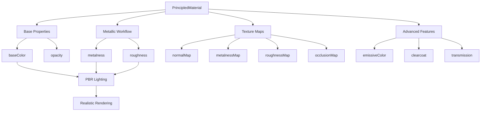

# PrincipledMaterial

## 是什么

PrincipledMaterial是Qt Quick 3D中基于物理的渲染（PBR）材质系统，遵循迪士尼原则化BRDF模型。它提供了真实感渲染所需的所有材质属性，包括金属度、粗糙度、法线贴图等，是创建逼真3D材质的标准选择。



PrincipledMaterial基于能量守恒原理，确保材质在不同光照条件下都能呈现一致和真实的外观。它支持完整的PBR工作流程，从简单的颜色设置到复杂的多层材质都能轻松实现。

## 常用属性一览表

| 属性名 | 类型 | 默认值 | 取值范围 | 作用 | 性能/质量提示 |
| ------ | ---- | ------ | -------- | ---- | -------------- |
| baseColor★ | color | white | 颜色值 | 基础颜色/反照率 | 影响整体材质外观 |
| metalness★ | real | 0.0 | 0.0-1.0 | 金属度 | 0=电介质，1=金属 |
| roughness★ | real | 0.0 | 0.0-1.0 | 粗糙度 | 0=镜面，1=完全粗糙 |
| normalMap★ | Texture | null | 纹理对象 | 法线贴图 | 显著提升细节但增加内存 |
| baseColorMap | Texture | null | 纹理对象 | 基础颜色贴图 | 最常用的纹理类型 |
| metalnessMap | Texture | null | 纹理对象 | 金属度贴图 | 通常与粗糙度合并 |
| roughnessMap | Texture | null | 纹理对象 | 粗糙度贴图 | 控制表面光泽变化 |
| occlusionMap | Texture | null | 纹理对象 | 环境遮挡贴图 | 增强深度感和真实感 |
| emissiveColor | color | black | 颜色值 | 自发光颜色 | 不受光照影响 |
| emissiveMap | Texture | null | 纹理对象 | 自发光贴图 | 用于发光效果 |
| opacity | real | 1.0 | 0.0-1.0 | 不透明度 | <1.0时需要透明度排序 |
| alphaMode | enum | Opaque | 透明模式 | 透明度处理方式 | 影响渲染性能 |

★ 标记表示高频使用属性

## 属性详解

### baseColor★ (高频属性)

baseColor定义材质的基础颜色，也称为反照率（Albedo）。这是材质最基本的视觉属性，决定了表面反射光线的颜色。

**物理意义：**

- 电介质材质：表面的固有颜色
- 金属材质：F0反射率（镜面反射颜色）
- 应该是线性空间的颜色值

**使用场景：**

- 设置材质的主要颜色特征
- 与baseColorMap结合实现复杂颜色变化
- 作为其他效果的基础颜色

**注意事项：**

- 避免使用过暗的颜色（<30 sRGB）
- 金属材质的baseColor应该是灰度值
- 电介质材质避免使用过亮的颜色（>240 sRGB）

### metalness★ (高频属性)

metalness控制材质的金属特性，是PBR工作流程的核心参数之一。

**数值含义：**

- 0.0: 完全的电介质（塑料、木材、皮肤等）
- 1.0: 完全的金属（铁、金、银等）
- 中间值: 通常避免使用，除非特殊效果

**物理效果：**

- 影响菲涅尔反射的强度
- 控制漫反射和镜面反射的比例
- 决定baseColor的解释方式

**使用场景：**

- 区分金属和非金属材质
- 创建生锈、氧化等过渡效果
- 与metalnessMap实现复杂的金属分布

### roughness★ (高频属性)

roughness控制表面的微观粗糙度，直接影响反射的清晰度和光泽度。

**数值效果：**

- 0.0: 完美镜面反射（如镜子）
- 0.2-0.4: 光滑表面（抛光金属、湿润表面）
- 0.5-0.7: 半光泽表面（塑料、陶瓷）
- 0.8-1.0: 粗糙表面（混凝土、布料）

**使用场景：**

- 控制材质的光泽度
- 模拟表面处理效果
- 与roughnessMap实现表面细节变化

**注意事项：**

- 避免使用完全的0.0值，会产生不真实的效果
- 结合法线贴图可以增强粗糙度的视觉效果

### normalMap★ (高频属性)

normalMap通过法线贴图增加表面细节，在不增加几何复杂度的情况下提升视觉质量。

**技术原理：**

- 存储表面法线的扰动信息
- 影响光照计算但不改变几何形状
- 通常使用切线空间法线贴图

**使用场景：**

- 增加表面纹理细节（砖块、木纹）
- 模拟凹凸和划痕效果
- 提升低多边形模型的视觉质量

**注意事项：**

- 需要模型具有正确的切线和副切线
- 法线贴图的强度可以通过normalStrength调节
- 过强的法线效果可能显得不自然

## 最小可运行示例

**文件树：**

```text
pbr-material-example/
├── main.qml
├── MaterialShowcase.qml
├── textures/
│   ├── metal_basecolor.jpg
│   ├── metal_normal.jpg
│   ├── metal_metallic.jpg
│   ├── metal_roughness.jpg
│   ├── wood_basecolor.jpg
│   ├── wood_normal.jpg
│   └── fabric_basecolor.jpg
└── CMakeLists.txt
```

**完整代码：**

main.qml:
```qml
import QtQuick
import QtQuick3D

Window {
    width: 1400
    height: 900
    visible: true
    title: "PrincipledMaterial PBR Showcase"

    View3D {
        anchors.fill: parent
        
        PerspectiveCamera {
            position: Qt.vector3d(0, 3, 12)
            eulerRotation: Qt.vector3d(-15, 0, 0)
        }
        
        // 金属材质球体
        Model {
            source: "#Sphere"
            position: Qt.vector3d(-4, 1, 0)
            
            materials: PrincipledMaterial {
                id: metalMaterial
                baseColor: "#C0C0C0"
                metalness: 1.0
                roughness: 0.2
                
                baseColorMap: Texture {
                    source: "qrc:/textures/metal_basecolor.jpg"
                }
                normalMap: Texture {
                    source: "qrc:/textures/metal_normal.jpg"
                }
                metalnessMap: Texture {
                    source: "qrc:/textures/metal_metallic.jpg"
                }
                roughnessMap: Texture {
                    source: "qrc:/textures/metal_roughness.jpg"
                }
            }
        }
        
        // 木材材质立方体
        Model {
            source: "#Cube"
            position: Qt.vector3d(-1, 1, 0)
            
            materials: PrincipledMaterial {
                baseColor: "#8B4513"
                metalness: 0.0
                roughness: 0.8
                
                baseColorMap: Texture {
                    source: "qrc:/textures/wood_basecolor.jpg"
                }
                normalMap: Texture {
                    source: "qrc:/textures/wood_normal.jpg"
                }
                normalStrength: 1.5
            }
        }
        
        // 塑料材质圆柱体
        Model {
            source: "#Cylinder"
            position: Qt.vector3d(2, 1, 0)
            
            materials: PrincipledMaterial {
                baseColor: "#FF4444"
                metalness: 0.0
                roughness: 0.3
                clearcoatAmount: 0.8
                clearcoatRoughnessAmount: 0.1
            }
        }
        
        // 发光材质
        Model {
            source: "#Sphere"
            position: Qt.vector3d(5, 1, 0)
            scale: Qt.vector3d(0.8, 0.8, 0.8)
            
            materials: PrincipledMaterial {
                baseColor: "#222222"
                metalness: 0.0
                roughness: 0.9
                emissiveColor: "#00FFFF"
                emissiveFactor: 2.0
                
                // 发光动画
                SequentialAnimation on emissiveFactor {
                    loops: Animation.Infinite
                    PropertyAnimation { to: 5.0; duration: 2000 }
                    PropertyAnimation { to: 1.0; duration: 2000 }
                }
            }
        }
        
        // 透明玻璃材质
        Model {
            source: "#Sphere"
            position: Qt.vector3d(-1, 1, -3)
            
            materials: PrincipledMaterial {
                baseColor: "#FFFFFF"
                metalness: 0.0
                roughness: 0.0
                opacity: 0.3
                alphaMode: PrincipledMaterial.Blend
                transmission: 1.0
                thicknessFactor: 1.0
            }
        }
        
        // 材质参数展示面板
        Repeater3D {
            model: 5
            Model {
                source: "#Sphere"
                position: Qt.vector3d((index - 2) * 2, -1.5, 0)
                scale: Qt.vector3d(0.6, 0.6, 0.6)
                
                materials: PrincipledMaterial {
                    baseColor: "#FFD700"
                    metalness: index * 0.25
                    roughness: 0.2
                }
            }
        }
        
        // 粗糙度展示
        Repeater3D {
            model: 5
            Model {
                source: "#Sphere"
                position: Qt.vector3d((index - 2) * 2, -3, 0)
                scale: Qt.vector3d(0.6, 0.6, 0.6)
                
                materials: PrincipledMaterial {
                    baseColor: "#4169E1"
                    metalness: 0.0
                    roughness: index * 0.25
                }
            }
        }
        
        // 地面
        Model {
            source: "#Rectangle"
            position: Qt.vector3d(0, -4, 0)
            eulerRotation: Qt.vector3d(-90, 0, 0)
            scale: Qt.vector3d(20, 20, 1)
            
            materials: PrincipledMaterial {
                baseColor: "#CCCCCC"
                metalness: 0.0
                roughness: 0.8
            }
        }
        
        // 环境光照
        DirectionalLight {
            eulerRotation.x: -30
            eulerRotation.y: 45
            brightness: 1.0
            castsShadow: true
        }
        
        // 环境贴图
        environment: SceneEnvironment {
            clearColor: "#87CEEB"
            backgroundMode: SceneEnvironment.SkyBox
            lightProbe: Texture {
                source: "qrc:/textures/environment.hdr"
            }
        }
    }
    
    // 材质参数控制面板
    Column {
        anchors.right: parent.right
        anchors.top: parent.top
        anchors.margins: 20
        spacing: 15
        width: 200
        
        Rectangle {
            width: parent.width
            height: 300
            color: "#33000000"
            radius: 10
            
            Column {
                anchors.fill: parent
                anchors.margins: 15
                spacing: 10
                
                Text {
                    text: "金属材质控制"
                    color: "white"
                    font.bold: true
                }
                
                Text {
                    text: "金属度: " + metalMaterial.metalness.toFixed(2)
                    color: "white"
                }
                
                Slider {
                    width: parent.width
                    from: 0.0
                    to: 1.0
                    value: metalMaterial.metalness
                    onValueChanged: metalMaterial.metalness = value
                }
                
                Text {
                    text: "粗糙度: " + metalMaterial.roughness.toFixed(2)
                    color: "white"
                }
                
                Slider {
                    width: parent.width
                    from: 0.0
                    to: 1.0
                    value: metalMaterial.roughness
                    onValueChanged: metalMaterial.roughness = value
                }
                
                Text {
                    text: "法线强度: " + metalMaterial.normalStrength.toFixed(2)
                    color: "white"
                }
                
                Slider {
                    width: parent.width
                    from: 0.0
                    to: 3.0
                    value: 1.0
                    onValueChanged: metalMaterial.normalStrength = value
                }
            }
        }
    }
    
    // 材质类型说明
    Row {
        anchors.bottom: parent.bottom
        anchors.horizontalCenter: parent.horizontalCenter
        anchors.margins: 20
        spacing: 30
        
        Column {
            Text { text: "金属"; color: "white"; font.bold: true }
            Text { text: "metalness: 1.0"; color: "lightgray" }
        }
        
        Column {
            Text { text: "木材"; color: "white"; font.bold: true }
            Text { text: "metalness: 0.0"; color: "lightgray" }
        }
        
        Column {
            Text { text: "塑料"; color: "white"; font.bold: true }
            Text { text: "clearcoat"; color: "lightgray" }
        }
        
        Column {
            Text { text: "发光"; color: "white"; font.bold: true }
            Text { text: "emissive"; color: "lightgray" }
        }
        
        Column {
            Text { text: "玻璃"; color: "white"; font.bold: true }
            Text { text: "transmission"; color: "lightgray" }
        }
    }
}
```

CMakeLists.txt:
```cmake
cmake_minimum_required(VERSION 3.16)
project(PBRMaterialExample)

find_package(Qt6 REQUIRED COMPONENTS Core Quick Quick3D)

qt_add_executable(PBRMaterialExample main.cpp)
qt_add_qml_module(PBRMaterialExample
    URI PBRMaterialExample
    VERSION 1.0
    QML_FILES 
        main.qml
        MaterialShowcase.qml
    RESOURCES
        textures/metal_basecolor.jpg
        textures/metal_normal.jpg
        textures/metal_metallic.jpg
        textures/metal_roughness.jpg
        textures/wood_basecolor.jpg
        textures/wood_normal.jpg
        textures/fabric_basecolor.jpg
        textures/environment.hdr
)

target_link_libraries(PBRMaterialExample Qt6::Core Qt6::Quick Qt6::Quick3D)
```

main.cpp:
```cpp
#include <QGuiApplication>
#include <QQmlApplicationEngine>

int main(int argc, char *argv[])
{
    QGuiApplication app(argc, argv);
    QQmlApplicationEngine engine;
    engine.load(QUrl(QStringLiteral("qrc:/main.qml")));
    return app.exec();
}
```

**预期效果：**
展示多种PBR材质效果，包括金属、木材、塑料、发光和透明材质，以及金属度和粗糙度的渐变效果。

## 踩坑与调试

### 常见错误

**错误1：材质显示过暗或过亮**
```
Console Warning: PBR material values may be outside physically plausible range
```
**解决方案：**
1. 检查baseColor是否在合理范围内（30-240 sRGB）
2. 确认环境光照设置是否充足
3. 验证金属材质的baseColor是否为灰度值
4. 检查emissiveFactor是否设置过高

**错误2：透明材质渲染异常**
```
Console Warning: Transparent material requires proper depth sorting
```
**解决方案：**
1. 设置正确的alphaMode（Blend或Mask）
2. 确保透明对象从后往前渲染
3. 检查opacity值是否在0-1范围内
4. 验证深度写入设置是否正确

**错误3：法线贴图效果异常**
```
Console Warning: Normal map may require tangent space data
```
**解决方案：**
1. 确保模型包含正确的切线和副切线数据
2. 检查法线贴图格式是否正确（通常为切线空间）
3. 调整normalStrength值获得合适的效果
4. 验证UV坐标是否正确映射

### 调试技巧

1. **材质参数可视化**
   - 使用简单的几何体测试材质效果
   - 创建参数滑块实时调整材质属性
   - 对比不同参数组合的视觉效果

2. **纹理贴图验证**
   - 单独测试每个纹理贴图的效果
   - 检查纹理的分辨率和格式
   - 验证UV映射的正确性

3. **光照环境测试**
   - 使用不同的光照条件测试材质
   - 检查环境贴图的质量和格式
   - 验证阴影和反射的正确性

### 性能优化建议

- 合理使用纹理分辨率，避免过大的贴图
- 将金属度和粗糙度打包到同一张贴图中
- 使用压缩纹理格式减少内存使用
- 避免过多的透明材质影响渲染性能
- 合理设置LOD距离，远距离使用简化材质

## 延伸阅读

1. **Qt Quick 3D PrincipledMaterial QML Type**  
   官方文档详细介绍了PrincipledMaterial的所有属性和PBR工作流程。  
   链接：https://doc.qt.io/qt-6/qml-qtquick3d-principledmaterial.html

2. **Physically Based Rendering Theory**  
   深入了解PBR的理论基础，包括BRDF模型和能量守恒原理。  
   链接：https://learnopengl.com/PBR/Theory

## 附录：完整属性清单

<details>
<summary>点击展开完整属性列表</summary>

| 属性名 | 类型 | 默认值 | 取值范围 | 作用 | 版本支持 |
| ------ | ---- | ------ | -------- | ---- | -------- |
| baseColor | color | white | 颜色值 | 基础颜色 | Qt 6.0+ |
| baseColorMap | Texture | null | 纹理对象 | 基础颜色贴图 | Qt 6.0+ |
| metalness | real | 0.0 | 0.0-1.0 | 金属度 | Qt 6.0+ |
| metalnessMap | Texture | null | 纹理对象 | 金属度贴图 | Qt 6.0+ |
| metalnessChannel | enum | R | 颜色通道 | 金属度贴图通道 | Qt 6.0+ |
| roughness | real | 0.0 | 0.0-1.0 | 粗糙度 | Qt 6.0+ |
| roughnessMap | Texture | null | 纹理对象 | 粗糙度贴图 | Qt 6.0+ |
| roughnessChannel | enum | R | 颜色通道 | 粗糙度贴图通道 | Qt 6.0+ |
| normalMap | Texture | null | 纹理对象 | 法线贴图 | Qt 6.0+ |
| normalStrength | real | 1.0 | 0.0-3.0 | 法线强度 | Qt 6.0+ |
| occlusionMap | Texture | null | 纹理对象 | 环境遮挡贴图 | Qt 6.0+ |
| occlusionAmount | real | 1.0 | 0.0-1.0 | 遮挡强度 | Qt 6.0+ |
| occlusionChannel | enum | R | 颜色通道 | 遮挡贴图通道 | Qt 6.0+ |
| emissiveColor | color | black | 颜色值 | 自发光颜色 | Qt 6.0+ |
| emissiveMap | Texture | null | 纹理对象 | 自发光贴图 | Qt 6.0+ |
| emissiveFactor | real | 1.0 | 正数 | 自发光强度 | Qt 6.0+ |
| specularAmount | real | 1.0 | 0.0-1.0 | 镜面反射量 | Qt 6.0+ |
| specularMap | Texture | null | 纹理对象 | 镜面反射贴图 | Qt 6.0+ |
| specularTint | real | 0.0 | 0.0-1.0 | 镜面反射着色 | Qt 6.0+ |
| opacity | real | 1.0 | 0.0-1.0 | 不透明度 | Qt 6.0+ |
| opacityMap | Texture | null | 纹理对象 | 不透明度贴图 | Qt 6.0+ |
| opacityChannel | enum | A | 颜色通道 | 不透明度贴图通道 | Qt 6.0+ |
| alphaMode | enum | Opaque | 透明模式 | 透明度处理 | Qt 6.0+ |
| alphaCutoff | real | 0.5 | 0.0-1.0 | Alpha裁剪阈值 | Qt 6.0+ |
| transmission | real | 0.0 | 0.0-1.0 | 透射率 | Qt 6.2+ |
| transmissionMap | Texture | null | 纹理对象 | 透射贴图 | Qt 6.2+ |
| thicknessFactor | real | 0.0 | 正数 | 厚度因子 | Qt 6.2+ |
| thicknessMap | Texture | null | 纹理对象 | 厚度贴图 | Qt 6.2+ |
| attenuationDistance | real | inf | 正数 | 衰减距离 | Qt 6.2+ |
| attenuationColor | color | white | 颜色值 | 衰减颜色 | Qt 6.2+ |
| clearcoatAmount | real | 0.0 | 0.0-1.0 | 清漆层强度 | Qt 6.5+ |
| clearcoatMap | Texture | null | 纹理对象 | 清漆层贴图 | Qt 6.5+ |
| clearcoatRoughnessAmount | real | 0.0 | 0.0-1.0 | 清漆层粗糙度 | Qt 6.5+ |
| clearcoatRoughnessMap | Texture | null | 纹理对象 | 清漆层粗糙度贴图 | Qt 6.5+ |
| clearcoatNormalMap | Texture | null | 纹理对象 | 清漆层法线贴图 | Qt 6.5+ |

**透明模式枚举值：**
- `PrincipledMaterial.Opaque`: 不透明
- `PrincipledMaterial.Mask`: Alpha遮罩
- `PrincipledMaterial.Blend`: Alpha混合

**颜色通道枚举值：**
- `PrincipledMaterial.R`: 红色通道
- `PrincipledMaterial.G`: 绿色通道
- `PrincipledMaterial.B`: 蓝色通道
- `PrincipledMaterial.A`: Alpha通道

**版本差异说明：**
- Qt 6.0-6.1: 基础PBR功能，支持标准金属/粗糙度工作流程
- Qt 6.2: 新增透射和厚度属性，支持体积渲染
- Qt 6.5: 新增清漆层支持，改进多层材质渲染
- Qt 6.7: 优化PBR计算性能，新增各向异性反射

</details>