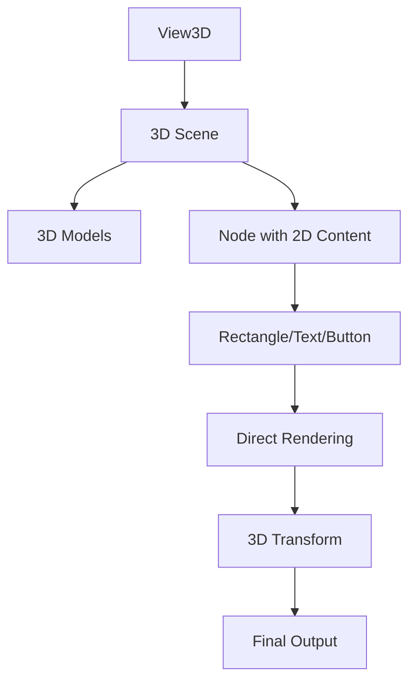

# 2D in 3D Integration - Direct Path

## 是什么

2D in 3D Integration - Direct Path（2D与3D集成 - 直接路径）是一种将 Qt Quick 2D 内容直接嵌入到 3D 场景中的技术。通过这种方式，2D UI 元素可以作为 3D 场景的一部分进行渲染，支持3D变换和交互。



直接路径方式将 2D Qt Quick 项直接放置在 3D 场景图中，这些 2D 元素会被当作 3D 对象处理，可以应用 3D 变换、参与深度测试，并支持鼠标和触摸交互。

## 常用属性一览表

### Node 相关属性（用于承载2D内容）

| 属性名 | 类型 | 默认值 | 取值范围 | 作用 | 性能/质量提示 |
| ------ | ---- | ------ | -------- | ---- | -------------- |
| position★ | vector3d | (0,0,0) | 3D坐标 | 2D内容在3D空间的位置 | 频繁修改会触发场景更新 |
| eulerRotation | vector3d | (0,0,0) | 角度值 | 2D内容的3D旋转 | 可创建倾斜的UI面板 |
| scale | vector3d | (1,1,1) | 缩放因子 | 2D内容的缩放 | 影响文本清晰度 |
| visible | bool | true | true/false | 可见性控制 | 隐藏可优化性能 |

### 2D Item 特殊考虑

| 属性名 | 类型 | 默认值 | 取值范围 | 作用 | 性能/质量提示 |
| ------ | ---- | ------ | -------- | ---- | -------------- |
| width★ | real | 0 | 像素值 | 2D内容宽度 | 影响3D空间中的实际大小 |
| height★ | real | 0 | 像素值 | 2D内容高度 | 影响3D空间中的实际大小 |
| z | real | 0 | 数值 | 2D层级顺序 | 在3D中通常使用position.z |

★ 标记表示高频使用属性

## 属性详解

### position★ (高频属性)

position 定义 2D 内容在 3D 空间中的位置，是实现 2D/3D 集成的核心属性。

**使用场景：**
- 在3D对象上方显示标签
- 创建浮动的UI面板
- 实现HUD（抬头显示）元素
- 在3D场景中放置交互按钮

**注意事项：**
- 坐标系与3D场景一致
- Z轴值影响深度测试和遮挡关系
- 可以使用动画实现平滑移动
- 需要考虑相机视角对可见性的影响

### width/height★ (高频属性)

width 和 height 定义 2D 内容的尺寸，在 3D 空间中这些值直接对应世界单位。

**使用场景：**
- 设置UI面板大小
- 控制文本显示区域
- 定义交互区域范围

**注意事项：**
- 1像素 ≈ 1个3D世界单位（默认情况）
- 大尺寸可能需要调整相机距离
- 文本清晰度受尺寸和距离影响
- 可以通过 scale 属性调整显示大小

### eulerRotation (高频属性)

eulerRotation 允许对 2D 内容应用 3D 旋转，创建倾斜或朝向特定方向的UI。

**使用场景：**
- 创建朝向相机的广告牌效果
- 倾斜的控制面板
- 跟随3D对象旋转的标签

**注意事项：**
- 旋转会影响交互区域的判定
- 过度旋转可能导致文本难以阅读
- 可以使用 lookAt 功能使UI始终面向相机

## 最小可运行示例

**文件树：**
```
project/
├── main.qml
├── main.cpp
└── CMakeLists.txt
```

**完整代码：**

main.qml:
```qml
import QtQuick
import QtQuick3D
import QtQuick.Controls

Window {
    width: 1280
    height: 720
    visible: true
    title: "2D in 3D Integration - Direct Path 示例"

    View3D {
        id: view3d
        anchors.fill: parent
        
        environment: SceneEnvironment {
            backgroundMode: SceneEnvironment.Color
            clearColor: "#1a1a2e"
            antialiasingMode: SceneEnvironment.MSAA
            antialiasingQuality: SceneEnvironment.High
        }
        
        // 相机
        PerspectiveCamera {
            id: camera
            position: Qt.vector3d(0, 100, 500)
            eulerRotation.x: -10
        }
        
        // 主光源
        DirectionalLight {
            eulerRotation.x: -45
            eulerRotation.y: 45
            brightness: 1.5
        }
        
        // 3D 模型
        Model {
            id: cube
            source: "#Cube"
            position: Qt.vector3d(0, 0, 0)
            scale: Qt.vector3d(1.5, 1.5, 1.5)
            
            materials: PrincipledMaterial {
                baseColor: "#4ecdc4"
                metalness: 0.5
                roughness: 0.3
            }
            
            SequentialAnimation on eulerRotation.y {
                loops: Animation.Infinite
                NumberAnimation { from: 0; to: 360; duration: 5000 }
            }
        }
        
        // 示例1: 简单的2D标签（直接嵌入）
        Node {
            position: Qt.vector3d(0, 150, 0)
            
            Rectangle {
                width: 200
                height: 60
                color: "#cc000000"
                radius: 10
                border.color: "#4ecdc4"
                border.width: 2
                
                // 居中对齐
                anchors.centerIn: parent
                
                Text {
                    anchors.centerIn: parent
                    text: "3D Cube"
                    color: "white"
                    font.pixelSize: 24
                    font.bold: true
                }
            }
        }
        
        // 示例2: 交互式2D按钮
        Node {
            id: buttonNode
            position: Qt.vector3d(-200, 0, 100)
            
            // 使按钮始终面向相机
            eulerRotation: Qt.vector3d(0, 0, 0)
            
            Rectangle {
                width: 150
                height: 50
                color: buttonArea.pressed ? "#ff6b6b" : "#ffe66d"
                radius: 8
                
                Text {
                    anchors.centerIn: parent
                    text: "Click Me!"
                    color: "#1a1a2e"
                    font.pixelSize: 18
                    font.bold: true
                }
                
                MouseArea {
                    id: buttonArea
                    anchors.fill: parent
                    onClicked: {
                        console.log("Button clicked in 3D space!")
                        clickAnimation.start()
                    }
                }
                
                SequentialAnimation {
                    id: clickAnimation
                    NumberAnimation {
                        target: buttonNode
                        property: "scale.x"
                        to: 1.2
                        duration: 100
                    }
                    NumberAnimation {
                        target: buttonNode
                        property: "scale.x"
                        to: 1.0
                        duration: 100
                    }
                }
            }
        }
        
        // 示例3: 信息面板（跟随3D对象）
        Node {
            position: Qt.vector3d(200, 50, 0)
            eulerRotation.y: -30
            
            Column {
                spacing: 10
                
                Rectangle {
                    width: 180
                    height: 120
                    color: "#cc16213e"
                    radius: 10
                    border.color: "#ffe66d"
                    border.width: 2
                    
                    Column {
                        anchors.fill: parent
                        anchors.margins: 15
                        spacing: 8
                        
                        Text {
                            text: "Object Info"
                            color: "#ffe66d"
                            font.pixelSize: 16
                            font.bold: true
                        }
                        
                        Text {
                            text: "Position: " + cube.position.x.toFixed(0) + ", " + 
                                  cube.position.y.toFixed(0) + ", " + 
                                  cube.position.z.toFixed(0)
                            color: "white"
                            font.pixelSize: 11
                        }
                        
                        Text {
                            text: "Rotation: " + cube.eulerRotation.y.toFixed(0) + "°"
                            color: "white"
                            font.pixelSize: 11
                        }
                        
                        Text {
                            text: "Scale: " + cube.scale.x.toFixed(2)
                            color: "white"
                            font.pixelSize: 11
                        }
                    }
                }
            }
        }
        
        // 示例4: 广告牌效果（始终面向相机）
        Node {
            id: billboard
            position: Qt.vector3d(0, -100, -100)
            
            // 计算朝向相机的旋转
            property vector3d directionToCamera: camera.position.minus(position)
            eulerRotation.y: Math.atan2(directionToCamera.x, directionToCamera.z) * 180 / Math.PI
            
            Rectangle {
                width: 250
                height: 80
                color: "#ccff6b6b"
                radius: 12
                
                Row {
                    anchors.centerIn: parent
                    spacing: 15
                    
                    Rectangle {
                        width: 50
                        height: 50
                        radius: 25
                        color: "#ffe66d"
                        
                        Text {
                            anchors.centerIn: parent
                            text: "!"
                            font.pixelSize: 32
                            font.bold: true
                            color: "#1a1a2e"
                        }
                    }
                    
                    Text {
                        text: "Billboard\nAlways Facing Camera"
                        color: "white"
                        font.pixelSize: 14
                        anchors.verticalCenter: parent.verticalCenter
                    }
                }
            }
        }
        
        // 地面
        Model {
            source: "#Rectangle"
            scale: Qt.vector3d(20, 20, 1)
            position.y: -100
            eulerRotation.x: -90
            materials: PrincipledMaterial {
                baseColor: "#0f3460"
                metalness: 0.1
                roughness: 0.9
            }
        }
    }
    
    // 2D 控制面板（覆盖在3D视图上）
    Rectangle {
        anchors.left: parent.left
        anchors.top: parent.top
        anchors.margins: 20
        width: 280
        height: 200
        color: "#cc000000"
        radius: 10
        
        Column {
            anchors.fill: parent
            anchors.margins: 15
            spacing: 12
            
            Text {
                text: "2D in 3D 集成"
                color: "white"
                font.pixelSize: 16
                font.bold: true
            }
            
            Text {
                text: "直接路径方式"
                color: "#4ecdc4"
                font.pixelSize: 14
            }
            
            Text {
                text: "特点："
                color: "#ffe66d"
                font.pixelSize: 12
            }
            
            Text {
                text: "• 2D元素直接嵌入3D场景\n• 支持3D变换和深度测试\n• 保持2D交互能力\n• 性能开销较小"
                color: "#aaaaaa"
                font.pixelSize: 11
                wrapMode: Text.WordWrap
                width: parent.width - 30
            }
        }
    }
}
```

CMakeLists.txt:
```cmake
cmake_minimum_required(VERSION 3.16)
project(Direct2Din3DExample VERSION 1.0 LANGUAGES CXX)

set(CMAKE_CXX_STANDARD 17)
set(CMAKE_CXX_STANDARD_REQUIRED ON)

find_package(Qt6 REQUIRED COMPONENTS Quick Quick3D)

qt_add_executable(Direct2Din3DExample
    main.cpp
)

qt_add_qml_module(Direct2Din3DExample
    URI Direct2Din3DExample
    VERSION 1.0
    QML_FILES main.qml
)

target_link_libraries(Direct2Din3DExample PRIVATE
    Qt6::Quick
    Qt6::Quick3D
)

set_target_properties(Direct2Din3DExample PROPERTIES
    WIN32_EXECUTABLE TRUE
    MACOSX_BUNDLE TRUE
)
```

main.cpp:
```cpp
#include <QGuiApplication>
#include <QQmlApplicationEngine>

int main(int argc, char *argv[])
{
    QGuiApplication app(argc, argv);
    QQmlApplicationEngine engine;
    
    const QUrl url(u"qrc:/Direct2Din3DExample/main.qml"_qs);
    engine.load(url);
    
    return app.exec();
}
```

## 常见问题与调试

### 1. 2D内容不可见

**可能原因：**
- 位置在相机视锥体外
- Z轴深度被其他对象遮挡
- 尺寸过小或过大
- 颜色与背景相同

**解决方案：**
```qml
Node {
    // 确保位置在相机可见范围内
    position: Qt.vector3d(0, 0, 0)
    
    Rectangle {
        // 设置合适的尺寸
        width: 200
        height: 100
        
        // 使用明显的颜色
        color: "red"
        border.color: "white"
        border.width: 2
        
        Text {
            anchors.centerIn: parent
            text: "Test"
            color: "white"
            font.pixelSize: 24
        }
    }
}
```

### 2. 交互不响应

**可能原因：**
- MouseArea 被3D对象遮挡
- 坐标转换问题
- 旋转导致交互区域偏移

**解决方案：**
```qml
Node {
    position: Qt.vector3d(0, 0, 100)
    
    Rectangle {
        width: 200
        height: 100
        color: "#80000000"
        
        MouseArea {
            anchors.fill: parent
            // 确保 MouseArea 覆盖整个区域
            onClicked: {
                console.log("Clicked at:", mouseX, mouseY)
            }
            
            // 调试：显示鼠标位置
            onPositionChanged: {
                console.log("Mouse:", mouseX, mouseY)
            }
        }
    }
}
```

### 3. 文本模糊

**可能原因：**
- 距离相机太远
- 缩放导致像素失真
- 抗锯齿设置不当

**解决方案：**
```qml
Node {
    position: Qt.vector3d(0, 0, 200)
    // 避免使用 scale，直接调整尺寸
    
    Rectangle {
        width: 300  // 使用较大的原始尺寸
        height: 100
        
        Text {
            anchors.centerIn: parent
            text: "Clear Text"
            font.pixelSize: 24  // 较大的字体
            color: "white"
            // 启用文本抗锯齿
            renderType: Text.NativeRendering
        }
    }
}

// 在 View3D 中启用抗锯齿
View3D {
    environment: SceneEnvironment {
        antialiasingMode: SceneEnvironment.MSAA
        antialiasingQuality: SceneEnvironment.High
    }
}
```

### 4. 深度排序问题

**可能原因：**
- 2D内容与3D对象的深度冲突
- 透明度导致的渲染顺序问题

**解决方案：**
```qml
Node {
    // 调整Z位置以避免深度冲突
    position: Qt.vector3d(0, 0, 100)
    
    Rectangle {
        width: 200
        height: 100
        // 使用半透明时注意渲染顺序
        color: "#cc000000"
        
        // 或使用完全不透明
        // color: "#000000"
    }
}
```

## 实战技巧

### 1. 创建HUD（抬头显示）

```qml
View3D {
    id: view3d
    
    // 3D场景内容...
    
    // HUD元素固定在屏幕空间
    Node {
        // 计算屏幕空间位置
        property vector3d screenPos: view3d.mapFrom3DScene(
            Qt.vector3d(0, 0, 0)
        )
        
        position: Qt.vector3d(screenPos.x, screenPos.y, 0)
        
        Rectangle {
            width: 100
            height: 30
            color: "#cc000000"
            
            Text {
                anchors.centerIn: parent
                text: "HUD"
                color: "white"
            }
        }
    }
}
```

### 2. 对象标签系统

```qml
Repeater3D {
    model: objectsModel
    
    Node {
        position: modelData.position
        
        // 3D对象
        Model {
            source: modelData.mesh
            materials: PrincipledMaterial { }
        }
        
        // 标签（位于对象上方）
        Node {
            position: Qt.vector3d(0, 100, 0)
            
            // 始终面向相机
            eulerRotation.y: calculateRotationToCamera()
            
            Rectangle {
                width: 120
                height: 40
                color: "#cc000000"
                radius: 5
                
                Text {
                    anchors.centerIn: parent
                    text: modelData.name
                    color: "white"
                    font.pixelSize: 14
                }
            }
        }
    }
}
```

### 3. 交互式控制面板

```qml
Node {
    id: controlPanel
    position: Qt.vector3d(300, 0, 0)
    eulerRotation.y: -45
    
    Rectangle {
        width: 250
        height: 300
        color: "#dd1a1a2e"
        radius: 10
        
        Column {
            anchors.fill: parent
            anchors.margins: 20
            spacing: 15
            
            Text {
                text: "Control Panel"
                color: "white"
                font.pixelSize: 18
                font.bold: true
            }
            
            Slider {
                width: parent.width
                from: 0
                to: 100
                value: 50
                onValueChanged: {
                    // 控制3D对象
                    targetObject.someProperty = value
                }
            }
            
            Button {
                text: "Action"
                onClicked: {
                    // 触发3D场景事件
                    targetObject.performAction()
                }
            }
            
            CheckBox {
                text: "Enable Feature"
                onCheckedChanged: {
                    targetObject.featureEnabled = checked
                }
            }
        }
    }
}
```

### 4. 动态信息显示

```qml
Node {
    id: infoDisplay
    position: targetObject.position
    
    // 跟随目标对象
    Connections {
        target: targetObject
        function onPositionChanged() {
            infoDisplay.position = Qt.vector3d(
                targetObject.position.x,
                targetObject.position.y + 150,
                targetObject.position.z
            )
        }
    }
    
    Rectangle {
        width: 200
        height: 80
        color: "#cc16213e"
        radius: 8
        
        Column {
            anchors.centerIn: parent
            spacing: 5
            
            Text {
                text: "Speed: " + targetObject.speed.toFixed(1)
                color: "#4ecdc4"
                font.pixelSize: 14
            }
            
            Text {
                text: "Health: " + targetObject.health + "%"
                color: targetObject.health > 50 ? "#4ecdc4" : "#ff6b6b"
                font.pixelSize: 14
            }
        }
    }
}
```

### 5. 广告牌优化

```qml
// 自定义广告牌组件
Component {
    id: billboardComponent
    
    Node {
        id: billboard
        
        property alias content: contentLoader.sourceComponent
        property bool alwaysFaceCamera: true
        
        // 高效的朝向计算
        property vector3d cameraDir: {
            if (!alwaysFaceCamera) return Qt.vector3d(0, 0, 0)
            
            let dir = camera.position.minus(position)
            return Qt.vector3d(
                0,
                Math.atan2(dir.x, dir.z) * 180 / Math.PI,
                0
            )
        }
        
        eulerRotation: cameraDir
        
        Loader {
            id: contentLoader
        }
    }
}

// 使用
Loader {
    sourceComponent: billboardComponent
    
    onLoaded: {
        item.position = Qt.vector3d(100, 50, 0)
        item.content = myContentComponent
    }
}
```

## 延伸阅读

- [Qt Quick 3D - Integrating 2D Content](https://doc.qt.io/qt-6/quick3d-2d.html)
- [2D-in-3D-Integration-Texture-Path.md](./2D-in-3D-Integration-Texture-Path.md) - 纹理路径集成
- [3D-in-2D-integration.md](./3D-in-2D-integration.md) - 3D与2D集成
- [View3D-renderMode.md](./View3D-renderMode.md) - 渲染模式文档
- [Qt Quick - Mouse and Touch Events](https://doc.qt.io/qt-6/qtquick-input-mouseevents.html)
