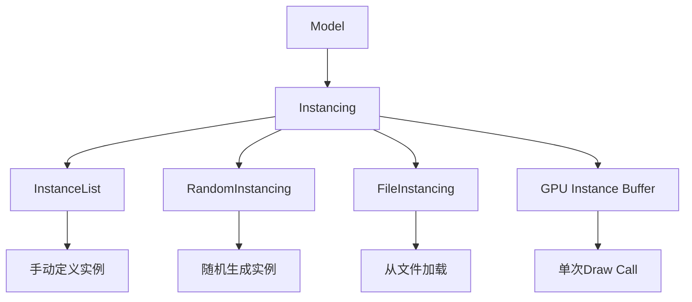

# Instanced Rendering

## 是什么

Instanced Rendering（实例化渲染）是一种高性能渲染技术，允许使用单次绘制调用渲染大量相同几何体的不同实例。在 Qt Quick 3D 中，通过 Instancing 组件实现，可以极大提升渲染大量重复对象的性能。



传统渲染每个对象需要一次绘制调用，而实例化渲染将所有实例的变换数据打包到GPU缓冲区，通过一次绘制调用完成所有实例的渲染，显著降低CPU开销。

## 常用属性一览表

| 属性名 | 类型 | 默认值 | 取值范围 | 作用 | 性能/质量提示 |
| ------ | ---- | ------ | -------- | ---- | -------------- |
| instancing★ | Instancing | null | Instancing对象 | 指定实例化数据源 | 核心属性，必须设置 |
| instanceRoot | Node | null | Node对象 | 实例化根节点 | 用于复杂层级结构 |
| depthBias | real | 0.0 | 数值 | 深度偏移 | 解决Z-fighting问题 |

### InstanceList 属性

| 属性名 | 类型 | 默认值 | 取值范围 | 作用 | 性能/质量提示 |
| ------ | ---- | ------ | -------- | ---- | -------------- |
| instances★ | list | [] | InstanceListEntry列表 | 实例数据列表 | 实例数量直接影响性能 |

### RandomInstancing 属性

| 属性名 | 类型 | 默认值 | 取值范围 | 作用 | 性能/质量提示 |
| ------ | ---- | ------ | -------- | ---- | -------------- |
| instanceCount★ | int | 0 | 正整数 | 实例数量 | 建议不超过10000 |
| randomSeed | int | -1 | 整数 | 随机种子 | -1为真随机 |
| position★ | Bounds | null | InstanceRange | 位置范围 | 定义实例分布区域 |
| scale | Bounds | null | InstanceRange | 缩放范围 | 变化范围影响视觉效果 |
| rotation | Bounds | null | InstanceRange | 旋转范围 | 欧拉角范围 |
| color | Bounds | null | InstanceRange | 颜色范围 | 需材质支持实例颜色 |

★ 标记表示高频使用属性

## 属性详解

### instancing★ (高频属性)

instancing 属性指定 Model 使用的实例化数据源，是启用实例化渲染的核心属性。

**使用场景：**
- 渲染大量树木、草地、石头等自然元素
- 粒子系统和特效
- 建筑群、城市场景
- 重复性装饰元素

**注意事项：**
- 必须设置此属性才能启用实例化渲染
- 所有实例共享相同的几何体和材质
- 实例数据在GPU端处理，CPU开销极小
- 支持三种数据源：InstanceList、RandomInstancing、FileInstancing

### instanceCount★ (RandomInstancing)

instanceCount 定义要生成的随机实例数量，是 RandomInstancing 的核心参数。

**使用场景：**
- 快速原型设计和测试
- 程序化生成场景元素
- 动态调整实例数量

**注意事项：**
- 实例数量与性能成正比，建议根据目标平台调整
- 移动设备建议不超过5000个实例
- 桌面设备可支持10000+实例
- 实例数量变化会触发GPU缓冲区重建

### position★ (RandomInstancing)

position 定义实例位置的随机分布范围，通过 InstanceRange 指定最小值和最大值。

**使用场景：**
- 在指定区域内随机分布对象
- 创建自然的散布效果
- 程序化地形装饰

**注意事项：**
- 范围过大会导致实例分布稀疏
- 配合相机视锥体裁剪优化性能
- 可以只在某些轴向上随机化

## 最小可运行示例

**文件树：**
```
project/
├── main.qml
└── CMakeLists.txt
```

**完整代码：**

main.qml:
```qml
import QtQuick
import QtQuick3D

Window {
    width: 1280
    height: 720
    visible: true
    title: "Instanced Rendering 实例化渲染示例"

    View3D {
        anchors.fill: parent
        
        environment: SceneEnvironment {
            backgroundMode: SceneEnvironment.SkyBox
            lightProbe: Texture {
                source: "qrc:/environment.hdr"
                mappingMode: Texture.LightProbe
            }
            antialiasingMode: SceneEnvironment.MSAA
            antialiasingQuality: SceneEnvironment.High
        }
        
        // 相机
        PerspectiveCamera {
            id: camera
            position: Qt.vector3d(0, 200, 500)
            eulerRotation.x: -20
            
            SequentialAnimation on position.x {
                loops: Animation.Infinite
                NumberAnimation { from: -300; to: 300; duration: 10000 }
                NumberAnimation { from: 300; to: -300; duration: 10000 }
            }
        }
        
        // 主光源
        DirectionalLight {
            eulerRotation.x: -45
            eulerRotation.y: 45
            brightness: 1.5
            castsShadow: true
        }
        
        // 示例1: RandomInstancing - 随机森林
        Model {
            source: "#Cone"
            instancing: RandomInstancing {
                instanceCount: 500
                randomSeed: 2024
                
                position: InstanceRange {
                    from: Qt.vector3d(-500, 0, -500)
                    to: Qt.vector3d(500, 0, 500)
                }
                
                scale: InstanceRange {
                    from: Qt.vector3d(0.5, 1.0, 0.5)
                    to: Qt.vector3d(1.5, 3.0, 1.5)
                }
                
                rotation: InstanceRange {
                    from: Qt.vector3d(0, 0, 0)
                    to: Qt.vector3d(0, 360, 0)
                }
                
                color: InstanceRange {
                    from: "#2d5016"
                    to: "#4a7c2c"
                }
            }
            
            materials: PrincipledMaterial {
                baseColor: "green"
                metalness: 0.0
                roughness: 0.8
            }
        }
        
        // 示例2: InstanceList - 精确控制
        Model {
            source: "#Cube"
            instancing: InstanceList {
                instances: [
                    InstanceListEntry {
                        position: Qt.vector3d(0, 50, 0)
                        scale: Qt.vector3d(2, 2, 2)
                        color: "red"
                    },
                    InstanceListEntry {
                        position: Qt.vector3d(100, 50, 0)
                        scale: Qt.vector3d(1.5, 1.5, 1.5)
                        eulerRotation: Qt.vector3d(0, 45, 0)
                        color: "blue"
                    },
                    InstanceListEntry {
                        position: Qt.vector3d(-100, 50, 0)
                        scale: Qt.vector3d(1.8, 1.8, 1.8)
                        eulerRotation: Qt.vector3d(0, -45, 0)
                        color: "yellow"
                    },
                    InstanceListEntry {
                        position: Qt.vector3d(0, 50, 100)
                        scale: Qt.vector3d(1.2, 1.2, 1.2)
                        eulerRotation: Qt.vector3d(45, 0, 0)
                        color: "cyan"
                    },
                    InstanceListEntry {
                        position: Qt.vector3d(0, 50, -100)
                        scale: Qt.vector3d(1.6, 1.6, 1.6)
                        eulerRotation: Qt.vector3d(-45, 0, 0)
                        color: "magenta"
                    }
                ]
            }
            
            materials: PrincipledMaterial {
                baseColor: "white"
                metalness: 0.5
                roughness: 0.3
            }
        }
        
        // 示例3: 动态实例化 - 粒子效果
        Model {
            source: "#Sphere"
            scale: Qt.vector3d(0.3, 0.3, 0.3)
            
            instancing: RandomInstancing {
                id: particles
                instanceCount: 1000
                randomSeed: Date.now()
                
                position: InstanceRange {
                    from: Qt.vector3d(-200, 100, -200)
                    to: Qt.vector3d(200, 300, 200)
                }
                
                scale: InstanceRange {
                    from: Qt.vector3d(0.5, 0.5, 0.5)
                    to: Qt.vector3d(1.5, 1.5, 1.5)
                }
                
                color: InstanceRange {
                    from: "#ff6b6b"
                    to: "#4ecdc4"
                }
            }
            
            materials: PrincipledMaterial {
                baseColor: "white"
                metalness: 0.8
                roughness: 0.2
                emissiveFactor: Qt.vector3d(0.5, 0.5, 0.5)
            }
            
            // 动画更新
            Timer {
                interval: 2000
                running: true
                repeat: true
                onTriggered: {
                    particles.randomSeed = Date.now()
                }
            }
        }
        
        // 地面
        Model {
            source: "#Rectangle"
            scale: Qt.vector3d(50, 50, 1)
            eulerRotation.x: -90
            materials: PrincipledMaterial {
                baseColor: "#3a3a3a"
                metalness: 0.0
                roughness: 0.9
            }
        }
    }
    
    // 性能统计
    Column {
        anchors.left: parent.left
        anchors.top: parent.top
        anchors.margins: 20
        spacing: 5
        
        Rectangle {
            width: 300
            height: 120
            color: "#cc000000"
            radius: 10
            
            Column {
                anchors.fill: parent
                anchors.margins: 15
                spacing: 8
                
                Text {
                    text: "实例化渲染统计"
                    color: "white"
                    font.pixelSize: 16
                    font.bold: true
                }
                
                Text {
                    text: "森林实例: 500"
                    color: "#4ecdc4"
                    font.pixelSize: 14
                }
                
                Text {
                    text: "立方体实例: 5"
                    color: "#4ecdc4"
                    font.pixelSize: 14
                }
                
                Text {
                    text: "粒子实例: 1000"
                    color: "#4ecdc4"
                    font.pixelSize: 14
                }
                
                Text {
                    text: "总计: 1505 个对象，仅3次绘制调用"
                    color: "#ffe66d"
                    font.pixelSize: 14
                    font.bold: true
                }
            }
        }
    }
}
```

CMakeLists.txt:
```cmake
cmake_minimum_required(VERSION 3.16)
project(InstancedRenderingExample VERSION 1.0 LANGUAGES CXX)

set(CMAKE_CXX_STANDARD 17)
set(CMAKE_CXX_STANDARD_REQUIRED ON)

find_package(Qt6 REQUIRED COMPONENTS Quick Quick3D)

qt_add_executable(InstancedRenderingExample
    main.cpp
)

qt_add_qml_module(InstancedRenderingExample
    URI InstancedRenderingExample
    VERSION 1.0
    QML_FILES main.qml
)

target_link_libraries(InstancedRenderingExample PRIVATE
    Qt6::Quick
    Qt6::Quick3D
)

set_target_properties(InstancedRenderingExample PROPERTIES
    WIN32_EXECUTABLE TRUE
    MACOSX_BUNDLE TRUE
)
```

main.cpp:
```cpp
#include <QGuiApplication>
#include <QQmlApplicationEngine>

int main(int argc, char *argv[])
{
    QGuiApplication app(argc, argv);
    QQmlApplicationEngine engine;
    
    const QUrl url(u"qrc:/InstancedRenderingExample/main.qml"_qs);
    engine.load(url);
    
    return app.exec();
}
```

## 常见问题与调试

### 1. 实例化不生效

**可能原因：**
- 未设置 instancing 属性
- Instancing 对象配置错误
- instanceCount 为0

**解决方案：**
```qml
Model {
    source: "#Cube"
    // 确保设置 instancing 属性
    instancing: RandomInstancing {
        instanceCount: 100  // 确保大于0
        position: InstanceRange {
            from: Qt.vector3d(-100, 0, -100)
            to: Qt.vector3d(100, 0, 100)
        }
    }
    materials: PrincipledMaterial { }
}
```

### 2. 性能没有提升

**可能原因：**
- 实例数量太少（<100）
- 每个实例使用不同的材质
- GPU瓶颈而非CPU瓶颈

**解决方案：**
- 实例化渲染在实例数量较大时才有明显优势
- 确保所有实例共享相同的材质
- 使用性能分析工具定位瓶颈

### 3. 实例颜色不显示

**可能原因：**
- 材质不支持实例颜色
- 未在 RandomInstancing 中设置 color 范围

**解决方案：**
```qml
Model {
    instancing: RandomInstancing {
        instanceCount: 100
        color: InstanceRange {
            from: "red"
            to: "blue"
        }
    }
    
    materials: PrincipledMaterial {
        // 材质会自动使用实例颜色
        baseColor: "white"
    }
}
```

### 4. 实例位置不正确

**解决方案：**
```qml
RandomInstancing {
    instanceCount: 100
    
    // 检查位置范围是否合理
    position: InstanceRange {
        from: Qt.vector3d(-100, 0, -100)
        to: Qt.vector3d(100, 0, 100)
    }
    
    // 使用固定种子以便调试
    randomSeed: 12345
}
```

## 实战技巧

### 1. 大规模森林场景

```qml
Model {
    source: "tree.mesh"
    instancing: RandomInstancing {
        instanceCount: 5000
        randomSeed: 2024
        
        position: InstanceRange {
            from: Qt.vector3d(-1000, 0, -1000)
            to: Qt.vector3d(1000, 0, 1000)
        }
        
        scale: InstanceRange {
            from: Qt.vector3d(0.8, 0.8, 0.8)
            to: Qt.vector3d(1.5, 1.5, 1.5)
            proportional: true  // 保持比例
        }
        
        rotation: InstanceRange {
            from: Qt.vector3d(0, 0, 0)
            to: Qt.vector3d(0, 360, 0)
        }
        
        color: InstanceRange {
            from: "#2d5016"
            to: "#5a9c3a"
        }
    }
    
    materials: PrincipledMaterial {
        baseColor: "green"
        roughness: 0.9
    }
}
```

### 2. 程序化城市建筑

```qml
Repeater3D {
    model: 3  // 不同类型的建筑
    
    Model {
        source: index === 0 ? "#Cube" : index === 1 ? "#Cylinder" : "#Cone"
        
        instancing: RandomInstancing {
            instanceCount: 200
            randomSeed: 1000 + index
            
            position: InstanceRange {
                from: Qt.vector3d(-500, 0, -500)
                to: Qt.vector3d(500, 0, 500)
            }
            
            scale: InstanceRange {
                from: Qt.vector3d(2, 5, 2)
                to: Qt.vector3d(5, 20, 5)
            }
            
            color: InstanceRange {
                from: "#808080"
                to: "#c0c0c0"
            }
        }
        
        materials: PrincipledMaterial {
            baseColor: "gray"
            metalness: 0.3
            roughness: 0.7
        }
    }
}
```

### 3. 精确控制的装饰元素

```qml
Model {
    source: "#Sphere"
    
    instancing: InstanceList {
        id: decorations
        
        // 使用 JavaScript 生成精确位置
        Component.onCompleted: {
            let instanceArray = []
            for (let i = 0; i < 10; i++) {
                for (let j = 0; j < 10; j++) {
                    instanceArray.push({
                        position: Qt.vector3d(i * 50 - 225, 0, j * 50 - 225),
                        scale: Qt.vector3d(1, 1, 1),
                        color: Qt.hsla((i + j) / 20, 0.8, 0.6, 1.0)
                    })
                }
            }
            instances = instanceArray
        }
    }
    
    materials: PrincipledMaterial {
        metalness: 0.9
        roughness: 0.1
    }
}
```

### 4. 性能优化配置

```qml
Model {
    source: "#Cube"
    
    // 关闭不必要的特性
    castsShadows: false
    receivesShadows: false
    
    instancing: RandomInstancing {
        // 根据平台调整实例数量
        instanceCount: Qt.platform.os === "android" ? 1000 : 5000
        
        position: InstanceRange {
            from: Qt.vector3d(-200, 0, -200)
            to: Qt.vector3d(200, 0, 200)
        }
    }
    
    materials: PrincipledMaterial {
        // 简化材质以提升性能
        baseColor: "white"
        metalness: 0.0
        roughness: 0.8
        // 避免使用复杂纹理
    }
}
```

## 延伸阅读

- [Qt Quick 3D - Instanced Rendering](https://doc.qt.io/qt-6/quick3d-instancing.html)
- [Repeater3D.md](./Repeater3D.md) - 3D重复器文档
- [Qt Quick 3D - Performance Optimization](https://doc.qt.io/qt-6/quick3d-asset-conditioning-3d-assets.html)
- [Model.md](./Model.md) - 模型组件文档
