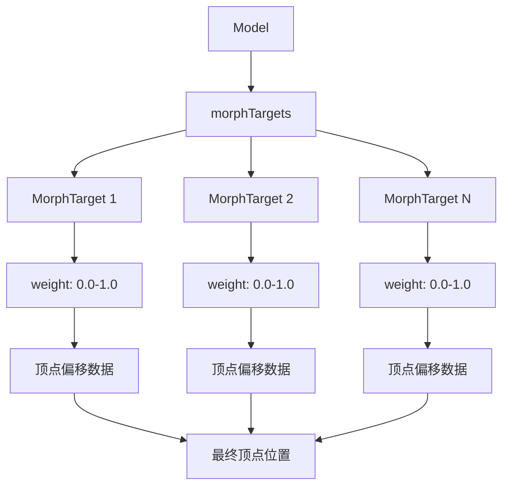

# Morphing Animation

## 是什么

Morphing Animation（变形动画/混合形状动画）是一种通过在多个预定义形状之间插值来实现模型变形的动画技术。在 Qt Quick 3D 中，通过 MorphTarget 实现，常用于面部表情、肌肉变形等需要平滑形状过渡的场景。



Morph Target（变形目标）存储相对于基础网格的顶点位置偏移，通过调整每个目标的权重（weight）值，可以混合多个变形效果，创造出复杂的动画。

## 常用属性一览表

### Model 相关属性

| 属性名 | 类型 | 默认值 | 取值范围 | 作用 | 性能/质量提示 |
| ------ | ---- | ------ | -------- | ---- | -------------- |
| morphTargets★ | list | [] | MorphTarget列表 | 变形目标列表 | 目标数量影响性能 |

### MorphTarget 属性

| 属性名 | 类型 | 默认值 | 取值范围 | 作用 | 性能/质量提示 |
| ------ | ---- | ------ | -------- | ---- | -------------- |
| weight★ | real | 0.0 | 0.0-1.0 | 变形权重 | 动画的核心参数 |
| attributes★ | int | Position | Position/Normal/Tangent | 变形属性类型 | 影响变形质量 |

★ 标记表示高频使用属性

## 属性详解

### morphTargets★ (高频属性)

morphTargets 是 Model 的属性，定义该模型可用的所有变形目标。每个变形目标代表一种特定的形状变化。

**使用场景：**
- 面部表情动画（微笑、皱眉、眨眼等）
- 肌肉变形（肌肉收缩、膨胀）
- 物体形变（气球充气、布料褶皱）
- 口型同步（语音动画）

**注意事项：**
- 变形目标必须与基础网格具有相同的顶点数量和拓扑结构
- 变形目标数量越多，GPU计算开销越大
- 建议不超过8-10个同时活跃的变形目标
- 变形数据通常在3D建模软件中创建（Blender、Maya等）

### weight★ (高频属性)

weight 控制单个变形目标的影响程度，是实现变形动画的核心参数。

**使用场景：**
- 0.0：不应用变形（基础形状）
- 0.5：应用50%的变形
- 1.0：完全应用变形
- 可以超过1.0实现夸张效果

**注意事项：**
- 权重值可以动画化以创建平滑过渡
- 多个变形目标可以同时具有非零权重
- 权重值的变化会触发顶点数据重新计算
- 使用 Easing 曲线可以创建更自然的动画

### attributes★ (高频属性)

attributes 指定变形目标影响的顶点属性类型，可以是位置、法线、切线或它们的组合。

**使用场景：**
- MorphTarget.Position：仅变形顶点位置（最常用）
- MorphTarget.Normal：同时变形法线（更好的光照效果）
- MorphTarget.Tangent：变形切线（用于法线贴图）
- 组合使用：Position | Normal | Tangent

**注意事项：**
- 仅变形位置性能最好，但光照可能不准确
- 包含法线变形可以获得更真实的光照效果
- 切线变形用于保持法线贴图的正确性
- 属性越多，GPU计算开销越大

## 最小可运行示例

**文件树：**
```
project/
├── main.qml
├── main.cpp
├── MorphCube.qml
└── CMakeLists.txt
```

**完整代码：**

main.qml:
```qml
import QtQuick
import QtQuick3D

Window {
    width: 1280
    height: 720
    visible: true
    title: "Morphing Animation 变形动画示例"

    View3D {
        anchors.fill: parent
        
        environment: SceneEnvironment {
            backgroundMode: SceneEnvironment.Color
            clearColor: "#1a1a2e"
            antialiasingMode: SceneEnvironment.MSAA
            antialiasingQuality: SceneEnvironment.High
        }
        
        // 相机
        PerspectiveCamera {
            position: Qt.vector3d(0, 0, 600)
        }
        
        // 主光源
        DirectionalLight {
            eulerRotation.x: -30
            eulerRotation.y: -45
            brightness: 1.5
        }
        
        // 辅助光源
        DirectionalLight {
            eulerRotation.x: 30
            eulerRotation.y: 135
            brightness: 0.5
            color: "#4ecdc4"
        }
        
        // 示例1: 简单立方体变形
        Model {
            id: morphCube
            position: Qt.vector3d(-200, 100, 0)
            
            geometry: MorphCubeGeometry {
                id: cubeGeometry
            }
            
            morphTargets: [
                MorphTarget {
                    id: sphereMorph
                    weight: 0
                    attributes: MorphTarget.Position | MorphTarget.Normal
                }
            ]
            
            materials: PrincipledMaterial {
                baseColor: "#ff6b6b"
                metalness: 0.3
                roughness: 0.5
            }
            
            // 循环变形动画
            SequentialAnimation on morphTargets {
                loops: Animation.Infinite
                PropertyAnimation {
                    target: sphereMorph
                    property: "weight"
                    from: 0.0
                    to: 1.0
                    duration: 2000
                    easing.type: Easing.InOutQuad
                }
                PropertyAnimation {
                    target: sphereMorph
                    property: "weight"
                    from: 1.0
                    to: 0.0
                    duration: 2000
                    easing.type: Easing.InOutQuad
                }
            }
        }
        
        // 示例2: 多目标混合
        Model {
            id: multiMorph
            position: Qt.vector3d(200, 100, 0)
            source: "#Cube"
            scale: Qt.vector3d(1.5, 1.5, 1.5)
            
            // 注意：实际项目中需要从3D软件导出的模型
            // 这里使用简化示例说明概念
            
            materials: PrincipledMaterial {
                baseColor: "#4ecdc4"
                metalness: 0.5
                roughness: 0.3
            }
        }
        
        // 示例3: 面部表情模拟
        Node {
            position: Qt.vector3d(0, -150, 0)
            
            Model {
                id: faceModel
                source: "#Sphere"
                scale: Qt.vector3d(1.5, 1.5, 1.5)
                
                materials: PrincipledMaterial {
                    baseColor: "#ffe66d"
                    metalness: 0.1
                    roughness: 0.7
                }
            }
            
            // 眼睛
            Model {
                source: "#Sphere"
                position: Qt.vector3d(-30, 20, 70)
                scale: Qt.vector3d(0.2, 0.2, 0.2)
                materials: PrincipledMaterial {
                    baseColor: "black"
                }
            }
            
            Model {
                source: "#Sphere"
                position: Qt.vector3d(30, 20, 70)
                scale: Qt.vector3d(0.2, 0.2, 0.2)
                materials: PrincipledMaterial {
                    baseColor: "black"
                }
            }
            
            // 嘴巴（使用缩放模拟表情变化）
            Model {
                id: mouth
                source: "#Sphere"
                position: Qt.vector3d(0, -30, 70)
                scale: Qt.vector3d(0.4, 0.1, 0.1)
                materials: PrincipledMaterial {
                    baseColor: "#ff6b6b"
                }
                
                // 微笑动画
                SequentialAnimation on scale.x {
                    loops: Animation.Infinite
                    NumberAnimation { from: 0.4; to: 0.6; duration: 1500 }
                    PauseAnimation { duration: 500 }
                    NumberAnimation { from: 0.6; to: 0.4; duration: 1500 }
                    PauseAnimation { duration: 500 }
                }
            }
        }
    }
    
    // 控制面板
    Column {
        anchors.right: parent.right
        anchors.top: parent.top
        anchors.margins: 20
        spacing: 10
        
        Rectangle {
            width: 280
            height: 200
            color: "#cc000000"
            radius: 10
            
            Column {
                anchors.fill: parent
                anchors.margins: 15
                spacing: 12
                
                Text {
                    text: "变形动画控制"
                    color: "white"
                    font.pixelSize: 16
                    font.bold: true
                }
                
                Text {
                    text: "立方体→球体变形"
                    color: "#ff6b6b"
                    font.pixelSize: 14
                }
                
                Row {
                    spacing: 10
                    Text {
                        text: "权重: " + sphereMorph.weight.toFixed(2)
                        color: "white"
                        width: 100
                    }
                    Slider {
                        width: 140
                        from: 0.0
                        to: 1.0
                        value: sphereMorph.weight
                        onValueChanged: sphereMorph.weight = value
                    }
                }
                
                Text {
                    text: "说明："
                    color: "#ffe66d"
                    font.pixelSize: 12
                }
                
                Text {
                    text: "• 权重0.0 = 立方体\n• 权重1.0 = 球体\n• 中间值 = 混合形状"
                    color: "#aaaaaa"
                    font.pixelSize: 11
                    wrapMode: Text.WordWrap
                    width: parent.width - 30
                }
            }
        }
    }
}
```

MorphCubeGeometry.qml:
```qml
import QtQuick
import QtQuick3D

// 自定义几何体，用于演示变形
Geometry {
    id: root
    
    property var positions: []
    property var normals: []
    property var indices: []
    
    Component.onCompleted: {
        // 创建立方体顶点数据
        // 这是简化示例，实际项目中使用3D软件导出的数据
        
        // 设置顶点属性
        root.addAttribute(Geometry.Attribute.PositionSemantic,
                         Geometry.Attribute.F32Type,
                         3)
        root.addAttribute(Geometry.Attribute.NormalSemantic,
                         Geometry.Attribute.F32Type,
                         3)
        
        // 设置索引属性
        root.addAttribute(Geometry.Attribute.IndexSemantic,
                         Geometry.Attribute.U16Type,
                         1)
        
        // 生成立方体数据
        generateCubeData()
        
        // 更新几何体
        root.update()
    }
    
    function generateCubeData() {
        // 简化的立方体顶点数据
        // 实际应用中应该从3D模型文件加载
    }
}
```

CMakeLists.txt:
```cmake
cmake_minimum_required(VERSION 3.16)
project(MorphingAnimationExample VERSION 1.0 LANGUAGES CXX)

set(CMAKE_CXX_STANDARD 17)
set(CMAKE_CXX_STANDARD_REQUIRED ON)

find_package(Qt6 REQUIRED COMPONENTS Quick Quick3D)

qt_add_executable(MorphingAnimationExample
    main.cpp
)

qt_add_qml_module(MorphingAnimationExample
    URI MorphingAnimationExample
    VERSION 1.0
    QML_FILES 
        main.qml
        MorphCubeGeometry.qml
)

target_link_libraries(MorphingAnimationExample PRIVATE
    Qt6::Quick
    Qt6::Quick3D
)

set_target_properties(MorphingAnimationExample PROPERTIES
    WIN32_EXECUTABLE TRUE
    MACOSX_BUNDLE TRUE
)
```

main.cpp:
```cpp
#include <QGuiApplication>
#include <QQmlApplicationEngine>

int main(int argc, char *argv[])
{
    QGuiApplication app(argc, argv);
    QQmlApplicationEngine engine;
    
    const QUrl url(u"qrc:/MorphingAnimationExample/main.qml"_qs);
    engine.load(url);
    
    return app.exec();
}
```

## 常见问题与调试

### 1. 变形不生效

**可能原因：**
- 变形目标数据未正确加载
- 权重值为0
- 变形目标与基础网格顶点数不匹配

**解决方案：**
```qml
Model {
    source: "model.mesh"  // 确保模型包含变形目标数据
    
    morphTargets: [
        MorphTarget {
            weight: 0.5  // 设置非零权重以查看效果
            attributes: MorphTarget.Position | MorphTarget.Normal
        }
    ]
    
    // 调试：打印变形目标信息
    Component.onCompleted: {
        console.log("Morph targets count:", morphTargets.length)
    }
}
```

### 2. 变形后光照不正确

**可能原因：**
- 仅变形了位置，未变形法线
- 法线数据未正确计算

**解决方案：**
```qml
MorphTarget {
    weight: 1.0
    // 包含法线变形以获得正确光照
    attributes: MorphTarget.Position | MorphTarget.Normal
}
```

### 3. 性能问题

**可能原因：**
- 变形目标数量过多
- 顶点数量过大
- 频繁更新权重值

**优化建议：**
```qml
Model {
    // 限制活跃的变形目标数量
    morphTargets: [
        MorphTarget { weight: smile },
        MorphTarget { weight: blink },
        // 最多8-10个
    ]
    
    // 使用动画而非实时更新
    NumberAnimation on morphTargets[0].weight {
        duration: 1000
        easing.type: Easing.InOutQuad
    }
}
```

### 4. 变形目标创建

**在 Blender 中创建变形目标：**

1. 选择基础网格
2. 进入编辑模式，修改顶点位置创建目标形状
3. 添加 Shape Key（形状键）
4. 导出为 glTF/FBX 格式
5. 使用 Balsam 工具转换为 .mesh 格式

```bash
# 使用 Balsam 转换模型
balsam model_with_morphs.gltf
```

## 实战技巧

### 1. 面部表情系统

```qml
Model {
    source: "character_head.mesh"
    
    property real smileAmount: 0.0
    property real blinkAmount: 0.0
    property real surpriseAmount: 0.0
    
    morphTargets: [
        MorphTarget {
            id: smileMorph
            weight: smileAmount
            attributes: MorphTarget.Position | MorphTarget.Normal
        },
        MorphTarget {
            id: blinkMorph
            weight: blinkAmount
            attributes: MorphTarget.Position | MorphTarget.Normal
        },
        MorphTarget {
            id: surpriseMorph
            weight: surpriseAmount
            attributes: MorphTarget.Position | MorphTarget.Normal
        }
    ]
    
    // 表情动画函数
    function playSmile() {
        smileAnimation.start()
    }
    
    NumberAnimation {
        id: smileAnimation
        target: parent
        property: "smileAmount"
        from: 0.0
        to: 1.0
        duration: 500
        easing.type: Easing.OutQuad
    }
}
```

### 2. 口型同步

```qml
Model {
    source: "character_head.mesh"
    
    // 音素对应的变形目标
    morphTargets: [
        MorphTarget { id: visemeA; weight: 0 },  // "ah"
        MorphTarget { id: visemeE; weight: 0 },  // "eh"
        MorphTarget { id: visemeI; weight: 0 },  // "ee"
        MorphTarget { id: visemeO; weight: 0 },  // "oh"
        MorphTarget { id: visemeU; weight: 0 }   // "oo"
    ]
    
    // 根据音频数据设置权重
    function setViseme(phoneme, weight) {
        // 重置所有权重
        visemeA.weight = 0
        visemeE.weight = 0
        visemeI.weight = 0
        visemeO.weight = 0
        visemeU.weight = 0
        
        // 设置当前音素
        switch(phoneme) {
            case "A": visemeA.weight = weight; break
            case "E": visemeE.weight = weight; break
            case "I": visemeI.weight = weight; break
            case "O": visemeO.weight = weight; break
            case "U": visemeU.weight = weight; break
        }
    }
}
```

### 3. 肌肉变形

```qml
Model {
    source: "character_arm.mesh"
    
    morphTargets: [
        MorphTarget {
            id: muscleFlex
            weight: 0
            attributes: MorphTarget.Position | MorphTarget.Normal
        }
    ]
    
    // 根据动作强度调整肌肉
    property real actionIntensity: 0.0
    
    Behavior on actionIntensity {
        NumberAnimation {
            duration: 200
            easing.type: Easing.OutQuad
        }
    }
    
    Binding {
        target: muscleFlex
        property: "weight"
        value: actionIntensity
    }
}
```

### 4. 组合多个变形效果

```qml
Model {
    source: "character.mesh"
    
    // 多个变形目标可以同时生效
    morphTargets: [
        MorphTarget { weight: 0.7 },  // 70% 微笑
        MorphTarget { weight: 0.3 },  // 30% 惊讶
        MorphTarget { weight: 1.0 }   // 100% 眨眼
    ]
    
    // 权重总和可以超过1.0
    // 最终效果是所有变形的叠加
}
```

## 延伸阅读

- [Qt Quick 3D - Morphing Animation](https://doc.qt.io/qt-6/quick3d-morphing.html)
- [Animation.md](./Animation.md) - 动画系统文档
- [Skeletal-Animation.md](./Skeletal-Animation.md) - 骨骼动画文档
- [Model.md](./Model.md) - 模型组件文档
- [Blender Shape Keys Documentation](https://docs.blender.org/manual/en/latest/animation/shape_keys/index.html)
