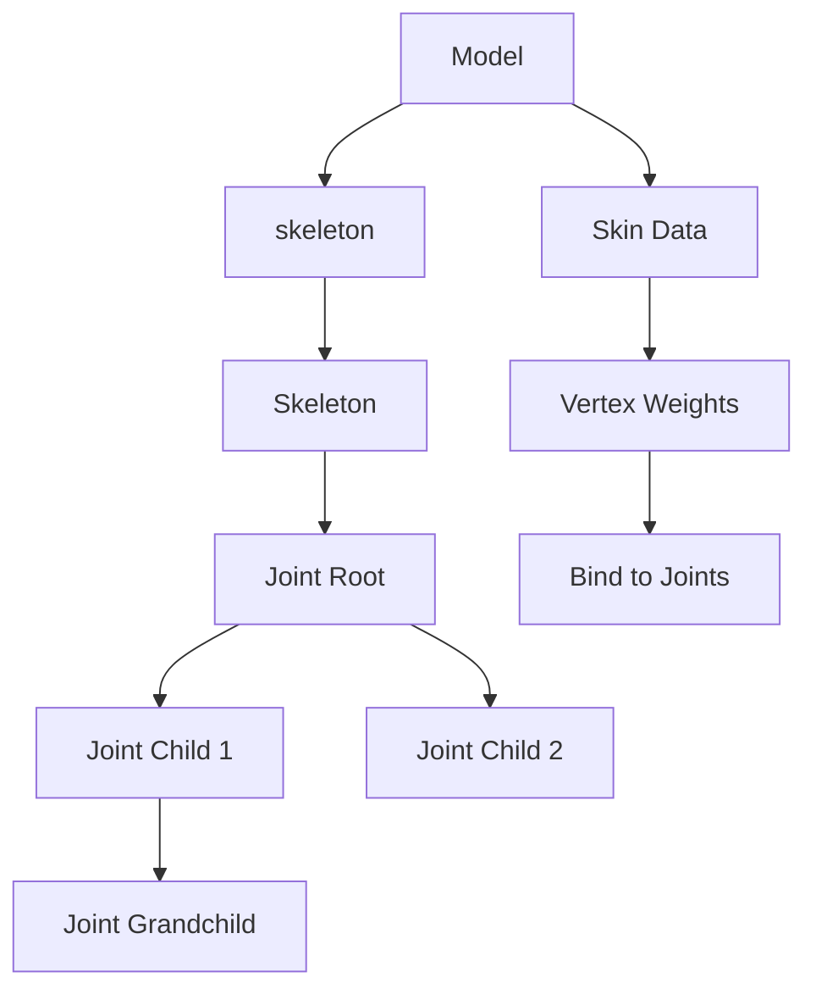

# Skeletal Animation

## 是什么

Skeletal Animation（骨骼动画）是一种通过骨骼层级结构驱动3D模型变形的动画技术。在 Qt Quick 3D 中，骨骼动画通过 Skeleton、Joint 和蒙皮权重实现，是创建角色动画的标准方法。



骨骼动画通过移动、旋转骨骼节点（Joint），利用蒙皮权重将骨骼变换传递到网格顶点，实现平滑的角色动画效果。

## 常用属性一览表

### Model 相关属性

| 属性名 | 类型 | 默认值 | 取值范围 | 作用 | 性能/质量提示 |
| ------ | ---- | ------ | -------- | ---- | -------------- |
| skeleton★ | Skeleton | null | Skeleton对象 | 骨骼系统 | 必须设置才能播放骨骼动画 |
| skin | Skin | null | Skin对象 | 蒙皮数据 | 通常从模型文件自动加载 |

### Skeleton 属性

| 属性名 | 类型 | 默认值 | 取值范围 | 作用 | 性能/质量提示 |
| ------ | ---- | ------ | -------- | ---- | -------------- |
| joints★ | list | [] | Joint列表 | 骨骼节点列表 | 骨骼数量影响性能 |

### Joint 属性

| 属性名 | 类型 | 默认值 | 取值范围 | 作用 | 性能/质量提示 |
| ------ | ---- | ------ | -------- | ---- | -------------- |
| index★ | int | -1 | 整数 | 骨骼索引 | 用于蒙皮绑定 |
| skeletonRoot | Joint | null | Joint对象 | 骨骼根节点 | 定义层级关系 |

★ 标记表示高频使用属性

## 属性详解

### skeleton★ (高频属性)

skeleton 属性将骨骼系统绑定到模型，是启用骨骼动画的核心属性。

**使用场景：**
- 角色动画（行走、跑步、跳跃）
- 生物动画（动物运动）
- 机械动画（机器人关节）
- 布料模拟（骨骼驱动）

**注意事项：**
- 骨骼系统必须与模型的蒙皮数据匹配
- 骨骼层级结构在3D软件中定义
- 支持从 glTF、FBX 等格式导入
- 骨骼数量建议不超过100个以保证性能

### joints★ (高频属性)

joints 定义骨骼系统中的所有骨骼节点，形成层级结构。

**使用场景：**
- 定义角色骨骼层级
- 程序化创建骨骼系统
- 动态修改骨骼结构

**注意事项：**
- 骨骼顺序必须与蒙皮数据中的索引对应
- 父子关系通过 Node 的层级结构定义
- 每个 Joint 需要唯一的 index 值
- 骨骼变换会影响所有子骨骼

### index★ (Joint 属性)

index 是 Joint 的唯一标识符，用于将骨骼与蒙皮权重数据关联。

**使用场景：**
- 蒙皮绑定
- 动画数据映射
- 骨骼查找和控制

**注意事项：**
- 索引值必须与模型的蒙皮数据匹配
- 通常从0开始连续编号
- 不同骨骼不能使用相同索引
- 索引值在模型导入时自动设置

## 最小可运行示例

**文件树：**
```
project/
├── main.qml
├── main.cpp
├── assets/
│   └── character.mesh
└── CMakeLists.txt
```

**完整代码：**

main.qml:
```qml
import QtQuick
import QtQuick3D

Window {
    width: 1280
    height: 720
    visible: true
    title: "Skeletal Animation 骨骼动画示例"

    View3D {
        anchors.fill: parent
        
        environment: SceneEnvironment {
            backgroundMode: SceneEnvironment.Color
            clearColor: "#16213e"
            antialiasingMode: SceneEnvironment.MSAA
            antialiasingQuality: SceneEnvironment.High
        }
        
        // 相机
        PerspectiveCamera {
            position: Qt.vector3d(0, 100, 300)
            eulerRotation.x: -10
        }
        
        // 主光源
        DirectionalLight {
            eulerRotation.x: -45
            eulerRotation.y: 45
            brightness: 1.5
            castsShadow: true
        }
        
        // 辅助光源
        DirectionalLight {
            eulerRotation.x: 30
            eulerRotation.y: -135
            brightness: 0.5
            color: "#4ecdc4"
        }
        
        // 示例1: 简单骨骼动画（程序化创建）
        Model {
            id: simpleCharacter
            position: Qt.vector3d(-150, 0, 0)
            source: "#Cylinder"
            scale: Qt.vector3d(0.3, 2, 0.3)
            
            // 简化的骨骼系统
            skeleton: Skeleton {
                id: simpleSkeleton
                
                Joint {
                    id: rootJoint
                    index: 0
                    eulerRotation.z: 0
                    
                    Joint {
                        id: midJoint
                        index: 1
                        y: 100
                        eulerRotation.z: 0
                        
                        Joint {
                            id: topJoint
                            index: 2
                            y: 100
                            eulerRotation.z: 0
                        }
                    }
                }
            }
            
            materials: PrincipledMaterial {
                baseColor: "#ff6b6b"
                metalness: 0.3
                roughness: 0.5
            }
            
            // 摆动动画
            SequentialAnimation on skeleton {
                loops: Animation.Infinite
                PropertyAnimation {
                    target: midJoint
                    property: "eulerRotation.z"
                    from: -30
                    to: 30
                    duration: 1500
                    easing.type: Easing.InOutQuad
                }
                PropertyAnimation {
                    target: midJoint
                    property: "eulerRotation.z"
                    from: 30
                    to: -30
                    duration: 1500
                    easing.type: Easing.InOutQuad
                }
            }
        }
        
        // 示例2: 从文件加载的角色动画
        Model {
            id: character
            position: Qt.vector3d(150, 0, 0)
            // 实际项目中使用带骨骼动画的模型文件
            source: "#Cube"  // 替换为 "character.mesh"
            scale: Qt.vector3d(1, 2, 0.5)
            
            materials: PrincipledMaterial {
                baseColor: "#4ecdc4"
                metalness: 0.5
                roughness: 0.3
            }
            
            // 旋转动画模拟
            SequentialAnimation on eulerRotation.y {
                loops: Animation.Infinite
                NumberAnimation { from: 0; to: 360; duration: 4000 }
            }
        }
        
        // 地面
        Model {
            source: "#Rectangle"
            scale: Qt.vector3d(20, 20, 1)
            eulerRotation.x: -90
            materials: PrincipledMaterial {
                baseColor: "#0f3460"
                metalness: 0.1
                roughness: 0.9
            }
        }
    }
    
    // 控制面板
    Column {
        anchors.right: parent.right
        anchors.top: parent.top
        anchors.margins: 20
        spacing: 10
        
        Rectangle {
            width: 300
            height: 250
            color: "#cc000000"
            radius: 10
            
            Column {
                anchors.fill: parent
                anchors.margins: 15
                spacing: 12
                
                Text {
                    text: "骨骼动画控制"
                    color: "white"
                    font.pixelSize: 16
                    font.bold: true
                }
                
                Text {
                    text: "简单骨骼系统"
                    color: "#ff6b6b"
                    font.pixelSize: 14
                }
                
                Row {
                    spacing: 10
                    Text {
                        text: "中间关节: " + midJoint.eulerRotation.z.toFixed(0) + "°"
                        color: "white"
                        width: 140
                    }
                    Slider {
                        width: 120
                        from: -90
                        to: 90
                        value: midJoint.eulerRotation.z
                        onValueChanged: midJoint.eulerRotation.z = value
                    }
                }
                
                Row {
                    spacing: 10
                    Text {
                        text: "顶部关节: " + topJoint.eulerRotation.z.toFixed(0) + "°"
                        color: "white"
                        width: 140
                    }
                    Slider {
                        width: 120
                        from: -90
                        to: 90
                        value: topJoint.eulerRotation.z
                        onValueChanged: topJoint.eulerRotation.z = value
                    }
                }
                
                Text {
                    text: "说明："
                    color: "#ffe66d"
                    font.pixelSize: 12
                }
                
                Text {
                    text: "• 骨骼层级：根→中→顶\n• 子骨骼继承父骨骼变换\n• 实际项目使用3D软件创建"
                    color: "#aaaaaa"
                    font.pixelSize: 11
                    wrapMode: Text.WordWrap
                    width: parent.width - 30
                }
            }
        }
    }
}
```

CMakeLists.txt:
```cmake
cmake_minimum_required(VERSION 3.16)
project(SkeletalAnimationExample VERSION 1.0 LANGUAGES CXX)

set(CMAKE_CXX_STANDARD 17)
set(CMAKE_CXX_STANDARD_REQUIRED ON)

find_package(Qt6 REQUIRED COMPONENTS Quick Quick3D)

qt_add_executable(SkeletalAnimationExample
    main.cpp
)

qt_add_qml_module(SkeletalAnimationExample
    URI SkeletalAnimationExample
    VERSION 1.0
    QML_FILES main.qml
    RESOURCES assets/character.mesh
)

target_link_libraries(SkeletalAnimationExample PRIVATE
    Qt6::Quick
    Qt6::Quick3D
)

set_target_properties(SkeletalAnimationExample PROPERTIES
    WIN32_EXECUTABLE TRUE
    MACOSX_BUNDLE TRUE
)
```

main.cpp:
```cpp
#include <QGuiApplication>
#include <QQmlApplicationEngine>

int main(int argc, char *argv[])
{
    QGuiApplication app(argc, argv);
    QQmlApplicationEngine engine;
    
    const QUrl url(u"qrc:/SkeletalAnimationExample/main.qml"_qs);
    engine.load(url);
    
    return app.exec();
}
```

## 常见问题与调试

### 1. 骨骼动画不播放

**可能原因：**
- 未设置 skeleton 属性
- 骨骼索引与蒙皮数据不匹配
- 模型文件不包含骨骼数据

**解决方案：**
```qml
Model {
    source: "character.mesh"
    
    // 确保设置骨骼系统
    skeleton: Skeleton {
        id: characterSkeleton
    }
    
    // 检查骨骼是否正确加载
    Component.onCompleted: {
        console.log("Skeleton joints:", skeleton.joints.length)
    }
}
```

### 2. 模型变形异常

**可能原因：**
- 蒙皮权重数据错误
- 骨骼层级结构不正确
- 骨骼索引重复或缺失

**解决方案：**
- 在3D软件中检查蒙皮绑定
- 确保每个顶点至少绑定到一个骨骼
- 验证骨骼索引的唯一性和连续性
- 重新导出模型并使用 Balsam 转换

### 3. 性能问题

**可能原因：**
- 骨骼数量过多
- 蒙皮权重计算复杂
- 多个角色同时播放动画

**优化建议：**
```qml
Model {
    source: "character.mesh"
    
    // 限制骨骼数量（建议<100）
    skeleton: Skeleton {
        // 移除不必要的辅助骨骼
    }
    
    // 降低模型复杂度
    // 使用LOD系统
    // 限制同屏角色数量
}
```

### 4. 动画导入问题

**在 Blender 中准备骨骼动画：**

1. 创建骨架（Armature）
2. 绑定网格到骨架（Skinning）
3. 创建动画关键帧
4. 导出为 glTF 2.0 格式（推荐）
5. 使用 Balsam 转换

```bash
# 转换带骨骼动画的模型
balsam character_animated.gltf
```

## 实战技巧

### 1. 角色行走动画

```qml
Model {
    source: "character.mesh"
    
    skeleton: Skeleton {
        id: walkSkeleton
    }
    
    // 循环播放行走动画
    Timeline {
        id: walkTimeline
        startFrame: 0
        endFrame: 30
        currentFrame: 0
        enabled: true
        
        animations: [
            TimelineAnimation {
                duration: 1000
                from: 0
                to: 30
                loops: Animation.Infinite
                running: true
            }
        ]
        
        KeyframeGroup {
            target: walkSkeleton.joints[1]  // 左腿
            property: "eulerRotation.x"
            
            Keyframe { frame: 0; value: -30 }
            Keyframe { frame: 15; value: 30 }
            Keyframe { frame: 30; value: -30 }
        }
        
        KeyframeGroup {
            target: walkSkeleton.joints[2]  // 右腿
            property: "eulerRotation.x"
            
            Keyframe { frame: 0; value: 30 }
            Keyframe { frame: 15; value: -30 }
            Keyframe { frame: 30; value: 30 }
        }
    }
}
```

### 2. 动画混合

```qml
Model {
    source: "character.mesh"
    
    property real walkWeight: 0.7
    property real runWeight: 0.3
    
    // 混合多个动画
    // 实际实现需要自定义动画系统
    
    function blendAnimations(anim1, anim2, weight) {
        // 在C++端实现动画混合逻辑
        // 或使用Qt Quick 3D的动画系统
    }
}
```

### 3. IK（反向运动学）模拟

```qml
Model {
    source: "character.mesh"
    
    skeleton: Skeleton {
        Joint {
            id: shoulder
            index: 0
            
            Joint {
                id: elbow
                index: 1
                y: 50
                
                Joint {
                    id: hand
                    index: 2
                    y: 50
                }
            }
        }
    }
    
    // 简单的IK目标跟踪
    property vector3d ikTarget: Qt.vector3d(100, 100, 0)
    
    function updateIK() {
        // 计算关节角度以使手部到达目标位置
        // 实际IK算法较复杂，建议使用专业库
    }
}
```

### 4. 骨骼附件系统

```qml
Model {
    id: character
    source: "character.mesh"
    
    skeleton: Skeleton {
        id: characterSkeleton
        
        Joint {
            id: handJoint
            index: 10
            
            // 附加武器到手部骨骼
            Model {
                source: "sword.mesh"
                position: Qt.vector3d(0, 0, 0)
                eulerRotation: Qt.vector3d(0, 0, 90)
                
                materials: PrincipledMaterial {
                    baseColor: "silver"
                    metalness: 0.9
                    roughness: 0.2
                }
            }
        }
    }
}
```

### 5. 动画事件系统

```qml
Model {
    source: "character.mesh"
    
    property int currentFrame: 0
    
    onCurrentFrameChanged: {
        // 在特定帧触发事件
        if (currentFrame === 10) {
            // 播放脚步声
            footstepSound.play()
        }
        if (currentFrame === 20) {
            // 触发特效
            dustEffect.trigger()
        }
    }
}
```

## 延伸阅读

- [Qt Quick 3D - Skeletal Animation](https://doc.qt.io/qt-6/quick3d-asset-conditioning-skeletal-animation.html)
- [Animation.md](./Animation.md) - 动画系统文档
- [Morphing-Animation.md](./Morphing-Animation.md) - 变形动画文档
- [Model.md](./Model.md) - 模型组件文档
- [Balsam-Asset-Import-Tool.md](./Balsam-Asset-Import-Tool.md) - 资源导入工具
- [Blender Rigging Documentation](https://docs.blender.org/manual/en/latest/animation/armatures/index.html)
