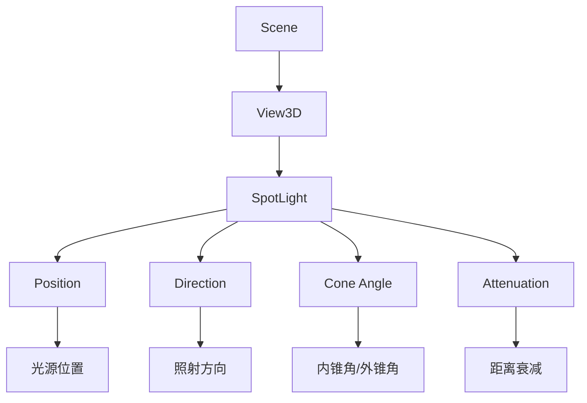

# SpotLight

## 是什么

SpotLight（聚光灯）是 Qt Quick 3D 中的锥形光源组件，模拟现实世界中的聚光灯效果。它从一个点向特定方向发射光线，形成圆锥形的照明区域，适合创建戏剧性照明、舞台效果或局部重点照明。



SpotLight 结合了 PointLight 的位置特性和 DirectionalLight 的方向特性，通过锥角参数控制光照范围，是创建聚焦照明效果的理想选择。

## 常用属性一览表

| 属性名 | 类型 | 默认值 | 取值范围 | 作用 | 性能/质量提示 |
| ------ | ---- | ------ | -------- | ---- | -------------- |
| coneAngle★ | real | 40.0 | 0.0-180.0 | 外锥角度（度） | 角度越大，影响范围越广，性能消耗越高 |
| innerConeAngle★ | real | 30.0 | 0.0-180.0 | 内锥角度（度） | 控制光照过渡区域，影响边缘柔和度 |
| brightness★ | real | 1.0 | 0.0-∞ | 光照强度 | 过高值可能导致过曝 |
| color | color | white | 颜色值 | 光源颜色 | 彩色光影响材质颜色混合 |
| position | vector3d | (0,0,0) | 3D坐标 | 光源位置 | 频繁修改会触发场景更新 |
| eulerRotation | vector3d | (0,0,0) | 角度值 | 光照方向 | 控制聚光灯朝向 |
| constantFade | real | 1.0 | 0.0-∞ | 常数衰减因子 | 影响整体亮度 |
| linearFade | real | 0.0 | 0.0-∞ | 线性衰减因子 | 距离衰减速率 |
| quadraticFade | real | 1.0 | 0.0-∞ | 二次衰减因子 | 物理真实的衰减模式 |
| castsShadow | bool | false | true/false | 是否投射阴影 | 开启会显著增加渲染开销 |
| shadowBias | real | 0.0 | -1.0-1.0 | 阴影偏移 | 解决阴影失真问题 |
| shadowFactor | real | 5.0 | 0.0-100.0 | 阴影柔和度 | 值越大阴影边缘越柔和 |
| shadowMapQuality | enum | Medium | Low/Medium/High/VeryHigh | 阴影贴图质量 | 高质量消耗更多显存和性能 |

★ 标记表示高频使用属性

## 属性详解

### coneAngle★ (高频属性)

coneAngle 定义聚光灯的外锥角，决定光照的最大覆盖范围。这是聚光灯最重要的特征属性。

**使用场景：**
- 舞台聚光灯效果（15-30度）
- 手电筒照明（30-60度）
- 室内筒灯（60-90度）
- 泛光照明（90-120度）

**注意事项：**
- 必须大于或等于 innerConeAngle
- 角度越大，受影响的物体越多，性能消耗越高
- 超过90度时接近半球照明，考虑使用 PointLight
- 配合 innerConeAngle 创建柔和的边缘过渡

### innerConeAngle★ (高频属性)

innerConeAngle 定义聚光灯的内锥角，在内锥角范围内光照强度保持最大值，内外锥角之间形成渐变过渡区域。

**使用场景：**
- 创建柔和的光照边缘
- 模拟真实聚光灯的光晕效果
- 控制光照的聚焦程度

**注意事项：**
- 必须小于或等于 coneAngle
- 两个角度差值越大，边缘过渡越柔和
- 差值为0时，边缘会非常锐利
- 典型设置：innerConeAngle = coneAngle * 0.7-0.9

### brightness★ (高频属性)

brightness 控制聚光灯的发光强度，直接影响照明效果的明暗程度。

**使用场景：**
- 调整场景整体亮度
- 创建明暗对比效果
- 模拟不同功率的光源
- 动画效果（闪烁、渐变）

**注意事项：**
- 默认值1.0适合大多数场景
- 过高值（>5.0）可能导致过曝和颜色失真
- 配合衰减参数使用以获得真实效果
- HDR场景中可以使用更高的值

### 衰减属性组 (constantFade, linearFade, quadraticFade)

这三个属性共同控制光照随距离的衰减方式，公式为：
```
attenuation = 1.0 / (constantFade + linearFade * d + quadraticFade * d²)
```
其中 d 是距离光源的距离。

**使用场景：**
- 物理真实照明：quadraticFade = 1.0, 其他为0
- 艺术化照明：调整三个参数创建特殊效果
- 扩大照明范围：降低 quadraticFade 值

**注意事项：**
- 默认设置（constantFade=1.0, quadraticFade=1.0）提供物理真实的衰减
- 全部设为0会导致无限亮度
- linearFade 通常保持为0，除非需要特殊效果

## 最小可运行示例

**文件树：**
```
project/
├── main.qml
└── CMakeLists.txt
```

**完整代码：**

main.qml:
```qml
import QtQuick
import QtQuick3D

Window {
    width: 1280
    height: 720
    visible: true
    title: "SpotLight 聚光灯示例"

    View3D {
        anchors.fill: parent
        
        environment: SceneEnvironment {
            backgroundMode: SceneEnvironment.Color
            clearColor: "#1a1a1a"
        }
        
        // 相机
        PerspectiveCamera {
            id: camera
            position: Qt.vector3d(0, 200, 600)
            eulerRotation.x: -20
        }
        
        // 聚光灯 - 主光源
        SpotLight {
            id: mainSpot
            position: Qt.vector3d(0, 400, 0)
            eulerRotation.x: -90
            brightness: 50
            color: "#ffffcc"
            coneAngle: 45
            innerConeAngle: 30
            castsShadow: true
            shadowMapQuality: Light.ShadowMapQualityHigh
            
            // 动画效果
            SequentialAnimation on eulerRotation.y {
                loops: Animation.Infinite
                NumberAnimation {
                    from: -30
                    to: 30
                    duration: 3000
                    easing.type: Easing.InOutQuad
                }
                NumberAnimation {
                    from: 30
                    to: -30
                    duration: 3000
                    easing.type: Easing.InOutQuad
                }
            }
        }
        
        // 辅助聚光灯 - 彩色效果
        SpotLight {
            position: Qt.vector3d(-300, 300, 200)
            eulerRotation: Qt.vector3d(-45, 45, 0)
            brightness: 30
            color: "#ff6b6b"
            coneAngle: 35
            innerConeAngle: 25
        }
        
        SpotLight {
            position: Qt.vector3d(300, 300, 200)
            eulerRotation: Qt.vector3d(-45, -45, 0)
            brightness: 30
            color: "#4ecdc4"
            coneAngle: 35
            innerConeAngle: 25
        }
        
        // 地面
        Model {
            source: "#Rectangle"
            scale: Qt.vector3d(20, 20, 1)
            eulerRotation.x: -90
            materials: PrincipledMaterial {
                baseColor: "#2a2a2a"
                metalness: 0.1
                roughness: 0.8
            }
        }
        
        // 中心立方体
        Model {
            source: "#Cube"
            position: Qt.vector3d(0, 50, 0)
            scale: Qt.vector3d(1, 1, 1)
            materials: PrincipledMaterial {
                baseColor: "#ffffff"
                metalness: 0.3
                roughness: 0.5
            }
            
            SequentialAnimation on eulerRotation.y {
                loops: Animation.Infinite
                NumberAnimation {
                    from: 0
                    to: 360
                    duration: 5000
                }
            }
        }
        
        // 周围的球体
        Repeater3D {
            model: 8
            Model {
                source: "#Sphere"
                property real angle: index * 45
                position: Qt.vector3d(
                    Math.cos(angle * Math.PI / 180) * 200,
                    50,
                    Math.sin(angle * Math.PI / 180) * 200
                )
                scale: Qt.vector3d(0.6, 0.6, 0.6)
                materials: PrincipledMaterial {
                    baseColor: Qt.hsla(index / 8, 0.7, 0.6, 1.0)
                    metalness: 0.8
                    roughness: 0.2
                }
            }
        }
    }
    
    // 控制面板
    Column {
        anchors.right: parent.right
        anchors.top: parent.top
        anchors.margins: 20
        spacing: 10
        
        Rectangle {
            width: 250
            height: 200
            color: "#cc000000"
            radius: 10
            
            Column {
                anchors.fill: parent
                anchors.margins: 15
                spacing: 10
                
                Text {
                    text: "聚光灯控制"
                    color: "white"
                    font.pixelSize: 16
                    font.bold: true
                }
                
                Row {
                    spacing: 10
                    Text {
                        text: "外锥角: " + mainSpot.coneAngle.toFixed(0) + "°"
                        color: "white"
                        width: 120
                    }
                    Slider {
                        width: 100
                        from: 10
                        to: 90
                        value: mainSpot.coneAngle
                        onValueChanged: mainSpot.coneAngle = value
                    }
                }
                
                Row {
                    spacing: 10
                    Text {
                        text: "内锥角: " + mainSpot.innerConeAngle.toFixed(0) + "°"
                        color: "white"
                        width: 120
                    }
                    Slider {
                        width: 100
                        from: 5
                        to: mainSpot.coneAngle
                        value: mainSpot.innerConeAngle
                        onValueChanged: mainSpot.innerConeAngle = value
                    }
                }
                
                Row {
                    spacing: 10
                    Text {
                        text: "亮度: " + mainSpot.brightness.toFixed(1)
                        color: "white"
                        width: 120
                    }
                    Slider {
                        width: 100
                        from: 0
                        to: 100
                        value: mainSpot.brightness
                        onValueChanged: mainSpot.brightness = value
                    }
                }
            }
        }
    }
}
```

CMakeLists.txt:
```cmake
cmake_minimum_required(VERSION 3.16)
project(SpotLightExample VERSION 1.0 LANGUAGES CXX)

set(CMAKE_CXX_STANDARD 17)
set(CMAKE_CXX_STANDARD_REQUIRED ON)

find_package(Qt6 REQUIRED COMPONENTS Quick Quick3D)

qt_add_executable(SpotLightExample
    main.cpp
)

qt_add_qml_module(SpotLightExample
    URI SpotLightExample
    VERSION 1.0
    QML_FILES main.qml
)

target_link_libraries(SpotLightExample PRIVATE
    Qt6::Quick
    Qt6::Quick3D
)

set_target_properties(SpotLightExample PROPERTIES
    WIN32_EXECUTABLE TRUE
    MACOSX_BUNDLE TRUE
)
```

main.cpp:
```cpp
#include <QGuiApplication>
#include <QQmlApplicationEngine>

int main(int argc, char *argv[])
{
    QGuiApplication app(argc, argv);
    QQmlApplicationEngine engine;
    
    const QUrl url(u"qrc:/SpotLightExample/main.qml"_qs);
    engine.load(url);
    
    return app.exec();
}
```

## 常见问题与调试

### 1. 聚光灯看不见效果

**可能原因：**
- 锥角设置过小，没有照射到物体
- 光源位置或方向不正确
- 亮度值过低
- 物体在光照范围之外

**解决方案：**
```qml
SpotLight {
    // 增大锥角以扩大照射范围
    coneAngle: 60
    innerConeAngle: 45
    
    // 提高亮度
    brightness: 50
    
    // 使用可视化辅助（开发阶段）
    // 添加一个小球体显示光源位置
}
```

### 2. 光照边缘过于锐利

**解决方案：**
```qml
SpotLight {
    coneAngle: 45
    // 增大内外锥角差值以获得柔和过渡
    innerConeAngle: 30  // 差值15度
    
    // 或使用更大的差值
    // innerConeAngle: 20  // 差值25度
}
```

### 3. 阴影出现失真或条纹

**解决方案：**
```qml
SpotLight {
    castsShadow: true
    
    // 调整阴影偏移
    shadowBias: 0.01
    
    // 提高阴影质量
    shadowMapQuality: Light.ShadowMapQualityHigh
    
    // 增加阴影柔和度
    shadowFactor: 10
}
```

### 4. 性能问题

**优化建议：**
- 限制场景中聚光灯数量（建议不超过3-4个）
- 关闭不必要的阴影投射
- 降低阴影贴图质量
- 减小锥角以缩小影响范围
- 使用合适的衰减参数限制照明距离

```qml
SpotLight {
    // 性能优化配置
    coneAngle: 40  // 适中的锥角
    castsShadow: false  // 关闭阴影
    
    // 限制照明距离
    constantFade: 1.0
    quadraticFade: 0.01  // 增大衰减速率
}
```

## 实战技巧

### 1. 舞台聚光灯效果

```qml
SpotLight {
    position: Qt.vector3d(0, 500, 0)
    eulerRotation.x: -90
    brightness: 100
    color: "#ffffee"
    coneAngle: 25
    innerConeAngle: 20
    castsShadow: true
    shadowMapQuality: Light.ShadowMapQualityHigh
}
```

### 2. 手电筒效果

```qml
SpotLight {
    // 跟随相机位置
    position: camera.position
    eulerRotation: camera.eulerRotation
    brightness: 30
    color: "#ffffcc"
    coneAngle: 35
    innerConeAngle: 28
    linearFade: 0.01
    quadraticFade: 0.001
}
```

### 3. 彩色舞台灯光

```qml
Repeater3D {
    model: 4
    SpotLight {
        property real angle: index * 90
        position: Qt.vector3d(
            Math.cos(angle * Math.PI / 180) * 300,
            400,
            Math.sin(angle * Math.PI / 180) * 300
        )
        eulerRotation: Qt.vector3d(-60, -angle, 0)
        brightness: 40
        color: Qt.hsla(index / 4, 1.0, 0.6, 1.0)
        coneAngle: 40
        innerConeAngle: 30
    }
}
```

## 延伸阅读

- [Qt Quick 3D - Lights QML Types](https://doc.qt.io/qt-6/qtquick3d-qmlmodule.html#lights)
- [DirectionalLight.md](./DirectionalLight.md) - 平行光文档
- [PointLight.md](./PointLight.md) - 点光源文档
- [Lights.md](./Lights.md) - 光照系统概述
- [Qt Quick 3D - Shadows](https://doc.qt.io/qt-6/quick3d-shadows.html)
