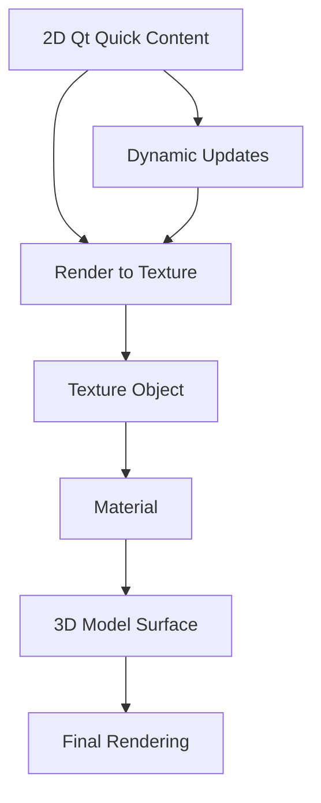

# 2D in 3D Integration - Texture Path

## 是什么

2D in 3D Integration - Texture Path（2D与3D集成 - 纹理路径）是一种将 Qt Quick 2D 内容渲染到纹理，然后将该纹理应用到 3D 对象表面的技术。这种方式适合需要在 3D 模型表面显示动态 2D 内容的场景。



纹理路径方式将 2D 内容离屏渲染到纹理对象，然后作为材质的一部分应用到 3D 模型上。这种方法性能开销较大，但可以实现复杂的效果，如曲面 UI、视频播放等。

## 常用属性一览表

### Texture 相关属性

| 属性名 | 类型 | 默认值 | 取值范围 | 作用 | 性能/质量提示 |
| ------ | ---- | ------ | -------- | ---- | -------------- |
| sourceItem★ | Item | null | Qt Quick Item | 2D内容源 | 核心属性，指定要渲染的2D内容 |
| layer.enabled★ | bool | false | true/false | 启用层渲染 | 必须启用才能渲染到纹理 |
| layer.textureSize★ | size | (0,0) | 像素尺寸 | 纹理分辨率 | 影响清晰度和性能 |
| layer.format | enum | RGBA8 | 格式枚举 | 纹理格式 | 影响内存占用 |
| layer.mipmap | bool | false | true/false | 生成mipmap | 改善远距离显示质量 |
| layer.smooth | bool | true | true/false | 纹理过滤 | 影响缩放质量 |

★ 标记表示高频使用属性

## 属性详解

### sourceItem★ (高频属性)

sourceItem 指定要渲染到纹理的 2D Qt Quick 项，是纹理路径集成的核心。

**使用场景：**
- 在 3D 屏幕模型上显示动态 UI
- 视频播放器表面
- 交互式控制面板
- 实时数据可视化

**注意事项：**
- sourceItem 必须是有效的 Qt Quick Item
- Item 的变化会自动更新纹理
- 复杂的 2D 内容会影响性能
- 需要配合 layer.enabled 使用

### layer.textureSize★ (高频属性)

layer.textureSize 定义渲染纹理的分辨率，直接影响显示质量和性能。

**使用场景：**
- 高清显示：使用较大尺寸（1024x1024 或更大）
- 性能优化：使用较小尺寸（512x512）
- 动态调整：根据距离调整分辨率

**注意事项：**
- 尺寸越大，内存占用越多
- 建议使用 2 的幂次方尺寸（512, 1024, 2048）
- 过大的尺寸会导致性能下降
- 可以根据 3D 对象大小动态调整

### layer.enabled★ (高频属性)

layer.enabled 启用层渲染，将 2D 内容渲染到离屏纹理。

**使用场景：**
- 必须启用才能将 2D 内容用作纹理
- 控制纹理更新的开关
- 性能优化（不需要时禁用）

**注意事项：**
- 启用会增加渲染开销
- 禁用时纹理不会更新
- 可以动态切换以优化性能

## 最小可运行示例

**文件树：**
```
project/
├── main.qml
├── main.cpp
└── CMakeLists.txt
```

**完整代码：**

main.qml:
```qml
import QtQuick
import QtQuick3D
import QtQuick.Controls

Window {
    width: 1280
    height: 720
    visible: true
    title: "2D in 3D Integration - Texture Path 示例"

    View3D {
        anchors.fill: parent
        
        environment: SceneEnvironment {
            backgroundMode: SceneEnvironment.Color
            clearColor: "#1a1a2e"
            antialiasingMode: SceneEnvironment.MSAA
            antialiasingQuality: SceneEnvironment.High
        }
        
        // 相机
        PerspectiveCamera {
            position: Qt.vector3d(0, 100, 400)
            eulerRotation.x: -15
        }
        
        // 光照
        DirectionalLight {
            eulerRotation.x: -45
            eulerRotation.y: 45
            brightness: 1.5
        }
        
        // 示例1：显示器模型 - 显示动态UI
        Model {
            id: screen
            source: "#Cube"
            position: Qt.vector3d(-150, 0, 0)
            scale: Qt.vector3d(2, 1.5, 0.1)
            
            materials: PrincipledMaterial {
                baseColorMap: Texture {
                    sourceItem: dynamicUI
                }
                metalness: 0.8
                roughness: 0.2
            }
        }
        
        // 示例2：视频播放器表面
        Model {
            source: "#Rectangle"
            position: Qt.vector3d(150, 0, 0)
            scale: Qt.vector3d(2, 1.5, 1)
            eulerRotation.y: -20
            
            materials: PrincipledMaterial {
                baseColorMap: Texture {
                    sourceItem: videoPlayer
                }
                emissiveFactor: Qt.vector3d(0.5, 0.5, 0.5)
            }
        }
        
        // 示例3：曲面UI - 圆柱体
        Model {
            source: "#Cylinder"
            position: Qt.vector3d(0, -150, 0)
            scale: Qt.vector3d(1.5, 1, 1.5)
            
            materials: PrincipledMaterial {
                baseColorMap: Texture {
                    sourceItem: curvedUI
                }
                metalness: 0.3
                roughness: 0.5
            }
            
            SequentialAnimation on eulerRotation.y {
                loops: Animation.Infinite
                NumberAnimation { from: 0; to: 360; duration: 10000 }
            }
        }
        
        // 地面
        Model {
            source: "#Rectangle"
            scale: Qt.vector3d(20, 20, 1)
            position.y: -200
            eulerRotation.x: -90
            materials: PrincipledMaterial {
                baseColor: "#0f3460"
                metalness: 0.1
                roughness: 0.9
            }
        }
    }
    
    // 2D 内容1：动态 UI
    Rectangle {
        id: dynamicUI
        width: 512
        height: 384
        color: "#16213e"
        visible: false  // 不在2D场景中显示
        
        // 启用层渲染
        layer.enabled: true
        layer.textureSize: Qt.size(512, 384)
        layer.smooth: true
        
        Column {
            anchors.centerIn: parent
            spacing: 20
            
            Text {
                text: "Dynamic UI"
                color: "#ffe66d"
                font.pixelSize: 32
                font.bold: true
                anchors.horizontalCenter: parent.horizontalCenter
            }
            
            Text {
                text: "Time: " + Qt.formatTime(new Date(), "hh:mm:ss")
                color: "white"
                font.pixelSize: 24
                anchors.horizontalCenter: parent.horizontalCenter
                
                Timer {
                    interval: 1000
                    running: true
                    repeat: true
                    onTriggered: parent.text = "Time: " + Qt.formatTime(new Date(), "hh:mm:ss")
                }
            }
            
            Row {
                spacing: 10
                anchors.horizontalCenter: parent.horizontalCenter
                
                Button {
                    text: "Button 1"
                    onClicked: console.log("Button 1 clicked")
                }
                
                Button {
                    text: "Button 2"
                    onClicked: console.log("Button 2 clicked")
                }
            }
            
            Slider {
                width: 300
                from: 0
                to: 100
                value: 50
                anchors.horizontalCenter: parent.horizontalCenter
            }
        }
    }
    
    // 2D 内容2：视频播放器模拟
    Rectangle {
        id: videoPlayer
        width: 640
        height: 480
        color: "black"
        visible: false
        
        layer.enabled: true
        layer.textureSize: Qt.size(640, 480)
        layer.smooth: true
        
        // 模拟视频内容
        Rectangle {
            anchors.fill: parent
            anchors.margins: 20
            
            gradient: Gradient {
                GradientStop { position: 0.0; color: "#ff6b6b" }
                GradientStop { position: 0.5; color: "#4ecdc4" }
                GradientStop { position: 1.0; color: "#ffe66d" }
            }
            
            // 动画效果
            rotation: 0
            SequentialAnimation on rotation {
                loops: Animation.Infinite
                NumberAnimation { from: 0; to: 360; duration: 5000 }
            }
        }
        
        // 播放控制
        Rectangle {
            anchors.bottom: parent.bottom
            anchors.left: parent.left
            anchors.right: parent.right
            height: 60
            color: "#cc000000"
            
            Row {
                anchors.centerIn: parent
                spacing: 15
                
                Button {
                    text: "▶"
                    width: 50
                    height: 40
                }
                
                Button {
                    text: "⏸"
                    width: 50
                    height: 40
                }
                
                Button {
                    text: "⏹"
                    width: 50
                    height: 40
                }
            }
        }
    }
    
    // 2D 内容3：曲面UI
    Rectangle {
        id: curvedUI
        width: 800
        height: 400
        color: "#1a1a2e"
        visible: false
        
        layer.enabled: true
        layer.textureSize: Qt.size(800, 400)
        layer.smooth: true
        
        Grid {
            anchors.fill: parent
            anchors.margins: 30
            columns: 3
            spacing: 20
            
            Repeater {
                model: 9
                
                Rectangle {
                    width: 230
                    height: 100
                    color: "#0f3460"
                    radius: 10
                    border.color: "#4ecdc4"
                    border.width: 2
                    
                    Column {
                        anchors.centerIn: parent
                        spacing: 5
                        
                        Text {
                            text: "Item " + (index + 1)
                            color: "white"
                            font.pixelSize: 18
                            anchors.horizontalCenter: parent.horizontalCenter
                        }
                        
                        Text {
                            text: "Value: " + Math.floor(Math.random() * 100)
                            color: "#4ecdc4"
                            font.pixelSize: 14
                            anchors.horizontalCenter: parent.horizontalCenter
                        }
                    }
                }
            }
        }
    }
    
    // 控制面板
    Rectangle {
        anchors.right: parent.right
        anchors.top: parent.top
        anchors.margins: 20
        width: 280
        height: 220
        color: "#cc000000"
        radius: 10
        
        Column {
            anchors.fill: parent
            anchors.margins: 15
            spacing: 12
            
            Text {
                text: "纹理路径集成"
                color: "white"
                font.pixelSize: 16
                font.bold: true
            }
            
            Text {
                text: "特点："
                color: "#ffe66d"
                font.pixelSize: 12
            }
            
            Text {
                text: "• 2D内容渲染到纹理\n• 可应用到任意3D表面\n• 支持曲面显示\n• 性能开销较大\n• 适合动态内容显示"
                color: "#aaaaaa"
                font.pixelSize: 11
                wrapMode: Text.WordWrap
                width: parent.width - 30
            }
        }
    }
}
```

CMakeLists.txt:
```cmake
cmake_minimum_required(VERSION 3.16)
project(Texture2Din3DExample VERSION 1.0 LANGUAGES CXX)

set(CMAKE_CXX_STANDARD 17)
set(CMAKE_CXX_STANDARD_REQUIRED ON)

find_package(Qt6 REQUIRED COMPONENTS Quick Quick3D)

qt_add_executable(Texture2Din3DExample
    main.cpp
)

qt_add_qml_module(Texture2Din3DExample
    URI Texture2Din3DExample
    VERSION 1.0
    QML_FILES main.qml
)

target_link_libraries(Texture2Din3DExample PRIVATE
    Qt6::Quick
    Qt6::Quick3D
)

set_target_properties(Texture2Din3DExample PROPERTIES
    WIN32_EXECUTABLE TRUE
    MACOSX_BUNDLE TRUE
)
```

main.cpp:
```cpp
#include <QGuiApplication>
#include <QQmlApplicationEngine>

int main(int argc, char *argv[])
{
    QGuiApplication app(argc, argv);
    QQmlApplicationEngine engine;
    
    const QUrl url(u"qrc:/Texture2Din3DExample/main.qml"_qs);
    engine.load(url);
    
    return app.exec();
}
```

## 常见问题与调试

### 1. 纹理不显示或显示黑色

**可能原因：**
- 未启用 layer.enabled
- sourceItem 为 null 或不可见
- 纹理尺寸设置不正确
- 2D 内容渲染失败

**解决方案：**
```qml
Rectangle {
    id: content2D
    width: 512
    height: 512
    color: "red"  // 使用明显的颜色测试
    visible: false  // 不在2D场景显示
    
    // 确保启用层渲染
    layer.enabled: true
    layer.textureSize: Qt.size(512, 512)
    
    Text {
        anchors.centerIn: parent
        text: "Test"
        font.pixelSize: 48
        color: "white"
    }
}

Model {
    materials: PrincipledMaterial {
        baseColorMap: Texture {
            sourceItem: content2D
        }
        // 调试：使用自发光查看纹理
        emissiveFactor: Qt.vector3d(1, 1, 1)
    }
}
```

### 2. 纹理模糊或失真

**可能原因：**
- 纹理分辨率过低
- 未启用平滑过滤
- UV 映射问题

**解决方案：**
```qml
Rectangle {
    id: content2D
    width: 1024
    height: 1024  // 使用更高分辨率
    
    layer.enabled: true
    layer.textureSize: Qt.size(1024, 1024)
    layer.smooth: true  // 启用平滑过滤
    layer.mipmap: true  // 生成 mipmap
}

Model {
    materials: PrincipledMaterial {
        baseColorMap: Texture {
            sourceItem: content2D
            magFilter: Texture.Linear
            minFilter: Texture.Linear
            mipFilter: Texture.Linear
        }
    }
}
```

### 3. 性能问题

**可能原因：**
- 纹理分辨率过高
- 2D 内容过于复杂
- 频繁更新纹理

**优化建议：**
```qml
Rectangle {
    id: content2D
    width: 512
    height: 512
    
    layer.enabled: true
    // 根据需要动态调整分辨率
    layer.textureSize: Qt.size(
        highQuality ? 1024 : 512,
        highQuality ? 1024 : 512
    )
    
    // 减少更新频率
    property bool needsUpdate: false
    
    Timer {
        interval: 100  // 限制更新频率
        running: parent.needsUpdate
        onTriggered: {
            // 执行更新
            parent.needsUpdate = false
        }
    }
}

// 距离相机远时降低质量
Model {
    property real distanceToCamera: position.minus(camera.position).length()
    
    materials: PrincipledMaterial {
        baseColorMap: Texture {
            sourceItem: content2D
            // 根据距离调整纹理质量
        }
    }
}
```

### 4. 交互不响应

**问题：**
纹理路径方式下，2D 内容的交互事件无法直接响应。

**解决方案：**
```qml
// 方案1：使用射线拾取
View3D {
    id: view3d
    
    MouseArea {
        anchors.fill: parent
        onClicked: (mouse) => {
            let pickResult = view3d.pick(mouse.x, mouse.y)
            if (pickResult.objectHit === screenModel) {
                // 计算UV坐标
                let uv = pickResult.uvPosition
                // 转换为2D内容坐标
                let x = uv.x * content2D.width
                let y = uv.y * content2D.height
                // 触发2D内容的交互
                content2D.handleClick(x, y)
            }
        }
    }
}

// 方案2：使用直接路径方式代替
// 参见 2D-in-3D-integration-Direct-Path.md
```

## 实战技巧

### 1. 虚拟显示器

```qml
Model {
    source: "monitor.mesh"
    
    materials: [
        // 显示器外壳
        PrincipledMaterial {
            baseColor: "black"
            metalness: 0.8
            roughness: 0.2
        },
        // 屏幕
        PrincipledMaterial {
            baseColorMap: Texture {
                sourceItem: screenContent
            }
            emissiveFactor: Qt.vector3d(1, 1, 1)
            emissiveMap: Texture {
                sourceItem: screenContent
            }
        }
    ]
}

Rectangle {
    id: screenContent
    width: 1920
    height: 1080
    visible: false
    
    layer.enabled: true
    layer.textureSize: Qt.size(1920, 1080)
    layer.smooth: true
    
    // 完整的桌面UI
    Item {
        anchors.fill: parent
        
        // 背景
        Image {
            anchors.fill: parent
            source: "desktop_wallpaper.jpg"
        }
        
        // 窗口
        Rectangle {
            x: 100
            y: 100
            width: 800
            height: 600
            color: "white"
            
            // 窗口内容...
        }
    }
}
```

### 2. 视频纹理

```qml
Model {
    source: "#Rectangle"
    scale: Qt.vector3d(3, 2, 1)
    
    materials: PrincipledMaterial {
        baseColorMap: Texture {
            sourceItem: videoOutput
        }
        emissiveFactor: Qt.vector3d(0.8, 0.8, 0.8)
    }
}

Rectangle {
    id: videoOutput
    width: 1280
    height: 720
    visible: false
    color: "black"
    
    layer.enabled: true
    layer.textureSize: Qt.size(1280, 720)
    
    // 使用 Qt Multimedia
    VideoOutput {
        anchors.fill: parent
        
        MediaPlayer {
            id: player
            source: "video.mp4"
            loops: MediaPlayer.Infinite
            autoPlay: true
        }
    }
}
```

### 3. 实时数据可视化

```qml
Model {
    source: "#Cube"
    
    materials: PrincipledMaterial {
        baseColorMap: Texture {
            sourceItem: dataViz
        }
    }
}

Rectangle {
    id: dataViz
    width: 800
    height: 600
    visible: false
    color: "#1a1a2e"
    
    layer.enabled: true
    layer.textureSize: Qt.size(800, 600)
    
    // 图表组件
    ChartView {
        anchors.fill: parent
        theme: ChartView.ChartThemeDark
        
        LineSeries {
            id: dataSeries
            name: "Real-time Data"
        }
    }
    
    Timer {
        interval: 100
        running: true
        repeat: true
        onTriggered: {
            // 更新数据
            dataSeries.append(Date.now(), Math.random() * 100)
        }
    }
}
```

### 4. 动态纹理质量

```qml
Model {
    id: texturedModel
    
    property real distanceToCamera: {
        let dx = position.x - camera.position.x
        let dy = position.y - camera.position.y
        let dz = position.z - camera.position.z
        return Math.sqrt(dx*dx + dy*dy + dz*dz)
    }
    
    property int textureQuality: {
        if (distanceToCamera < 200) return 2  // 高质量
        if (distanceToCamera < 500) return 1  // 中质量
        return 0  // 低质量
    }
    
    materials: PrincipledMaterial {
        baseColorMap: Texture {
            sourceItem: dynamicContent
        }
    }
}

Rectangle {
    id: dynamicContent
    visible: false
    
    width: texturedModel.textureQuality === 2 ? 1024 : 
           texturedModel.textureQuality === 1 ? 512 : 256
    height: width
    
    layer.enabled: true
    layer.textureSize: Qt.size(width, height)
}
```

### 5. 多页面UI系统

```qml
Model {
    source: "tablet.mesh"
    
    materials: PrincipledMaterial {
        baseColorMap: Texture {
            sourceItem: tabletUI
        }
    }
}

Rectangle {
    id: tabletUI
    width: 768
    height: 1024
    visible: false
    
    layer.enabled: true
    layer.textureSize: Qt.size(768, 1024)
    
    StackView {
        id: stackView
        anchors.fill: parent
        initialItem: homePage
    }
    
    Component {
        id: homePage
        Rectangle {
            color: "#16213e"
            // 主页内容...
        }
    }
    
    Component {
        id: settingsPage
        Rectangle {
            color: "#1a1a2e"
            // 设置页内容...
        }
    }
}
```

## 延伸阅读

- [Qt Quick - Item Layers](https://doc.qt.io/qt-6/qtquick-effects-topic.html)
- [2D-in-3D-integration-Direct-Path.md](./2D-in-3D-integration-Direct-Path.md) - 直接路径集成
- [3D-in-2D-integration.md](./3D-in-2D-integration.md) - 3D与2D集成
- [PrincipledMaterial.md](./PrincipledMaterial.md) - PBR材质文档
- [Qt Multimedia Documentation](https://doc.qt.io/qt-6/qtmultimedia-index.html)
