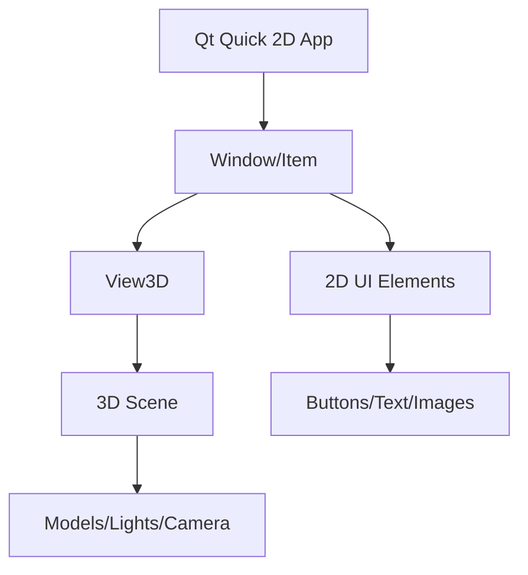

# 3D in 2D Integration

## 是什么

3D in 2D Integration（3D与2D集成）是指在传统的 Qt Quick 2D 应用程序中嵌入 3D 内容。通过 View3D 组件，可以将 3D 场景作为 2D 界面的一部分，实现混合应用。



这种集成方式允许开发者在保持 2D UI 优势的同时，为应用添加 3D 可视化、产品展示、游戏元素等功能。

## 常用属性一览表

### View3D 集成属性

| 属性名 | 类型 | 默认值 | 取值范围 | 作用 | 性能/质量提示 |
| ------ | ---- | ------ | -------- | ---- | -------------- |
| anchors★ | Anchors | - | 锚点设置 | 在2D布局中定位 | 标准2D布局属性 |
| width★ | real | 0 | 像素值 | 3D视口宽度 | 影响渲染分辨率 |
| height★ | real | 0 | 像素值 | 3D视口高度 | 影响渲染分辨率 |
| renderMode★ | enum | Offscreen | Offscreen/Underlay/Overlay | 渲染模式 | 影响性能和层级 |
| visible | bool | true | true/false | 可见性 | 控制3D内容显示 |

★ 标记表示高频使用属性

## 属性详解

### renderMode★ (高频属性)

renderMode 决定 3D 内容如何与 2D 内容混合渲染。

**使用场景：**
- Offscreen：3D渲染到纹理，可与2D任意混合（默认）
- Underlay：3D在2D下方，性能最好
- Overlay：3D在2D上方

**注意事项：**
- Offscreen 最灵活但性能稍低
- Underlay/Overlay 性能更好但限制更多
- 选择合适模式平衡性能和功能

## 最小可运行示例

**文件树：**
```
project/
├── main.qml
├── main.cpp
└── CMakeLists.txt
```

**完整代码：**

main.qml:
```qml
import QtQuick
import QtQuick3D
import QtQuick.Controls

Window {
    width: 1280
    height: 720
    visible: true
    title: "3D in 2D Integration 示例"

    // 2D 应用布局
    Rectangle {
        anchors.fill: parent
        color: "#f0f0f0"
        
        // 顶部工具栏
        Rectangle {
            id: toolbar
            anchors.top: parent.top
            anchors.left: parent.left
            anchors.right: parent.right
            height: 60
            color: "#2c3e50"
            
            Row {
                anchors.centerIn: parent
                spacing: 15
                
                Button {
                    text: "Rotate"
                    onClicked: rotateAnimation.running = !rotateAnimation.running
                }
                
                Button {
                    text: "Reset"
                    onClicked: model3d.eulerRotation = Qt.vector3d(0, 0, 0)
                }
                
                ComboBox {
                    model: ["Cube", "Sphere", "Cylinder"]
                    onCurrentTextChanged: {
                        model3d.source = "#" + currentText
                    }
                }
            }
        }
        
        // 主内容区域
        Row {
            anchors.top: toolbar.bottom
            anchors.bottom: parent.bottom
            anchors.left: parent.left
            anchors.right: parent.right
            
            // 左侧面板
            Rectangle {
                width: 250
                height: parent.height
                color: "white"
                border.color: "#ddd"
                border.width: 1
                
                Column {
                    anchors.fill: parent
                    anchors.margins: 20
                    spacing: 15
                    
                    Text {
                        text: "3D 控制"
                        font.pixelSize: 18
                        font.bold: true
                    }
                    
                    Text { text: "X 旋转" }
                    Slider {
                        width: parent.width
                        from: -180
                        to: 180
                        value: model3d.eulerRotation.x
                        onValueChanged: model3d.eulerRotation.x = value
                    }
                    
                    Text { text: "Y 旋转" }
                    Slider {
                        width: parent.width
                        from: -180
                        to: 180
                        value: model3d.eulerRotation.y
                        onValueChanged: model3d.eulerRotation.y = value
                    }
                    
                    Text { text: "缩放" }
                    Slider {
                        width: parent.width
                        from: 0.5
                        to: 3.0
                        value: 1.0
                        onValueChanged: model3d.scale = Qt.vector3d(value, value, value)
                    }
                }
            }
            
            // 中央 3D 视口
            View3D {
                id: view3d
                width: parent.width - 500
                height: parent.height
                
                environment: SceneEnvironment {
                    backgroundMode: SceneEnvironment.Color
                    clearColor: "#ecf0f1"
                    antialiasingMode: SceneEnvironment.MSAA
                }
                
                PerspectiveCamera {
                    position: Qt.vector3d(0, 0, 300)
                }
                
                DirectionalLight {
                    eulerRotation.x: -45
                    eulerRotation.y: 45
                }
                
                Model {
                    id: model3d
                    source: "#Cube"
                    materials: PrincipledMaterial {
                        baseColor: "#3498db"
                        metalness: 0.5
                        roughness: 0.3
                    }
                    
                    SequentialAnimation on eulerRotation.y {
                        id: rotateAnimation
                        loops: Animation.Infinite
                        running: false
                        NumberAnimation { from: 0; to: 360; duration: 3000 }
                    }
                }
            }
            
            // 右侧信息面板
            Rectangle {
                width: 250
                height: parent.height
                color: "white"
                border.color: "#ddd"
                border.width: 1
                
                Column {
                    anchors.fill: parent
                    anchors.margins: 20
                    spacing: 10
                    
                    Text {
                        text: "对象信息"
                        font.pixelSize: 18
                        font.bold: true
                    }
                    
                    Text {
                        text: "位置: " + model3d.position.x.toFixed(1) + ", " +
                              model3d.position.y.toFixed(1) + ", " +
                              model3d.position.z.toFixed(1)
                        wrapMode: Text.WordWrap
                        width: parent.width
                    }
                    
                    Text {
                        text: "旋转: " + model3d.eulerRotation.x.toFixed(0) + "°, " +
                              model3d.eulerRotation.y.toFixed(0) + "°, " +
                              model3d.eulerRotation.z.toFixed(0) + "°"
                        wrapMode: Text.WordWrap
                        width: parent.width
                    }
                    
                    Text {
                        text: "缩放: " + model3d.scale.x.toFixed(2)
                    }
                }
            }
        }
    }
}
```

CMakeLists.txt:
```cmake
cmake_minimum_required(VERSION 3.16)
project(3Din2DExample VERSION 1.0 LANGUAGES CXX)

set(CMAKE_CXX_STANDARD 17)
set(CMAKE_CXX_STANDARD_REQUIRED ON)

find_package(Qt6 REQUIRED COMPONENTS Quick Quick3D)

qt_add_executable(3Din2DExample main.cpp)

qt_add_qml_module(3Din2DExample
    URI 3Din2DExample
    VERSION 1.0
    QML_FILES main.qml
)

target_link_libraries(3Din2DExample PRIVATE
    Qt6::Quick
    Qt6::Quick3D
)

set_target_properties(3Din2DExample PROPERTIES
    WIN32_EXECUTABLE TRUE
    MACOSX_BUNDLE TRUE
)
```

main.cpp:
```cpp
#include <QGuiApplication>
#include <QQmlApplicationEngine>

int main(int argc, char *argv[])
{
    QGuiApplication app(argc, argv);
    QQmlApplicationEngine engine;
    
    const QUrl url(u"qrc:/3Din2DExample/main.qml"_qs);
    engine.load(url);
    
    return app.exec();
}
```

## 常见问题与调试

### 1. 3D内容不显示

**解决方案：**
```qml
View3D {
    width: 800  // 确保设置尺寸
    height: 600
    
    camera: PerspectiveCamera {
        position: Qt.vector3d(0, 0, 300)
    }
    
    DirectionalLight { }
    
    Model {
        source: "#Cube"
        materials: PrincipledMaterial { }
    }
}
```

### 2. 性能优化

**解决方案：**
```qml
View3D {
    renderMode: View3D.Underlay  // 使用Underlay模式
    
    environment: SceneEnvironment {
        antialiasingMode: SceneEnvironment.NoAA  // 降低抗锯齿
    }
}
```

## 实战技巧

### 1. 产品展示应用

```qml
Window {
    Rectangle {
        anchors.fill: parent
        
        View3D {
            anchors.centerIn: parent
            width: 600
            height: 600
            
            camera: PerspectiveCamera {
                position: Qt.vector3d(0, 0, 500)
            }
            
            Model {
                source: "product.mesh"
                materials: PrincipledMaterial { }
                
                SequentialAnimation on eulerRotation.y {
                    loops: Animation.Infinite
                    NumberAnimation { from: 0; to: 360; duration: 10000 }
                }
            }
        }
        
        // 2D UI 覆盖层
        Column {
            anchors.right: parent.right
            anchors.margins: 20
            
            Button { text: "购买" }
            Button { text: "详情" }
        }
    }
}
```

### 2. 数据可视化

```qml
Rectangle {
    View3D {
        anchors.fill: parent
        
        // 3D 图表
        Repeater3D {
            model: dataModel
            Model {
                source: "#Cylinder"
                position: Qt.vector3d(index * 50, modelData * 10, 0)
                scale: Qt.vector3d(1, modelData, 1)
            }
        }
    }
}
```

## 延伸阅读

- [Qt Quick 3D - View3D](https://doc.qt.io/qt-6/qml-qtquick3d-view3d.html)
- [2D-in-3D-integration-Direct-Path.md](./2D-in-3D-integration-Direct-Path.md)
- [View3D-renderMode.md](./View3D-renderMode.md)
- [Quick-3D.md](./Quick-3D.md)
