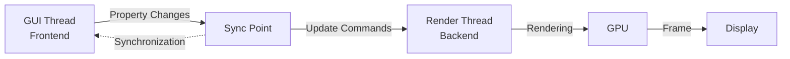

# Frontend Backend Synchronization

## 是什么

Frontend Backend Synchronization（前后端同步）是 Qt Quick 3D 的线程模型，用于在 GUI 线程（前端）和渲染线程（后端）之间同步数据。理解这个机制对于编写高性能、线程安全的 3D 应用至关重要。



Qt Quick 3D 使用双线程架构：GUI 线程处理用户交互和 QML 逻辑，渲染线程负责 3D 场景的渲染。两个线程在同步点交换数据，确保线程安全。

## 常用属性一览表

### 同步相关信号

| 信号名 | 触发时机 | 线程 | 作用 | 使用场景 |
| ------ | -------- | ---- | ---- | -------- |
| beforeSynchronizing★ | 同步前 | Render | 准备同步数据 | 更新渲染状态 |
| afterSynchronizing | 同步后 | Render | 同步完成 | 验证同步结果 |
| beforeRendering★ | 渲染前 | Render | 准备渲染 | 自定义渲染命令 |
| afterRendering | 渲染后 | Render | 渲染完成 | 读取渲染结果 |

★ 标记表示高频使用信号

## 属性详解

### beforeSynchronizing★ (高频信号)

在 GUI 线程和渲染线程同步之前触发，是修改渲染状态的安全时机。

**使用场景：**
- 更新自定义渲染数据
- 准备 GPU 资源
- 同步外部数据到渲染线程

**注意事项：**
- 在渲染线程中执行
- 不要执行耗时操作
- 避免访问 GUI 线程的对象
- 确保线程安全

### beforeRendering★ (高频信号)

在场景渲染之前触发，可以执行自定义渲染命令。

**使用场景：**
- 注入自定义 OpenGL/Vulkan 命令
- 更新动态纹理
- 执行计算着色器

**注意事项：**
- 在渲染线程中执行
- 可以访问 GPU 上下文
- 不要阻塞渲染管线

## 最小可运行示例

**完整代码：**

main.qml:
```qml
import QtQuick
import QtQuick3D

Window {
    width: 1280
    height: 720
    visible: true
    title: "Frontend Backend Synchronization 示例"

    View3D {
        id: view3d
        anchors.fill: parent
        
        environment: SceneEnvironment {
            backgroundMode: SceneEnvironment.Color
            clearColor: "#1a1a2e"
        }
        
        PerspectiveCamera {
            position: Qt.vector3d(0, 0, 300)
        }
        
        DirectionalLight { }
        
        Model {
            id: cube
            source: "#Cube"
            
            property real customValue: 0
            
            materials: PrincipledMaterial {
                baseColor: Qt.hsla(cube.customValue / 360, 0.8, 0.6, 1.0)
            }
            
            SequentialAnimation on eulerRotation.y {
                loops: Animation.Infinite
                NumberAnimation { from: 0; to: 360; duration: 3000 }
            }
        }
        
        // 监听同步事件
        onBeforeSynchronizing: {
            // 在渲染线程中执行
            console.log("Before synchronizing - Render Thread")
            syncCounter++
        }
        
        onAfterSynchronizing: {
            console.log("After synchronizing - Render Thread")
        }
        
        onBeforeRendering: {
            // 在渲染线程中执行
            console.log("Before rendering - Render Thread")
            renderCounter++
        }
        
        onAfterRendering: {
            console.log("After rendering - Render Thread")
        }
        
        property int syncCounter: 0
        property int renderCounter: 0
    }
    
    // GUI 线程更新
    Timer {
        interval: 16  // ~60 FPS
        running: true
        repeat: true
        onTriggered: {
            // 在 GUI 线程中执行
            cube.customValue = (cube.customValue + 1) % 360
        }
    }
    
    // 信息面板
    Rectangle {
        anchors.left: parent.left
        anchors.top: parent.top
        anchors.margins: 20
        width: 350
        height: 300
        color: "#cc000000"
        radius: 10
        
        Column {
            anchors.fill: parent
            anchors.margins: 15
            spacing: 12
            
            Text {
                text: "前后端同步"
                color: "white"
                font.pixelSize: 18
                font.bold: true
            }
            
            Rectangle {
                width: parent.width
                height: 1
                color: "#555"
            }
            
            Text {
                text: "线程模型："
                color: "#ffe66d"
                font.pixelSize: 14
            }
            
            Text {
                text: "• GUI 线程：处理用户交互\n• 渲染线程：执行 3D 渲染\n• 同步点：数据交换"
                color: "#aaaaaa"
                font.pixelSize: 12
                wrapMode: Text.WordWrap
                width: parent.width
            }
            
            Rectangle {
                width: parent.width
                height: 1
                color: "#555"
            }
            
            Text {
                text: "统计信息："
                color: "#ffe66d"
                font.pixelSize: 14
            }
            
            Text {
                text: "同步次数: " + view3d.syncCounter
                color: "#4ecdc4"
                font.pixelSize: 12
            }
            
            Text {
                text: "渲染次数: " + view3d.renderCounter
                color: "#4ecdc4"
                font.pixelSize: 12
            }
            
            Text {
                text: "自定义值: " + cube.customValue.toFixed(0)
                color: "#4ecdc4"
                font.pixelSize: 12
            }
        }
    }
}
```

## 常见问题与调试

### 1. 线程安全问题

**错误示例：**
```qml
View3D {
    onBeforeRendering: {
        // 错误：在渲染线程访问 GUI 对象
        someGuiObject.property = value  // 可能崩溃
    }
}
```

**正确示例：**
```qml
View3D {
    property var sharedData: null
    
    onBeforeSynchronizing: {
        // 正确：在同步点准备数据
        // 此时可以安全地访问共享数据
    }
}
```

### 2. 性能问题

**优化建议：**
```qml
View3D {
    onBeforeSynchronizing: {
        // 避免耗时操作
        // 不要在这里执行复杂计算
    }
    
    onBeforeRendering: {
        // 快速执行
        // 不要阻塞渲染管线
    }
}
```

### 3. 数据同步延迟

**解决方案：**
```qml
// GUI 线程
Timer {
    interval: 16
    running: true
    repeat: true
    onTriggered: {
        // 更新会在下一个同步点传递到渲染线程
        model.position = newPosition
    }
}
```

## 实战技巧

### 1. 自定义渲染数据同步

```qml
View3D {
    id: view3d
    
    property var customRenderData: ({})
    
    onBeforeSynchronizing: {
        // 同步自定义数据到渲染线程
        if (customRenderData.needsUpdate) {
            // 更新渲染状态
            customRenderData.needsUpdate = false
        }
    }
    
    function updateRenderData(data) {
        customRenderData = data
        customRenderData.needsUpdate = true
    }
}
```

### 2. 性能监控

```qml
View3D {
    property real lastFrameTime: 0
    property real fps: 0
    
    onBeforeRendering: {
        let currentTime = Date.now()
        if (lastFrameTime > 0) {
            let deltaTime = currentTime - lastFrameTime
            fps = 1000 / deltaTime
        }
        lastFrameTime = currentTime
    }
}
```

### 3. 动态纹理更新

```qml
View3D {
    Model {
        id: dynamicModel
        
        materials: PrincipledMaterial {
            baseColorMap: Texture {
                id: dynamicTexture
                sourceItem: canvas2d
            }
        }
    }
    
    onBeforeSynchronizing: {
        // 纹理更新会在此时同步
    }
}

Canvas {
    id: canvas2d
    visible: false
    
    onPaint: {
        // 绘制会触发纹理更新
    }
}
```

### 4. 线程安全的状态管理

```qml
QtObject {
    id: sharedState
    
    // 使用属性绑定确保线程安全
    property real value: 0
    property bool needsUpdate: false
}

View3D {
    onBeforeSynchronizing: {
        if (sharedState.needsUpdate) {
            // 安全地读取共享状态
            let val = sharedState.value
            // 更新渲染状态
            sharedState.needsUpdate = false
        }
    }
}

Timer {
    interval: 16
    running: true
    repeat: true
    onTriggered: {
        // GUI 线程更新
        sharedState.value = Math.random()
        sharedState.needsUpdate = true
    }
}
```

## 延伸阅读

- [Qt Quick Scene Graph](https://doc.qt.io/qt-6/qtquick-visualcanvas-scenegraph.html)
- [Scene-Rendering.md](./Scene-Rendering.md)
- [Qt-Quick-Spatial-Scene-Graph.md](./Qt-Quick-Spatial-Scene-Graph.md)
- [Qt Threading Basics](https://doc.qt.io/qt-6/threads-technologies.html)
