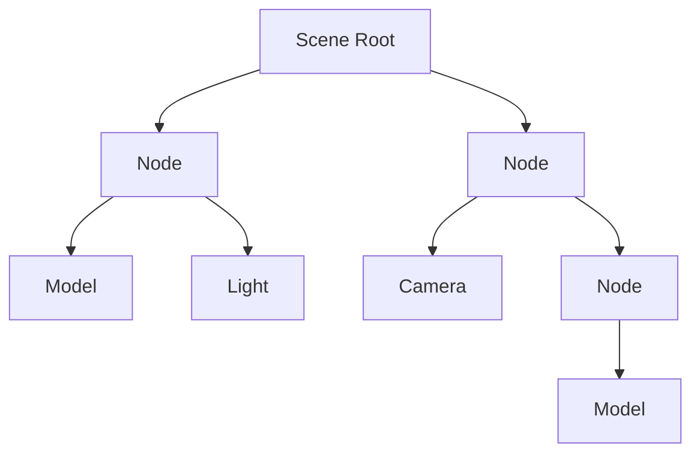

# Qt Quick Spatial Scene Graph

## 是什么

Qt Quick Spatial Scene Graph（Qt Quick 空间场景图）是 Qt Quick 3D 的核心数据结构，用于组织和管理 3D 场景中的所有元素。它是一个层级树结构，支持空间变换、可见性管理和高效渲染。



场景图通过节点的父子关系构建层级结构，每个节点可以包含变换信息、子节点和渲染属性。这种结构支持高效的场景遍历、裁剪和渲染。

## 常用属性一览表

### Node 场景图属性

| 属性名 | 类型 | 默认值 | 取值范围 | 作用 | 性能/质量提示 |
| ------ | ---- | ------ | -------- | ---- | -------------- |
| parent★ | Node | null | Node对象 | 父节点 | 定义层级关系 |
| children | list | [] | Node列表 | 子节点 | 只读，自动管理 |
| scenePosition | vector3d | - | 3D坐标 | 世界坐标 | 只读，计算得出 |
| sceneRotation | quaternion | - | 四元数 | 世界旋转 | 只读，计算得出 |
| sceneScale | vector3d | - | 缩放值 | 世界缩放 | 只读，计算得出 |

★ 标记表示高频使用属性

## 属性详解

### parent★ (高频属性)

parent 定义节点在场景图中的父节点，决定了变换的继承关系。

**使用场景：**
- 构建对象层级
- 实现组合对象
- 管理场景结构

**注意事项：**
- 子节点继承父节点的变换
- 修改父节点影响所有子节点
- 循环引用会导致错误

### scenePosition (只读属性)

scenePosition 返回节点在世界坐标系中的位置，考虑了所有父节点的变换。

**使用场景：**
- 获取对象的世界坐标
- 计算对象间距离
- 碰撞检测

**注意事项：**
- 只读属性，不能直接设置
- 自动计算，包含所有父节点变换
- 性能开销较小

## 最小可运行示例

**完整代码：**

main.qml:
```qml
import QtQuick
import QtQuick3D

Window {
    width: 1280
    height: 720
    visible: true
    title: "Qt Quick Spatial Scene Graph 示例"

    View3D {
        anchors.fill: parent
        
        environment: SceneEnvironment {
            backgroundMode: SceneEnvironment.Color
            clearColor: "#1a1a2e"
        }
        
        PerspectiveCamera {
            position: Qt.vector3d(0, 200, 600)
            eulerRotation.x: -20
        }
        
        DirectionalLight {
            eulerRotation.x: -45
        }
        
        // 场景图示例：太阳系模型
        Node {
            id: solarSystem
            
            // 太阳
            Model {
                id: sun
                source: "#Sphere"
                scale: Qt.vector3d(2, 2, 2)
                materials: PrincipledMaterial {
                    baseColor: "#f39c12"
                    emissiveFactor: Qt.vector3d(1, 1, 1)
                }
                
                SequentialAnimation on eulerRotation.y {
                    loops: Animation.Infinite
                    NumberAnimation { from: 0; to: 360; duration: 10000 }
                }
            }
            
            // 地球轨道
            Node {
                id: earthOrbit
                
                SequentialAnimation on eulerRotation.y {
                    loops: Animation.Infinite
                    NumberAnimation { from: 0; to: 360; duration: 20000 }
                }
                
                // 地球
                Model {
                    id: earth
                    source: "#Sphere"
                    position: Qt.vector3d(200, 0, 0)
                    scale: Qt.vector3d(0.8, 0.8, 0.8)
                    materials: PrincipledMaterial {
                        baseColor: "#3498db"
                    }
                    
                    SequentialAnimation on eulerRotation.y {
                        loops: Animation.Infinite
                        NumberAnimation { from: 0; to: 360; duration: 5000 }
                    }
                    
                    // 月球轨道
                    Node {
                        id: moonOrbit
                        
                        SequentialAnimation on eulerRotation.y {
                            loops: Animation.Infinite
                            NumberAnimation { from: 0; to: 360; duration: 5000 }
                        }
                        
                        // 月球
                        Model {
                            id: moon
                            source: "#Sphere"
                            position: Qt.vector3d(50, 0, 0)
                            scale: Qt.vector3d(0.3, 0.3, 0.3)
                            materials: PrincipledMaterial {
                                baseColor: "#95a5a6"
                            }
                        }
                    }
                }
            }
            
            // 火星轨道
            Node {
                id: marsOrbit
                
                SequentialAnimation on eulerRotation.y {
                    loops: Animation.Infinite
                    NumberAnimation { from: 0; to: 360; duration: 30000 }
                }
                
                // 火星
                Model {
                    id: mars
                    source: "#Sphere"
                    position: Qt.vector3d(300, 0, 0)
                    scale: Qt.vector3d(0.6, 0.6, 0.6)
                    materials: PrincipledMaterial {
                        baseColor: "#e74c3c"
                    }
                }
            }
        }
    }
    
    // 场景图信息面板
    Rectangle {
        anchors.left: parent.left
        anchors.top: parent.top
        anchors.margins: 20
        width: 350
        height: 400
        color: "#cc000000"
        radius: 10
        
        Column {
            anchors.fill: parent
            anchors.margins: 15
            spacing: 10
            
            Text {
                text: "空间场景图"
                color: "white"
                font.pixelSize: 18
                font.bold: true
            }
            
            Text {
                text: "层级结构："
                color: "#ffe66d"
                font.pixelSize: 14
            }
            
            Text {
                text: "SolarSystem\n├─ Sun\n├─ EarthOrbit\n│  └─ Earth\n│     └─ MoonOrbit\n│        └─ Moon\n└─ MarsOrbit\n   └─ Mars"
                color: "#aaaaaa"
                font.pixelSize: 11
                font.family: "Courier New"
            }
            
            Rectangle {
                width: parent.width
                height: 1
                color: "#555"
            }
            
            Text {
                text: "世界坐标："
                color: "#ffe66d"
                font.pixelSize: 14
            }
            
            Text {
                text: "地球: " + earth.scenePosition.x.toFixed(0) + ", " +
                      earth.scenePosition.y.toFixed(0) + ", " +
                      earth.scenePosition.z.toFixed(0)
                color: "#3498db"
                font.pixelSize: 11
            }
            
            Text {
                text: "月球: " + moon.scenePosition.x.toFixed(0) + ", " +
                      moon.scenePosition.y.toFixed(0) + ", " +
                      moon.scenePosition.z.toFixed(0)
                color: "#95a5a6"
                font.pixelSize: 11
            }
            
            Text {
                text: "火星: " + mars.scenePosition.x.toFixed(0) + ", " +
                      mars.scenePosition.y.toFixed(0) + ", " +
                      mars.scenePosition.z.toFixed(0)
                color: "#e74c3c"
                font.pixelSize: 11
            }
            
            Rectangle {
                width: parent.width
                height: 1
                color: "#555"
            }
            
            Text {
                text: "说明："
                color: "#ffe66d"
                font.pixelSize: 12
            }
            
            Text {
                text: "• 子节点继承父节点变换\n• 世界坐标自动计算\n• 层级结构便于管理"
                color: "#aaaaaa"
                font.pixelSize: 11
                wrapMode: Text.WordWrap
                width: parent.width
            }
        }
    }
}
```

## 常见问题与调试

### 1. 变换继承

**示例：**
```qml
Node {
    position: Qt.vector3d(100, 0, 0)
    rotation: Qt.vector3d(0, 45, 0)
    
    Model {
        position: Qt.vector3d(50, 0, 0)
        // 世界坐标会考虑父节点的变换
    }
}
```

### 2. 场景图遍历

**示例：**
```qml
Node {
    id: root
    
    function findNodeByName(name) {
        for (let i = 0; i < children.length; i++) {
            if (children[i].objectName === name) {
                return children[i]
            }
        }
        return null
    }
}
```

## 实战技巧

### 1. 动态场景图

```qml
Node {
    id: dynamicRoot
    
    function addChild(component) {
        component.createObject(dynamicRoot)
    }
    
    function removeAllChildren() {
        for (let i = children.length - 1; i >= 0; i--) {
            children[i].destroy()
        }
    }
}
```

### 2. 场景图优化

```qml
Node {
    // 使用可见性控制减少渲染
    visible: distanceToCamera < 1000
    
    // 使用LOD
    Model {
        source: distanceToCamera < 200 ? "high.mesh" : "low.mesh"
    }
}
```

## 延伸阅读

- [Qt Quick 3D - Scene Graph](https://doc.qt.io/qt-6/qtquick3d-architecture.html)
- [Scene-Manager.md](./Scene-Manager.md)
- [Scene-Rendering.md](./Scene-Rendering.md)
- [Quick-3D.md](./Quick-3D.md)
