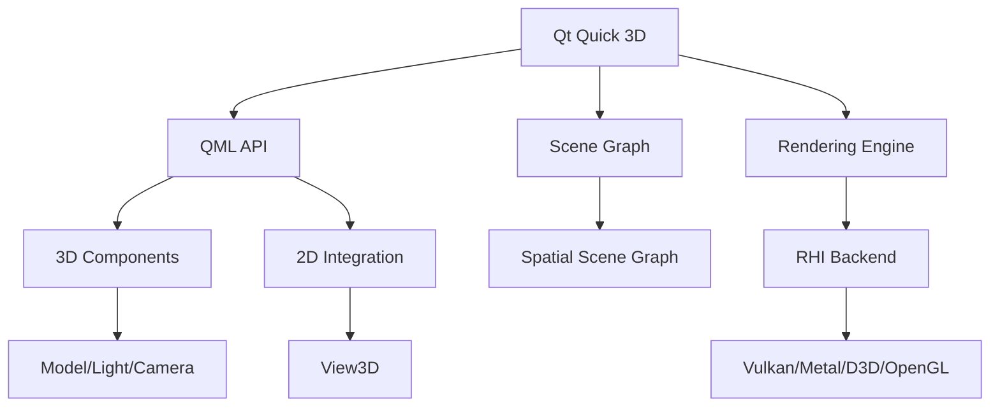

# Qt Quick 3D

## 是什么

Qt Quick 3D 是 Qt 框架中用于创建 3D 内容的模块，它将 3D 图形功能无缝集成到 Qt Quick 2D 应用程序中。作为一个高级 API，它提供了声明式的 QML 接口，使开发者能够轻松创建复杂的 3D 场景。



Qt Quick 3D 构建在 Qt 的渲染硬件接口（RHI）之上，支持多种图形 API，提供了从简单 3D 可视化到复杂游戏和仿真应用的完整解决方案。

## 常用属性一览表

### View3D 核心属性

| 属性名 | 类型 | 默认值 | 取值范围 | 作用 | 性能/质量提示 |
| ------ | ---- | ------ | -------- | ---- | -------------- |
| camera★ | Camera | null | Camera对象 | 场景相机 | 必须设置才能看到3D内容 |
| environment★ | SceneEnvironment | null | SceneEnvironment对象 | 场景环境设置 | 影响渲染质量和性能 |
| importScene | Node | null | Node对象 | 导入的场景根节点 | 用于加载外部场景 |
| renderMode | enum | Offscreen | Offscreen/Underlay/Overlay | 渲染模式 | 影响与2D内容的集成方式 |

### SceneEnvironment 属性

| 属性名 | 类型 | 默认值 | 取值范围 | 作用 | 性能/质量提示 |
| ------ | ---- | ------ | -------- | ---- | -------------- |
| backgroundMode★ | enum | Transparent | Transparent/Color/SkyBox | 背景模式 | 影响场景外观 |
| clearColor | color | black | 颜色值 | 背景颜色 | backgroundMode为Color时生效 |
| antialiasingMode★ | enum | NoAA | NoAA/SSAA/MSAA/ProgressiveAA | 抗锯齿模式 | 显著影响性能和质量 |
| antialiasingQuality | enum | Medium | Low/Medium/High/VeryHigh | 抗锯齿质量 | 质量越高性能消耗越大 |
| lightProbe | Texture | null | Texture对象 | 环境光探针 | 用于IBL照明 |

★ 标记表示高频使用属性

## 属性详解

### camera★ (高频属性)

camera 属性指定用于渲染 3D 场景的相机，是 View3D 最重要的属性之一。

**使用场景：**
- 设置场景视角和投影方式
- 实现相机动画和切换
- 控制可视范围和视野角度
- 实现第一人称/第三人称视角

**注意事项：**
- 必须设置相机才能看到 3D 内容
- 支持 PerspectiveCamera（透视）和 OrthographicCamera（正交）
- 相机位置和方向决定场景的可见性
- 可以动态切换不同相机

### environment★ (高频属性)

environment 定义场景的渲染环境，包括背景、光照、抗锯齿等全局设置。

**使用场景：**
- 配置场景背景（纯色、天空盒、透明）
- 设置抗锯齿和后处理效果
- 配置基于图像的光照（IBL）
- 调整雾效和环境光

**注意事项：**
- 环境设置影响整个场景的渲染
- 抗锯齿模式对性能影响显著
- IBL 需要 HDR 环境贴图
- 可以在运行时动态修改环境设置

### renderMode (高频属性)

renderMode 控制 3D 内容如何与 2D Qt Quick 内容集成和渲染。

**使用场景：**
- Offscreen：3D 内容渲染到离屏缓冲区（默认，最灵活）
- Underlay：3D 内容在 2D 内容下方渲染（性能最好）
- Overlay：3D 内容在 2D 内容上方渲染

**注意事项：**
- Offscreen 模式支持任意混合，但性能稍低
- Underlay/Overlay 模式性能更好，但限制更多
- 模式选择影响深度测试和透明度处理
- 根据应用需求选择合适的模式

## 最小可运行示例

**文件树：**
```
project/
├── main.qml
├── main.cpp
└── CMakeLists.txt
```

**完整代码：**

main.qml:
```qml
import QtQuick
import QtQuick3D

Window {
    width: 1280
    height: 720
    visible: true
    title: "Qt Quick 3D 框架示例"

    // 基础 3D 场景
    View3D {
        id: view3d
        anchors.fill: parent
        
        // 场景环境配置
        environment: SceneEnvironment {
            backgroundMode: SceneEnvironment.Color
            clearColor: "#1a1a2e"
            antialiasingMode: SceneEnvironment.MSAA
            antialiasingQuality: SceneEnvironment.High
            
            // 可选：添加环境光探针
            // lightProbe: Texture {
            //     source: "environment.hdr"
            //     mappingMode: Texture.LightProbe
            // }
        }
        
        // 相机设置
        PerspectiveCamera {
            id: camera
            position: Qt.vector3d(0, 200, 500)
            eulerRotation.x: -20
            fieldOfView: 60
            clipNear: 1
            clipFar: 10000
        }
        
        // 光照
        DirectionalLight {
            eulerRotation.x: -45
            eulerRotation.y: 45
            brightness: 1.5
            castsShadow: true
            shadowMapQuality: Light.ShadowMapQualityHigh
        }
        
        // 环境光
        DirectionalLight {
            eulerRotation.x: 30
            eulerRotation.y: -135
            brightness: 0.3
            color: "#4ecdc4"
        }
        
        // 3D 模型
        Model {
            source: "#Cube"
            position: Qt.vector3d(0, 0, 0)
            scale: Qt.vector3d(1.5, 1.5, 1.5)
            
            materials: PrincipledMaterial {
                baseColor: "#4ecdc4"
                metalness: 0.5
                roughness: 0.3
            }
            
            SequentialAnimation on eulerRotation.y {
                loops: Animation.Infinite
                NumberAnimation { from: 0; to: 360; duration: 5000 }
            }
        }
        
        // 地面
        Model {
            source: "#Rectangle"
            scale: Qt.vector3d(20, 20, 1)
            position.y: -100
            eulerRotation.x: -90
            
            materials: PrincipledMaterial {
                baseColor: "#0f3460"
                metalness: 0.1
                roughness: 0.9
            }
        }
    }
    
    // 2D UI 覆盖层
    Rectangle {
        anchors.left: parent.left
        anchors.top: parent.top
        anchors.margins: 20
        width: 300
        height: 250
        color: "#cc000000"
        radius: 10
        
        Column {
            anchors.fill: parent
            anchors.margins: 15
            spacing: 12
            
            Text {
                text: "Qt Quick 3D 框架"
                color: "white"
                font.pixelSize: 18
                font.bold: true
            }
            
            Text {
                text: "核心特性："
                color: "#ffe66d"
                font.pixelSize: 14
            }
            
            Column {
                spacing: 5
                
                Text {
                    text: "• 声明式 QML API"
                    color: "#aaaaaa"
                    font.pixelSize: 12
                }
                
                Text {
                    text: "• 无缝 2D/3D 集成"
                    color: "#aaaaaa"
                    font.pixelSize: 12
                }
                
                Text {
                    text: "• 跨平台渲染（RHI）"
                    color: "#aaaaaa"
                    font.pixelSize: 12
                }
                
                Text {
                    text: "• PBR 材质系统"
                    color: "#aaaaaa"
                    font.pixelSize: 12
                }
                
                Text {
                    text: "• 骨骼和变形动画"
                    color: "#aaaaaa"
                    font.pixelSize: 12
                }
                
                Text {
                    text: "• 粒子系统"
                    color: "#aaaaaa"
                    font.pixelSize: 12
                }
            }
            
            Row {
                spacing: 10
                
                Rectangle {
                    width: 80
                    height: 30
                    color: "#4ecdc4"
                    radius: 5
                    
                    Text {
                        anchors.centerIn: parent
                        text: "Vulkan"
                        color: "white"
                        font.pixelSize: 11
                    }
                }
                
                Rectangle {
                    width: 80
                    height: 30
                    color: "#ff6b6b"
                    radius: 5
                    
                    Text {
                        anchors.centerIn: parent
                        text: "Metal"
                        color: "white"
                        font.pixelSize: 11
                    }
                }
                
                Rectangle {
                    width: 80
                    height: 30
                    color: "#ffe66d"
                    radius: 5
                    
                    Text {
                        anchors.centerIn: parent
                        text: "D3D11"
                        color: "black"
                        font.pixelSize: 11
                    }
                }
            }
        }
    }
}
```

CMakeLists.txt:
```cmake
cmake_minimum_required(VERSION 3.16)
project(QtQuick3DExample VERSION 1.0 LANGUAGES CXX)

set(CMAKE_CXX_STANDARD 17)
set(CMAKE_CXX_STANDARD_REQUIRED ON)

find_package(Qt6 REQUIRED COMPONENTS Quick Quick3D)

qt_add_executable(QtQuick3DExample
    main.cpp
)

qt_add_qml_module(QtQuick3DExample
    URI QtQuick3DExample
    VERSION 1.0
    QML_FILES main.qml
)

target_link_libraries(QtQuick3DExample PRIVATE
    Qt6::Quick
    Qt6::Quick3D
)

set_target_properties(QtQuick3DExample PROPERTIES
    WIN32_EXECUTABLE TRUE
    MACOSX_BUNDLE TRUE
)
```

main.cpp:
```cpp
#include <QGuiApplication>
#include <QQmlApplicationEngine>

int main(int argc, char *argv[])
{
    QGuiApplication app(argc, argv);
    
    QQmlApplicationEngine engine;
    const QUrl url(u"qrc:/QtQuick3DExample/main.qml"_qs);
    
    QObject::connect(&engine, &QQmlApplicationEngine::objectCreated,
        &app, [url](QObject *obj, const QUrl &objUrl) {
            if (!obj && url == objUrl)
                QCoreApplication::exit(-1);
        }, Qt::QueuedConnection);
    
    engine.load(url);
    
    return app.exec();
}
```

## 常见问题与调试

### 1. 3D 内容不显示

**可能原因：**
- 未设置相机
- 相机位置或方向不正确
- 模型在相机视锥体外
- 光照不足

**解决方案：**
```qml
View3D {
    // 确保设置相机
    camera: PerspectiveCamera {
        position: Qt.vector3d(0, 0, 500)
        // 确保相机朝向场景中心
        lookAt: Qt.vector3d(0, 0, 0)
    }
    
    // 添加光照
    DirectionalLight {
        eulerRotation.x: -45
        brightness: 1.0
    }
    
    // 确保模型在可见范围内
    Model {
        source: "#Cube"
        position: Qt.vector3d(0, 0, 0)
        materials: PrincipledMaterial { }
    }
}
```

### 2. 性能问题

**可能原因：**
- 抗锯齿设置过高
- 阴影质量过高
- 模型复杂度过高
- 过多的绘制调用

**优化建议：**
```qml
SceneEnvironment {
    // 根据目标平台调整抗锯齿
    antialiasingMode: Qt.platform.os === "android" 
        ? SceneEnvironment.NoAA 
        : SceneEnvironment.MSAA
    antialiasingQuality: SceneEnvironment.Medium
    
    // 禁用不必要的特性
    // depthTestEnabled: true
    // depthPrePassEnabled: false
}

// 优化光照
DirectionalLight {
    castsShadow: true
    // 降低阴影质量
    shadowMapQuality: Light.ShadowMapQualityMedium
}

// 使用实例化渲染
Model {
    instancing: RandomInstancing {
        instanceCount: 1000
    }
}
```

### 3. 图形 API 兼容性问题

**解决方案：**

设置环境变量选择图形 API：
```bash
# Windows - 使用 D3D11
set QSG_RHI_BACKEND=d3d11

# macOS - 使用 Metal
export QSG_RHI_BACKEND=metal

# Linux - 使用 Vulkan
export QSG_RHI_BACKEND=vulkan

# 跨平台 - 使用 OpenGL
export QSG_RHI_BACKEND=opengl
```

在代码中设置：
```cpp
int main(int argc, char *argv[])
{
    // 在创建 QGuiApplication 之前设置
    qputenv("QSG_RHI_BACKEND", "vulkan");
    
    QGuiApplication app(argc, argv);
    // ...
}
```

### 4. 2D/3D 集成问题

**解决方案：**
```qml
// 方案1：使用 Offscreen 模式（默认）
View3D {
    renderMode: View3D.Offscreen
    // 3D 内容可以与 2D 任意混合
}

// 方案2：使用 Underlay 模式（性能更好）
View3D {
    renderMode: View3D.Underlay
    // 3D 在 2D 下方，2D 覆盖在上面
}

// 方案3：直接在 3D 场景中嵌入 2D
View3D {
    Node {
        Rectangle {
            width: 200
            height: 100
            color: "red"
        }
    }
}
```

## 实战技巧

### 1. 多视口渲染

```qml
Window {
    width: 1280
    height: 720
    
    // 共享的 3D 场景
    Node {
        id: sharedScene
        
        Model {
            source: "#Cube"
            materials: PrincipledMaterial { }
        }
        
        DirectionalLight {
            eulerRotation.x: -45
        }
    }
    
    Row {
        anchors.fill: parent
        
        // 视口1：主视图
        View3D {
            width: parent.width * 0.7
            height: parent.height
            
            camera: PerspectiveCamera {
                position: Qt.vector3d(0, 0, 500)
            }
            
            importScene: sharedScene
        }
        
        // 视口2：俯视图
        View3D {
            width: parent.width * 0.3
            height: parent.height
            
            camera: OrthographicCamera {
                position: Qt.vector3d(0, 1000, 0)
                eulerRotation.x: -90
            }
            
            importScene: sharedScene
            
            environment: SceneEnvironment {
                backgroundMode: SceneEnvironment.Color
                clearColor: "#2a2a2a"
            }
        }
    }
}
```

### 2. 动态场景加载

```qml
View3D {
    id: view3d
    
    camera: PerspectiveCamera {
        position: Qt.vector3d(0, 0, 500)
    }
    
    environment: SceneEnvironment {
        backgroundMode: SceneEnvironment.Color
        clearColor: "#1a1a2e"
    }
    
    // 动态加载场景
    Loader3D {
        id: sceneLoader
        source: ""
        
        onStatusChanged: {
            if (status === Loader3D.Ready) {
                console.log("Scene loaded successfully")
            }
        }
    }
    
    // 加载不同场景
    function loadScene(scenePath) {
        sceneLoader.source = scenePath
    }
    
    Component.onCompleted: {
        loadScene("scenes/level1.qml")
    }
}
```

### 3. 自定义渲染管线

```qml
View3D {
    environment: SceneEnvironment {
        backgroundMode: SceneEnvironment.Color
        clearColor: "black"
        
        // 启用后处理效果
        effects: [
            // 自定义后处理效果
            Effect {
                passes: [
                    Pass {
                        shaders: [
                            Shader {
                                stage: Shader.Fragment
                                shader: "custom_postprocess.frag"
                            }
                        ]
                    }
                ]
            }
        ]
    }
}
```

### 4. 性能监控

```qml
View3D {
    id: view3d
    
    // 性能统计
    property int frameCount: 0
    property real lastTime: 0
    property real fps: 0
    
    Timer {
        interval: 1000
        running: true
        repeat: true
        onTriggered: {
            let currentTime = Date.now()
            let deltaTime = (currentTime - parent.lastTime) / 1000
            parent.fps = parent.frameCount / deltaTime
            parent.frameCount = 0
            parent.lastTime = currentTime
            
            console.log("FPS:", parent.fps.toFixed(1))
        }
    }
    
    onAfterRendering: {
        frameCount++
    }
}
```

### 5. 响应式场景配置

```qml
View3D {
    id: view3d
    
    // 根据窗口大小调整相机
    camera: PerspectiveCamera {
        position: Qt.vector3d(0, 0, 500)
        fieldOfView: view3d.width > 1920 ? 70 : 60
    }
    
    environment: SceneEnvironment {
        // 根据平台调整质量
        antialiasingMode: {
            if (Qt.platform.os === "android" || Qt.platform.os === "ios")
                return SceneEnvironment.NoAA
            else if (view3d.width > 1920)
                return SceneEnvironment.SSAA
            else
                return SceneEnvironment.MSAA
        }
        
        antialiasingQuality: {
            if (Qt.platform.os === "android" || Qt.platform.os === "ios")
                return SceneEnvironment.Low
            else
                return SceneEnvironment.High
        }
    }
    
    // 根据性能动态调整
    property bool highPerformanceMode: false
    
    DirectionalLight {
        castsShadow: !view3d.highPerformanceMode
        shadowMapQuality: view3d.highPerformanceMode 
            ? Light.ShadowMapQualityLow 
            : Light.ShadowMapQualityHigh
    }
}
```

### 6. 场景状态管理

```qml
Item {
    id: root
    
    // 场景状态
    property string currentScene: "menu"
    
    View3D {
        anchors.fill: parent
        
        camera: PerspectiveCamera {
            position: Qt.vector3d(0, 0, 500)
        }
        
        // 菜单场景
        Node {
            visible: root.currentScene === "menu"
            
            Model {
                source: "menu_background.mesh"
                materials: PrincipledMaterial { }
            }
        }
        
        // 游戏场景
        Node {
            visible: root.currentScene === "game"
            
            Model {
                source: "game_level.mesh"
                materials: PrincipledMaterial { }
            }
        }
        
        // 设置场景
        Node {
            visible: root.currentScene === "settings"
            
            Model {
                source: "settings_ui.mesh"
                materials: PrincipledMaterial { }
            }
        }
    }
    
    // 场景切换
    function switchScene(sceneName) {
        currentScene = sceneName
    }
}
```

## 延伸阅读

- [Qt Quick 3D - Overview](https://doc.qt.io/qt-6/qtquick3d-index.html)
- [View3D-renderMode.md](./View3D-renderMode.md) - 渲染模式详解
- [Scene-Rendering.md](./Scene-Rendering.md) - 场景渲染管线
- [2D-in-3D-integration-Direct-Path.md](./2D-in-3D-integration-Direct-Path.md) - 2D/3D集成
- [3D-in-2D-integration.md](./3D-in-2D-integration.md) - 3D/2D集成
- [Qt RHI Documentation](https://doc.qt.io/qt-6/topics-graphics.html)
