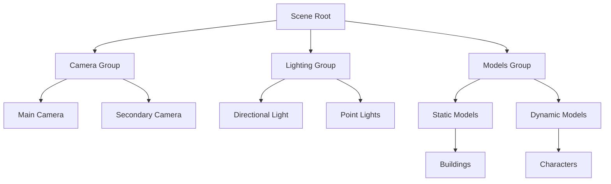

# Scene Manager

## 是什么

Scene Manager（场景管理器）是 Qt Quick 3D 中用于组织和管理 3D 场景图的概念系统。通过节点层级结构，可以有效地组织模型、光照、相机等场景元素，实现复杂场景的构建和管理。



场景管理器通过 Node 节点的父子关系构建场景图，支持变换继承、可见性控制、批量操作等功能，是构建大型 3D 应用的基础。

## 常用属性一览表

### Node 核心属性

| 属性名 | 类型 | 默认值 | 取值范围 | 作用 | 性能/质量提示 |
| ------ | ---- | ------ | -------- | ---- | -------------- |
| position★ | vector3d | (0,0,0) | 3D坐标 | 节点位置 | 相对于父节点 |
| eulerRotation | vector3d | (0,0,0) | 角度值 | 节点旋转 | 子节点继承旋转 |
| scale | vector3d | (1,1,1) | 缩放因子 | 节点缩放 | 子节点继承缩放 |
| visible★ | bool | true | true/false | 可见性 | 影响所有子节点 |
| opacity | real | 1.0 | 0.0-1.0 | 透明度 | 子节点继承透明度 |

### 场景组织属性

| 属性名 | 类型 | 默认值 | 取值范围 | 作用 | 性能/质量提示 |
| ------ | ---- | ------ | -------- | ---- | -------------- |
| parent | Node | null | Node对象 | 父节点 | 定义层级关系 |
| children | list | [] | Node列表 | 子节点列表 | 只读属性 |

★ 标记表示高频使用属性

## 属性详解

### position★ (高频属性)

position 定义节点在 3D 空间中的位置，是相对于父节点的局部坐标。

**使用场景：**
- 组织场景元素的空间关系
- 实现对象的移动动画
- 构建复杂的层级结构
- 批量移动一组对象

**注意事项：**
- 位置是相对于父节点的局部坐标
- 修改父节点位置会影响所有子节点的世界坐标
- 可以使用 scenePosition 获取世界坐标
- 频繁修改会触发场景图更新

### visible★ (高频属性)

visible 控制节点及其所有子节点的可见性，是场景管理的重要工具。

**使用场景：**
- 显示/隐藏整个场景分组
- 实现LOD（细节层次）系统
- 场景切换和状态管理
- 性能优化（隐藏不需要的对象）

**注意事项：**
- 隐藏父节点会隐藏所有子节点
- 隐藏的对象不参与渲染但仍在场景图中
- 隐藏对象仍会参与包围盒计算
- 可以用于实现简单的场景管理

## 最小可运行示例

**文件树：**
```
project/
├── main.qml
├── main.cpp
└── CMakeLists.txt
```

**完整代码：**

main.qml:
```qml
import QtQuick
import QtQuick3D
import QtQuick.Controls

Window {
    width: 1280
    height: 720
    visible: true
    title: "Scene Manager 场景管理示例"

    View3D {
        id: view3d
        anchors.fill: parent
        
        environment: SceneEnvironment {
            backgroundMode: SceneEnvironment.Color
            clearColor: "#1a1a2e"
            antialiasingMode: SceneEnvironment.MSAA
        }
        
        PerspectiveCamera {
            id: camera
            position: Qt.vector3d(0, 200, 800)
            eulerRotation.x: -15
        }
        
        DirectionalLight {
            eulerRotation.x: -45
            eulerRotation.y: 45
            brightness: 1.5
        }
        
        // 场景根节点
        Node {
            id: sceneRoot
            
            // 建筑群组
            Node {
                id: buildingsGroup
                position: Qt.vector3d(-300, 0, 0)
                
                Repeater3D {
                    model: 5
                    Model {
                        source: "#Cube"
                        position: Qt.vector3d(index * 80, 0, 0)
                        scale: Qt.vector3d(1, 2 + index * 0.5, 1)
                        materials: PrincipledMaterial {
                            baseColor: "#95a5a6"
                            metalness: 0.3
                            roughness: 0.7
                        }
                    }
                }
            }
            
            // 树木群组
            Node {
                id: treesGroup
                position: Qt.vector3d(200, 0, -100)
                
                Repeater3D {
                    model: 8
                    Model {
                        source: "#Cone"
                        position: Qt.vector3d(
                            (index % 4) * 60,
                            0,
                            Math.floor(index / 4) * 60
                        )
                        scale: Qt.vector3d(0.5, 1.5, 0.5)
                        materials: PrincipledMaterial {
                            baseColor: "#27ae60"
                            roughness: 0.9
                        }
                    }
                }
            }
            
            // 动态对象群组
            Node {
                id: dynamicGroup
                position: Qt.vector3d(0, 50, 100)
                
                SequentialAnimation on eulerRotation.y {
                    loops: Animation.Infinite
                    NumberAnimation { from: 0; to: 360; duration: 10000 }
                }
                
                // 中心对象
                Model {
                    source: "#Sphere"
                    scale: Qt.vector3d(1.5, 1.5, 1.5)
                    materials: PrincipledMaterial {
                        baseColor: "#e74c3c"
                        metalness: 0.8
                        roughness: 0.2
                    }
                }
                
                // 环绕对象
                Repeater3D {
                    model: 6
                    Model {
                        source: "#Cube"
                        position: Qt.vector3d(
                            Math.cos(index * 60 * Math.PI / 180) * 100,
                            0,
                            Math.sin(index * 60 * Math.PI / 180) * 100
                        )
                        scale: Qt.vector3d(0.5, 0.5, 0.5)
                        materials: PrincipledMaterial {
                            baseColor: "#3498db"
                            metalness: 0.5
                            roughness: 0.3
                        }
                    }
                }
            }
            
            // 地面
            Model {
                source: "#Rectangle"
                scale: Qt.vector3d(50, 50, 1)
                position.y: -50
                eulerRotation.x: -90
                materials: PrincipledMaterial {
                    baseColor: "#34495e"
                    metalness: 0.1
                    roughness: 0.9
                }
            }
        }
    }
    
    // 场景控制面板
    Rectangle {
        anchors.right: parent.right
        anchors.top: parent.top
        anchors.margins: 20
        width: 280
        height: 350
        color: "#cc000000"
        radius: 10
        
        Column {
            anchors.fill: parent
            anchors.margins: 15
            spacing: 15
            
            Text {
                text: "场景管理器"
                color: "white"
                font.pixelSize: 18
                font.bold: true
            }
            
            // 建筑群组控制
            Column {
                width: parent.width
                spacing: 5
                
                Row {
                    width: parent.width
                    spacing: 10
                    
                    CheckBox {
                        id: buildingsVisible
                        checked: true
                        onCheckedChanged: buildingsGroup.visible = checked
                    }
                    
                    Text {
                        text: "建筑群组"
                        color: "#95a5a6"
                        font.pixelSize: 14
                        anchors.verticalCenter: parent.verticalCenter
                    }
                }
                
                Slider {
                    width: parent.width
                    from: -500
                    to: 500
                    value: buildingsGroup.position.x
                    enabled: buildingsVisible.checked
                    onValueChanged: buildingsGroup.position.x = value
                }
            }
            
            // 树木群组控制
            Column {
                width: parent.width
                spacing: 5
                
                Row {
                    width: parent.width
                    spacing: 10
                    
                    CheckBox {
                        id: treesVisible
                        checked: true
                        onCheckedChanged: treesGroup.visible = checked
                    }
                    
                    Text {
                        text: "树木群组"
                        color: "#27ae60"
                        font.pixelSize: 14
                        anchors.verticalCenter: parent.verticalCenter
                    }
                }
                
                Slider {
                    width: parent.width
                    from: 0.5
                    to: 2.0
                    value: 1.0
                    enabled: treesVisible.checked
                    onValueChanged: {
                        treesGroup.scale = Qt.vector3d(value, value, value)
                    }
                }
            }
            
            // 动态群组控制
            Column {
                width: parent.width
                spacing: 5
                
                Row {
                    width: parent.width
                    spacing: 10
                    
                    CheckBox {
                        id: dynamicVisible
                        checked: true
                        onCheckedChanged: dynamicGroup.visible = checked
                    }
                    
                    Text {
                        text: "动态群组"
                        color: "#e74c3c"
                        font.pixelSize: 14
                        anchors.verticalCenter: parent.verticalCenter
                    }
                }
            }
            
            // 全局控制
            Rectangle {
                width: parent.width
                height: 1
                color: "#555"
            }
            
            Button {
                text: "显示全部"
                width: parent.width
                onClicked: {
                    buildingsVisible.checked = true
                    treesVisible.checked = true
                    dynamicVisible.checked = true
                }
            }
            
            Button {
                text: "隐藏全部"
                width: parent.width
                onClicked: {
                    buildingsVisible.checked = false
                    treesVisible.checked = false
                    dynamicVisible.checked = false
                }
            }
        }
    }
}
```

CMakeLists.txt:
```cmake
cmake_minimum_required(VERSION 3.16)
project(SceneManagerExample VERSION 1.0 LANGUAGES CXX)

set(CMAKE_CXX_STANDARD 17)
set(CMAKE_CXX_STANDARD_REQUIRED ON)

find_package(Qt6 REQUIRED COMPONENTS Quick Quick3D)

qt_add_executable(SceneManagerExample main.cpp)

qt_add_qml_module(SceneManagerExample
    URI SceneManagerExample
    VERSION 1.0
    QML_FILES main.qml
)

target_link_libraries(SceneManagerExample PRIVATE
    Qt6::Quick
    Qt6::Quick3D
)

set_target_properties(SceneManagerExample PROPERTIES
    WIN32_EXECUTABLE TRUE
    MACOSX_BUNDLE TRUE
)
```

main.cpp:
```cpp
#include <QGuiApplication>
#include <QQmlApplicationEngine>

int main(int argc, char *argv[])
{
    QGuiApplication app(argc, argv);
    QQmlApplicationEngine engine;
    
    const QUrl url(u"qrc:/SceneManagerExample/main.qml"_qs);
    engine.load(url);
    
    return app.exec();
}
```

## 常见问题与调试

### 1. 变换不生效

**解决方案：**
```qml
Node {
    id: parentNode
    position: Qt.vector3d(100, 0, 0)
    
    Model {
        // 相对于父节点的位置
        position: Qt.vector3d(50, 0, 0)
        // 世界坐标为 (150, 0, 0)
    }
}
```

### 2. 场景组织最佳实践

**解决方案：**
```qml
Node {
    id: sceneRoot
    
    // 按功能分组
    Node {
        id: staticGeometry
        // 静态几何体
    }
    
    Node {
        id: dynamicObjects
        // 动态对象
    }
    
    Node {
        id: lighting
        // 光照
    }
    
    Node {
        id: effects
        // 特效
    }
}
```

## 实战技巧

### 1. LOD 系统

```qml
Node {
    id: lodObject
    
    property real distanceToCamera: {
        let dx = position.x - camera.position.x
        let dy = position.y - camera.position.y
        let dz = position.z - camera.position.z
        return Math.sqrt(dx*dx + dy*dy + dz*dz)
    }
    
    // 高细节模型
    Model {
        source: "high_detail.mesh"
        visible: lodObject.distanceToCamera < 200
    }
    
    // 中细节模型
    Model {
        source: "medium_detail.mesh"
        visible: lodObject.distanceToCamera >= 200 && 
                 lodObject.distanceToCamera < 500
    }
    
    // 低细节模型
    Model {
        source: "low_detail.mesh"
        visible: lodObject.distanceToCamera >= 500
    }
}
```

### 2. 场景状态管理

```qml
Node {
    id: gameScene
    
    property string currentState: "menu"
    
    Node {
        id: menuScene
        visible: gameScene.currentState === "menu"
    }
    
    Node {
        id: gameplayScene
        visible: gameScene.currentState === "gameplay"
    }
    
    Node {
        id: pauseScene
        visible: gameScene.currentState === "pause"
    }
    
    function setState(newState) {
        currentState = newState
    }
}
```

### 3. 批量操作

```qml
Node {
    id: enemiesGroup
    
    function hideAll() {
        for (let i = 0; i < children.length; i++) {
            children[i].visible = false
        }
    }
    
    function showAll() {
        for (let i = 0; i < children.length; i++) {
            children[i].visible = true
        }
    }
    
    function moveAll(offset) {
        for (let i = 0; i < children.length; i++) {
            children[i].position = children[i].position.plus(offset)
        }
    }
}
```

## 延伸阅读

- [Qt Quick 3D - Node](https://doc.qt.io/qt-6/qml-qtquick3d-node.html)
- [Qt-Quick-Spatial-Scene-Graph.md](./Qt-Quick-Spatial-Scene-Graph.md)
- [Scene-Rendering.md](./Scene-Rendering.md)
- [Quick-3D.md](./Quick-3D.md)
