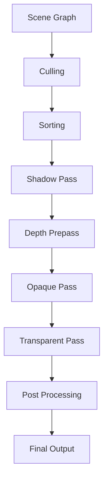

# Scene Rendering

## 是什么

Scene Rendering（场景渲染）是 Qt Quick 3D 将 3D 场景图转换为屏幕图像的完整过程。理解渲染管线有助于优化性能和实现高级渲染效果。



Qt Quick 3D 的渲染管线包括视锥体裁剪、深度预处理、不透明物体渲染、透明物体渲染和后处理等多个阶段。

## 常用属性一览表

### SceneEnvironment 渲染属性

| 属性名 | 类型 | 默认值 | 取值范围 | 作用 | 性能/质量提示 |
| ------ | ---- | ------ | -------- | ---- | -------------- |
| depthTestEnabled★ | bool | true | true/false | 启用深度测试 | 必须启用以正确渲染 |
| depthPrePassEnabled | bool | false | true/false | 深度预处理 | 可减少overdraw |
| effects | list | [] | Effect列表 | 后处理效果 | 影响性能 |

★ 标记表示高频使用属性

## 属性详解

### depthTestEnabled★ (高频属性)

控制是否启用深度测试，决定物体的前后遮挡关系。

**使用场景：**
- 正常3D渲染（必须启用）
- 特殊效果（可能禁用）

**注意事项：**
- 默认启用，通常不需要修改
- 禁用会导致渲染顺序错误

### depthPrePassEnabled (优化属性)

启用深度预处理可以减少像素着色器的overdraw。

**使用场景：**
- 复杂场景优化
- 高分辨率渲染

**注意事项：**
- 增加一个渲染pass
- 适合片段着色器复杂的场景

## 最小可运行示例

**完整代码：**

main.qml:
```qml
import QtQuick
import QtQuick3D

Window {
    width: 1280
    height: 720
    visible: true
    title: "Scene Rendering 场景渲染示例"

    View3D {
        id: view3d
        anchors.fill: parent
        
        environment: SceneEnvironment {
            id: sceneEnv
            backgroundMode: SceneEnvironment.Color
            clearColor: "#1a1a2e"
            
            // 渲染设置
            depthTestEnabled: true
            depthPrePassEnabled: depthPrePassCheck.checked
            
            // 抗锯齿
            antialiasingMode: aaCombo.currentIndex === 0 ? SceneEnvironment.NoAA :
                             aaCombo.currentIndex === 1 ? SceneEnvironment.MSAA :
                             SceneEnvironment.SSAA
            antialiasingQuality: SceneEnvironment.High
        }
        
        PerspectiveCamera {
            position: Qt.vector3d(0, 100, 400)
            eulerRotation.x: -15
        }
        
        DirectionalLight {
            eulerRotation.x: -45
            eulerRotation.y: 45
            brightness: 1.5
            castsShadow: shadowCheck.checked
            shadowMapQuality: Light.ShadowMapQualityHigh
        }
        
        // 不透明物体
        Model {
            source: "#Cube"
            position: Qt.vector3d(-100, 0, 0)
            materials: PrincipledMaterial {
                baseColor: "#e74c3c"
                metalness: 0.5
                roughness: 0.3
            }
            
            SequentialAnimation on eulerRotation.y {
                loops: Animation.Infinite
                NumberAnimation { from: 0; to: 360; duration: 3000 }
            }
        }
        
        // 半透明物体
        Model {
            source: "#Sphere"
            position: Qt.vector3d(100, 0, 0)
            materials: PrincipledMaterial {
                baseColor: "#3498db"
                opacity: 0.6
                metalness: 0.8
                roughness: 0.2
            }
            
            SequentialAnimation on eulerRotation.x {
                loops: Animation.Infinite
                NumberAnimation { from: 0; to: 360; duration: 4000 }
            }
        }
        
        // 地面
        Model {
            source: "#Rectangle"
            scale: Qt.vector3d(20, 20, 1)
            position.y: -50
            eulerRotation.x: -90
            materials: PrincipledMaterial {
                baseColor: "#34495e"
                metalness: 0.1
                roughness: 0.9
            }
        }
        
        // 性能统计
        property int frameCount: 0
        property real lastTime: Date.now()
        property real fps: 0
        
        onAfterRendering: {
            frameCount++
            let currentTime = Date.now()
            if (currentTime - lastTime >= 1000) {
                fps = frameCount / ((currentTime - lastTime) / 1000)
                frameCount = 0
                lastTime = currentTime
            }
        }
    }
    
    // 控制面板
    Rectangle {
        anchors.right: parent.right
        anchors.top: parent.top
        anchors.margins: 20
        width: 300
        height: 400
        color: "#cc000000"
        radius: 10
        
        Column {
            anchors.fill: parent
            anchors.margins: 15
            spacing: 15
            
            Text {
                text: "渲染设置"
                color: "white"
                font.pixelSize: 18
                font.bold: true
            }
            
            // 抗锯齿设置
            Column {
                width: parent.width
                spacing: 5
                
                Text {
                    text: "抗锯齿模式"
                    color: "#ffe66d"
                    font.pixelSize: 14
                }
                
                ComboBox {
                    id: aaCombo
                    width: parent.width
                    model: ["NoAA", "MSAA", "SSAA"]
                    currentIndex: 1
                }
            }
            
            // 阴影设置
            CheckBox {
                id: shadowCheck
                text: "启用阴影"
                checked: true
            }
            
            // 深度预处理
            CheckBox {
                id: depthPrePassCheck
                text: "深度预处理"
                checked: false
            }
            
            Rectangle {
                width: parent.width
                height: 1
                color: "#555"
            }
            
            // 性能信息
            Column {
                width: parent.width
                spacing: 5
                
                Text {
                    text: "性能统计"
                    color: "#ffe66d"
                    font.pixelSize: 14
                }
                
                Text {
                    text: "FPS: " + view3d.fps.toFixed(1)
                    color: view3d.fps > 50 ? "#2ecc71" : 
                           view3d.fps > 30 ? "#f39c12" : "#e74c3c"
                    font.pixelSize: 16
                    font.bold: true
                }
            }
            
            Rectangle {
                width: parent.width
                height: 1
                color: "#555"
            }
            
            // 渲染管线说明
            Column {
                width: parent.width
                spacing: 5
                
                Text {
                    text: "渲染管线："
                    color: "#ffe66d"
                    font.pixelSize: 12
                }
                
                Text {
                    text: "1. 视锥体裁剪\n2. 阴影渲染\n3. 深度预处理\n4. 不透明物体\n5. 透明物体\n6. 后处理"
                    color: "#aaaaaa"
                    font.pixelSize: 11
                    wrapMode: Text.WordWrap
                    width: parent.width
                }
            }
        }
    }
}
```

## 常见问题与调试

### 1. 透明物体渲染顺序错误

**解决方案：**
```qml
Model {
    materials: PrincipledMaterial {
        opacity: 0.5
        // 透明物体会自动按深度排序
    }
}
```

### 2. Z-Fighting 问题

**解决方案：**
```qml
Model {
    // 调整深度偏移
    depthBias: 0.01
}
```

### 3. 性能优化

**解决方案：**
```qml
SceneEnvironment {
    // 禁用不必要的特性
    depthPrePassEnabled: false
    
    // 降低抗锯齿质量
    antialiasingMode: SceneEnvironment.NoAA
}

DirectionalLight {
    // 降低阴影质量
    castsShadow: false
}
```

## 实战技巧

### 1. 自定义渲染顺序

```qml
Model {
    // 使用 z 值控制渲染顺序
    z: 10  // 较大的值后渲染
}
```

### 2. 多pass渲染

```qml
View3D {
    // 第一pass：渲染到纹理
    renderMode: View3D.Offscreen
}
```

### 3. 性能监控

```qml
View3D {
    property int drawCalls: 0
    
    onBeforeRendering: {
        // 统计绘制调用
    }
}
```

## 延伸阅读

- [Qt Quick 3D - Rendering](https://doc.qt.io/qt-6/qtquick3d-index.html)
- [Frontend-Backend-synchronization.md](./Frontend-Backend-synchronization.md)
- [Qt-Quick-Spatial-Scene-Graph.md](./Qt-Quick-Spatial-Scene-Graph.md)
- [Quick-3D.md](./Quick-3D.md)
