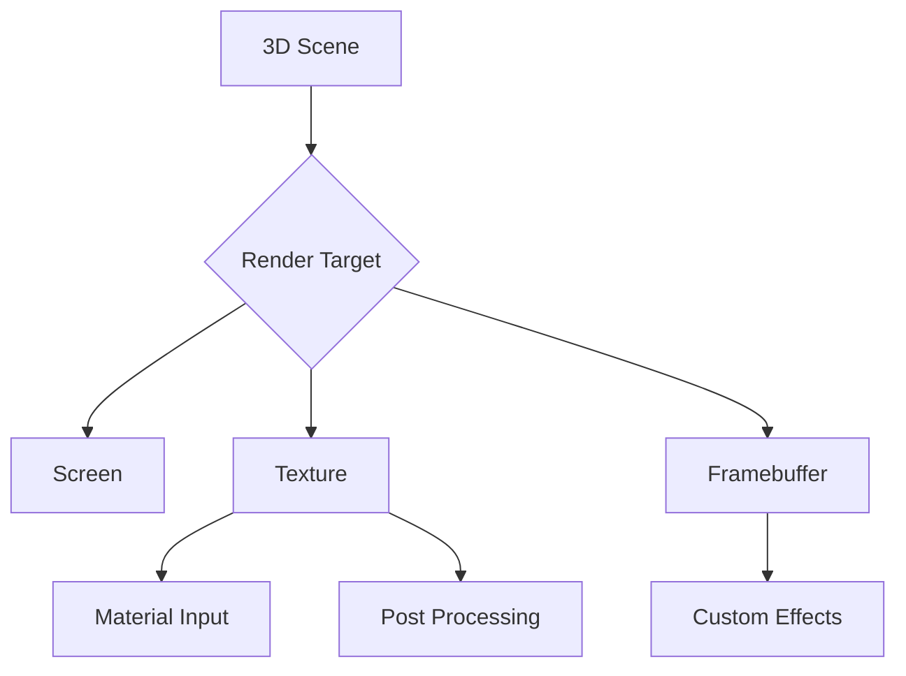

# Set up Render Target

## 是什么

Set up Render Target（设置渲染目标）是指配置 3D 场景渲染到特定目标的过程，可以是屏幕、纹理或帧缓冲区。通过自定义渲染目标，可以实现离屏渲染、多pass渲染、后处理效果等高级功能。



渲染目标决定了渲染结果的输出位置，是实现复杂渲染效果的基础。

## 常用属性一览表

### SceneEnvironment 渲染目标属性

| 属性名 | 类型 | 默认值 | 取值范围 | 作用 | 性能/质量提示 |
| ------ | ---- | ------ | -------- | ---- | -------------- |
| renderMode★ | enum | Offscreen | Offscreen/Underlay/Overlay | 渲染模式 | 影响渲染目标类型 |

### Texture 作为渲染目标

| 属性名 | 类型 | 默认值 | 取值范围 | 作用 | 性能/质量提示 |
| ------ | ---- | ------ | -------- | ---- | -------------- |
| sourceItem★ | Item | null | Qt Quick Item | 2D内容源 | 渲染2D到纹理 |
| layer.enabled | bool | false | true/false | 启用层渲染 | 必须启用 |
| layer.textureSize | size | (0,0) | 像素尺寸 | 纹理分辨率 | 影响质量和性能 |

★ 标记表示高频使用属性

## 属性详解

### renderMode★ (高频属性)

renderMode 决定 View3D 的渲染目标类型。

**使用场景：**
- Offscreen：渲染到纹理（默认）
- Underlay：直接渲染到屏幕（3D在下）
- Overlay：直接渲染到屏幕（3D在上）

**注意事项：**
- Offscreen 模式创建离屏渲染目标
- Underlay/Overlay 直接渲染到屏幕
- 选择合适模式平衡性能和功能

## 最小可运行示例

**完整代码：**

main.qml:
```qml
import QtQuick
import QtQuick3D

Window {
    width: 1280
    height: 720
    visible: true
    title: "Set up Render Target 渲染目标示例"

    Row {
        anchors.fill: parent
        spacing: 20
        padding: 20
        
        // 示例1：渲染到纹理用于材质
        Column {
            width: (parent.width - 60) / 2
            height: parent.height - 40
            spacing: 10
            
            Text {
                text: "渲染到纹理"
                font.pixelSize: 18
                font.bold: true
            }
            
            // 3D场景渲染到纹理
            View3D {
                id: renderToTexture
                width: parent.width
                height: parent.height - 30
                renderMode: View3D.Offscreen
                
                environment: SceneEnvironment {
                    backgroundMode: SceneEnvironment.Color
                    clearColor: "#2c3e50"
                }
                
                PerspectiveCamera {
                    position: Qt.vector3d(0, 0, 300)
                }
                
                DirectionalLight { }
                
                Model {
                    source: "#Cube"
                    materials: PrincipledMaterial {
                        baseColor: "#e74c3c"
                        metalness: 0.8
                        roughness: 0.2
                    }
                    
                    SequentialAnimation on eulerRotation.y {
                        loops: Animation.Infinite
                        NumberAnimation { from: 0; to: 360; duration: 3000 }
                    }
                }
            }
        }
        
        // 示例2：使用渲染纹理
        Column {
            width: (parent.width - 60) / 2
            height: parent.height - 40
            spacing: 10
            
            Text {
                text: "使用渲染纹理"
                font.pixelSize: 18
                font.bold: true
            }
            
            View3D {
                width: parent.width
                height: parent.height - 30
                
                environment: SceneEnvironment {
                    backgroundMode: SceneEnvironment.Color
                    clearColor: "#1a1a2e"
                }
                
                PerspectiveCamera {
                    position: Qt.vector3d(0, 0, 400)
                }
                
                DirectionalLight { }
                
                // 使用第一个View3D的渲染结果作为纹理
                Model {
                    source: "#Sphere"
                    scale: Qt.vector3d(1.5, 1.5, 1.5)
                    
                    materials: PrincipledMaterial {
                        baseColorMap: Texture {
                            sourceItem: renderToTexture
                        }
                        metalness: 0.3
                        roughness: 0.5
                    }
                    
                    SequentialAnimation on eulerRotation.x {
                        loops: Animation.Infinite
                        NumberAnimation { from: 0; to: 360; duration: 5000 }
                    }
                }
            }
        }
    }
    
    // 信息面板
    Rectangle {
        anchors.left: parent.left
        anchors.bottom: parent.bottom
        anchors.margins: 20
        width: 350
        height: 200
        color: "#cc000000"
        radius: 10
        
        Column {
            anchors.fill: parent
            anchors.margins: 15
            spacing: 10
            
            Text {
                text: "渲染目标设置"
                color: "white"
                font.pixelSize: 16
                font.bold: true
            }
            
            Text {
                text: "左侧："
                color: "#ffe66d"
                font.pixelSize: 12
            }
            
            Text {
                text: "• View3D 渲染到离屏纹理\n• 可作为其他材质的输入"
                color: "#aaaaaa"
                font.pixelSize: 11
                wrapMode: Text.WordWrap
                width: parent.width
            }
            
            Text {
                text: "右侧："
                color: "#ffe66d"
                font.pixelSize: 12
            }
            
            Text {
                text: "• 使用左侧渲染结果\n• 应用到球体表面"
                color: "#aaaaaa"
                font.pixelSize: 11
                wrapMode: Text.WordWrap
                width: parent.width
            }
        }
    }
}
```

## 常见问题与调试

### 1. 渲染目标不更新

**解决方案：**
```qml
View3D {
    renderMode: View3D.Offscreen
    // 确保场景有变化才会更新
    
    Model {
        // 添加动画确保持续更新
        SequentialAnimation on eulerRotation.y {
            loops: Animation.Infinite
            NumberAnimation { from: 0; to: 360; duration: 3000 }
        }
    }
}
```

### 2. 纹理分辨率问题

**解决方案：**
```qml
View3D {
    width: 1024
    height: 1024
    // 尺寸影响渲染纹理分辨率
}
```

### 3. 性能优化

**解决方案：**
```qml
View3D {
    renderMode: View3D.Offscreen
    
    // 降低渲染质量
    environment: SceneEnvironment {
        antialiasingMode: SceneEnvironment.NoAA
    }
    
    // 限制更新频率
    property bool needsUpdate: true
}
```

## 实战技巧

### 1. 镜面反射

```qml
// 主场景
View3D {
    Model {
        id: mainObject
        source: "#Cube"
    }
}

// 镜面渲染
View3D {
    id: mirrorView
    renderMode: View3D.Offscreen
    
    // 镜像相机
    PerspectiveCamera {
        position: Qt.vector3d(
            mainCamera.position.x,
            -mainCamera.position.y,
            mainCamera.position.z
        )
    }
    
    // 渲染相同场景
}

// 镜面
Model {
    source: "#Rectangle"
    materials: PrincipledMaterial {
        baseColorMap: Texture {
            sourceItem: mirrorView
        }
        metalness: 1.0
        roughness: 0.0
    }
}
```

### 2. 小地图

```qml
// 主视图
View3D {
    id: mainView
    anchors.fill: parent
}

// 小地图
View3D {
    id: minimap
    width: 200
    height: 200
    anchors.top: parent.top
    anchors.right: parent.right
    anchors.margins: 20
    
    renderMode: View3D.Offscreen
    
    // 俯视相机
    OrthographicCamera {
        position: Qt.vector3d(0, 1000, 0)
        eulerRotation.x: -90
    }
    
    // 共享场景
    importScene: mainView.scene
}
```

### 3. 后处理效果

```qml
// 渲染到纹理
View3D {
    id: sceneRender
    visible: false
    renderMode: View3D.Offscreen
    
    // 原始场景
}

// 应用后处理
ShaderEffect {
    anchors.fill: parent
    
    property variant source: sceneRender
    
    fragmentShader: "
        varying highp vec2 qt_TexCoord0;
        uniform sampler2D source;
        void main() {
            vec4 color = texture2D(source, qt_TexCoord0);
            // 应用后处理效果
            gl_FragColor = color;
        }
    "
}
```

### 4. 多视口渲染

```qml
Row {
    // 主视图
    View3D {
        width: parent.width * 0.7
        height: parent.height
        
        camera: mainCamera
        importScene: sharedScene
    }
    
    Column {
        width: parent.width * 0.3
        height: parent.height
        
        // 顶视图
        View3D {
            width: parent.width
            height: parent.height / 2
            
            camera: topCamera
            importScene: sharedScene
        }
        
        // 侧视图
        View3D {
            width: parent.width
            height: parent.height / 2
            
            camera: sideCamera
            importScene: sharedScene
        }
    }
}

Node {
    id: sharedScene
    // 共享的场景内容
}
```

## 延伸阅读

- [Qt Quick 3D - View3D](https://doc.qt.io/qt-6/qml-qtquick3d-view3d.html)
- [Scene-Rendering.md](./Scene-Rendering.md)
- [View3D-renderMode.md](./View3D-renderMode.md)
- [2D-in-3D-Integration-Texture-Path.md](./2D-in-3D-Integration-Texture-Path.md)
