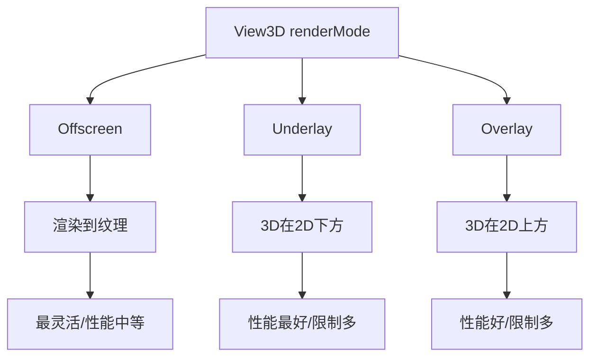

# View3D renderMode

## 是什么

View3D renderMode 属性控制 3D 内容如何与 2D Qt Quick 内容集成和渲染。不同的渲染模式在性能、灵活性和使用场景上各有特点。



## 常用属性一览表

### renderMode 枚举值

| 模式 | 描述 | 性能 | 灵活性 | 使用场景 |
| ---- | ---- | ---- | ------ | -------- |
| Offscreen★ | 3D渲染到离屏纹理 | 中等 | 最高 | 默认模式，2D/3D任意混合 |
| Underlay | 3D在2D下方渲染 | 最好 | 低 | 3D背景，2D UI覆盖 |
| Overlay | 3D在2D上方渲染 | 好 | 低 | 3D覆盖层，2D背景 |
| Inline | 内联渲染 | 好 | 中 | Qt 6.4+ 新增模式 |

★ 标记表示默认模式

## 属性详解

### Offscreen 模式

3D 内容渲染到离屏纹理，然后作为 2D 纹理合成到最终画面。

**优点：**
- 最灵活，支持任意 2D/3D 混合
- 支持透明度和混合模式
- 可以应用 2D 效果（如模糊、阴影）

**缺点：**
- 需要额外的纹理内存
- 多一次渲染传递
- 性能略低于 Underlay/Overlay

**使用场景：**
```qml
View3D {
    renderMode: View3D.Offscreen  // 默认值
    
    // 可以与2D内容任意混合
    Rectangle {
        // 2D内容可以在3D上方或下方
    }
}
```

### Underlay 模式

3D 内容直接渲染到后缓冲区，2D 内容渲染在其上方。

**优点：**
- 性能最好，无额外纹理开销
- 适合 3D 背景场景

**缺点：**
- 3D 始终在 2D 下方
- 不支持 3D 透明度
- 2D 内容必须覆盖在 3D 上

**使用场景：**
```qml
View3D {
    renderMode: View3D.Underlay
    anchors.fill: parent
    
    // 3D 背景
    Model { source: "#Cube" }
}

// 2D UI 覆盖层
Rectangle {
    // 始终在 3D 上方
}
```

### Overlay 模式

2D 内容先渲染，3D 内容渲染在其上方。

**优点：**
- 性能好
- 适合 3D 覆盖效果

**缺点：**
- 3D 始终在 2D 上方
- 灵活性受限

**使用场景：**
```qml
Rectangle {
    // 2D 背景
}

View3D {
    renderMode: View3D.Overlay
    // 3D 覆盖层
}
```

## 最小可运行示例

**完整代码：**

main.qml:
```qml
import QtQuick
import QtQuick3D
import QtQuick.Controls

Window {
    width: 1280
    height: 720
    visible: true
    title: "View3D renderMode 示例"

    StackLayout {
        anchors.fill: parent
        currentIndex: modeSelector.currentIndex
        
        // Offscreen 模式示例
        Item {
            Rectangle {
                anchors.fill: parent
                color: "#2c3e50"
            }
            
            // 2D 背景元素
            Rectangle {
                x: 100
                y: 100
                width: 200
                height: 200
                color: "#e74c3c"
                opacity: 0.7
            }
            
            // 3D 内容
            View3D {
                anchors.centerIn: parent
                width: 600
                height: 600
                renderMode: View3D.Offscreen
                
                environment: SceneEnvironment {
                    backgroundMode: SceneEnvironment.Transparent
                }
                
                PerspectiveCamera {
                    position: Qt.vector3d(0, 0, 300)
                }
                
                DirectionalLight { }
                
                Model {
                    source: "#Cube"
                    materials: PrincipledMaterial {
                        baseColor: "#3498db"
                        opacity: 0.8
                    }
                    
                    SequentialAnimation on eulerRotation.y {
                        loops: Animation.Infinite
                        NumberAnimation { from: 0; to: 360; duration: 3000 }
                    }
                }
            }
            
            // 2D 前景元素
            Rectangle {
                x: 900
                y: 400
                width: 200
                height: 200
                color: "#f39c12"
                opacity: 0.7
            }
            
            Text {
                anchors.top: parent.top
                anchors.horizontalCenter: parent.horizontalCenter
                anchors.margins: 20
                text: "Offscreen 模式\n2D和3D可以任意混合"
                color: "white"
                font.pixelSize: 18
                horizontalAlignment: Text.AlignHCenter
            }
        }
        
        // Underlay 模式示例
        Item {
            View3D {
                anchors.fill: parent
                renderMode: View3D.Underlay
                
                environment: SceneEnvironment {
                    backgroundMode: SceneEnvironment.Color
                    clearColor: "#1a1a2e"
                }
                
                PerspectiveCamera {
                    position: Qt.vector3d(0, 0, 500)
                }
                
                DirectionalLight { }
                
                Model {
                    source: "#Sphere"
                    scale: Qt.vector3d(2, 2, 2)
                    materials: PrincipledMaterial {
                        baseColor: "#9b59b6"
                        metalness: 0.8
                        roughness: 0.2
                    }
                    
                    SequentialAnimation on eulerRotation.y {
                        loops: Animation.Infinite
                        NumberAnimation { from: 0; to: 360; duration: 4000 }
                    }
                }
            }
            
            // 2D UI 覆盖层
            Rectangle {
                anchors.centerIn: parent
                width: 400
                height: 300
                color: "#cc000000"
                radius: 15
                
                Column {
                    anchors.centerIn: parent
                    spacing: 20
                    
                    Text {
                        text: "Underlay 模式"
                        color: "white"
                        font.pixelSize: 24
                        font.bold: true
                        anchors.horizontalCenter: parent.horizontalCenter
                    }
                    
                    Text {
                        text: "3D 在 2D 下方\n性能最好"
                        color: "#bdc3c7"
                        font.pixelSize: 16
                        horizontalAlignment: Text.AlignHCenter
                        anchors.horizontalCenter: parent.horizontalCenter
                    }
                    
                    Button {
                        text: "示例按钮"
                        anchors.horizontalCenter: parent.horizontalCenter
                    }
                }
            }
        }
        
        // Overlay 模式示例
        Item {
            Rectangle {
                anchors.fill: parent
                gradient: Gradient {
                    GradientStop { position: 0.0; color: "#667eea" }
                    GradientStop { position: 1.0; color: "#764ba2" }
                }
            }
            
            Text {
                anchors.centerIn: parent
                text: "2D 背景内容"
                color: "white"
                font.pixelSize: 48
                font.bold: true
            }
            
            View3D {
                anchors.fill: parent
                renderMode: View3D.Overlay
                
                environment: SceneEnvironment {
                    backgroundMode: SceneEnvironment.Transparent
                }
                
                PerspectiveCamera {
                    position: Qt.vector3d(0, 0, 400)
                }
                
                DirectionalLight { }
                
                Model {
                    source: "#Cylinder"
                    scale: Qt.vector3d(1.5, 1.5, 1.5)
                    materials: PrincipledMaterial {
                        baseColor: "#e74c3c"
                        metalness: 0.5
                        roughness: 0.3
                    }
                    
                    SequentialAnimation on eulerRotation.x {
                        loops: Animation.Infinite
                        NumberAnimation { from: 0; to: 360; duration: 3000 }
                    }
                }
            }
            
            Text {
                anchors.bottom: parent.bottom
                anchors.horizontalCenter: parent.horizontalCenter
                anchors.margins: 20
                text: "Overlay 模式\n3D 在 2D 上方"
                color: "white"
                font.pixelSize: 18
                horizontalAlignment: Text.AlignHCenter
            }
        }
    }
    
    // 模式选择器
    Rectangle {
        anchors.top: parent.top
        anchors.left: parent.left
        anchors.margins: 20
        width: 250
        height: 150
        color: "#cc000000"
        radius: 10
        
        Column {
            anchors.fill: parent
            anchors.margins: 15
            spacing: 10
            
            Text {
                text: "渲染模式"
                color: "white"
                font.pixelSize: 16
                font.bold: true
            }
            
            ComboBox {
                id: modeSelector
                width: parent.width
                model: ["Offscreen", "Underlay", "Overlay"]
            }
            
            Text {
                text: "切换查看不同模式效果"
                color: "#95a5a6"
                font.pixelSize: 11
                wrapMode: Text.WordWrap
                width: parent.width
            }
        }
    }
}
```

## 常见问题与调试

### 1. 选择合适的渲染模式

**决策树：**
```
需要2D/3D任意混合？
├─ 是 → Offscreen
└─ 否
    └─ 3D是背景？
        ├─ 是 → Underlay（性能最好）
        └─ 否 → Overlay
```

### 2. 性能优化

**Underlay 模式优化：**
```qml
View3D {
    renderMode: View3D.Underlay
    // 性能最好，适合移动设备
    
    environment: SceneEnvironment {
        antialiasingMode: SceneEnvironment.NoAA
    }
}
```

### 3. 透明度处理

**Offscreen 模式支持透明：**
```qml
View3D {
    renderMode: View3D.Offscreen
    
    environment: SceneEnvironment {
        backgroundMode: SceneEnvironment.Transparent
    }
    
    Model {
        materials: PrincipledMaterial {
            opacity: 0.5  // 支持透明度
        }
    }
}
```

## 实战技巧

### 1. 游戏UI（Underlay）

```qml
View3D {
    renderMode: View3D.Underlay
    anchors.fill: parent
    
    // 3D 游戏场景
}

// 2D HUD
Rectangle {
    anchors.top: parent.top
    // UI 元素
}
```

### 2. 产品展示（Offscreen）

```qml
Rectangle {
    // 2D 背景
}

View3D {
    renderMode: View3D.Offscreen
    // 3D 产品模型
}

Rectangle {
    // 2D 前景装饰
}
```

### 3. 动态切换模式

```qml
View3D {
    renderMode: highPerformanceMode 
        ? View3D.Underlay 
        : View3D.Offscreen
}
```

## 延伸阅读

- [Qt Quick 3D - View3D](https://doc.qt.io/qt-6/qml-qtquick3d-view3d.html)
- [Quick-3D.md](./Quick-3D.md)
- [Scene-Rendering.md](./Scene-Rendering.md)
- [2D-in-3D-integration-Direct-Path.md](./2D-in-3D-integration-Direct-Path.md)
