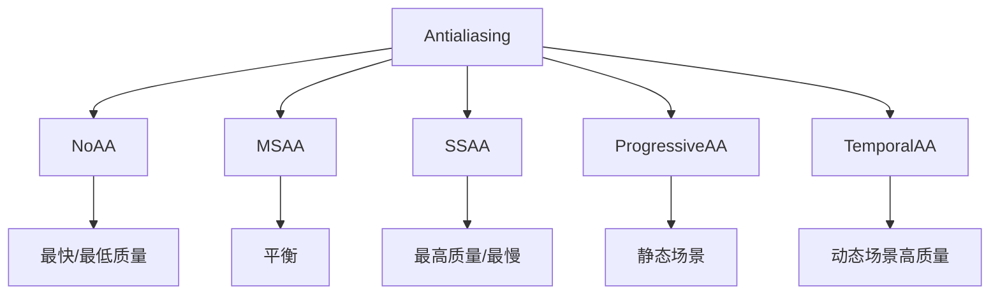

# Anti Aliasing Techniques

## 是什么

Anti Aliasing Techniques（抗锯齿技术）是消除3D渲染中锯齿状边缘的各种方法。Qt Quick 3D 支持多种抗锯齿技术，每种都有不同的性能和质量特点。



## 常用属性一览表

### SceneEnvironment 抗锯齿属性

| 属性名 | 类型 | 默认值 | 取值范围 | 作用 | 性能/质量提示 |
| ------ | ---- | ------ | -------- | ---- | -------------- |
| antialiasingMode★ | enum | NoAA | NoAA/MSAA/SSAA/ProgressiveAA/TemporalAA | 抗锯齿模式 | 核心属性 |
| antialiasingQuality | enum | Medium | Low/Medium/High/VeryHigh | 抗锯齿质量 | 影响采样数 |

★ 标记表示高频使用属性

## 抗锯齿技术对比

### NoAA（无抗锯齿）
- **性能：** ⭐⭐⭐⭐⭐
- **质量：** ⭐
- **适用：** 性能优先场景
- **特点：** 无额外开销，边缘有锯齿

### MSAA（多重采样抗锯齿）
- **性能：** ⭐⭐⭐⭐
- **质量：** ⭐⭐⭐
- **适用：** 大多数场景
- **特点：** 平衡性能和质量

### SSAA（超采样抗锯齿）
- **性能：** ⭐⭐
- **质量：** ⭐⭐⭐⭐⭐
- **适用：** 截图、高质量渲染
- **特点：** 最高质量，性能开销大

### ProgressiveAA（渐进式抗锯齿）
- **性能：** ⭐⭐⭐⭐
- **质量：** ⭐⭐⭐⭐
- **适用：** 静态场景
- **特点：** 逐帧提升质量

### TemporalAA（时间抗锯齿）
- **性能：** ⭐⭐⭐⭐
- **质量：** ⭐⭐⭐⭐
- **适用：** 动态场景
- **特点：** 利用历史帧，可能产生模糊

## 最小可运行示例

main.qml:
```qml
import QtQuick
import QtQuick3D
import QtQuick.Controls

Window {
    width: 1280
    height: 720
    visible: true
    title: "Anti Aliasing Techniques 对比"

    Row {
        anchors.fill: parent
        
        Repeater {
            model: ["NoAA", "MSAA", "SSAA", "ProgressiveAA", "TemporalAA"]
            
            Column {
                width: parent.width / 5
                height: parent.height
                
                Text {
                    text: modelData
                    color: "white"
                    font.pixelSize: 14
                    anchors.horizontalCenter: parent.horizontalCenter
                    padding: 10
                }
                
                View3D {
                    width: parent.width
                    height: parent.height - 40
                    
                    environment: SceneEnvironment {
                        backgroundMode: SceneEnvironment.Color
                        clearColor: "#1a1a2e"
                        
                        antialiasingMode: {
                            switch(modelData) {
                                case "NoAA": return SceneEnvironment.NoAA
                                case "MSAA": return SceneEnvironment.MSAA
                                case "SSAA": return SceneEnvironment.SSAA
                                case "ProgressiveAA": return SceneEnvironment.ProgressiveAA
                                case "TemporalAA": return SceneEnvironment.TemporalAA
                            }
                        }
                        
                        antialiasingQuality: SceneEnvironment.High
                    }
                    
                    PerspectiveCamera {
                        position: Qt.vector3d(0, 0, 200)
                    }
                    
                    DirectionalLight { }
                    
                    Model {
                        source: "#Cube"
                        eulerRotation: Qt.vector3d(30, 45, 0)
                        materials: PrincipledMaterial {
                            baseColor: "#3498db"
                        }
                    }
                }
            }
        }
    }
}
```

## 选择指南

### 移动设备
```qml
SceneEnvironment {
    antialiasingMode: SceneEnvironment.NoAA
    // 或 MSAA Low quality
}
```

### 桌面应用
```qml
SceneEnvironment {
    antialiasingMode: SceneEnvironment.MSAA
    antialiasingQuality: SceneEnvironment.High
}
```

### 静态场景
```qml
SceneEnvironment {
    antialiasingMode: SceneEnvironment.ProgressiveAA
}
```

### 高质量动态场景
```qml
SceneEnvironment {
    antialiasingMode: SceneEnvironment.TemporalAA
}
```

### 截图/渲染
```qml
SceneEnvironment {
    antialiasingMode: SceneEnvironment.SSAA
    antialiasingQuality: SceneEnvironment.VeryHigh
}
```

## 实战技巧

### 1. 自适应抗锯齿

```qml
SceneEnvironment {
    antialiasingMode: {
        if (Qt.platform.os === "android" || Qt.platform.os === "ios")
            return SceneEnvironment.NoAA
        else if (sceneIsStatic)
            return SceneEnvironment.ProgressiveAA
        else
            return SceneEnvironment.TemporalAA
    }
}
```

### 2. 性能模式切换

```qml
property bool highPerformanceMode: false

SceneEnvironment {
    antialiasingMode: highPerformanceMode ? 
        SceneEnvironment.NoAA : 
        SceneEnvironment.MSAA
}
```

### 3. 质量设置

```qml
property int qualityLevel: 2  // 0=Low, 1=Medium, 2=High

SceneEnvironment {
    antialiasingMode: SceneEnvironment.MSAA
    antialiasingQuality: {
        switch(qualityLevel) {
            case 0: return SceneEnvironment.Low
            case 1: return SceneEnvironment.Medium
            case 2: return SceneEnvironment.High
            default: return SceneEnvironment.Medium
        }
    }
}
```

## 延伸阅读

- [Temporal-and-Progressive-Antialiasing.md](./Temporal-and-Progressive-Antialiasing.md)
- [Super-Sampling-Antialiasing-SSAA.md](./Super-Sampling-Antialiasing-SSAA.md)
- [Scene-Rendering.md](./Scene-Rendering.md)
