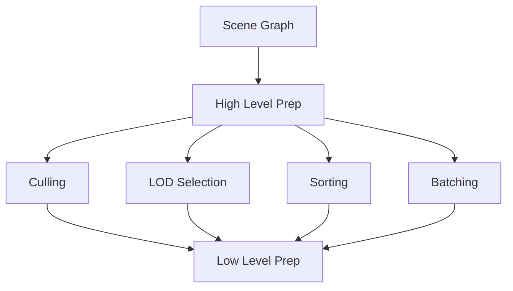

# High Level Render Preparation

## 是什么

High Level Render Preparation（高级渲染准备）是渲染管线中的高层次准备阶段，负责场景分析、优化决策和渲染策略制定。这个阶段处理场景级别的准备工作。



高级准备包括视锥体裁剪、LOD选择、渲染排序、批处理优化等，为低级渲染准备提供优化的场景数据。

## 常用属性一览表

### 高级准备相关属性

| 属性名 | 类型 | 默认值 | 取值范围 | 作用 | 性能/质量提示 |
| ------ | ---- | ------ | -------- | ---- | -------------- |
| frustumCulling★ | bool | true | true/false | 视锥体裁剪 | 显著提升性能 |
| visible | bool | true | true/false | 可见性 | 影响裁剪决策 |

★ 标记表示高频使用属性

## 属性详解

### frustumCulling★ (高频属性)

控制是否启用视锥体裁剪，自动剔除相机视野外的对象。

**使用场景：**
- 大型场景优化
- 开放世界游戏
- 建筑可视化

**注意事项：**
- 默认启用，通常不需要禁用
- 对性能影响显著
- 基于包围盒计算

## 最小可运行示例

**完整代码：**

main.qml:
```qml
import QtQuick
import QtQuick3D

Window {
    width: 1280
    height: 720
    visible: true
    title: "High Level Render Preparation 示例"

    View3D {
        id: view3d
        anchors.fill: parent
        
        environment: SceneEnvironment {
            backgroundMode: SceneEnvironment.Color
            clearColor: "#1a1a2e"
        }
        
        PerspectiveCamera {
            id: camera
            position: Qt.vector3d(0, 200, 600)
            eulerRotation.x: -20
            
            // 相机动画
            SequentialAnimation on position.x {
                loops: Animation.Infinite
                NumberAnimation { from: -400; to: 400; duration: 10000 }
                NumberAnimation { from: 400; to: -400; duration: 10000 }
            }
        }
        
        DirectionalLight {
            eulerRotation.x: -45
        }
        
        // 大量对象用于演示裁剪
        Repeater3D {
            model: 100
            
            Model {
                id: cubeModel
                source: "#Cube"
                
                property int index: model.index
                property real angle: index * 3.6
                property real radius: 300
                
                position: Qt.vector3d(
                    Math.cos(angle * Math.PI / 180) * radius,
                    (index % 10) * 50 - 200,
                    Math.sin(angle * Math.PI / 180) * radius
                )
                
                scale: Qt.vector3d(0.5, 0.5, 0.5)
                
                materials: PrincipledMaterial {
                    baseColor: Qt.hsla(angle / 360, 0.8, 0.6, 1.0)
                }
                
                // 检测是否在视锥体内
                property bool inFrustum: checkInFrustum()
                
                function checkInFrustum() {
                    // 简化的视锥体检测
                    let toCamera = camera.position.minus(scenePosition)
                    let distance = Math.sqrt(
                        toCamera.x * toCamera.x +
                        toCamera.y * toCamera.y +
                        toCamera.z * toCamera.z
                    )
                    return distance < 800
                }
            }
        }
    }
    
    // 统计面板
    Rectangle {
        anchors.right: parent.right
        anchors.top: parent.top
        anchors.margins: 20
        width: 300
        height: 300
        color: "#cc000000"
        radius: 10
        
        Column {
            anchors.fill: parent
            anchors.margins: 15
            spacing: 12
            
            Text {
                text: "高级渲染准备"
                color: "white"
                font.pixelSize: 18
                font.bold: true
            }
            
            Rectangle {
                width: parent.width
                height: 1
                color: "#555"
            }
            
            Text {
                text: "优化技术："
                color: "#ffe66d"
                font.pixelSize: 14
            }
            
            Column {
                spacing: 5
                
                Row {
                    spacing: 10
                    Rectangle {
                        width: 12
                        height: 12
                        radius: 6
                        color: "#2ecc71"
                        anchors.verticalCenter: parent.verticalCenter
                    }
                    Text {
                        text: "视锥体裁剪"
                        color: "#aaaaaa"
                        font.pixelSize: 11
                    }
                }
                
                Row {
                    spacing: 10
                    Rectangle {
                        width: 12
                        height: 12
                        radius: 6
                        color: "#3498db"
                        anchors.verticalCenter: parent.verticalCenter
                    }
                    Text {
                        text: "LOD 选择"
                        color: "#aaaaaa"
                        font.pixelSize: 11
                    }
                }
                
                Row {
                    spacing: 10
                    Rectangle {
                        width: 12
                        height: 12
                        radius: 6
                        color: "#9b59b6"
                        anchors.verticalCenter: parent.verticalCenter
                    }
                    Text {
                        text: "渲染排序"
                        color: "#aaaaaa"
                        font.pixelSize: 11
                    }
                }
                
                Row {
                    spacing: 10
                    Rectangle {
                        width: 12
                        height: 12
                        radius: 6
                        color: "#e74c3c"
                        anchors.verticalCenter: parent.verticalCenter
                    }
                    Text {
                        text: "批处理优化"
                        color: "#aaaaaa"
                        font.pixelSize: 11
                    }
                }
            }
            
            Rectangle {
                width: parent.width
                height: 1
                color: "#555"
            }
            
            Text {
                text: "场景统计："
                color: "#ffe66d"
                font.pixelSize: 14
            }
            
            Text {
                text: "总对象数: 100"
                color: "#4ecdc4"
                font.pixelSize: 12
            }
            
            Text {
                text: "说明：相机移动时自动裁剪\n视野外的对象"
                color: "#95a5a6"
                font.pixelSize: 10
                wrapMode: Text.WordWrap
                width: parent.width
            }
        }
    }
}
```

## 常见问题与调试

### 1. 裁剪过于激进

**解决方案：**
```qml
Model {
    // 调整包围盒
    bounds: Qt.vector3d(2, 2, 2)
}
```

### 2. LOD 切换明显

**解决方案：**
```qml
// 使用平滑过渡
Model {
    property real lodDistance: distanceToCamera
    
    Behavior on lodDistance {
        NumberAnimation { duration: 200 }
    }
}
```

## 实战技巧

### 1. 自定义 LOD 系统

```qml
Node {
    property real distanceToCamera: 0
    
    Model {
        source: "high_detail.mesh"
        visible: parent.distanceToCamera < 100
    }
    
    Model {
        source: "medium_detail.mesh"
        visible: parent.distanceToCamera >= 100 && 
                 parent.distanceToCamera < 300
    }
    
    Model {
        source: "low_detail.mesh"
        visible: parent.distanceToCamera >= 300
    }
}
```

### 2. 动态批处理

```qml
Node {
    // 相同材质的对象自动批处理
    Repeater3D {
        model: 100
        Model {
            source: "#Cube"
            materials: sharedMaterial  // 共享材质
        }
    }
    
    PrincipledMaterial {
        id: sharedMaterial
    }
}
```

## 延伸阅读

- [Prepare-for-Render.md](./Prepare-for-Render.md)
- [Low-Level-render-preparation.md](./Low-Level-render-preparation.md)
- [Scene-Rendering.md](./Scene-Rendering.md)
