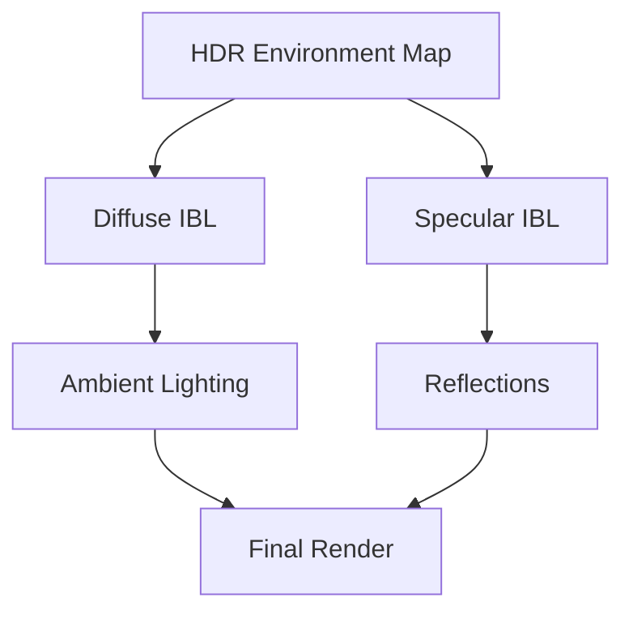

# Image Based Lighting

## 是什么

Image Based Lighting（基于图像的光照，IBL）是一种使用环境贴图为场景提供真实光照和反射的技术。IBL 通过 HDR 环境贴图捕捉真实世界的光照信息，为3D对象提供自然的照明和反射。



IBL 是实现照片级真实感渲染的关键技术，特别适合产品展示和建筑可视化。

## 常用属性一览表

### SceneEnvironment IBL 属性

| 属性名 | 类型 | 默认值 | 取值范围 | 作用 | 性能/质量提示 |
| ------ | ---- | ------ | -------- | ---- | -------------- |
| lightProbe★ | Texture | null | HDR纹理 | 环境光探针 | 核心IBL属性 |
| probeExposure | real | 1.0 | 0.0-∞ | 探针曝光 | 控制IBL强度 |
| probeHorizon | real | 0.0 | -1.0-1.0 | 地平线裁剪 | 避免地面反射 |
| probeOrientation | vector3d | (0,0,0) | 角度值 | 探针旋转 | 调整环境方向 |

★ 标记表示高频使用属性

## 属性详解

### lightProbe★ (高频属性)

lightProbe 指定用于 IBL 的 HDR 环境贴图，是启用 IBL 的核心属性。

**使用场景：**
- 室外场景（天空盒）
- 室内场景（工作室照明）
- 产品展示
- 建筑可视化

**注意事项：**
- 必须使用 HDR 格式（.hdr, .exr）
- 推荐使用等距柱状投影格式
- 文件大小影响加载时间
- 可以使用 Balsam 工具转换

## 最小可运行示例

main.qml:
```qml
import QtQuick
import QtQuick3D

Window {
    width: 1280
    height: 720
    visible: true
    title: "Image Based Lighting 示例"

    View3D {
        id: view3d
        anchors.fill: parent
        
        environment: SceneEnvironment {
            backgroundMode: SceneEnvironment.SkyBox
            
            // IBL 设置
            lightProbe: Texture {
                source: "environment.hdr"
                mappingMode: Texture.LightProbe
            }
            
            probeExposure: exposureSlider.value
            probeOrientation: Qt.vector3d(0, orientationSlider.value, 0)
        }
        
        PerspectiveCamera {
            position: Qt.vector3d(0, 0, 300)
        }
        
        // 不同材质展示 IBL 效果
        Row {
            spacing: 100
            x: -150
            
            // 金属球
            Model {
                source: "#Sphere"
                materials: PrincipledMaterial {
                    baseColor: "#ffffff"
                    metalness: 1.0
                    roughness: 0.0
                }
            }
            
            // 半金属球
            Model {
                source: "#Sphere"
                materials: PrincipledMaterial {
                    baseColor: "#3498db"
                    metalness: 0.5
                    roughness: 0.3
                }
            }
            
            // 粗糙球
            Model {
                source: "#Sphere"
                materials: PrincipledMaterial {
                    baseColor: "#e74c3c"
                    metalness: 0.0
                    roughness: 0.8
                }
            }
        }
    }
    
    // 控制面板
    Rectangle {
        anchors.right: parent.right
        anchors.top: parent.top
        anchors.margins: 20
        width: 300
        height: 250
        color: "#cc000000"
        radius: 10
        
        Column {
            anchors.fill: parent
            anchors.margins: 15
            spacing: 15
            
            Text {
                text: "IBL 控制"
                color: "white"
                font.pixelSize: 18
                font.bold: true
            }
            
            Column {
                width: parent.width
                spacing: 5
                
                Text {
                    text: "曝光: " + exposureSlider.value.toFixed(2)
                    color: "#ffe66d"
                    font.pixelSize: 14
                }
                
                Slider {
                    id: exposureSlider
                    width: parent.width
                    from: 0.0
                    to: 3.0
                    value: 1.0
                }
            }
            
            Column {
                width: parent.width
                spacing: 5
                
                Text {
                    text: "方向: " + orientationSlider.value.toFixed(0) + "°"
                    color: "#ffe66d"
                    font.pixelSize: 14
                }
                
                Slider {
                    id: orientationSlider
                    width: parent.width
                    from: 0
                    to: 360
                    value: 0
                }
            }
            
            Text {
                text: "说明：\n• 左：完全金属反射\n• 中：半金属\n• 右：粗糙表面"
                color: "#95a5a6"
                font.pixelSize: 10
                wrapMode: Text.WordWrap
                width: parent.width
            }
        }
    }
}
```

## 常见问题与调试

### 1. IBL 不显示

**解决方案：**
```qml
SceneEnvironment {
    lightProbe: Texture {
        source: "environment.hdr"
        mappingMode: Texture.LightProbe  // 必须设置
    }
}
```

### 2. 反射过亮或过暗

**解决方案：**
```qml
SceneEnvironment {
    lightProbe: Texture { source: "environment.hdr" }
    probeExposure: 0.5  // 调整曝光
}
```

### 3. 环境方向不对

**解决方案：**
```qml
SceneEnvironment {
    lightProbe: Texture { source: "environment.hdr" }
    probeOrientation: Qt.vector3d(0, 180, 0)  // 旋转环境
}
```

## 实战技巧

### 1. 室外场景

```qml
SceneEnvironment {
    backgroundMode: SceneEnvironment.SkyBox
    
    lightProbe: Texture {
        source: "outdoor_sky.hdr"
        mappingMode: Texture.LightProbe
    }
    
    probeExposure: 1.5
}
```

### 2. 室内场景

```qml
SceneEnvironment {
    backgroundMode: SceneEnvironment.Color
    clearColor: "#1a1a1a"
    
    lightProbe: Texture {
        source: "studio_lighting.hdr"
        mappingMode: Texture.LightProbe
    }
    
    probeExposure: 1.0
}
```

### 3. 产品展示

```qml
SceneEnvironment {
    backgroundMode: SceneEnvironment.Color
    clearColor: "white"
    
    lightProbe: Texture {
        source: "studio_soft.hdr"
        mappingMode: Texture.LightProbe
    }
    
    probeExposure: 1.2
    probeHorizon: 0.5  // 减少地面反射
}
```

### 4. 动态环境切换

```qml
SceneEnvironment {
    lightProbe: Texture {
        source: currentEnvironment
        mappingMode: Texture.LightProbe
    }
    
    property string currentEnvironment: "day.hdr"
    
    function switchToNight() {
        currentEnvironment = "night.hdr"
    }
    
    function switchToDay() {
        currentEnvironment = "day.hdr"
    }
}
```

### 5. 自定义天空盒

```qml
SceneEnvironment {
    backgroundMode: SceneEnvironment.SkyBox
    
    lightProbe: Texture {
        source: "custom_skybox.hdr"
        mappingMode: Texture.LightProbe
    }
    
    // 天空盒和 IBL 使用同一张贴图
}
```

## 延伸阅读

- [Physically-Based-Rendering.md](./Physically-Based-Rendering.md)
- [PrincipledMaterial.md](./PrincipledMaterial.md)
- [Lights.md](./Lights.md)
- [Qt Quick 3D - Image Based Lighting](https://doc.qt.io/qt-6/quick3d-ibl.html)
