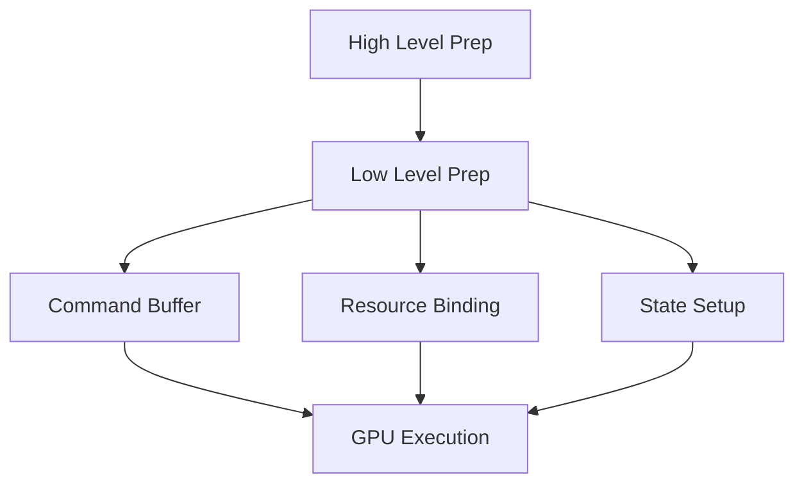

# Low Level Render Preparation

## 是什么

Low Level Render Preparation（低级渲染准备）是渲染管线中的底层准备阶段，负责 GPU 命令生成、缓冲区绑定和渲染状态设置。这是最接近硬件的准备层。



低级准备将高级渲染决策转换为具体的 GPU 命令，包括顶点缓冲区绑定、着色器设置、纹理绑定等。

## 常用属性一览表

### 低级准备相关操作

| 操作 | 描述 | 性能影响 | 优化建议 |
| ---- | ---- | -------- | -------- |
| Buffer Binding★ | 绑定顶点/索引缓冲区 | 中 | 减少切换次数 |
| Shader Setup | 设置着色器程序 | 高 | 批处理相同着色器 |
| Texture Binding | 绑定纹理单元 | 中 | 使用纹理数组 |
| State Changes | 修改渲染状态 | 高 | 最小化状态变化 |

★ 标记表示高频操作

## 属性详解

### Buffer Binding★ (高频操作)

绑定顶点和索引缓冲区到 GPU 管线。

**使用场景：**
- 每个模型渲染前
- 动态几何体更新后
- 实例化渲染

**注意事项：**
- 频繁切换影响性能
- 尽量批处理相同缓冲区
- 使用实例化减少绑定次数

## 最小可运行示例

**完整代码：**

main.qml:
```qml
import QtQuick
import QtQuick3D

Window {
    width: 1280
    height: 720
    visible: true
    title: "Low Level Render Preparation 示例"

    View3D {
        anchors.fill: parent
        
        environment: SceneEnvironment {
            backgroundMode: SceneEnvironment.Color
            clearColor: "#1a1a2e"
        }
        
        PerspectiveCamera {
            position: Qt.vector3d(0, 100, 400)
        }
        
        DirectionalLight { }
        
        // 优化的渲染：相同材质批处理
        Node {
            id: batchedObjects
            
            // 共享材质
            property var sharedMaterial: PrincipledMaterial {
                baseColor: "#3498db"
                metalness: 0.5
                roughness: 0.3
            }
            
            Repeater3D {
                model: 50
                Model {
                    source: "#Cube"
                    position: Qt.vector3d(
                        (index % 10) * 50 - 225,
                        0,
                        Math.floor(index / 10) * 50 - 100
                    )
                    materials: batchedObjects.sharedMaterial
                }
            }
        }
        
        // 监听渲染事件
        property int drawCallCount: 0
        
        onBeforeRendering: {
            // 低级准备阶段
            drawCallCount++
        }
    }
    
    Rectangle {
        anchors.left: parent.left
        anchors.top: parent.top
        anchors.margins: 20
        width: 300
        height: 250
        color: "#cc000000"
        radius: 10
        
        Column {
            anchors.fill: parent
            anchors.margins: 15
            spacing: 10
            
            Text {
                text: "低级渲染准备"
                color: "white"
                font.pixelSize: 18
                font.bold: true
            }
            
            Text {
                text: "GPU 操作："
                color: "#ffe66d"
                font.pixelSize: 14
            }
            
            Text {
                text: "• 缓冲区绑定\n• 着色器设置\n• 纹理绑定\n• 状态配置\n• 绘制调用"
                color: "#aaaaaa"
                font.pixelSize: 11
            }
            
            Text {
                text: "优化技巧："
                color: "#ffe66d"
                font.pixelSize: 14
            }
            
            Text {
                text: "• 批处理相同材质\n• 减少状态切换\n• 使用实例化渲染"
                color: "#aaaaaa"
                font.pixelSize: 11
            }
        }
    }
}
```

## 实战技巧

### 1. 减少绘制调用

```qml
// 使用实例化
Model {
    source: "#Cube"
    instancing: RandomInstancing {
        instanceCount: 1000
    }
    // 1000个对象，仅1次绘制调用
}
```

### 2. 材质批处理

```qml
Node {
    property var sharedMaterial: PrincipledMaterial { }
    
    Repeater3D {
        model: 100
        Model {
            materials: sharedMaterial  // 共享材质
        }
    }
}
```

## 延伸阅读

- [Prepare-for-Render.md](./Prepare-for-Render.md)
- [High-Level-render-preparation.md](./High-Level-render-preparation.md)
- [Scene-Rendering.md](./Scene-Rendering.md)
