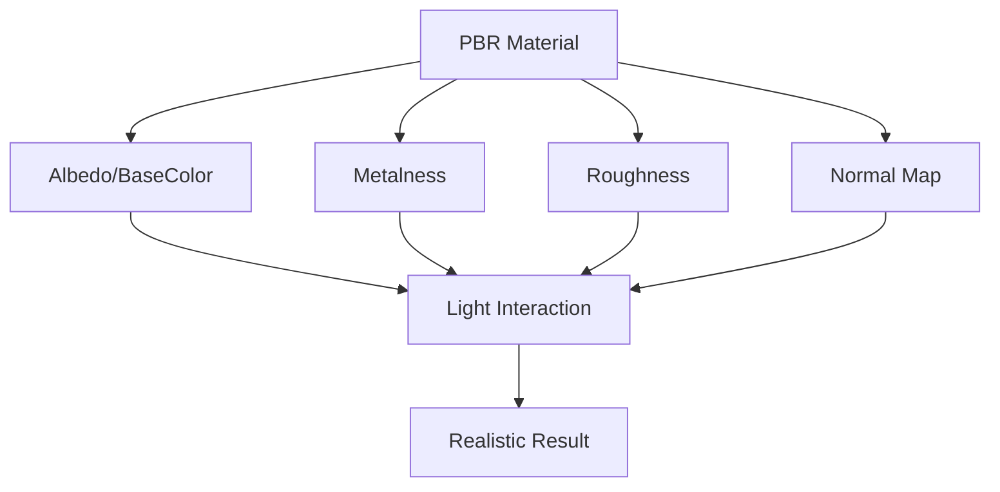

# Physically Based Rendering

## 是什么

Physically Based Rendering（基于物理的渲染，PBR）是一种基于物理原理的渲染技术，通过模拟真实世界的光照和材质交互，实现照片级真实感的视觉效果。



PBR 是现代3D渲染的标准，Qt Quick 3D 通过 PrincipledMaterial 提供完整的 PBR 支持。

## 常用属性一览表

### PrincipledMaterial PBR 属性

| 属性名 | 类型 | 默认值 | 取值范围 | 作用 | 性能/质量提示 |
| ------ | ---- | ------ | -------- | ---- | -------------- |
| baseColor★ | color | white | 颜色值 | 基础颜色 | 非金属的固有色 |
| metalness★ | real | 0.0 | 0.0-1.0 | 金属度 | 0=非金属，1=金属 |
| roughness★ | real | 0.0 | 0.0-1.0 | 粗糙度 | 0=光滑，1=粗糙 |
| normalMap | Texture | null | 法线贴图 | 表面细节 | 提升细节感 |
| occlusionMap | Texture | null | AO贴图 | 环境遮蔽 | 增强深度感 |

★ 标记表示高频使用属性

## 属性详解

### baseColor★ (高频属性)

baseColor 定义材质的基础颜色，对于非金属是固有色，对于金属是反射色。

**使用场景：**
- 非金属：物体的实际颜色
- 金属：反射的颜色（通常是灰度）

**注意事项：**
- 非金属通常使用彩色
- 金属通常使用灰度值
- 避免使用纯黑或纯白

### metalness★ (高频属性)

metalness 定义材质的金属特性，是 PBR 的核心参数之一。

**使用场景：**
- 0.0：完全非金属（塑料、木材、布料）
- 1.0：完全金属（铁、铜、金）
- 中间值：通常避免使用

**注意事项：**
- 通常使用0或1，避免中间值
- 金属有强烈的反射
- 非金属有漫反射

### roughness★ (高频属性)

roughness 定义表面的粗糙程度，影响反射的清晰度。

**使用场景：**
- 0.0：完全光滑（镜面）
- 0.3：抛光金属
- 0.7：磨砂表面
- 1.0：完全粗糙（布料）

**注意事项：**
- 影响反射的模糊程度
- 粗糙表面散射光线
- 配合 IBL 效果最佳

## 最小可运行示例

main.qml:
```qml
import QtQuick
import QtQuick3D

Window {
    width: 1280
    height: 720
    visible: true
    title: "Physically Based Rendering 示例"

    View3D {
        anchors.fill: parent
        
        environment: SceneEnvironment {
            backgroundMode: SceneEnvironment.SkyBox
            
            lightProbe: Texture {
                source: "environment.hdr"
                mappingMode: Texture.LightProbe
            }
        }
        
        PerspectiveCamera {
            position: Qt.vector3d(0, 100, 500)
            eulerRotation.x: -10
        }
        
        DirectionalLight {
            eulerRotation.x: -45
            brightness: 1.0
        }
        
        // PBR 材质展示
        Grid {
            columns: 5
            rows: 5
            
            Repeater3D {
                model: 25
                
                Model {
                    source: "#Sphere"
                    
                    property int row: Math.floor(index / 5)
                    property int col: index % 5
                    
                    position: Qt.vector3d(
                        (col - 2) * 120,
                        (2 - row) * 120,
                        0
                    )
                    
                    scale: Qt.vector3d(0.8, 0.8, 0.8)
                    
                    materials: PrincipledMaterial {
                        baseColor: "#ffffff"
                        
                        // 横向：金属度从0到1
                        metalness: col / 4
                        
                        // 纵向：粗糙度从0到1
                        roughness: row / 4
                    }
                }
            }
        }
    }
    
    // 标签
    Column {
        anchors.left: parent.left
        anchors.top: parent.top
        anchors.margins: 20
        spacing: 10
        
        Text {
            text: "PBR 材质矩阵"
            color: "white"
            font.pixelSize: 18
            font.bold: true
        }
        
        Text {
            text: "横向：金属度 0 → 1"
            color: "#ffe66d"
            font.pixelSize: 14
        }
        
        Text {
            text: "纵向：粗糙度 0 → 1"
            color: "#4ecdc4"
            font.pixelSize: 14
        }
    }
}
```

## 常见问题与调试

### 1. 材质看起来不真实

**解决方案：**
```qml
PrincipledMaterial {
    baseColor: "#808080"  // 避免纯白
    metalness: 1.0  // 使用0或1
    roughness: 0.3  // 避免完全光滑
}
```

### 2. 金属材质不反光

**解决方案：**
```qml
// 确保有 IBL
SceneEnvironment {
    lightProbe: Texture {
        source: "environment.hdr"
        mappingMode: Texture.LightProbe
    }
}

PrincipledMaterial {
    metalness: 1.0
    roughness: 0.2  // 降低粗糙度
}
```

## 实战技巧

### 1. 常见材质配置

```qml
// 抛光金属
PrincipledMaterial {
    baseColor: "#c0c0c0"
    metalness: 1.0
    roughness: 0.2
}

// 塑料
PrincipledMaterial {
    baseColor: "#3498db"
    metalness: 0.0
    roughness: 0.5
}

// 木材
PrincipledMaterial {
    baseColor: "#8b4513"
    metalness: 0.0
    roughness: 0.8
}

// 布料
PrincipledMaterial {
    baseColor: "#e74c3c"
    metalness: 0.0
    roughness: 1.0
}
```

### 2. 使用纹理贴图

```qml
PrincipledMaterial {
    baseColorMap: Texture { source: "albedo.png" }
    metalnessMap: Texture { source: "metalness.png" }
    roughnessMap: Texture { source: "roughness.png" }
    normalMap: Texture { source: "normal.png" }
    occlusionMap: Texture { source: "ao.png" }
}
```

## 延伸阅读

- [PrincipledMaterial.md](./PrincipledMaterial.md)
- [Image-Based-Lighting.md](./Image-Based-Lighting.md)
- [CustomMaterial.md](./CustomMaterial.md)
