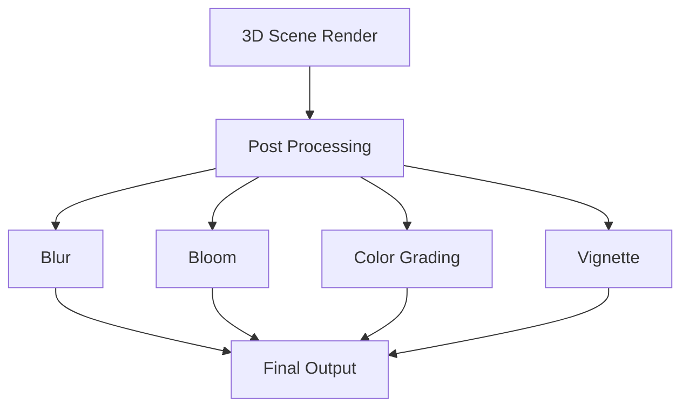

# Post Processing Effects

## 是什么

Post Processing Effects（后处理效果）是在场景渲染完成后应用的图像处理效果。通过对渲染结果进行二次处理，可以实现模糊、辉光、色彩校正等视觉效果。



后处理效果在渲染管线的最后阶段执行，可以显著提升画面质量和艺术表现力。

## 常用属性一览表

### SceneEnvironment 后处理属性

| 属性名 | 类型 | 默认值 | 取值范围 | 作用 | 性能/质量提示 |
| ------ | ---- | ------ | -------- | ---- | -------------- |
| effects★ | list | [] | Effect列表 | 后处理效果列表 | 按顺序执行 |
| tonemapMode | enum | Linear | Linear/Aces/HejlDawson/Filmic | 色调映射模式 | 影响HDR显示 |

★ 标记表示高频使用属性

## 属性详解

### effects★ (高频属性)

effects 列表定义要应用的后处理效果及其顺序。

**使用场景：**
- 添加模糊效果
- 实现辉光/泛光
- 色彩校正
- 景深效果

**注意事项：**
- 效果按列表顺序执行
- 每个效果增加渲染开销
- 建议不超过3-4个效果
- 可以动态添加/移除效果

## 最小可运行示例

**完整代码：**

main.qml:
```qml
import QtQuick
import QtQuick3D
import QtQuick3D.Effects

Window {
    width: 1280
    height: 720
    visible: true
    title: "Post Processing Effects 后处理效果示例"

    View3D {
        id: view3d
        anchors.fill: parent
        
        environment: SceneEnvironment {
            backgroundMode: SceneEnvironment.Color
            clearColor: "#1a1a2e"
            antialiasingMode: SceneEnvironment.MSAA
            
            // 后处理效果
            effects: [
                bloom,
                vignette,
                colorMaster
            ]
        }
        
        PerspectiveCamera {
            position: Qt.vector3d(0, 100, 400)
            eulerRotation.x: -15
        }
        
        DirectionalLight {
            eulerRotation.x: -45
            brightness: 1.5
        }
        
        // 发光对象
        Model {
            source: "#Sphere"
            position: Qt.vector3d(-150, 0, 0)
            materials: PrincipledMaterial {
                baseColor: "#e74c3c"
                emissiveFactor: Qt.vector3d(2, 0.5, 0.5)
            }
            
            SequentialAnimation on position.y {
                loops: Animation.Infinite
                NumberAnimation { from: -50; to: 50; duration: 2000; easing.type: Easing.InOutQuad }
                NumberAnimation { from: 50; to: -50; duration: 2000; easing.type: Easing.InOutQuad }
            }
        }
        
        Model {
            source: "#Cube"
            position: Qt.vector3d(0, 0, 0)
            materials: PrincipledMaterial {
                baseColor: "#3498db"
                metalness: 0.8
                roughness: 0.2
            }
            
            SequentialAnimation on eulerRotation.y {
                loops: Animation.Infinite
                NumberAnimation { from: 0; to: 360; duration: 4000 }
            }
        }
        
        Model {
            source: "#Cylinder"
            position: Qt.vector3d(150, 0, 0)
            materials: PrincipledMaterial {
                baseColor: "#f39c12"
                emissiveFactor: Qt.vector3d(1, 0.8, 0)
            }
        }
        
        Model {
            source: "#Rectangle"
            scale: Qt.vector3d(20, 20, 1)
            position.y: -50
            eulerRotation.x: -90
            materials: PrincipledMaterial {
                baseColor: "#34495e"
                metalness: 0.3
                roughness: 0.7
            }
        }
    }
    
    // 后处理效果定义
    Bloom {
        id: bloom
        bloomIntensity: bloomSlider.value
        bloomThreshold: 0.5
    }
    
    Vignette {
        id: vignette
        vignetteRadius: vignetteSlider.value
        vignetteColor: "#000000"
    }
    
    ColorMaster {
        id: colorMaster
        saturation: saturationSlider.value
    }
    
    // 控制面板
    Rectangle {
        anchors.right: parent.right
        anchors.top: parent.top
        anchors.margins: 20
        width: 320
        height: 450
        color: "#cc000000"
        radius: 10
        
        Column {
            anchors.fill: parent
            anchors.margins: 15
            spacing: 15
            
            Text {
                text: "后处理效果"
                color: "white"
                font.pixelSize: 18
                font.bold: true
            }
            
            Rectangle {
                width: parent.width
                height: 1
                color: "#555"
            }
            
            // Bloom 控制
            Column {
                width: parent.width
                spacing: 5
                
                Row {
                    width: parent.width
                    spacing: 10
                    
                    CheckBox {
                        id: bloomCheck
                        checked: true
                        onCheckedChanged: {
                            if (checked) {
                                if (view3d.environment.effects.indexOf(bloom) === -1)
                                    view3d.environment.effects.push(bloom)
                            } else {
                                let idx = view3d.environment.effects.indexOf(bloom)
                                if (idx !== -1)
                                    view3d.environment.effects.splice(idx, 1)
                            }
                        }
                    }
                    
                    Text {
                        text: "Bloom (辉光)"
                        color: "#e74c3c"
                        font.pixelSize: 14
                        anchors.verticalCenter: parent.verticalCenter
                    }
                }
                
                Row {
                    spacing: 10
                    Text {
                        text: "强度: " + bloomSlider.value.toFixed(2)
                        color: "white"
                        width: 100
                    }
                    Slider {
                        id: bloomSlider
                        width: 170
                        from: 0
                        to: 2
                        value: 0.5
                    }
                }
            }
            
            Rectangle {
                width: parent.width
                height: 1
                color: "#555"
            }
            
            // Vignette 控制
            Column {
                width: parent.width
                spacing: 5
                
                Row {
                    width: parent.width
                    spacing: 10
                    
                    CheckBox {
                        id: vignetteCheck
                        checked: true
                    }
                    
                    Text {
                        text: "Vignette (暗角)"
                        color: "#9b59b6"
                        font.pixelSize: 14
                        anchors.verticalCenter: parent.verticalCenter
                    }
                }
                
                Row {
                    spacing: 10
                    Text {
                        text: "半径: " + vignetteSlider.value.toFixed(2)
                        color: "white"
                        width: 100
                    }
                    Slider {
                        id: vignetteSlider
                        width: 170
                        from: 0
                        to: 2
                        value: 0.7
                    }
                }
            }
            
            Rectangle {
                width: parent.width
                height: 1
                color: "#555"
            }
            
            // Color Master 控制
            Column {
                width: parent.width
                spacing: 5
                
                Row {
                    width: parent.width
                    spacing: 10
                    
                    CheckBox {
                        id: colorCheck
                        checked: true
                    }
                    
                    Text {
                        text: "Color Master (色彩)"
                        color: "#3498db"
                        font.pixelSize: 14
                        anchors.verticalCenter: parent.verticalCenter
                    }
                }
                
                Row {
                    spacing: 10
                    Text {
                        text: "饱和度: " + saturationSlider.value.toFixed(2)
                        color: "white"
                        width: 100
                    }
                    Slider {
                        id: saturationSlider
                        width: 170
                        from: 0
                        to: 2
                        value: 1.0
                    }
                }
            }
            
            Rectangle {
                width: parent.width
                height: 1
                color: "#555"
            }
            
            Text {
                text: "说明："
                color: "#ffe66d"
                font.pixelSize: 12
            }
            
            Text {
                text: "后处理效果在场景渲染后应用，\n可以显著提升视觉质量"
                color: "#95a5a6"
                font.pixelSize: 10
                wrapMode: Text.WordWrap
                width: parent.width
            }
        }
    }
}
```

## 常见问题与调试

### 1. 效果不显示

**解决方案：**
```qml
SceneEnvironment {
    // 确保效果列表正确
    effects: [myEffect]
}

// 确保效果对象已创建
Bloom {
    id: myEffect
    bloomIntensity: 1.0
}
```

### 2. 性能问题

**解决方案：**
```qml
SceneEnvironment {
    // 限制效果数量
    effects: highPerformanceMode ? [] : [bloom, vignette]
}
```

## 实战技巧

### 1. 动态效果切换

```qml
View3D {
    environment: SceneEnvironment {
        effects: currentEffects
    }
    
    property var currentEffects: []
    
    function enableBloom() {
        currentEffects = [bloom]
    }
    
    function enableAll() {
        currentEffects = [bloom, vignette, colorMaster]
    }
}
```

### 2. 效果动画

```qml
Bloom {
    id: bloom
    bloomIntensity: 0.5
    
    SequentialAnimation on bloomIntensity {
        loops: Animation.Infinite
        NumberAnimation { from: 0.2; to: 1.5; duration: 2000 }
        NumberAnimation { from: 1.5; to: 0.2; duration: 2000 }
    }
}
```

## 延伸阅读

- [Post-Processing.md](./Post-Processing.md)
- [Scene-Rendering.md](./Scene-Rendering.md)
- [Qt Quick 3D Effects](https://doc.qt.io/qt-6/qtquick3d-effects-qmlmodule.html)
