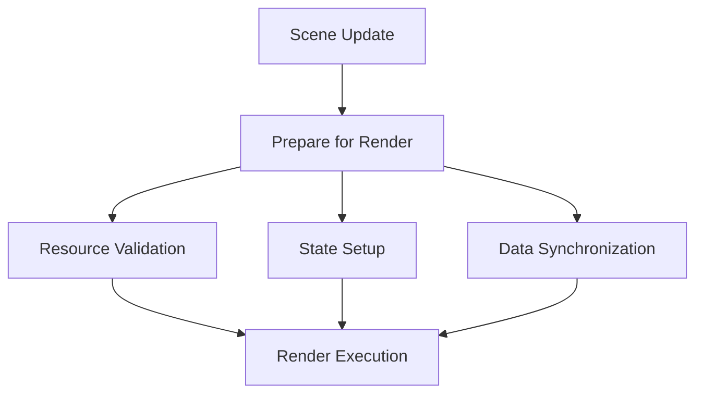

# Prepare for Render

## 是什么

Prepare for Render（渲染准备）是 Qt Quick 3D 渲染管线中的关键阶段，负责在实际渲染前准备所有必要的资源、状态和数据。这个阶段确保渲染过程高效且正确。



渲染准备包括资源验证、着色器编译、缓冲区更新、状态设置等操作，是连接场景更新和实际渲染的桥梁。

## 常用属性一览表

### 渲染准备相关信号

| 信号名 | 触发时机 | 线程 | 作用 | 使用场景 |
| ------ | -------- | ---- | ---- | -------- |
| beforeSynchronizing★ | 同步前 | Render | 准备同步 | 更新渲染数据 |
| afterSynchronizing | 同步后 | Render | 同步完成 | 验证同步结果 |
| beforeRendering★ | 渲染前 | Render | 准备渲染 | 最后的状态设置 |

★ 标记表示高频使用信号

## 属性详解

### beforeSynchronizing★ (高频信号)

在 GUI 线程和渲染线程同步之前触发，是准备渲染数据的主要时机。

**使用场景：**
- 更新动态几何体数据
- 准备纹理资源
- 同步自定义渲染状态
- 验证资源完整性

**注意事项：**
- 在渲染线程执行
- 避免耗时操作
- 确保线程安全
- 不要访问 GUI 对象

### beforeRendering★ (高频信号)

在场景渲染之前触发，是设置渲染状态的最后机会。

**使用场景：**
- 绑定自定义资源
- 设置渲染参数
- 注入渲染命令
- 更新动态纹理

**注意事项：**
- 在渲染线程执行
- 可以访问 GPU 上下文
- 快速执行，不要阻塞
- 适合最后的状态调整

## 最小可运行示例

**完整代码：**

main.qml:
```qml
import QtQuick
import QtQuick3D

Window {
    width: 1280
    height: 720
    visible: true
    title: "Prepare for Render 渲染准备示例"

    View3D {
        id: view3d
        anchors.fill: parent
        
        environment: SceneEnvironment {
            backgroundMode: SceneEnvironment.Color
            clearColor: "#1a1a2e"
            antialiasingMode: SceneEnvironment.MSAA
        }
        
        PerspectiveCamera {
            position: Qt.vector3d(0, 100, 400)
            eulerRotation.x: -15
        }
        
        DirectionalLight {
            eulerRotation.x: -45
            brightness: 1.5
        }
        
        // 动态几何体
        Model {
            id: dynamicModel
            
            geometry: CustomGeometry {
                id: customGeo
                
                property var vertexData: []
                property bool needsUpdate: false
                
                function updateGeometry() {
                    // 标记需要更新
                    needsUpdate = true
                }
            }
            
            materials: PrincipledMaterial {
                baseColor: "#3498db"
                metalness: 0.5
                roughness: 0.3
            }
        }
        
        // 渲染准备监听
        property int syncCount: 0
        property int renderCount: 0
        property real lastPrepareTime: 0
        
        onBeforeSynchronizing: {
            syncCount++
            
            // 准备阶段：更新几何体数据
            if (customGeo.needsUpdate) {
                console.log("Preparing geometry data...")
                // 更新顶点数据
                customGeo.needsUpdate = false
            }
            
            // 记录准备时间
            lastPrepareTime = Date.now()
        }
        
        onAfterSynchronizing: {
            let prepareTime = Date.now() - lastPrepareTime
            console.log("Synchronization completed in", prepareTime, "ms")
        }
        
        onBeforeRendering: {
            renderCount++
            
            // 最后的渲染准备
            console.log("Final render preparation...")
            
            // 可以在这里设置自定义渲染状态
        }
        
        onAfterRendering: {
            // 渲染完成
        }
    }
    
    // 触发更新
    Timer {
        interval: 1000
        running: true
        repeat: true
        onTriggered: {
            customGeo.updateGeometry()
        }
    }
    
    // 信息面板
    Rectangle {
        anchors.left: parent.left
        anchors.top: parent.top
        anchors.margins: 20
        width: 350
        height: 350
        color: "#cc000000"
        radius: 10
        
        Column {
            anchors.fill: parent
            anchors.margins: 15
            spacing: 12
            
            Text {
                text: "渲染准备流程"
                color: "white"
                font.pixelSize: 18
                font.bold: true
            }
            
            Rectangle {
                width: parent.width
                height: 1
                color: "#555"
            }
            
            Text {
                text: "准备阶段："
                color: "#ffe66d"
                font.pixelSize: 14
            }
            
            Column {
                spacing: 5
                
                Text {
                    text: "1. 场景更新（GUI线程）"
                    color: "#aaaaaa"
                    font.pixelSize: 11
                }
                
                Text {
                    text: "2. beforeSynchronizing"
                    color: "#4ecdc4"
                    font.pixelSize: 11
                }
                
                Text {
                    text: "   • 验证资源"
                    color: "#95a5a6"
                    font.pixelSize: 10
                }
                
                Text {
                    text: "   • 更新数据"
                    color: "#95a5a6"
                    font.pixelSize: 10
                }
                
                Text {
                    text: "3. afterSynchronizing"
                    color: "#4ecdc4"
                    font.pixelSize: 11
                }
                
                Text {
                    text: "4. beforeRendering"
                    color: "#4ecdc4"
                    font.pixelSize: 11
                }
                
                Text {
                    text: "   • 最后状态设置"
                    color: "#95a5a6"
                    font.pixelSize: 10
                }
                
                Text {
                    text: "5. 执行渲染"
                    color: "#aaaaaa"
                    font.pixelSize: 11
                }
            }
            
            Rectangle {
                width: parent.width
                height: 1
                color: "#555"
            }
            
            Text {
                text: "统计信息："
                color: "#ffe66d"
                font.pixelSize: 14
            }
            
            Text {
                text: "同步次数: " + view3d.syncCount
                color: "#4ecdc4"
                font.pixelSize: 12
            }
            
            Text {
                text: "渲染次数: " + view3d.renderCount
                color: "#4ecdc4"
                font.pixelSize: 12
            }
        }
    }
}
```

## 常见问题与调试

### 1. 资源未准备好

**问题：**
渲染时资源尚未加载完成。

**解决方案：**
```qml
View3D {
    property bool resourcesReady: false
    
    onBeforeSynchronizing: {
        // 检查资源状态
        if (!resourcesReady) {
            // 等待资源加载
            if (checkResourcesLoaded()) {
                resourcesReady = true
            }
        }
    }
    
    function checkResourcesLoaded() {
        // 验证所有必要资源已加载
        return true
    }
}
```

### 2. 性能问题

**问题：**
准备阶段耗时过长。

**解决方案：**
```qml
View3D {
    property real prepareStartTime: 0
    
    onBeforeSynchronizing: {
        prepareStartTime = Date.now()
        
        // 只更新必要的数据
        if (needsUpdate) {
            // 快速更新
            needsUpdate = false
        }
    }
    
    onAfterSynchronizing: {
        let duration = Date.now() - prepareStartTime
        if (duration > 16) {  // 超过一帧时间
            console.warn("Prepare phase too slow:", duration, "ms")
        }
    }
}
```

### 3. 数据同步错误

**问题：**
渲染数据与场景状态不一致。

**解决方案：**
```qml
View3D {
    property var pendingUpdates: []
    
    onBeforeSynchronizing: {
        // 批量处理待更新数据
        for (let i = 0; i < pendingUpdates.length; i++) {
            applyUpdate(pendingUpdates[i])
        }
        pendingUpdates = []
    }
    
    function scheduleUpdate(update) {
        pendingUpdates.push(update)
    }
}
```

## 实战技巧

### 1. 动态几何体更新

```qml
Model {
    geometry: Geometry {
        id: dynamicGeometry
        
        property var vertexBuffer: null
        property bool dirty: false
        
        function updateVertices(newData) {
            vertexBuffer = newData
            dirty = true
        }
    }
}

View3D {
    onBeforeSynchronizing: {
        if (dynamicGeometry.dirty) {
            // 更新 GPU 缓冲区
            dynamicGeometry.updateGPUBuffer()
            dynamicGeometry.dirty = false
        }
    }
}
```

### 2. 纹理流式加载

```qml
View3D {
    property var textureQueue: []
    property int maxTexturesPerFrame: 2
    
    onBeforeSynchronizing: {
        // 每帧加载有限数量的纹理
        let count = Math.min(maxTexturesPerFrame, textureQueue.length)
        for (let i = 0; i < count; i++) {
            loadTexture(textureQueue.shift())
        }
    }
    
    function queueTexture(texturePath) {
        textureQueue.push(texturePath)
    }
}
```

### 3. 渲染状态缓存

```qml
View3D {
    property var renderStateCache: ({})
    
    onBeforeSynchronizing: {
        // 缓存渲染状态避免重复计算
        if (!renderStateCache.valid) {
            renderStateCache = {
                viewMatrix: calculateViewMatrix(),
                projectionMatrix: calculateProjectionMatrix(),
                valid: true
            }
        }
    }
    
    onBeforeRendering: {
        // 使用缓存的状态
        applyRenderState(renderStateCache)
    }
}
```

### 4. 条件渲染准备

```qml
View3D {
    property bool highQualityMode: false
    
    onBeforeSynchronizing: {
        if (highQualityMode) {
            // 高质量模式：准备额外资源
            prepareHighQualityResources()
        } else {
            // 性能模式：最小准备
            prepareMinimalResources()
        }
    }
}
```

### 5. 渲染准备性能监控

```qml
View3D {
    property var performanceStats: ({
        syncTime: 0,
        renderTime: 0,
        frameCount: 0
    })
    
    property real syncStartTime: 0
    property real renderStartTime: 0
    
    onBeforeSynchronizing: {
        syncStartTime = Date.now()
    }
    
    onAfterSynchronizing: {
        performanceStats.syncTime = Date.now() - syncStartTime
    }
    
    onBeforeRendering: {
        renderStartTime = Date.now()
    }
    
    onAfterRendering: {
        performanceStats.renderTime = Date.now() - renderStartTime
        performanceStats.frameCount++
        
        // 每秒输出统计
        if (performanceStats.frameCount % 60 === 0) {
            console.log("Avg Sync:", performanceStats.syncTime.toFixed(2), "ms")
            console.log("Avg Render:", performanceStats.renderTime.toFixed(2), "ms")
        }
    }
}
```

### 6. 资源预加载

```qml
View3D {
    Component.onCompleted: {
        // 预加载关键资源
        preloadResources()
    }
    
    function preloadResources() {
        // 预加载模型
        preloadModel("character.mesh")
        
        // 预加载纹理
        preloadTexture("diffuse.png")
        
        // 预编译着色器
        precompileShaders()
    }
    
    onBeforeSynchronizing: {
        // 资源已预加载，准备更快
    }
}
```

## 延伸阅读

- [Frontend-Backend-synchronization.md](./Frontend-Backend-synchronization.md)
- [Scene-Rendering.md](./Scene-Rendering.md)
- [High-Level-render-preparation.md](./High-Level-render-preparation.md)
- [Low-Level-render-preparation.md](./Low-Level-render-preparation.md)
