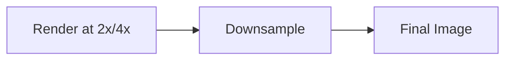

# Super Sampling Antialiasing (SSAA)

## 是什么

Super Sampling Antialiasing（超采样抗锯齿）是最高质量的抗锯齿技术，通过以更高分辨率渲染场景然后降采样来消除锯齿。SSAA 提供最佳视觉质量，但性能开销最大。



## 常用属性一览表

### SceneEnvironment SSAA 属性

| 属性名 | 类型 | 默认值 | 取值范围 | 作用 | 性能/质量提示 |
| ------ | ---- | ------ | -------- | ---- | -------------- |
| antialiasingMode★ | enum | NoAA | SSAA | 启用SSAA | 性能开销大 |
| antialiasingQuality | enum | Medium | Low/Medium/High/VeryHigh | SSAA质量 | 影响采样倍数 |

★ 标记表示高频使用属性

## 最小可运行示例

main.qml:
```qml
import QtQuick
import QtQuick3D

Window {
    width: 1280
    height: 720
    visible: true

    View3D {
        anchors.fill: parent
        
        environment: SceneEnvironment {
            backgroundMode: SceneEnvironment.Color
            clearColor: "#1a1a2e"
            
            // 启用 SSAA
            antialiasingMode: SceneEnvironment.SSAA
            antialiasingQuality: SceneEnvironment.High
        }
        
        PerspectiveCamera {
            position: Qt.vector3d(0, 0, 300)
        }
        
        DirectionalLight { }
        
        Model {
            source: "#Cube"
            materials: PrincipledMaterial {
                baseColor: "#3498db"
            }
            
            SequentialAnimation on eulerRotation.y {
                loops: Animation.Infinite
                NumberAnimation { from: 0; to: 360; duration: 3000 }
            }
        }
    }
}
```

## 实战技巧

### 1. 条件启用

```qml
SceneEnvironment {
    antialiasingMode: highQualityMode ? 
        SceneEnvironment.SSAA : 
        SceneEnvironment.MSAA
}
```

### 2. 截图模式

```qml
function captureHighQuality() {
    // 临时启用 SSAA
    environment.antialiasingMode = SceneEnvironment.SSAA
    environment.antialiasingQuality = SceneEnvironment.VeryHigh
    
    // 截图
    view3d.grabToImage(function(result) {
        result.saveToFile("screenshot.png")
        
        // 恢复正常模式
        environment.antialiasingMode = SceneEnvironment.MSAA
    })
}
```

## 延伸阅读

- [Anti-Aliasing-Techniques.md](./Anti-Aliasing-Techniques.md)
- [Temporal-and-Progressive-Antialiasing.md](./Temporal-and-Progressive-Antialiasing.md)
