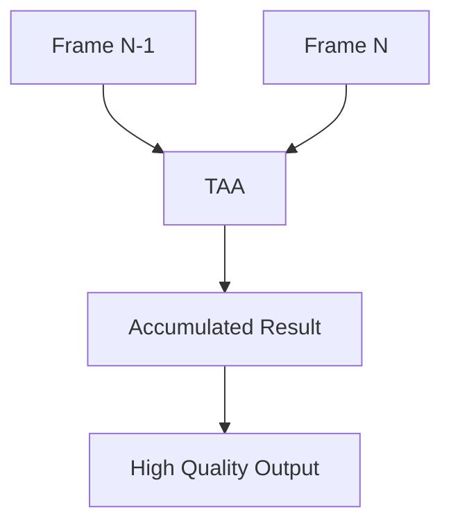

# Temporal and Progressive Antialiasing

## 是什么

Temporal and Progressive Antialiasing（时间和渐进式抗锯齿）是高级抗锯齿技术，通过多帧累积或时间采样来提升图像质量，特别适合静态或慢速移动的场景。



TAA 利用时间信息，Progressive AA 通过渐进式渲染，都能在较低性能开销下获得高质量抗锯齿效果。

## 常用属性一览表

### SceneEnvironment 抗锯齿属性

| 属性名 | 类型 | 默认值 | 取值范围 | 作用 | 性能/质量提示 |
| ------ | ---- | ------ | -------- | ---- | -------------- |
| antialiasingMode★ | enum | NoAA | NoAA/MSAA/SSAA/ProgressiveAA/TemporalAA | 抗锯齿模式 | 影响质量和性能 |
| antialiasingQuality | enum | Medium | Low/Medium/High/VeryHigh | 抗锯齿质量 | 质量越高开销越大 |
| temporalAAEnabled | bool | false | true/false | 启用TAA | Qt 6.4+ |
| temporalAAStrength | real | 0.3 | 0.0-2.0 | TAA强度 | 影响模糊程度 |

★ 标记表示高频使用属性

## 属性详解

### antialiasingMode★ (高频属性)

选择抗锯齿算法类型。

**模式对比：**
- NoAA：无抗锯齿，性能最好
- MSAA：多重采样，平衡性能和质量
- SSAA：超采样，质量最好但性能开销大
- ProgressiveAA：渐进式，适合静态场景
- TemporalAA：时间抗锯齿，高质量低开销

**使用场景：**
```qml
SceneEnvironment {
    // 移动设备
    antialiasingMode: SceneEnvironment.NoAA
    
    // 桌面设备
    antialiasingMode: SceneEnvironment.MSAA
    
    // 静态场景
    antialiasingMode: SceneEnvironment.ProgressiveAA
    
    // 动态场景高质量
    antialiasingMode: SceneEnvironment.TemporalAA
}
```

## 最小可运行示例

main.qml:
```qml
import QtQuick
import QtQuick3D
import QtQuick.Controls

Window {
    width: 1280
    height: 720
    visible: true
    title: "Temporal and Progressive AA 示例"

    View3D {
        id: view3d
        anchors.fill: parent
        
        environment: SceneEnvironment {
            backgroundMode: SceneEnvironment.Color
            clearColor: "#1a1a2e"
            
            antialiasingMode: aaCombo.currentIndex === 0 ? SceneEnvironment.NoAA :
                             aaCombo.currentIndex === 1 ? SceneEnvironment.MSAA :
                             aaCombo.currentIndex === 2 ? SceneEnvironment.SSAA :
                             aaCombo.currentIndex === 3 ? SceneEnvironment.ProgressiveAA :
                             SceneEnvironment.TemporalAA
            
            antialiasingQuality: SceneEnvironment.High
            
            temporalAAEnabled: aaCombo.currentIndex === 4
            temporalAAStrength: taaSlider.value
        }
        
        PerspectiveCamera {
            position: Qt.vector3d(0, 100, 400)
            eulerRotation.x: -15
        }
        
        DirectionalLight {
            eulerRotation.x: -45
        }
        
        // 测试场景：细节丰富的对象
        Model {
            source: "#Sphere"
            scale: Qt.vector3d(2, 2, 2)
            materials: PrincipledMaterial {
                baseColor: "#3498db"
                metalness: 0.8
                roughness: 0.2
            }
            
            // 慢速旋转以测试TAA
            SequentialAnimation on eulerRotation.y {
                loops: Animation.Infinite
                NumberAnimation { from: 0; to: 360; duration: 10000 }
            }
        }
        
        // 网格地面用于测试锯齿
        Model {
            source: "#Rectangle"
            scale: Qt.vector3d(20, 20, 1)
            position.y: -100
            eulerRotation.x: -90
            materials: PrincipledMaterial {
                baseColor: "#2c3e50"
                metalness: 0.3
                roughness: 0.7
            }
        }
    }
    
    // 控制面板
    Rectangle {
        anchors.right: parent.right
        anchors.top: parent.top
        anchors.margins: 20
        width: 320
        height: 350
        color: "#cc000000"
        radius: 10
        
        Column {
            anchors.fill: parent
            anchors.margins: 15
            spacing: 15
            
            Text {
                text: "抗锯齿设置"
                color: "white"
                font.pixelSize: 18
                font.bold: true
            }
            
            Column {
                width: parent.width
                spacing: 5
                
                Text {
                    text: "抗锯齿模式"
                    color: "#ffe66d"
                    font.pixelSize: 14
                }
                
                ComboBox {
                    id: aaCombo
                    width: parent.width
                    model: ["NoAA", "MSAA", "SSAA", "ProgressiveAA", "TemporalAA"]
                    currentIndex: 1
                }
            }
            
            Column {
                width: parent.width
                spacing: 5
                visible: aaCombo.currentIndex === 4
                
                Text {
                    text: "TAA 强度"
                    color: "#ffe66d"
                    font.pixelSize: 14
                }
                
                Row {
                    spacing: 10
                    Text {
                        text: taaSlider.value.toFixed(2)
                        color: "white"
                        width: 50
                    }
                    Slider {
                        id: taaSlider
                        width: 220
                        from: 0.0
                        to: 2.0
                        value: 0.3
                    }
                }
            }
            
            Rectangle {
                width: parent.width
                height: 1
                color: "#555"
            }
            
            Text {
                text: "模式说明："
                color: "#ffe66d"
                font.pixelSize: 12
            }
            
            Text {
                text: {
                    switch(aaCombo.currentIndex) {
                        case 0: return "NoAA: 无抗锯齿\n性能最好，边缘有锯齿"
                        case 1: return "MSAA: 多重采样\n平衡性能和质量"
                        case 2: return "SSAA: 超采样\n质量最好，性能开销大"
                        case 3: return "ProgressiveAA: 渐进式\n适合静态场景，逐帧提升"
                        case 4: return "TemporalAA: 时间抗锯齿\n利用历史帧，高质量低开销"
                        default: return ""
                    }
                }
                color: "#aaaaaa"
                font.pixelSize: 11
                wrapMode: Text.WordWrap
                width: parent.width
            }
        }
    }
}
```

## 常见问题与调试

### 1. TAA 产生模糊

**解决方案：**
```qml
SceneEnvironment {
    temporalAAEnabled: true
    temporalAAStrength: 0.2  // 降低强度
}
```

### 2. Progressive AA 不生效

**原因：**
场景持续变化，无法累积。

**解决方案：**
```qml
// 确保场景静止
Model {
    // 停止动画
}
```

## 实战技巧

### 1. 自适应抗锯齿

```qml
SceneEnvironment {
    antialiasingMode: {
        if (sceneIsStatic)
            return SceneEnvironment.ProgressiveAA
        else if (highPerformanceMode)
            return SceneEnvironment.NoAA
        else
            return SceneEnvironment.TemporalAA
    }
}
```

### 2. 平台优化

```qml
SceneEnvironment {
    antialiasingMode: {
        if (Qt.platform.os === "android" || Qt.platform.os === "ios")
            return SceneEnvironment.NoAA
        else
            return SceneEnvironment.TemporalAA
    }
}
```

## 延伸阅读

- [Anti-Aliasing-Techniques.md](./Anti-Aliasing-Techniques.md)
- [Super-Sampling-Antialiasing-SSAA.md](./Super-Sampling-Antialiasing-SSAA.md)
- [Scene-Rendering.md](./Scene-Rendering.md)
