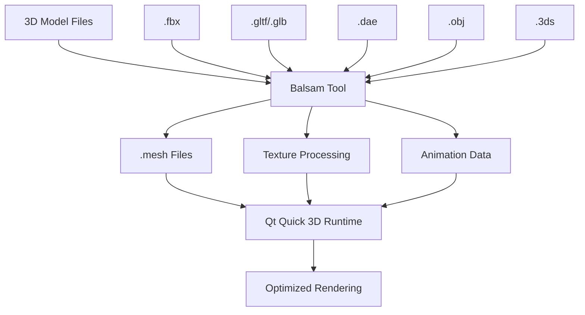

# Balsam Asset Import Tool

## 是什么

Balsam是Qt Quick 3D提供的命令行资产导入工具，用于将各种3D模型格式转换为Qt Quick 3D的原生.mesh格式。它是Qt Quick 3D资产管线的核心工具，负责优化和预处理3D资产以获得最佳运行时性能。



Balsam工具通过预处理3D资产，消除了运行时的格式转换开销，并提供了多种优化选项来平衡质量和性能。它支持批量处理，是构建高效3D应用的必备工具。

## 常用参数一览表

| 参数名 | 类型 | 默认值 | 取值范围 | 作用 | 性能/质量提示 |
| ------ | ---- | ------ | -------- | ---- | -------------- |
| --outputPath★ | string | 当前目录 | 目录路径 | 指定输出目录 | 使用绝对路径避免混淆 |
| --generateMeshLevelsOfDetail★ | int | 0 | 0-4 | 生成LOD级别 | 提升远距离渲染性能 |
| --meshOptimization★ | enum | Normal | None/Fast/Normal/Best | 网格优化级别 | Best质量最高但处理时间长 |
| --textureCompression★ | enum | None | None/Fast/Best | 纹理压缩 | 显著减少内存使用 |
| --generateTangents | bool | false | true/false | 生成切线数据 | 法线贴图必需，增加文件大小 |
| --generateNormals | bool | false | true/false | 生成法线 | 平滑着色必需 |
| --generateLightmapUV | bool | false | true/false | 生成光照贴图UV | 烘焙光照必需 |
| --scaleToFitSize | float | 0 | 正数 | 缩放到指定大小 | 统一模型尺寸 |
| --dropNormals | bool | false | true/false | 移除法线数据 | 减少文件大小但影响光照 |
| --dropTangents | bool | false | true/false | 移除切线数据 | 无法使用法线贴图 |
| --dropTextureCoordinates | bool | false | true/false | 移除纹理坐标 | 无法使用纹理 |
| --generateMipMaps | bool | true | true/false | 生成纹理Mipmap | 改善纹理质量和性能 |

★ 标记表示高频使用参数

## 属性详解

### --outputPath★ (高频参数)

指定转换后文件的输出目录。这是组织项目资产结构的关键参数。

**使用场景：**

- 将转换后的资产输出到项目的assets目录
- 按类型组织不同的资产文件
- 批量处理时统一输出位置

**注意事项：**

- 使用绝对路径避免路径混淆
- 确保目标目录具有写入权限
- 输出目录不存在时会自动创建

### --generateMeshLevelsOfDetail★ (高频参数)

自动生成网格的细节层次（LOD），根据距离显示不同精度的模型版本。

**LOD级别说明：**

- 0: 不生成LOD（默认）
- 1: 生成1个简化级别
- 2-4: 生成多个递进简化级别

**使用场景：**

- 大型场景中的远距离对象
- 移动设备性能优化
- 复杂模型的性能平衡

**注意事项：**

- LOD级别越高，文件大小越大
- 需要在运行时配置LOD距离阈值
- 简化算法可能影响模型外观

### --meshOptimization★ (高频参数)

控制网格数据的优化程度，影响渲染性能和文件大小。

**优化级别：**

- `None`: 不进行优化，保持原始数据
- `Fast`: 快速优化，基本的顶点合并
- `Normal`: 标准优化，平衡质量和性能
- `Best`: 最佳优化，最大化性能但处理时间长

**使用场景：**

- 开发阶段使用Fast快速迭代
- 发布版本使用Best获得最佳性能
- 特殊模型使用None保持精度

### --textureCompression★ (高频参数)

启用纹理压缩以减少内存使用和加载时间。

**压缩选项：**

- `None`: 不压缩纹理
- `Fast`: 快速压缩，质量略有损失
- `Best`: 最佳压缩，质量和大小平衡

**使用场景：**

- 移动设备必须启用压缩
- 大量纹理的项目
- 内存受限的环境

## 最小可运行示例

**文件树：**

```text
asset-conversion/
├── models/
│   ├── character.fbx
│   ├── environment.gltf
│   └── props.obj
├── textures/
│   ├── diffuse.png
│   └── normal.png
├── output/
└── convert.bat
```

**完整代码：**

convert.bat (Windows):
```batch
@echo off
echo Converting 3D assets with Balsam...

REM 基础转换 - 单个文件
balsam --outputPath ./output models/character.fbx

REM 高质量转换 - 包含LOD和优化
balsam --outputPath ./output ^
       --generateMeshLevelsOfDetail 3 ^
       --meshOptimization Best ^
       --textureCompression Best ^
       --generateTangents ^
       --generateNormals ^
       models/environment.gltf

REM 批量转换 - 整个目录
balsam --outputPath ./output ^
       --meshOptimization Normal ^
       --textureCompression Fast ^
       --generateMipMaps ^
       models/

REM 移动设备优化转换
balsam --outputPath ./output/mobile ^
       --generateMeshLevelsOfDetail 2 ^
       --meshOptimization Best ^
       --textureCompression Best ^
       --scaleToFitSize 1.0 ^
       --dropTangents ^
       models/props.obj

echo Conversion completed!
pause
```

convert.sh (Linux/macOS):
```bash
#!/bin/bash
echo "Converting 3D assets with Balsam..."

# 基础转换 - 单个文件
balsam --outputPath ./output models/character.fbx

# 高质量转换 - 包含LOD和优化
balsam --outputPath ./output \
       --generateMeshLevelsOfDetail 3 \
       --meshOptimization Best \
       --textureCompression Best \
       --generateTangents \
       --generateNormals \
       models/environment.gltf

# 批量转换 - 整个目录
balsam --outputPath ./output \
       --meshOptimization Normal \
       --textureCompression Fast \
       --generateMipMaps \
       models/

# 移动设备优化转换
balsam --outputPath ./output/mobile \
       --generateMeshLevelsOfDetail 2 \
       --meshOptimization Best \
       --textureCompression Best \
       --scaleToFitSize 1.0 \
       --dropTangents \
       models/props.obj

echo "Conversion completed!"
```

CMakeLists.txt集成:
```cmake
# 在构建过程中自动转换资产
find_program(BALSAM_TOOL balsam REQUIRED)

function(convert_3d_assets)
    set(INPUT_DIR ${CMAKE_SOURCE_DIR}/assets/models)
    set(OUTPUT_DIR ${CMAKE_BINARY_DIR}/assets)
    
    file(GLOB_RECURSE MODEL_FILES 
         "${INPUT_DIR}/*.fbx"
         "${INPUT_DIR}/*.gltf" 
         "${INPUT_DIR}/*.obj")
    
    foreach(MODEL_FILE ${MODEL_FILES})
        get_filename_component(MODEL_NAME ${MODEL_FILE} NAME_WE)
        set(OUTPUT_FILE ${OUTPUT_DIR}/${MODEL_NAME}.mesh)
        
        add_custom_command(
            OUTPUT ${OUTPUT_FILE}
            COMMAND ${BALSAM_TOOL} 
                    --outputPath ${OUTPUT_DIR}
                    --meshOptimization Normal
                    --textureCompression Fast
                    ${MODEL_FILE}
            DEPENDS ${MODEL_FILE}
            COMMENT "Converting ${MODEL_NAME} with Balsam"
        )
        
        list(APPEND CONVERTED_ASSETS ${OUTPUT_FILE})
    endforeach()
    
    add_custom_target(convert_assets ALL DEPENDS ${CONVERTED_ASSETS})
endfunction()

convert_3d_assets()
```

**预期效果：**
将models目录中的3D模型文件转换为优化的.mesh格式，输出到指定目录，文件大小减少30-70%。

## 踩坑与调试

### 常见错误

**错误1：文件格式不支持**
```
Error: Unsupported file format: .blend
```
**解决方案：**
1. 检查支持的格式列表：.fbx, .gltf, .glb, .dae, .obj, .3ds
2. 使用Blender等工具导出为支持的格式
3. 确保文件没有损坏或加密
4. 检查文件扩展名是否正确

**错误2：纹理路径问题**
```
Warning: Texture not found: textures/missing.png
```
**解决方案：**
1. 确保纹理文件与模型文件在相对路径下
2. 使用绝对路径或将纹理复制到模型目录
3. 检查纹理文件名的大小写敏感性
4. 验证纹理格式是否支持

**错误3：内存不足**
```
Error: Out of memory during mesh optimization
```
**解决方案：**
1. 降低meshOptimization级别
2. 分批处理大型模型文件
3. 增加系统可用内存
4. 使用--dropNormals等参数减少数据量

### 调试技巧

1. **详细输出模式**
   - 使用--verbose参数查看详细处理信息
   - 检查每个处理步骤的输出
   - 分析性能瓶颈和警告信息

2. **分步处理**
   - 先进行基础转换，再添加优化参数
   - 逐个测试不同的优化选项
   - 比较不同参数组合的效果

3. **质量验证**
   - 在Qt Quick 3D中加载转换后的模型
   - 检查纹理映射和材质效果
   - 验证动画数据的完整性

### 性能优化建议

- 开发阶段使用Fast优化快速迭代
- 发布版本使用Best优化获得最佳性能
- 根据目标平台选择合适的压缩级别
- 大型项目使用批处理脚本自动化转换
- 定期清理输出目录避免磁盘空间浪费

## 延伸阅读

1. **Qt Quick 3D Asset Conditioning**  
   官方文档详细介绍了Balsam工具的所有功能和最佳实践，包括高级优化技巧。  
   链接：https://doc.qt.io/qt-6/quick3d-asset-conditioning.html

2. **3D Asset Pipeline Best Practices**  
   业界标准的3D资产管线最佳实践，涵盖从建模到运行时优化的完整流程。  
   链接：https://docs.unrealengine.com/5.0/en-US/content-pipeline-best-practices/

## 附录：完整参数清单

<details>
<summary>点击展开完整参数列表</summary>

| 参数名 | 类型 | 默认值 | 取值范围 | 作用 | 版本支持 |
| ------ | ---- | ------ | -------- | ---- | -------- |
| --outputPath | string | 当前目录 | 目录路径 | 输出目录 | Qt 6.0+ |
| --generateMeshLevelsOfDetail | int | 0 | 0-4 | LOD级别数 | Qt 6.0+ |
| --meshOptimization | enum | Normal | None/Fast/Normal/Best | 网格优化 | Qt 6.0+ |
| --textureCompression | enum | None | None/Fast/Best | 纹理压缩 | Qt 6.0+ |
| --generateTangents | bool | false | true/false | 生成切线 | Qt 6.0+ |
| --generateNormals | bool | false | true/false | 生成法线 | Qt 6.0+ |
| --generateLightmapUV | bool | false | true/false | 光照贴图UV | Qt 6.2+ |
| --scaleToFitSize | float | 0 | 正数 | 缩放大小 | Qt 6.0+ |
| --dropNormals | bool | false | true/false | 移除法线 | Qt 6.0+ |
| --dropTangents | bool | false | true/false | 移除切线 | Qt 6.0+ |
| --dropTextureCoordinates | bool | false | true/false | 移除UV | Qt 6.0+ |
| --generateMipMaps | bool | true | true/false | 生成Mipmap | Qt 6.0+ |
| --useBinaryKeyframes | bool | true | true/false | 二进制关键帧 | Qt 6.0+ |
| --generateLightmaps | bool | false | true/false | 生成光照贴图 | Qt 6.5+ |
| --lightmapBaseResolution | int | 256 | 64-2048 | 光照贴图分辨率 | Qt 6.5+ |
| --lightmapQuality | enum | Medium | Low/Medium/High | 光照贴图质量 | Qt 6.5+ |
| --recalculateNormals | bool | false | true/false | 重新计算法线 | Qt 6.2+ |
| --recalculateTangents | bool | false | true/false | 重新计算切线 | Qt 6.2+ |
| --smoothNormals | bool | false | true/false | 平滑法线 | Qt 6.2+ |
| --verbose | bool | false | true/false | 详细输出 | Qt 6.0+ |
| --help | bool | false | true/false | 显示帮助 | Qt 6.0+ |
| --version | bool | false | true/false | 显示版本 | Qt 6.0+ |

**支持的输入格式：**
- .fbx (Autodesk FBX)
- .gltf/.glb (GL Transmission Format)
- .dae (COLLADA)
- .obj (Wavefront OBJ)
- .3ds (3D Studio Max)
- .ply (Stanford PLY) - Qt 6.2+
- .stl (STereoLithography) - Qt 6.5+

**输出格式：**
- .mesh (Qt Quick 3D原生格式)
- .qml (QML组件文件)
- 纹理文件（根据压缩设置）

**版本差异说明：**
- Qt 6.0-6.1: 基础转换功能，支持主要3D格式
- Qt 6.2: 新增光照贴图UV生成和法线重计算
- Qt 6.5: 新增烘焙光照和更多输入格式支持
- Qt 6.7: 优化处理速度和内存使用

</details>