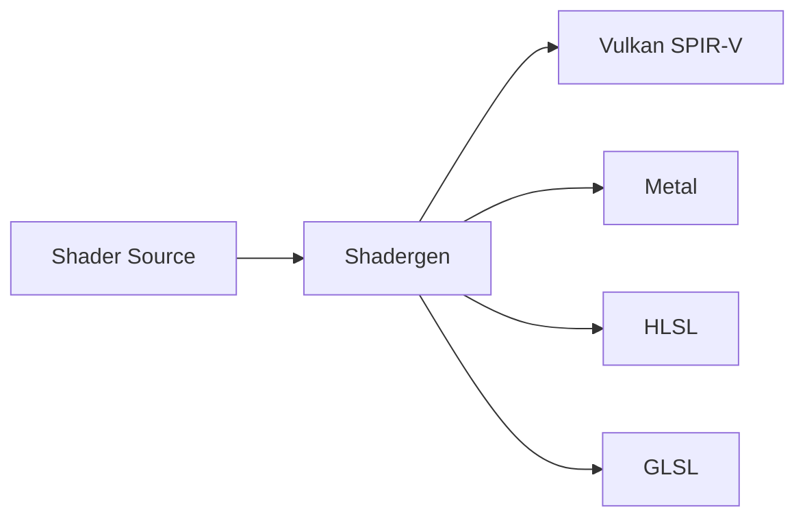

# Shadergen Tool

## 是什么

Shadergen Tool（着色器生成工具）是 Qt Quick 3D 提供的命令行工具，用于生成、编译和优化着色器代码。它可以将高级着色器描述转换为针对不同图形 API 优化的着色器代码。



Shadergen 是 Qt Quick 3D 渲染管线的重要工具，支持跨平台着色器开发和优化。

## 常用参数一览表

### 命令行参数

| 参数 | 类型 | 默认值 | 作用 | 使用场景 |
| ---- | ---- | ------ | ---- | -------- |
| --input★ | 文件路径 | - | 输入着色器文件 | 必需参数 |
| --output★ | 文件路径 | - | 输出目录 | 必需参数 |
| --target | API | all | vulkan/metal/hlsl/glsl | 目标图形API |
| --optimize | 级别 | 1 | 0/1/2/3 | 优化级别 |
| --debug | 标志 | false | 启用调试信息 | 开发调试 |
| --validate | 标志 | true | 验证着色器 | 错误检查 |

★ 标记表示必需参数

## 参数详解

### --input★ (必需参数)

指定输入的着色器源文件路径。

**使用场景：**
- 编译自定义着色器
- 转换着色器格式
- 优化现有着色器

**注意事项：**
- 支持 .vert, .frag, .comp 等扩展名
- 文件必须存在且可读
- 支持相对路径和绝对路径

**示例：**
```bash
shadergen --input shader.frag --output ./shaders
```

### --output★ (必需参数)

指定输出目录，生成的着色器文件将保存在此目录。

**使用场景：**
- 组织编译后的着色器
- 集成到项目资源
- 版本控制管理

**注意事项：**
- 目录会自动创建
- 已存在的文件会被覆盖
- 建议使用项目相对路径

**示例：**
```bash
shadergen --input shader.frag --output ./build/shaders
```

### --target (目标平台)

指定目标图形 API，控制生成哪些平台的着色器代码。

**使用场景：**
- all：生成所有平台（默认）
- vulkan：仅生成 Vulkan SPIR-V
- metal：仅生成 Metal
- hlsl：仅生成 Direct3D HLSL
- glsl：仅生成 OpenGL GLSL

**注意事项：**
- 默认生成所有平台以确保跨平台兼容
- 可以指定多个目标（逗号分隔）
- 不同平台可能有特定限制

**示例：**
```bash
# 仅生成 Vulkan 和 Metal
shadergen --input shader.frag --output ./shaders --target vulkan,metal
```

### --optimize (优化级别)

控制着色器优化程度。

**优化级别：**
- 0：无优化（最快编译）
- 1：基础优化（默认）
- 2：标准优化（平衡）
- 3：激进优化（最慢编译，最优性能）

**使用场景：**
- 开发阶段：使用 0 或 1
- 测试阶段：使用 2
- 发布版本：使用 3

**示例：**
```bash
# 发布版本使用最高优化
shadergen --input shader.frag --output ./shaders --optimize 3
```

## 最小可运行示例

### 1. 基础着色器编译

**custom_shader.frag:**
```glsl
#version 440

layout(location = 0) in vec2 texCoord;
layout(location = 0) out vec4 fragColor;

layout(binding = 1) uniform sampler2D baseColorMap;

void main()
{
    fragColor = texture(baseColorMap, texCoord);
}
```

**编译命令：**
```bash
# Windows
shadergen --input custom_shader.frag --output ./shaders

# Linux/macOS
./shadergen --input custom_shader.frag --output ./shaders
```

**输出文件：**
```
shaders/
├── custom_shader.frag.qsb
└── custom_shader_metadata.json
```

### 2. 多平台编译

```bash
# 生成所有平台
shadergen --input shader.frag --output ./shaders --target all

# 仅移动平台
shadergen --input shader.frag --output ./shaders --target vulkan,metal
```

### 3. 优化编译

```bash
# 开发版本（快速编译）
shadergen --input shader.frag --output ./shaders --optimize 0 --debug

# 发布版本（最优性能）
shadergen --input shader.frag --output ./shaders --optimize 3
```

### 4. 批量编译

**compile_shaders.bat (Windows):**
```batch
@echo off
for %%f in (shaders\*.frag) do (
    shadergen --input %%f --output build\shaders --optimize 2
)
for %%f in (shaders\*.vert) do (
    shadergen --input %%f --output build\shaders --optimize 2
)
echo Shader compilation complete!
```

**compile_shaders.sh (Linux/macOS):**
```bash
#!/bin/bash
for file in shaders/*.frag shaders/*.vert; do
    ./shadergen --input "$file" --output build/shaders --optimize 2
done
echo "Shader compilation complete!"
```

### 5. CMake 集成

**CMakeLists.txt:**
```cmake
# 查找 shadergen 工具
find_program(SHADERGEN shadergen)

if(SHADERGEN)
    # 定义着色器编译函数
    function(compile_shader SHADER_FILE)
        get_filename_component(SHADER_NAME ${SHADER_FILE} NAME)
        set(OUTPUT_FILE ${CMAKE_BINARY_DIR}/shaders/${SHADER_NAME}.qsb)
        
        add_custom_command(
            OUTPUT ${OUTPUT_FILE}
            COMMAND ${SHADERGEN}
                --input ${SHADER_FILE}
                --output ${CMAKE_BINARY_DIR}/shaders
                --optimize 2
            DEPENDS ${SHADER_FILE}
            COMMENT "Compiling shader: ${SHADER_NAME}"
        )
        
        list(APPEND COMPILED_SHADERS ${OUTPUT_FILE})
        set(COMPILED_SHADERS ${COMPILED_SHADERS} PARENT_SCOPE)
    endfunction()
    
    # 编译所有着色器
    file(GLOB SHADER_FILES 
        ${CMAKE_SOURCE_DIR}/shaders/*.frag
        ${CMAKE_SOURCE_DIR}/shaders/*.vert
    )
    
    foreach(SHADER ${SHADER_FILES})
        compile_shader(${SHADER})
    endforeach()
    
    # 添加自定义目标
    add_custom_target(CompileShaders ALL
        DEPENDS ${COMPILED_SHADERS}
    )
endif()
```

## 常见问题与调试

### 1. 找不到 shadergen 工具

**问题：**
```
'shadergen' is not recognized as an internal or external command
```

**解决方案：**
```bash
# 添加 Qt 的 bin 目录到 PATH
# Windows
set PATH=%PATH%;C:\Qt\6.x.x\msvc2019_64\bin

# Linux/macOS
export PATH=$PATH:/opt/Qt/6.x.x/gcc_64/bin
```

### 2. 着色器编译错误

**问题：**
```
Error: Shader compilation failed
```

**解决方案：**
```bash
# 启用详细输出和调试信息
shadergen --input shader.frag --output ./shaders --debug --verbose

# 检查着色器语法
# 确保使用正确的 GLSL 版本
# 检查 layout 绑定是否正确
```

### 3. 输出文件未生成

**问题：**
输出目录为空或文件不完整。

**解决方案：**
```bash
# 检查输出目录权限
# 确保目录可写

# 使用绝对路径
shadergen --input shader.frag --output C:/project/shaders

# 检查磁盘空间
```

### 4. 跨平台兼容性问题

**问题：**
某些平台的着色器无法生成。

**解决方案：**
```bash
# 检查着色器是否使用了平台特定功能
# 使用标准 GLSL 语法

# 分别测试每个平台
shadergen --input shader.frag --output ./shaders --target vulkan
shadergen --input shader.frag --output ./shaders --target metal
shadergen --input shader.frag --output ./shaders --target hlsl
```

## 实战技巧

### 1. 自动化构建流程

```bash
# 在构建脚本中集成
#!/bin/bash

echo "Compiling shaders..."
SHADER_DIR="src/shaders"
OUTPUT_DIR="build/shaders"

mkdir -p $OUTPUT_DIR

for shader in $SHADER_DIR/*.{vert,frag,comp}; do
    if [ -f "$shader" ]; then
        echo "Compiling: $shader"
        shadergen --input "$shader" --output "$OUTPUT_DIR" --optimize 2
        
        if [ $? -ne 0 ]; then
            echo "Error compiling $shader"
            exit 1
        fi
    fi
done

echo "Shader compilation complete!"
```

### 2. 条件编译

```bash
# 根据构建类型选择优化级别
if [ "$BUILD_TYPE" = "Debug" ]; then
    OPTIMIZE=0
    DEBUG_FLAG="--debug"
else
    OPTIMIZE=3
    DEBUG_FLAG=""
fi

shadergen --input shader.frag --output ./shaders --optimize $OPTIMIZE $DEBUG_FLAG
```

### 3. 版本控制

```bash
# .gitignore
build/shaders/*.qsb
*.qsb

# 仅提交源着色器文件
# 编译后的文件在构建时生成
```

### 4. 性能分析

```bash
# 比较不同优化级别的性能
for level in 0 1 2 3; do
    echo "Testing optimization level: $level"
    time shadergen --input shader.frag --output ./test_$level --optimize $level
done
```

### 5. 着色器变体管理

```bash
# 为不同质量级别编译着色器变体
shadergen --input shader_low.frag --output ./shaders/low --optimize 1
shadergen --input shader_medium.frag --output ./shaders/medium --optimize 2
shadergen --input shader_high.frag --output ./shaders/high --optimize 3
```

## 延伸阅读

- [CustomMaterial.md](./CustomMaterial.md) - 自定义材质文档
- [Qt Shader Tools Documentation](https://doc.qt.io/qt-6/qtshadertools-index.html)
- [Balsam-Asset-Import-Tool.md](./Balsam-Asset-Import-Tool.md) - 资源导入工具
- [Qt Quick 3D - Custom Materials](https://doc.qt.io/qt-6/quick3d-custom-materials.html)
