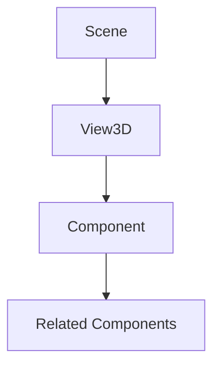

# [Component Name]

## 是什么

[Component definition and positioning in Qt Quick 3D framework]



[Brief explanation of the component's role and relationships]

## 常用属性一览表

| 属性名 | 类型 | 默认值 | 取值范围 | 作用 | 性能/质量提示 |
| ------ | ---- | ------ | -------- | ---- | -------------- |
| property★ | type | default | range/enum | description | performance note |
| property | type | default | range/enum | description | performance note |

★ 标记表示高频使用属性

## 属性详解

### property★ (高频属性)

[Detailed explanation of the high-frequency property marked with ★]

**使用场景：**
- [Common use case 1]
- [Common use case 2]

**注意事项：**
- [Important consideration 1]
- [Important consideration 2]

### property

[Detailed explanation of other important properties]

## 最小可运行示例

**文件树：**
```
project/
├── main.qml
├── assets/
│   └── [relevant assets]
└── CMakeLists.txt
```

**完整代码：**

main.qml:
```qml
import QtQuick
import QtQuick3D

Window {
    width: 800
    height: 600
    visible: true
    title: "[Component Name] Example"

    View3D {
        anchors.fill: parent
        
        // Camera setup
        PerspectiveCamera {
            position: Qt.vector3d(0, 0, 5)
        }
        
        // Component example
        [ComponentName] {
            // Property configurations
        }
        
        // Lighting
        DirectionalLight {
            eulerRotation.x: -45
        }
    }
}
```

CMakeLists.txt:
```cmake
cmake_minimum_required(VERSION 3.16)
project([ProjectName])

find_package(Qt6 REQUIRED COMPONENTS Core Quick Quick3D)

qt_add_executable([ProjectName] main.cpp)
qt_add_qml_module([ProjectName]
    URI [ProjectName]
    VERSION 1.0
    QML_FILES main.qml
)

target_link_libraries([ProjectName] Qt6::Core Qt6::Quick Qt6::Quick3D)
```

**预期效果：**
[20-word description of expected visual result]

## 踩坑与调试

### 常见错误

**错误1：[Common Error Description]**
```
Console Warning: [Actual warning message]
```
**解决方案：**
[Step-by-step solution]

**错误2：[Another Common Error]**
```
Console Warning: [Another warning message]
```
**解决方案：**
[Step-by-step solution]

### 调试技巧

1. **[Debugging technique 1]**
   - [Specific debugging step]
   - [Expected outcome]

2. **[Debugging technique 2]**
   - [Specific debugging step]
   - [Expected outcome]

### 性能优化建议

- [Performance tip 1]
- [Performance tip 2]
- [Performance tip 3]

## 延伸阅读

1. **[External Resource Title 1]**  
   [Brief description of the resource and why it's useful]  
   链接：[URL]

2. **[External Resource Title 2]**  
   [Brief description of the resource and why it's useful]  
   链接：[URL]

## 附录：完整属性清单

<details>
<summary>点击展开完整属性列表</summary>

| 属性名 | 类型 | 默认值 | 取值范围 | 作用 | 版本支持 |
| ------ | ---- | ------ | -------- | ---- | -------- |
| property1 | type | default | range | description | Qt 6.2+ |
| property2 | type | default | range | description | Qt 6.5+ |
| property3 | type | default | range | description | Qt 6.7+ |
| ... | ... | ... | ... | ... | ... |

**版本差异说明：**
- Qt 6.2: [behavior description]
- Qt 6.5: [behavior changes]
- Qt 6.7: [latest behavior]

</details>