# 渲染方程与光照模型深度解析

> 本文档深入解析计算机图形学中的渲染方程、BRDF模型、光照理论等核心概念，包含详细的数学推导、物理原理和概念拓展。

## 目录

1. [渲染方程基础理论](#1-渲染方程基础理论)
2. [辐射度量学基础](#2-辐射度量学基础)
3. [BRDF 双向反射分布函数](#3-brdf-双向反射分布函数)
4. [Lambert 漫反射模型](#4-lambert-漫反射模型)
5. [Cook-Torrance 镜面反射模型](#5-cook-torrance-镜面反射模型)
6. [菲涅尔效应](#6-菲涅尔效应)
7. [微表面理论](#7-微表面理论)
8. [全局光照与环境光遮蔽](#8-全局光照与环境光遮蔽)
9. [图像基础光照 IBL](#9-图像基础光照-ibl)
10. [能量守恒原理](#10-能量守恒原理)

---

## 1. 渲染方程基础理论

### 1.1 渲染方程的起源

**渲染方程（Rendering Equation）** 由 James Kajiya 在 1986 年提出，是计算机图形学中描述光线传输的基础方程。它统一了光线追踪、辐射度等多种渲染技术的理论基础。

### 1.2 渲染方程的数学表达

完整的渲染方程表示为：

```
L_o(p, ω_o) = L_e(p, ω_o) + ∫_Ω f_r(p, ω_i, ω_o) L_i(p, ω_i) (n · ω_i) dω_i
```

### 1.3 符号解释

| 符号 | 名称 | 含义 | 单位 |
|------|------|------|------|
| **L_o(p, ω_o)** | 出射辐射度 | 从点 p 沿方向 ω_o 出射的光线强度 | W/(m²·sr) |
| **L_e(p, ω_o)** | 自发光辐射度 | 点 p 自身发出的光线强度 | W/(m²·sr) |
| **L_i(p, ω_i)** | 入射辐射度 | 从方向 ω_i 入射到点 p 的光线强度 | W/(m²·sr) |
| **f_r(p, ω_i, ω_o)** | BRDF | 双向反射分布函数 | sr⁻¹ |
| **n** | 表面法线 | 点 p 处的单位法向量 | 无量纲 |
| **ω_i** | 入射方向 | 光线入射的单位方向向量 | 无量纲 |
| **ω_o** | 出射方向 | 光线出射的单位方向向量 | 无量纲 |
| **Ω** | 半球积分域 | 以法线 n 为轴的上半球 | 立体角 |
| **(n · ω_i)** | 余弦项 | Lambert 余弦定律 | 无量纲 |
| **dω_i** | 微分立体角 | 无穷小的立体角元素 | sr |

### 1.4 渲染方程的物理意义

渲染方程描述了光线在场景中的传输过程：

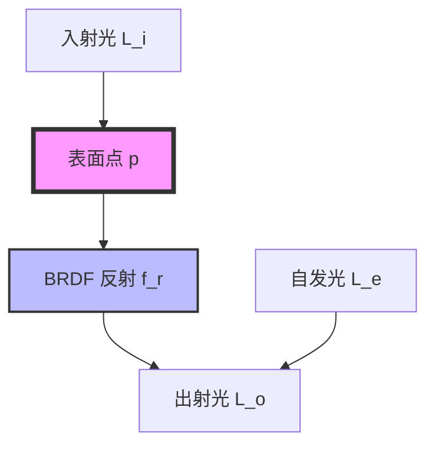

**核心思想**：
1. 一个点的出射光 = 自发光 + 所有入射光经过表面反射的总和
2. 这是一个**递归方程**：入射光 L_i 本身也是其他点的出射光 L_o
3. 积分遍历整个半球，考虑所有可能的入射方向

### 1.5 渲染方程的递归性质

```
L_o(p, ω_o) = L_e(p, ω_o) + ∫_Ω f_r(p, ω_i, ω_o) L_i(p, ω_i) (n · ω_i) dω_i

其中 L_i(p, ω_i) 可以展开为：
L_i(p, ω_i) = L_o(p', -ω_i)  (p' 是光线反向追踪的交点)

因此：
L_o(p, ω_o) = L_e(p, ω_o) + ∫_Ω f_r(p, ω_i, ω_o) L_o(p', -ω_i) (n · ω_i) dω_i
```

这种递归性质导致：
- **直接光照**：光源直接照射到表面
- **间接光照**：光线经过多次反射后到达表面
- **全局光照**：考虑所有光线传输路径

### 1.6 渲染方程的求解困难

**为什么难以精确求解？**

1. **积分域复杂**：需要对整个半球积分
2. **递归性质**：L_i 依赖于其他点的 L_o
3. **高维问题**：涉及位置、方向、时间、波长等多个维度
4. **计算量巨大**：精确求解需要追踪无限次反射

**实时渲染的近似方法**：
- 只考虑直接光照（忽略间接光照）
- 使用预计算（光照贴图、环境贴图）
- 简化 BRDF 模型
- 使用屏幕空间技术（SSAO、SSR）


## 2. 辐射度量学基础

### 2.1 为什么需要辐射度量学

**辐射度量学（Radiometry）** 是研究电磁辐射能量传输的科学。在计算机图形学中，我们需要精确的物理量来描述光线，以实现物理正确的渲染。

### 2.2 核心物理量

#### 2.2.1 辐射能量 (Radiant Energy)

**定义**：电磁辐射的总能量

**符号**：Q  
**单位**：焦耳 (J)

```
Q = ∫ Φ dt
```
 
#### 2.2.2 辐射通量 (Radiant Flux / Power)

**定义**：单位时间内通过某个表面的辐射能量

**符号**：Φ  
**单位**：瓦特 (W) = J/s

```
Φ = dQ/dt
```

**物理意义**：光源的"功率"，例如 100W 的灯泡

#### 2.2.3 辐射强度 (Radiant Intensity)

**定义**：点光源在单位立体角内发出的辐射通量

**符号**：I  
**单位**：W/sr (瓦特每球面度)

```
I = dΦ/dω
```

**立体角（Solid Angle）**：
```
立体角 ω 的定义：
ω = A/r²

其中：
A = 球面上的面积
r = 球的半径

单位：球面度 (steradian, sr)
整个球面的立体角：4π sr
半球的立体角：2π sr
```

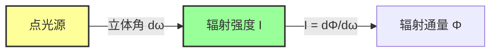

#### 2.2.4 辐照度 (Irradiance)

**定义**：单位面积接收到的辐射通量

**符号**：E  
**单位**：W/m²

```
E = dΦ/dA
```

**物理意义**：表面接收到的光线"密度"

**Lambert 余弦定律**：
```
E = I · cos(θ) / r²

其中：
θ = 光线方向与表面法线的夹角
r = 光源到表面的距离
```

#### 2.2.5 辐射度 (Radiance)

**定义**：单位投影面积、单位立体角内的辐射通量

**符号**：L  
**单位**：W/(m²·sr)

```
L = d²Φ / (dA · cos(θ) · dω)
```

**这是最重要的量**，因为：
1. 辐射度在传输过程中保持不变（真空中）
2. 相机传感器测量的就是辐射度
3. 渲染方程使用辐射度作为基本量

### 2.3 物理量之间的关系

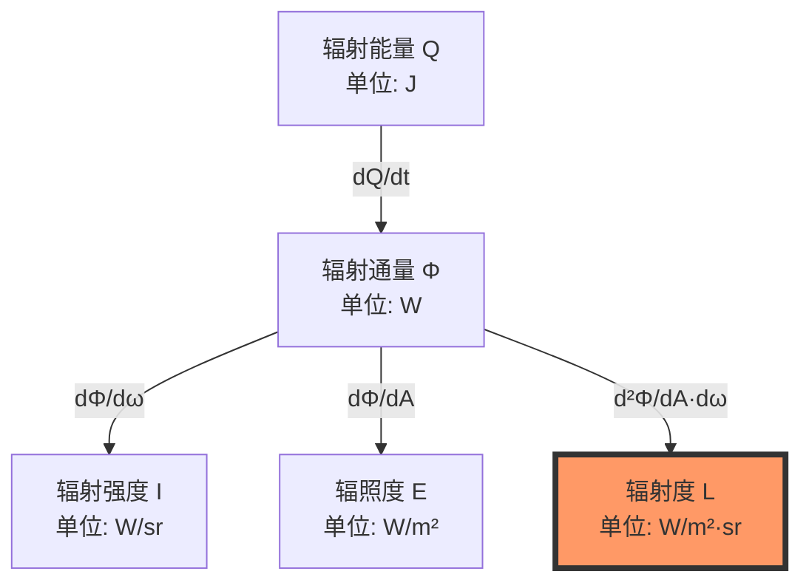

### 2.4 辐射度的重要性质

#### 2.4.1 不变性

在真空中，辐射度沿直线传播时保持不变：

```
L(p₁ → p₂) = L(p₂ ← p₁)
```

这个性质使得我们可以：
- 从任意点追踪光线
- 双向路径追踪
- 光子映射

#### 2.4.2 可加性

多个光源的辐射度可以直接相加：

```
L_total = L₁ + L₂ + L₃ + ...
```

#### 2.4.3 与其他量的关系

**辐照度与辐射度**：
```
E(p) = ∫_Ω L_i(p, ω) cos(θ) dω
```

**辐射强度与辐射度**：
```
I(ω) = ∫_A L(p, ω) cos(θ) dA
```

### 2.5 实际应用示例

**例1：计算点光源的辐照度**

```
已知：
- 点光源辐射强度 I = 100 W/sr
- 距离 r = 2 m
- 入射角 θ = 30°

求：表面辐照度 E

解：
E = I · cos(θ) / r²
E = 100 · cos(30°) / 4
E = 100 · 0.866 / 4
E = 21.65 W/m²
```

**例2：Lambert 表面的辐射度**

```
已知：
- 表面反照率 ρ = 0.8
- 入射辐照度 E = 1000 W/m²

求：出射辐射度 L

解：
对于 Lambert 表面：
L = ρ · E / π
L = 0.8 · 1000 / π
L ≈ 254.6 W/(m²·sr)
```


## 3. BRDF 双向反射分布函数

### 3.1 BRDF 的定义

**BRDF (Bidirectional Reflectance Distribution Function)** 描述了光线在表面上的反射特性。

**数学定义**：

```
f_r(ω_i, ω_o) = dL_o(ω_o) / dE_i(ω_i)
              = dL_o(ω_o) / [L_i(ω_i) cos(θ_i) dω_i]
```

**单位**：sr⁻¹ (每球面度)

### 3.2 BRDF 的物理意义

BRDF 回答了一个问题：

> 当光线从方向 ω_i 入射时，有多少光线会沿方向 ω_o 反射？

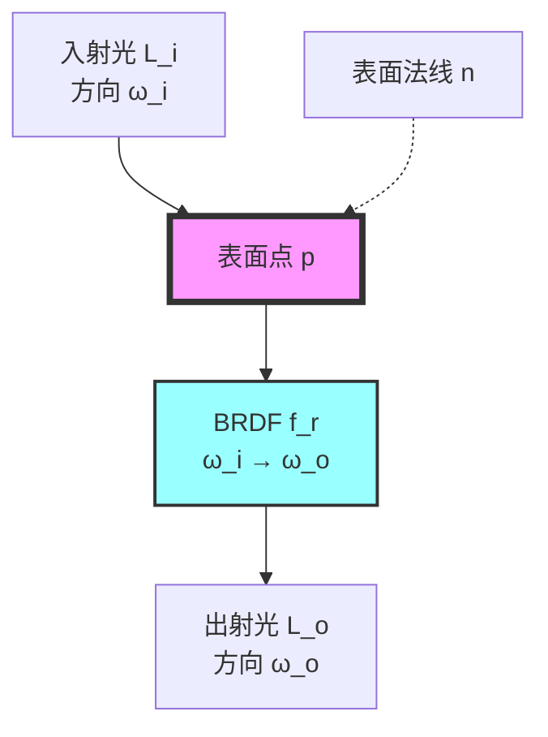

### 3.3 BRDF 的性质

#### 3.3.1 非负性

```
f_r(ω_i, ω_o) ≥ 0  对所有 ω_i, ω_o
```

物理意义：不能产生负的光线

#### 3.3.2 Helmholtz 互易性

```
f_r(ω_i, ω_o) = f_r(ω_o, ω_i)
```

物理意义：交换入射和出射方向，BRDF 值不变

这个性质来自于光路可逆原理，使得：
- 可以从相机追踪光线到光源（光线追踪）
- 也可以从光源追踪光线到相机（光子映射）

#### 3.3.3 能量守恒

```
∫_Ω f_r(ω_i, ω_o) cos(θ_o) dω_o ≤ 1  对所有 ω_i
```

物理意义：反射的能量不能超过入射的能量

### 3.4 BRDF 的分类

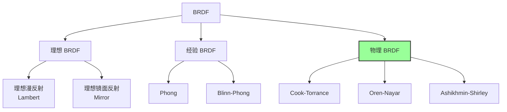

### 3.5 BRDF 的组成

大多数 BRDF 可以分解为漫反射和镜面反射两部分：

```
f_r = f_diffuse + f_specular
```

**漫反射（Diffuse）**：
- 光线均匀散射到各个方向
- 与视角无关
- 产生物体的基本颜色

**镜面反射（Specular）**：
- 光线主要沿镜面反射方向
- 与视角相关
- 产生高光效果

### 3.6 各向同性与各向异性

#### 3.6.1 各向同性 BRDF (Isotropic)

```
f_r(ω_i, ω_o) 只依赖于 θ_i, θ_o, φ_d

其中：
θ_i = 入射天顶角
θ_o = 出射天顶角
φ_d = 入射和出射方位角的差值
```

**特点**：旋转表面不改变反射特性

**例子**：大多数材质（塑料、金属、木材等）

#### 3.6.2 各向异性 BRDF (Anisotropic)

```
f_r(ω_i, ω_o) 依赖于 θ_i, θ_o, φ_i, φ_o

需要完整的方位角信息
```

**特点**：旋转表面会改变反射特性

**例子**：
- 拉丝金属
- 头发
- 天鹅绒
- CD 光盘表面

### 3.7 BRDF 的测量与表示

#### 3.7.1 测量方法

**Gonioreflectometer（测角反射计）**：
1. 固定入射角
2. 测量所有出射方向的反射率
3. 重复所有入射角

**数据量**：
- 各向同性：3 维（θ_i, θ_o, φ_d）
- 各向异性：4 维（θ_i, θ_o, φ_i, φ_o）

#### 3.7.2 表示方法

**1. 解析模型**：
- 优点：紧凑、可编辑
- 缺点：难以表示复杂材质
- 例子：Lambert、Cook-Torrance

**2. 查找表（LUT）**：
- 优点：可以表示任意 BRDF
- 缺点：内存占用大、插值误差
- 例子：MERL BRDF Database

**3. 基函数展开**：
- 优点：平衡精度和存储
- 缺点：重建开销
- 例子：球谐函数、小波

### 3.8 BRDF 的重要性采样

在路径追踪中，我们需要根据 BRDF 的分布采样方向：

```
概率密度函数 (PDF):
p(ω_o) ∝ f_r(ω_i, ω_o) cos(θ_o)

重要性采样的目标：
在 BRDF 值大的方向采样更多的样本
```

**为什么重要？**
- 减少方差
- 加快收敛
- 提高渲染质量


## 4. Lambert 漫反射模型

### 4.1 Lambert 定律的历史

**Johann Heinrich Lambert** 在 1760 年提出了 Lambert 余弦定律，这是最简单也是最基础的漫反射模型。

### 4.2 Lambert BRDF 的数学表达

```
f_lambert = ρ_d / π

其中：
ρ_d = 漫反射反照率 (albedo)，范围 [0, 1]
π = 归一化常数
```

### 4.3 为什么除以 π？

这是能量守恒的要求。让我们推导：

**步骤 1：出射辐射度**

```
L_o = f_r · L_i · cos(θ_i)
```

**步骤 2：出射辐射通量**

```
Φ_o = ∫_Ω L_o · cos(θ_o) dω_o
    = ∫_Ω f_r · L_i · cos(θ_i) · cos(θ_o) dω_o
```

**步骤 3：对于 Lambert 表面**

```
f_r = ρ_d / π (常数)

Φ_o = (ρ_d / π) · L_i · cos(θ_i) · ∫_Ω cos(θ_o) dω_o
```

**步骤 4：计算半球积分**

```
∫_Ω cos(θ_o) dω_o = ∫₀^(2π) ∫₀^(π/2) cos(θ) sin(θ) dθ dφ
                   = 2π · ∫₀^(π/2) cos(θ) sin(θ) dθ
                   = 2π · [sin²(θ)/2]₀^(π/2)
                   = π
```

**步骤 5：能量守恒**

```
Φ_o = (ρ_d / π) · L_i · cos(θ_i) · π
    = ρ_d · L_i · cos(θ_i)
    = ρ_d · Φ_i

因此：Φ_o / Φ_i = ρ_d ≤ 1 ✓
```

**结论**：除以 π 确保了能量守恒！

### 4.4 Lambert 模型的特性

#### 4.4.1 视角无关性

```
L_o(ω_o) = (ρ_d / π) · ∫_Ω L_i(ω_i) · cos(θ_i) dω_i
```

注意：出射辐射度 L_o 不依赖于观察方向 ω_o

**物理意义**：
- 从任何角度看，表面亮度相同
- 这就是为什么粉笔、纸张看起来"平"的原因

#### 4.4.2 余弦衰减

```
E = L_i · cos(θ_i)
```

**物理意义**：
- 入射角越大，单位面积接收的能量越少
- 这就是为什么正午的太阳比早晨更热

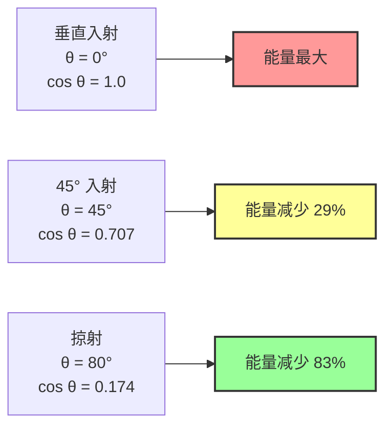

### 4.5 Lambert 模型的局限性

#### 4.5.1 过于理想化

真实世界的漫反射表面通常不是完美的 Lambert 表面：

**粗糙表面**：
- 掠射角时反射率增加（逆反射效应）
- 例子：月球表面、粗糙布料

**次表面散射**：
- 光线进入材质内部再散射出来
- 例子：皮肤、大理石、牛奶

#### 4.5.2 改进模型

**Oren-Nayar 模型**：考虑表面粗糙度

```
f_r = (ρ_d / π) · (A + B · max(0, cos(φ_i - φ_o)) · sin(α) · tan(β))

其中：
A = 1 - 0.5 · σ² / (σ² + 0.33)
B = 0.45 · σ² / (σ² + 0.09)
σ = 表面粗糙度
α = max(θ_i, θ_o)
β = min(θ_i, θ_o)
```

**Disney Diffuse 模型**：更符合真实材质

```
f_r = (ρ_d / π) · (1 + (F_D90 - 1) · (1 - cos(θ_i))⁵) · (1 + (F_D90 - 1) · (1 - cos(θ_o))⁵)

其中：
F_D90 = 0.5 + 2 · roughness · cos²(θ_d)
θ_d = 半角向量与法线的夹角
```

### 4.6 Lambert 模型的应用

#### 4.6.1 实时渲染

Lambert 模型因其简单性在实时渲染中广泛使用：

```
漫反射光照计算：
L_diffuse = (ρ_d / π) · L_light · max(0, n · l)

其中：
n = 表面法线
l = 光源方向
```

#### 4.6.2 全局光照

在路径追踪中，Lambert 表面的重要性采样：

```
采样方向：
ω_o = 余弦加权的半球采样

概率密度：
p(ω_o) = cos(θ_o) / π

蒙特卡洛估计：
L_o ≈ (1/N) · Σ [f_r · L_i · cos(θ_i) / p(ω_i)]
    = (1/N) · Σ [(ρ_d/π) · L_i · cos(θ_i) / (cos(θ_i)/π)]
    = (1/N) · Σ [ρ_d · L_i]
```

### 4.7 Lambert 模型的数值示例

**例：计算漫反射光照**

```
已知：
- 反照率 ρ_d = 0.8 (白色表面)
- 入射辐射度 L_i = 1000 W/(m²·sr)
- 入射角 θ_i = 30°
- 法线 n = (0, 1, 0)
- 光源方向 l = (0, 0.866, 0.5)

计算：
1. cos(θ_i) = n · l = 0.866

2. f_lambert = ρ_d / π = 0.8 / 3.14159 ≈ 0.2546 sr⁻¹

3. L_o = f_lambert · L_i · cos(θ_i)
       = 0.2546 · 1000 · 0.866
       ≈ 220.5 W/(m²·sr)

4. 反射率 = L_o / L_i = 0.2205 = 22.05%
```


## 5. Cook-Torrance 镜面反射模型

### 5.1 Cook-Torrance 模型的起源

**Robert L. Cook** 和 **Kenneth E. Torrance** 在 1982 年提出了基于微表面理论的镜面反射模型，这是现代 PBR（基于物理的渲染）的基础。

### 5.2 Cook-Torrance BRDF 的数学表达

```
f_specular = (D · G · F) / (4 · (n · ω_i) · (n · ω_o))

其中：
D = 法线分布函数 (Normal Distribution Function)
G = 几何函数 (Geometry Function)
F = 菲涅尔项 (Fresnel Term)
n = 宏观表面法线
ω_i = 入射方向
ω_o = 出射方向
```

### 5.3 Cook-Torrance 模型的组成

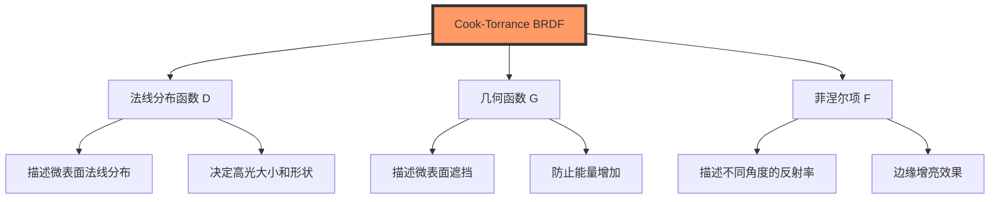

### 5.4 分母项的物理意义

```
分母 = 4 · (n · ω_i) · (n · ω_o)
```

**作用**：
1. **几何校正**：将微表面的局部坐标系转换到宏观坐标系
2. **能量守恒**：确保反射能量不超过入射能量
3. **归一化**：使 BRDF 具有正确的单位（sr⁻¹）

**推导**：

```
微表面的有效面积：
dA_micro = dA_macro / cos(θ_o)

微表面接收的能量：
dE_micro = L_i · cos(θ_i_micro) · dω_i

转换到宏观坐标系：
dE_macro = dE_micro · (dA_micro / dA_macro)
         = L_i · cos(θ_i_micro) · dω_i / cos(θ_o)

考虑立体角的转换：
dω_i_micro = dω_i · cos(θ_i) / cos(θ_i_micro)

最终得到分母中的 4 倍因子
```

### 5.5 为什么是 Cook-Torrance？

**优势**：
1. **物理正确**：基于微表面理论
2. **能量守恒**：满足物理定律
3. **参数直观**：粗糙度、金属度等参数有明确物理意义
4. **适用广泛**：可以表示多种材质

**与经验模型的对比**：

| 特性 | Phong/Blinn-Phong | Cook-Torrance |
|------|-------------------|---------------|
| 物理正确性 | ❌ 经验模型 | ✅ 物理模型 |
| 能量守恒 | ❌ 不保证 | ✅ 保证 |
| 参数意义 | ❌ 抽象 | ✅ 物理参数 |
| 边缘增亮 | ❌ 无 | ✅ 菲涅尔效应 |
| 计算复杂度 | 低 | 中等 |

### 5.6 Cook-Torrance 的变体

#### 5.6.1 不同的 D 项

**Beckmann 分布**（原始 Cook-Torrance）：
```
D_beckmann = exp(-tan²(θ_h) / α²) / (π · α² · cos⁴(θ_h))

其中：
θ_h = 半角向量与法线的夹角
α = 粗糙度参数
```

**GGX/Trowbridge-Reitz 分布**（现代标准）：
```
D_GGX = α² / (π · ((n · h)² · (α² - 1) + 1)²)

优点：
- 更长的尾部（更真实的高光衰减）
- 数值稳定性更好
- 计算效率更高
```

#### 5.6.2 不同的 G 项

**Smith 几何函数**：
```
G_smith = G₁(ω_i) · G₁(ω_o)

其中 G₁ 是单向遮挡函数
```

**Schlick-GGX 近似**：
```
G₁(ω) = (n · ω) / ((n · ω) · (1 - k) + k)

其中：
k = α / 2  (直接光照)
k = α² / 2  (IBL)
```

### 5.7 完整的 PBR 着色方程

结合漫反射和镜面反射：

```
f_r = f_diffuse + f_specular
    = (1 - F) · (ρ_d / π) + (D · G · F) / (4 · (n · ω_i) · (n · ω_o))

其中：
(1 - F) = 漫反射比例（能量守恒）
F = 镜面反射比例
```

**金属与非金属的区别**：

```
非金属（电介质）：
- F₀ ≈ 0.04 (4% 反射率)
- 有漫反射
- 基础颜色用于漫反射

金属（导体）：
- F₀ = 基础颜色 (高反射率)
- 无漫反射
- 基础颜色用于镜面反射
```

### 5.8 数值示例

**例：计算镜面反射**

```
已知：
- 粗糙度 α = 0.3
- 金属度 metallic = 0.0 (非金属)
- 基础颜色 baseColor = (0.8, 0.8, 0.8)
- 入射方向 ω_i，出射方向 ω_o
- 半角向量 h = normalize(ω_i + ω_o)
- n · h = 0.9
- n · ω_i = 0.8
- n · ω_o = 0.7
- h · ω_o = 0.95

计算：

1. F₀ = 0.04 (非金属)

2. D (GGX):
   D = 0.3² / (π · ((0.9² · (0.3² - 1) + 1)²))
     = 0.09 / (π · (0.81 · (-0.91) + 1)²)
     = 0.09 / (π · 0.2629²)
     ≈ 0.414

3. G (Smith-Schlick):
   k = 0.3 / 2 = 0.15
   G₁(ω_i) = 0.8 / (0.8 · 0.85 + 0.15) = 0.842
   G₁(ω_o) = 0.7 / (0.7 · 0.85 + 0.15) = 0.824
   G = 0.842 · 0.824 = 0.694

4. F (Schlick):
   F = 0.04 + (1 - 0.04) · (1 - 0.95)⁵
     = 0.04 + 0.96 · 0.0000003125
     ≈ 0.04

5. f_specular:
   f_specular = (0.414 · 0.694 · 0.04) / (4 · 0.8 · 0.7)
              = 0.0115 / 2.24
              ≈ 0.00513 sr⁻¹

6. 镜面反射率 ≈ 0.5%（非金属的典型值）
```


## 6. 菲涅尔效应

### 6.1 菲涅尔效应的发现

**Augustin-Jean Fresnel** 在 1823 年推导出了描述光在介质界面反射和折射的方程，这就是著名的**菲涅尔方程（Fresnel Equations）**。

### 6.2 菲涅尔效应的物理现象

**观察**：
- 垂直看水面：几乎透明，能看到水底
- 掠射角看水面：像镜子一样反射天空

**原因**：反射率随入射角变化

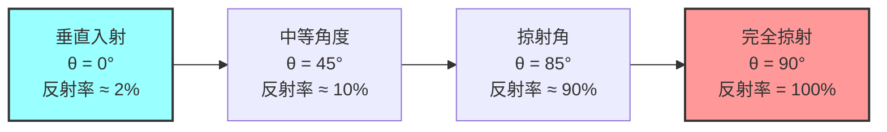

### 6.3 菲涅尔方程的完整形式

对于非偏振光，菲涅尔反射率为：

```
F = (F_s + F_p) / 2

其中：
F_s = |r_s|² = |(n₁cos(θ_i) - n₂cos(θ_t)) / (n₁cos(θ_i) + n₂cos(θ_t))|²
F_p = |r_p|² = |(n₁cos(θ_t) - n₂cos(θ_i)) / (n₁cos(θ_t) + n₂cos(θ_i))|²

n₁ = 入射介质的折射率
n₂ = 折射介质的折射率
θ_i = 入射角
θ_t = 折射角（由 Snell 定律确定）
```

**Snell 定律**：
```
n₁ · sin(θ_i) = n₂ · sin(θ_t)
```

### 6.4 Schlick 近似

完整的菲涅尔方程计算复杂，**Christophe Schlick** 在 1994 年提出了一个简单而精确的近似：

```
F_schlick(θ) = F₀ + (1 - F₀) · (1 - cos(θ))⁵

其中：
F₀ = 垂直入射时的反射率
θ = 入射角（或半角向量与视线的夹角）
```

**F₀ 的计算**：

对于电介质（非金属）：
```
F₀ = ((n₁ - n₂) / (n₁ + n₂))²

常见材质的 F₀：
- 空气/水：F₀ = ((1 - 1.33) / (1 + 1.33))² ≈ 0.02
- 空气/玻璃：F₀ = ((1 - 1.5) / (1 + 1.5))² ≈ 0.04
- 空气/钻石：F₀ = ((1 - 2.42) / (1 + 2.42))² ≈ 0.17
```

对于金属（导体）：
```
F₀ = 基础颜色（RGB）

常见金属的 F₀：
- 铁：(0.56, 0.57, 0.58)
- 铜：(0.95, 0.64, 0.54)
- 金：(1.00, 0.71, 0.29)
- 铝：(0.91, 0.92, 0.92)
- 银：(0.95, 0.93, 0.88)
```

### 6.5 Schlick 近似的精度

```
误差分析：

对于 F₀ = 0.04（玻璃）：
θ = 0°:   F_exact = 0.040, F_schlick = 0.040, 误差 = 0.0%
θ = 30°:  F_exact = 0.042, F_schlick = 0.042, 误差 = 0.0%
θ = 60°:  F_exact = 0.088, F_schlick = 0.087, 误差 = 1.1%
θ = 80°:  F_exact = 0.441, F_schlick = 0.434, 误差 = 1.6%
θ = 85°:  F_exact = 0.721, F_schlick = 0.710, 误差 = 1.5%
θ = 89°:  F_exact = 0.969, F_schlick = 0.961, 误差 = 0.8%

结论：Schlick 近似非常精确！
```

### 6.6 菲涅尔效应的应用

#### 6.6.1 边缘增亮（Rim Lighting）

```
边缘增亮因子 = (1 - cos(θ))⁵

当视线与表面法线接近垂直时：
- cos(θ) → 0
- 因子 → 1
- 反射率增加
```

这就是为什么物体边缘看起来更亮的原因。

#### 6.6.2 能量守恒

```
反射能量 + 折射能量 = 入射能量

F + T = 1

其中：
F = 菲涅尔反射率
T = 透射率 = 1 - F
```

在 PBR 中：
```
镜面反射比例 = F
漫反射比例 = (1 - F) · (1 - metallic)

金属没有漫反射，所以：
metallic = 1 时，漫反射比例 = 0
```

### 6.7 复折射率与导体

对于导体（金属），折射率是复数：

```
n̂ = n + i·k

其中：
n = 实部（折射率）
k = 虚部（消光系数）
```

**完整的菲涅尔方程**（导体）：

```
F = ((n - 1)² + k²) / ((n + 1)² + k²)

这就是为什么金属有彩色的 F₀
```

### 6.8 菲涅尔效应的视觉影响

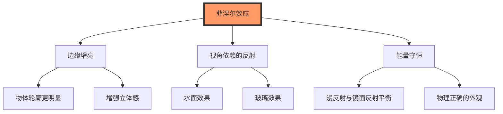

### 6.9 数值示例

**例1：计算水面的菲涅尔反射率**

```
已知：
- 空气折射率 n₁ = 1.0
- 水折射率 n₂ = 1.33
- 观察角度 θ = 60°

计算：

1. F₀ = ((1 - 1.33) / (1 + 1.33))²
      = (-0.33 / 2.33)²
      ≈ 0.0201

2. cos(60°) = 0.5

3. F_schlick = 0.0201 + (1 - 0.0201) · (1 - 0.5)⁵
             = 0.0201 + 0.9799 · 0.03125
             ≈ 0.0507

结论：60° 角度看水面，约 5% 的光被反射
```

**例2：金属的菲涅尔反射**

```
已知：
- 金的 F₀ = (1.0, 0.71, 0.29)
- 观察角度 θ = 80°

计算：

cos(80°) = 0.1736

F_schlick = (1.0, 0.71, 0.29) + (0, 0.29, 0.71) · (1 - 0.1736)⁵
          = (1.0, 0.71, 0.29) + (0, 0.29, 0.71) · 0.3504
          ≈ (1.0, 0.81, 0.54)

结论：掠射角时，金色变得更亮、更白
```


## 7. 微表面理论

### 7.1 微表面理论的基本概念

**微表面理论（Microfacet Theory）** 认为：宏观上粗糙的表面，在微观上由大量微小的完美镜面组成。

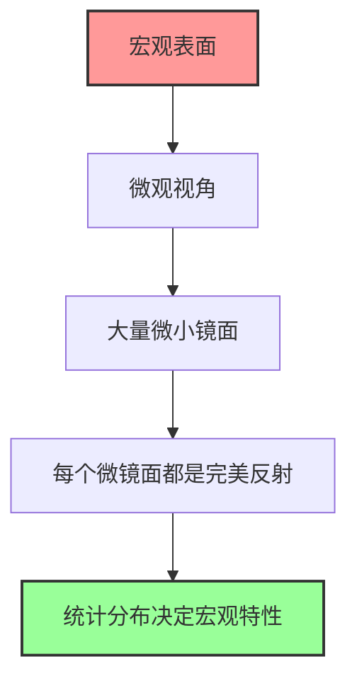

### 7.2 微表面的统计描述

#### 7.2.1 法线分布函数 (NDF)

**定义**：描述微表面法线的统计分布

```
D(h) = 微表面法线为 h 的概率密度

性质：
1. D(h) ≥ 0  (非负)
2. ∫_Ω D(h) · (n · h) dω_h = 1  (归一化)
```

**物理意义**：
- D(h) 大：很多微表面法线指向 h 方向
- D(h) 小：很少微表面法线指向 h 方向

#### 7.2.2 GGX 法线分布

**数学表达**：

```
D_GGX(h) = α² / (π · ((n · h)² · (α² - 1) + 1)²)

其中：
α = roughness²  (粗糙度的平方)
n = 宏观表面法线
h = 半角向量
```

**特性分析**：

```
当 α → 0 (光滑表面):
D_GGX → δ(h - n)  (狄拉克函数，完美镜面)

当 α → 1 (粗糙表面):
D_GGX → 1/π  (均匀分布)
```

**GGX 的优势**：

1. **长尾分布**：
```
对于大角度 θ：
D_GGX ∝ 1 / θ⁴

而 Beckmann：
D_beckmann ∝ exp(-θ²)

GGX 衰减更慢，更符合真实材质
```

2. **数值稳定性**：
```
分母永远 > 0，不会出现除零
```

### 7.3 几何函数 (Geometry Function)

#### 7.3.1 遮挡与阴影

微表面之间会相互遮挡：

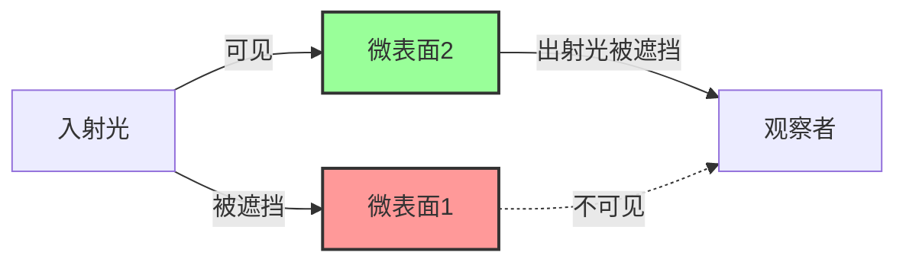

**两种遮挡**：
1. **Shadowing**：入射光被遮挡
2. **Masking**：出射光被遮挡

#### 7.3.2 Smith 几何函数

**定义**：

```
G(ω_i, ω_o) = G₁(ω_i) · G₁(ω_o)

其中 G₁ 是单向遮挡函数：
G₁(ω) = (n · ω) / ((n · ω) · (1 - k) + k)

k = α / 2  (直接光照)
k = α² / 2  (IBL)
```

**物理意义**：

```
G₁(ω) = 可见微表面的比例

G₁ = 1: 所有微表面都可见（光滑表面）
G₁ < 1: 部分微表面被遮挡（粗糙表面）
```

#### 7.3.3 高度相关的遮挡

Smith 假设遮挡是独立的，但实际上：

```
高的微表面更不容易被遮挡
低的微表面更容易被遮挡
```

**改进模型**：

```
G_height_correlated = G₁(ω_i) · G₁(ω_o) / (G₁(ω_i) + G₁(ω_o) - G₁(ω_i) · G₁(ω_o))
```

### 7.4 微表面 BRDF 的推导

#### 7.4.1 从微观到宏观

**步骤 1：单个微表面的反射**

```
完美镜面反射：
f_micro = δ(ω_r - reflect(ω_i, h)) / (n · ω_i)

其中：
ω_r = 镜面反射方向
h = 微表面法线
```

**步骤 2：统计平均**

```
f_macro = ∫ f_micro · D(h) · G(ω_i, ω_o, h) dh
```

**步骤 3：菲涅尔效应**

```
f_macro = ∫ f_micro · D(h) · G(ω_i, ω_o, h) · F(ω_i, h) dh
```

**步骤 4：简化积分**

利用镜面反射的性质：
```
ω_o = reflect(ω_i, h)
⟺ h = normalize(ω_i + ω_o)
```

最终得到：

```
f_r = (D(h) · G(ω_i, ω_o) · F(ω_i, h)) / (4 · (n · ω_i) · (n · ω_o))
```

### 7.5 粗糙度的物理意义

#### 7.5.1 粗糙度参数

```
α = roughness²

roughness ∈ [0, 1]:
- 0: 完美镜面
- 0.5: 中等粗糙
- 1: 完全粗糙
```

#### 7.5.2 粗糙度对外观的影响

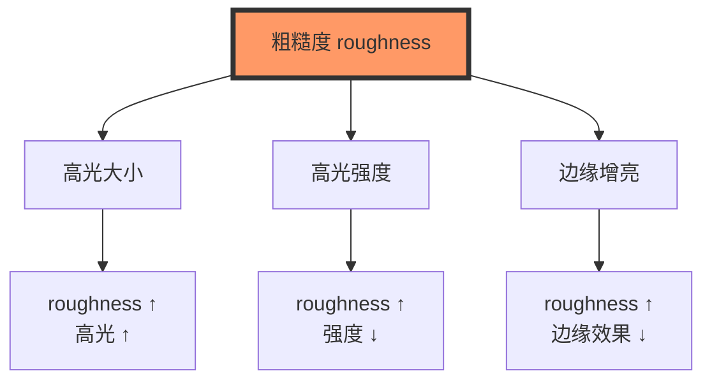

**数值关系**：

```
roughness = 0.0:  高光半径 ≈ 0°
roughness = 0.2:  高光半径 ≈ 10°
roughness = 0.5:  高光半径 ≈ 30°
roughness = 0.8:  高光半径 ≈ 60°
roughness = 1.0:  高光半径 ≈ 90°
```

### 7.6 各向异性微表面

#### 7.6.1 各向异性的原因

表面具有方向性的微结构：
- 拉丝金属：沿拉丝方向的沟槽
- 头发：沿纤维方向的鳞片
- 布料：编织纹理

#### 7.6.2 各向异性 GGX

```
D_aniso(h) = 1 / (π · α_x · α_y · ((h_x/α_x)² + (h_y/α_y)² + h_z²)²)

其中：
α_x = roughness_x²  (切线方向粗糙度)
α_y = roughness_y²  (副切线方向粗糙度)
h_x, h_y, h_z = 半角向量在切线空间的分量
```

**特殊情况**：
```
α_x = α_y: 各向同性（普通 GGX）
α_x ≠ α_y: 各向异性（椭圆形高光）
```

### 7.7 微表面理论的局限性

#### 7.7.1 假设条件

1. **几何光学近似**：
   - 忽略波动光学效应（衍射、干涉）
   - 微表面尺寸 >> 波长

2. **单次散射**：
   - 忽略微表面之间的多次反射
   - 粗糙表面会有能量损失

3. **统计独立性**：
   - 假设微表面法线独立分布
   - 实际表面有空间相关性

#### 7.7.2 改进方向

**多次散射**：

```
f_r = f_single + f_multiple

f_multiple 考虑微表面之间的多次反射
```

**波动光学**：

```
考虑衍射效应：
- 彩虹色（CD 光盘）
- 干涉条纹（肥皂泡）
```

### 7.8 数值示例

**例：计算不同粗糙度的 NDF**

```
已知：
- n · h = 0.9 (半角向量接近法线)

计算不同粗糙度的 D_GGX：

roughness = 0.1:
α = 0.01
D = 0.01 / (π · (0.81 · (-0.99) + 1)²)
  = 0.01 / (π · 0.0081²)
  ≈ 48.6

roughness = 0.5:
α = 0.25
D = 0.25 / (π · (0.81 · (-0.75) + 1)²)
  = 0.25 / (π · 0.3925²)
  ≈ 0.517

roughness = 1.0:
α = 1.0
D = 1.0 / (π · (0.81 · 0 + 1)²)
  = 1.0 / π
  ≈ 0.318

结论：
- 光滑表面：D 值很大，高光集中
- 粗糙表面：D 值较小，高光分散
```


## 8. 全局光照与环境光遮蔽

### 8.1 全局光照的概念

**全局光照（Global Illumination, GI）** 考虑场景中所有光线的传输，包括：
- 直接光照：光源直接照射
- 间接光照：光线经过多次反射

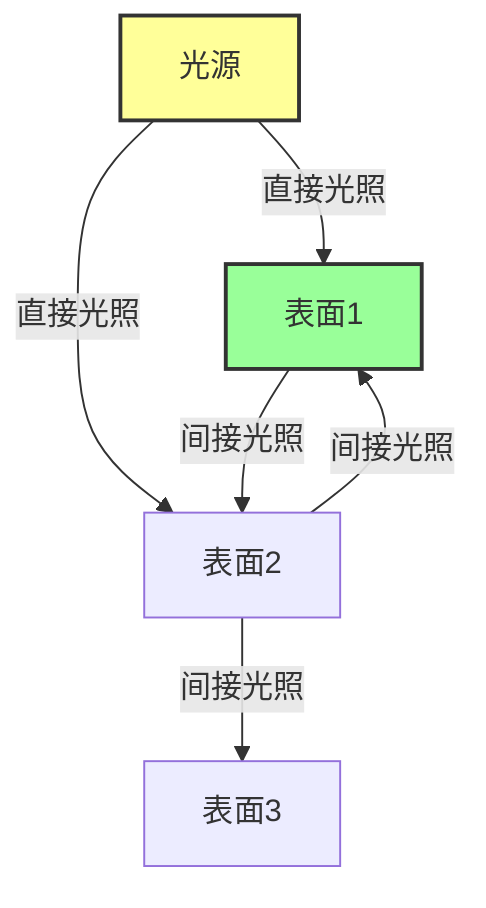

### 8.2 光线传输路径表示法

**路径表示**：

```
L: 光源 (Light)
E: 眼睛/相机 (Eye)
D: 漫反射 (Diffuse)
S: 镜面反射 (Specular)

示例路径：
LE: 直接看光源
LDE: 直接光照（一次漫反射）
LDDE: 间接光照（两次漫反射）
LSE: 镜面反射
LSDE: 镜面反射 + 漫反射
```

**正则表达式**：

```
L(D|S)*E: 所有可能的光线路径

展开：
LE + LDE + LSE + LDDE + LDSE + LSDE + LSSE + ...
```

### 8.3 环境光遮蔽 (Ambient Occlusion)

#### 8.3.1 AO 的物理意义

**定义**：一个点能够接收到环境光的程度

```
AO(p) = (1/π) · ∫_Ω V(p, ω) · cos(θ) dω

其中：
V(p, ω) = 可见性函数
         = 1 如果方向 ω 没有遮挡
         = 0 如果方向 ω 被遮挡
```

**物理意义**：
- AO = 1: 完全暴露，接收所有环境光
- AO = 0: 完全遮蔽，接收不到环境光
- 0 < AO < 1: 部分遮蔽

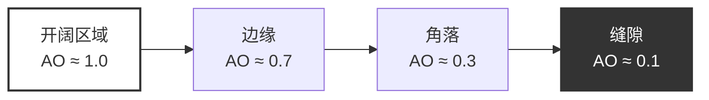

#### 8.3.2 SSAO (Screen Space Ambient Occlusion)

**算法流程**：

```
1. 对每个像素 p：
   a. 获取位置和法线
   b. 在半球内生成采样点
   c. 检查采样点的深度
   d. 计算遮蔽因子

2. 遮蔽计算：
   occlusion = 0
   for each sample s:
       if depth(s) > depth(p):
           occlusion += 1
   
   AO = 1 - (occlusion / sampleCount)
```

**优点**：
- 实时性能好
- 不需要场景几何信息

**缺点**：
- 只考虑屏幕空间
- 有屏幕边缘伪影
- 采样噪声

#### 8.3.3 HBAO (Horizon-Based Ambient Occlusion)

**改进思路**：考虑地平线角度

```
对每个方向 φ：
1. 沿方向采样多个点
2. 计算最大地平线角 θ_max
3. 遮蔽 = sin(θ_max) - sin(θ_horizon)

其中：
θ_horizon = 表面法线与水平面的夹角
```

**优势**：
- 更准确的遮蔽计算
- 更少的采样噪声
- 更好的细节保留

### 8.4 辐照度环境贴图

#### 8.4.1 环境贴图的概念

**环境贴图（Environment Map）**：存储周围环境的光照信息

```
类型：
1. Cube Map: 6 个面的立方体贴图
2. Equirectangular: 球面全景图
3. Octahedral: 八面体投影
```

#### 8.4.2 辐照度卷积

**目标**：预计算漫反射的环境光照

```
E(n) = ∫_Ω L_i(ω) · cos(θ) dω

离散化：
E(n) ≈ Σ L_i(ω_k) · cos(θ_k) · Δω_k
```

**实现**：

```
对环境贴图的每个像素：
1. 确定法线方向 n
2. 在半球内采样
3. 累加加权的辐射度
4. 存储到辐照度贴图
```

**采样策略**：

```
球面坐标采样：
for φ in [0, 2π]:
    for θ in [0, π/2]:
        direction = sphericalToCartesian(θ, φ)
        weight = cos(θ) · sin(θ)
        irradiance += sampleEnvMap(direction) · weight

归一化：
irradiance *= π / sampleCount
```

### 8.5 预过滤环境贴图

#### 8.5.1 镜面反射的环境光照

**问题**：不同粗糙度需要不同的模糊程度

```
roughness = 0.0: 清晰的镜面反射
roughness = 0.5: 模糊的反射
roughness = 1.0: 完全模糊（接近漫反射）
```

**解决方案**：预过滤 Mipmap

```
Mip Level 0: roughness = 0.0 (原始环境贴图)
Mip Level 1: roughness = 0.2
Mip Level 2: roughness = 0.4
...
Mip Level N: roughness = 1.0
```

#### 8.5.2 重要性采样

**目标**：根据 BRDF 分布采样

```
采样方向的概率密度：
p(ω) ∝ D(h) · (n · h)

使用 GGX 重要性采样：
1. 生成随机数 (ξ₁, ξ₂)
2. 计算球面坐标：
   θ = arctan(α · √ξ₁ / √(1 - ξ₁))
   φ = 2π · ξ₂
3. 转换为笛卡尔坐标
4. 采样环境贴图
```

### 8.6 Split Sum 近似

**Epic Games 的方法**：

```
∫_Ω L_i(ω) · f_r(ω_i, ω_o) · (n · ω_i) dω_i
≈ (∫_Ω L_i(ω) dω) · (∫_Ω f_r(ω_i, ω_o) · (n · ω_i) dω_i)

第一项：预过滤环境贴图
第二项：BRDF 积分贴图（2D LUT）
```

**BRDF LUT**：

```
输入：
- x 轴：n · ω_o (视角)
- y 轴：roughness (粗糙度)

输出：
- R 通道：∫ f_r · (n · ω_i) dω_i
- G 通道：∫ (1 - f_r) · (n · ω_i) dω_i
```

### 8.7 球谐函数 (Spherical Harmonics)

#### 8.7.1 SH 的数学基础

**定义**：球面上的正交基函数

```
Y_l^m(θ, φ) = 球谐函数

性质：
1. 正交性：∫ Y_l^m · Y_l'^m' dω = δ_ll' · δ_mm'
2. 完备性：任何球面函数都可以展开
```

**展开**：

```
f(ω) = Σ_l Σ_m c_l^m · Y_l^m(ω)

其中：
c_l^m = ∫ f(ω) · Y_l^m(ω) dω  (系数)
```

#### 8.7.2 SH 在光照中的应用

**优势**：
- 紧凑表示（9 个系数 = 3 阶 SH）
- 快速旋转
- 支持卷积

**漫反射光照**：

```
E(n) = Σ_l Σ_m c_l^m · Y_l^m(n) · A_l

其中：
A_l = 卷积系数
A₀ = π
A₁ = 2π/3
A₂ = π/4
```

### 8.8 光照探针 (Light Probes)

#### 8.8.1 光照探针的概念

**定义**：场景中特定位置的环境光照采样

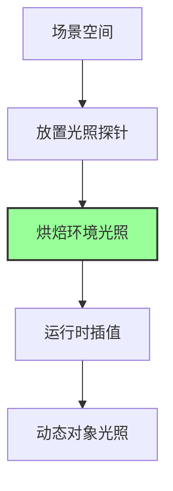

#### 8.8.2 探针插值

**方法**：

```
1. 四面体插值：
   - 找到包含点 p 的四面体
   - 使用重心坐标插值

2. 最近邻插值：
   - 找到最近的 N 个探针
   - 距离加权平均

3. 球谐插值：
   - 插值 SH 系数
   - 重建光照
```

### 8.9 数值示例

**例：计算 AO**

```
已知：
- 采样点数 N = 64
- 半球半径 r = 0.5
- 遮挡点数 occluded = 20

计算：
AO = 1 - (occluded / N)
   = 1 - (20 / 64)
   = 1 - 0.3125
   = 0.6875

结论：该点接收约 69% 的环境光
```

**例：SH 光照计算**

```
已知：
- SH 系数 c = [1.0, 0.5, -0.3, 0.2, ...]
- 法线 n = (0, 1, 0)

计算（3 阶 SH）：
Y₀⁰ = 0.282095
Y₁⁻¹ = 0.488603 · n.y
Y₁⁰ = 0.488603 · n.z
Y₁¹ = 0.488603 · n.x
...

E(n) = c₀ · Y₀⁰ · π + c₁ · Y₁⁻¹ · (2π/3) + ...
     ≈ 1.0 · 0.282095 · π + 0.5 · 0.488603 · (2π/3) + ...
     ≈ 0.886 + 0.512 + ...
     ≈ 1.5 W/(m²·sr)
```


## 9. 图像基础光照 IBL

### 9.1 IBL 的基本原理

**图像基础光照（Image-Based Lighting）** 使用环境贴图作为光源，提供真实的环境光照。

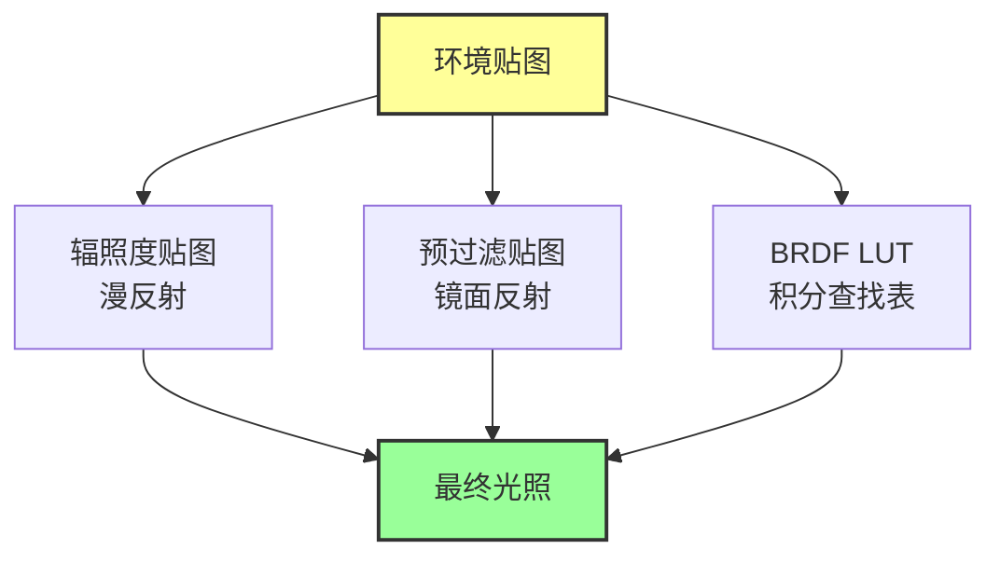

### 9.2 IBL 的数学表达

**完整的 IBL 方程**：

```
L_o(p, ω_o) = ∫_Ω L_i(ω_i) · f_r(p, ω_i, ω_o) · (n · ω_i) dω_i

分解为漫反射和镜面反射：
L_o = L_diffuse + L_specular
```

#### 9.2.1 漫反射 IBL

```
L_diffuse = (ρ_d / π) · ∫_Ω L_i(ω_i) · (n · ω_i) dω_i
          = (ρ_d / π) · E(n)

其中：
E(n) = 辐照度（预计算）
```

**实现**：
```
1. 预计算：卷积环境贴图生成辐照度贴图
2. 运行时：采样辐照度贴图
```

#### 9.2.2 镜面反射 IBL

```
L_specular = ∫_Ω L_i(ω_i) · f_r(ω_i, ω_o) · (n · ω_i) dω_i

使用 Split Sum 近似：
L_specular ≈ (∫_Ω L_i(ω_i) dω_i) · (∫_Ω f_r(ω_i, ω_o) · (n · ω_i) dω_i)
           = L_prefiltered · BRDF_integral
```

### 9.3 环境贴图格式

#### 9.3.1 Cube Map

**结构**：6 个面的立方体

```
面的排列：
+X (右), -X (左)
+Y (上), -Y (下)
+Z (前), -Z (后)

方向到面的映射：
if |x| > |y| and |x| > |z|:
    face = +X if x > 0 else -X
elif |y| > |z|:
    face = +Y if y > 0 else -Y
else:
    face = +Z if z > 0 else -Z
```

**优点**：
- 硬件支持好
- 采样简单
- 无奇点

**缺点**：
- 6 个纹理
- 边缘不连续

#### 9.3.2 Equirectangular (等距柱状投影)

**映射公式**：

```
方向 (x, y, z) → UV 坐标：
u = 0.5 + atan2(z, x) / (2π)
v = 0.5 - asin(y) / π

UV 坐标 → 方向：
θ = π · (1 - 2v)  (纬度)
φ = 2π · (u - 0.5)  (经度)

x = cos(θ) · cos(φ)
y = sin(θ)
z = cos(θ) · sin(φ)
```

**优点**：
- 单张纹理
- 易于编辑

**缺点**：
- 极点扭曲
- 采样不均匀

#### 9.3.3 Octahedral (八面体投影)

**优点**：
- 单张纹理
- 采样均匀
- 无奇点

**缺点**：
- 映射复杂
- 硬件支持少

### 9.4 辐照度贴图生成

#### 9.4.1 蒙特卡洛积分

**算法**：

```
对每个像素 (u, v)：
1. 计算法线方向 n = uvToDirection(u, v)

2. 构建切线空间：
   up = (0, 1, 0) if |n.y| < 0.999 else (1, 0, 0)
   tangent = normalize(cross(up, n))
   bitangent = cross(n, tangent)
   TBN = [tangent, bitangent, n]

3. 半球采样：
   irradiance = 0
   for i in range(sampleCount):
       ξ = random()
       direction = cosineSample(ξ)  // 余弦加权采样
       worldDir = TBN * direction
       
       radiance = sampleEnvMap(worldDir)
       irradiance += radiance * cos(θ) * sin(θ)
   
4. 归一化：
   irradiance *= π / sampleCount

5. 存储到辐照度贴图
```

#### 9.4.2 球谐函数方法

**步骤**：

```
1. 投影环境贴图到 SH：
   for each pixel in envMap:
       direction = pixelToDirection(pixel)
       radiance = envMap[pixel]
       
       for l in range(order):
           for m in range(-l, l+1):
               coeff[l][m] += radiance * SH(l, m, direction) * weight

2. 卷积（乘以 A_l）：
   coeff[l][m] *= A_l

3. 重建辐照度：
   irradiance(n) = Σ coeff[l][m] * SH(l, m, n)
```

### 9.5 预过滤环境贴图

#### 9.5.1 Mipmap 层级

**映射关系**：

```
Mip Level → Roughness：
level 0: roughness = 0.0
level 1: roughness = 0.2
level 2: roughness = 0.4
level 3: roughness = 0.6
level 4: roughness = 0.8
level 5: roughness = 1.0

或使用公式：
roughness = level / maxLevel
```

#### 9.5.2 重要性采样实现

**GGX 重要性采样**：

```
function importanceSampleGGX(ξ, n, roughness):
    α = roughness²
    
    // 球面坐标
    φ = 2π · ξ.x
    cosθ = √((1 - ξ.y) / (1 + (α² - 1) · ξ.y))
    sinθ = √(1 - cosθ²)
    
    // 切线空间
    h_tangent = (cos(φ) · sinθ, sin(φ) · sinθ, cosθ)
    
    // 转换到世界空间
    up = |n.z| < 0.999 ? (0, 0, 1) : (1, 0, 0)
    tangent = normalize(cross(up, n))
    bitangent = cross(n, tangent)
    
    h = tangent · h_tangent.x + bitangent · h_tangent.y + n · h_tangent.z
    
    return normalize(h)
```

**预过滤算法**：

```
function prefilterEnvMap(r, roughness):
    n = r  // 反射方向作为法线
    v = r  // 假设视线方向等于反射方向
    
    totalWeight = 0
    prefilteredColor = 0
    
    for i in range(sampleCount):
        ξ = hammersley(i, sampleCount)
        h = importanceSampleGGX(ξ, n, roughness)
        l = reflect(-v, h)
        
        NdotL = max(dot(n, l), 0)
        if NdotL > 0:
            // 采样环境贴图
            color = sampleEnvMap(l)
            
            // 累加
            prefilteredColor += color * NdotL
            totalWeight += NdotL
    
    return prefilteredColor / totalWeight
```

### 9.6 BRDF 积分查找表

#### 9.6.1 LUT 的生成

**积分**：

```
∫_Ω f_r(ω_i, ω_o) · (n · ω_i) dω_i

使用 Schlick 近似：
F = F₀ + (1 - F₀) · (1 - cos(θ))⁵

分解：
∫ = F₀ · ∫ (1 - (1 - cos(θ))⁵) · ... dω
  + ∫ (1 - cos(θ))⁵ · ... dω
  = F₀ · scale + bias
```

**LUT 存储**：

```
输入：
- x = n · ω_o (cos(θ_o))
- y = roughness

输出：
- R 通道 = scale
- G 通道 = bias

使用：
F_env = F₀ · scale + bias
```

#### 9.6.2 LUT 生成算法

```
for each pixel (x, y) in LUT:
    cosθ_o = x
    roughness = y
    
    // 构建视线方向
    sinθ_o = √(1 - cosθ_o²)
    v = (sinθ_o, 0, cosθ_o)
    n = (0, 0, 1)
    
    scale = 0
    bias = 0
    
    for i in range(sampleCount):
        ξ = hammersley(i, sampleCount)
        h = importanceSampleGGX(ξ, n, roughness)
        l = reflect(-v, h)
        
        NdotL = max(l.z, 0)
        NdotH = max(h.z, 0)
        VdotH = max(dot(v, h), 0)
        
        if NdotL > 0:
            G = geometrySmith(n, v, l, roughness)
            G_vis = G * VdotH / (NdotH * cosθ_o)
            Fc = (1 - VdotH)⁵
            
            scale += (1 - Fc) * G_vis
            bias += Fc * G_vis
    
    scale /= sampleCount
    bias /= sampleCount
    
    LUT[x][y] = (scale, bias)
```

### 9.7 IBL 的完整实现

**着色器代码结构**：

```
// 1. 漫反射 IBL
vec3 irradiance = texture(irradianceMap, n).rgb
vec3 diffuse = irradiance * albedo

// 2. 镜面反射 IBL
vec3 r = reflect(-v, n)
float lod = roughness * maxMipLevel
vec3 prefilteredColor = textureLod(prefilterMap, r, lod).rgb

vec2 envBRDF = texture(brdfLUT, vec2(NdotV, roughness)).rg
vec3 specular = prefilteredColor * (F0 * envBRDF.x + envBRDF.y)

// 3. 组合
vec3 ambient = (kD * diffuse + specular) * ao

// 4. 最终颜色
vec3 color = ambient + directLighting
```

### 9.8 IBL 的优化技术

#### 9.8.1 采样优化

**分层采样**：
```
将半球分成多个层
每层采样固定数量的样本
确保样本分布均匀
```

**低差异序列**：
```
使用 Hammersley 或 Halton 序列
比随机采样收敛更快
```

#### 9.8.2 存储优化

**压缩格式**：
```
RGBM: RGB + Multiplier
RGBE: RGB + Exponent (Radiance HDR)
BC6H: 硬件压缩 HDR 格式
```

**分辨率选择**：
```
辐照度贴图: 32×32 或 64×64 (低频)
预过滤贴图: 512×512 或 1024×1024 (高频)
BRDF LUT: 512×512 (2D)
```

### 9.9 数值示例

**例：计算 IBL 光照**

```
已知：
- 法线 n = (0, 1, 0)
- 视线 v = (0, 0.866, 0.5)
- 粗糙度 roughness = 0.3
- 金属度 metallic = 0.0
- 基础颜色 albedo = (0.8, 0.8, 0.8)

计算：

1. 漫反射：
   irradiance = sampleIrradiance(n) = (1.5, 1.5, 1.5)
   kD = (1 - F) * (1 - metallic) ≈ 0.96
   diffuse = kD * albedo * irradiance / π
           = 0.96 * 0.8 * 1.5 / π
           ≈ (0.367, 0.367, 0.367)

2. 镜面反射：
   r = reflect(-v, n) = (0, 0.866, -0.5)
   lod = 0.3 * 5 = 1.5
   prefilteredColor = samplePrefilter(r, 1.5) = (2.0, 2.0, 2.0)
   
   NdotV = dot(n, v) = 0.866
   envBRDF = sampleBRDF(0.866, 0.3) = (0.8, 0.2)
   
   F0 = 0.04
   specular = prefilteredColor * (F0 * 0.8 + 0.2)
            = 2.0 * (0.032 + 0.2)
            = 2.0 * 0.232
            = (0.464, 0.464, 0.464)

3. 总环境光照：
   ambient = diffuse + specular
           = (0.367, 0.367, 0.367) + (0.464, 0.464, 0.464)
           = (0.831, 0.831, 0.831)
```


## 10. 能量守恒原理

### 10.1 能量守恒的物理基础

**能量守恒定律**：在封闭系统中，能量既不会凭空产生，也不会凭空消失，只能从一种形式转化为另一种形式。

在渲染中：
```
入射能量 = 反射能量 + 吸收能量 + 透射能量

Φ_i = Φ_r + Φ_a + Φ_t
```

对于不透明表面：
```
Φ_i = Φ_r + Φ_a

反射率 + 吸收率 = 1
ρ + α = 1
```

### 10.2 BRDF 的能量守恒条件

**数学表达**：

```
∫_Ω f_r(ω_i, ω_o) · cos(θ_o) dω_o ≤ 1  对所有 ω_i

物理意义：
反射的能量不能超过入射的能量
```

**验证 Lambert BRDF**：

```
f_lambert = ρ_d / π

∫_Ω (ρ_d / π) · cos(θ_o) dω_o
= (ρ_d / π) · ∫_Ω cos(θ_o) dω_o
= (ρ_d / π) · π
= ρ_d ≤ 1 ✓

结论：Lambert BRDF 满足能量守恒
```

### 10.3 漫反射与镜面反射的能量分配

#### 10.3.1 菲涅尔项的作用

```
总反射 = 镜面反射 + 漫反射

F = 镜面反射比例
1 - F = 可用于漫反射的能量
```

**完整的能量分配**：

```
f_r = k_s · f_specular + k_d · f_diffuse

其中：
k_s = F  (镜面反射比例)
k_d = (1 - F) · (1 - metallic)  (漫反射比例)
```

**为什么乘以 (1 - metallic)？**

```
金属的特性：
- 没有漫反射（所有能量都是镜面反射）
- metallic = 1 时，k_d = 0

非金属的特性：
- 有漫反射和镜面反射
- metallic = 0 时，k_d = 1 - F
```

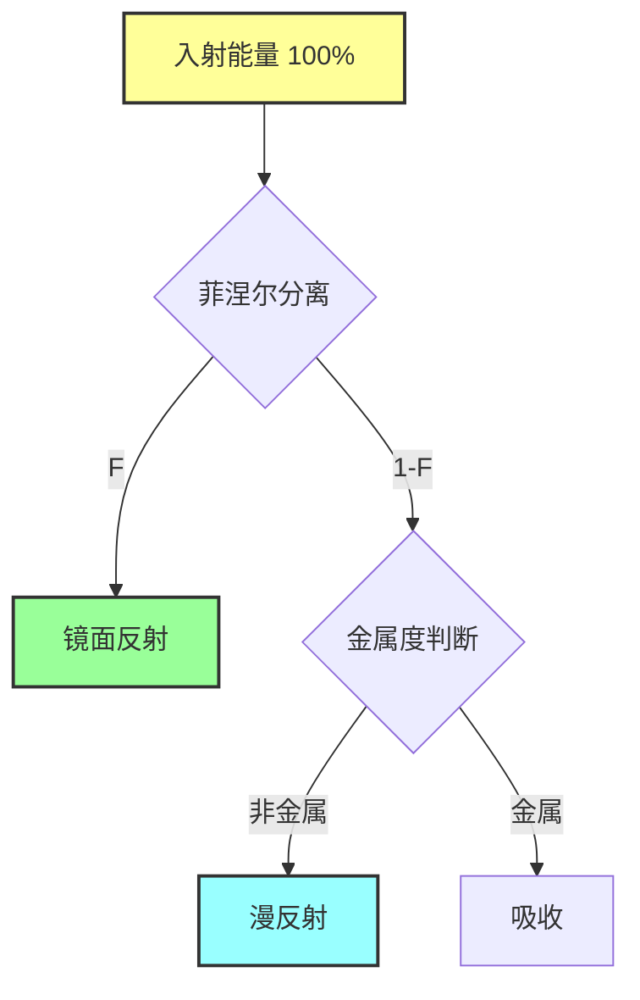

#### 10.3.2 数值示例

**例1：非金属材质**

```
已知：
- F = 0.04 (垂直入射)
- metallic = 0.0
- albedo = 0.8

计算能量分配：

镜面反射：
k_s = F = 0.04 = 4%

漫反射：
k_d = (1 - F) · (1 - metallic)
    = (1 - 0.04) · (1 - 0)
    = 0.96 = 96%

实际漫反射：
diffuse = k_d · albedo = 0.96 · 0.8 = 0.768 = 76.8%

吸收：
absorbed = 1 - 0.04 - 0.768 = 0.192 = 19.2%

验证：4% + 76.8% + 19.2% = 100% ✓
```

**例2：金属材质**

```
已知：
- F = (0.95, 0.64, 0.54) (铜的 F₀)
- metallic = 1.0
- albedo = (0.95, 0.64, 0.54)

计算能量分配：

镜面反射：
k_s = F = (0.95, 0.64, 0.54) = 95%, 64%, 54%

漫反射：
k_d = (1 - F) · (1 - metallic) = 0 (金属无漫反射)

吸收：
absorbed = 1 - F = (0.05, 0.36, 0.46) = 5%, 36%, 46%

验证（红色通道）：95% + 0% + 5% = 100% ✓
```

### 10.4 多次散射的能量损失

#### 10.4.1 单次散射的局限

标准的 Cook-Torrance 模型只考虑单次散射：

```
光线 → 微表面 → 观察者

忽略了：
光线 → 微表面1 → 微表面2 → 观察者
```

**能量损失**：

```
粗糙表面的多次散射：
- 单次散射：约 70% 能量
- 多次散射：约 30% 能量（被忽略）

结果：粗糙金属看起来比实际更暗
```

#### 10.4.2 多次散射补偿

**Kulla-Conty 方法**：

```
E_avg = ∫∫ f_r(ω_i, ω_o) · cos(θ_i) · cos(θ_o) dω_i dω_o

能量损失：
E_loss = 1 - E_avg

补偿项：
f_ms = E_loss / (π · (1 - E_avg))

最终 BRDF：
f_total = f_single + f_ms
```

**预计算表**：

```
E_avg(roughness, cos(θ)):
- 输入：粗糙度和角度
- 输出：平均反射能量
- 存储：2D 查找表
```

### 10.5 透明材质的能量守恒

#### 10.5.1 反射与透射

```
F + T = 1

其中：
F = 菲涅尔反射率
T = 透射率 = 1 - F
```

**折射定律（Snell's Law）**：

```
n₁ · sin(θ_i) = n₂ · sin(θ_t)

其中：
n₁ = 入射介质折射率
n₂ = 折射介质折射率
θ_i = 入射角
θ_t = 折射角
```

#### 10.5.2 全内反射

```
临界角：
θ_c = arcsin(n₂ / n₁)

当 θ_i > θ_c 时：
- 发生全内反射
- T = 0, F = 1
- 所有能量被反射
```

**例：水到空气**

```
n_water = 1.33
n_air = 1.0

θ_c = arcsin(1.0 / 1.33) ≈ 48.75°

当入射角 > 48.75° 时，发生全内反射
这就是为什么在水下看水面像镜子
```

### 10.6 次表面散射的能量守恒

#### 10.6.1 BSSRDF

**双向散射表面反射分布函数**：

```
S(x_i, ω_i, x_o, ω_o)

描述：
光线在 x_i 点入射，在 x_o 点出射
考虑材质内部的散射
```

**能量守恒**：

```
∫∫ S(x_i, ω_i, x_o, ω_o) · cos(θ_o) dA_o dω_o ≤ 1
```

#### 10.6.2 漫反射近似

**Dipole 模型**：

```
R_d(r) = (α' / 4π) · (z_r · (σ_tr + 1/d_r) · exp(-σ_tr · d_r) / d_r²
                     + z_v · (σ_tr + 1/d_v) · exp(-σ_tr · d_v) / d_v²)

其中：
r = 入射点和出射点的距离
α' = 减少的反照率
σ_tr = 传输系数
z_r, z_v = 虚拟光源位置
d_r, d_v = 距离
```

### 10.7 实时渲染中的能量守恒

#### 10.7.1 归一化因子

**Blinn-Phong 的问题**：

```
f_blinn = k_s · (n · h)^α

问题：不满足能量守恒
当 α 增加时，高光变小但总能量不变
```

**归一化 Blinn-Phong**：

```
f_normalized = k_s · ((α + 2) / (2π)) · (n · h)^α

归一化因子 (α + 2) / (2π) 确保能量守恒
```

#### 10.7.2 验证方法

**数值积分**：

```
function verifyEnergyConservation(brdf):
    totalEnergy = 0
    sampleCount = 10000
    
    for i in range(sampleCount):
        ω_o = cosineSample()
        energy = brdf(ω_i, ω_o) * cos(θ_o)
        totalEnergy += energy
    
    averageEnergy = totalEnergy / sampleCount * 2π
    
    if averageEnergy > 1.0:
        print("违反能量守恒！")
    else:
        print(f"能量守恒：{averageEnergy * 100}%")
```

### 10.8 常见错误与修正

#### 10.8.1 错误1：忘记归一化

```
❌ 错误：
f_diffuse = albedo

✅ 正确：
f_diffuse = albedo / π
```

#### 10.8.2 错误2：重复计算菲涅尔

```
❌ 错误：
diffuse = F · albedo / π
specular = F · D · G / (4 · NdotI · NdotO)

✅ 正确：
diffuse = (1 - F) · albedo / π
specular = F · D · G / (4 · NdotI · NdotO)
```

#### 10.8.3 错误3：金属的漫反射

```
❌ 错误：
diffuse = albedo / π  (对所有材质)

✅ 正确：
diffuse = (1 - metallic) · albedo / π
```

### 10.9 能量守恒的视觉影响

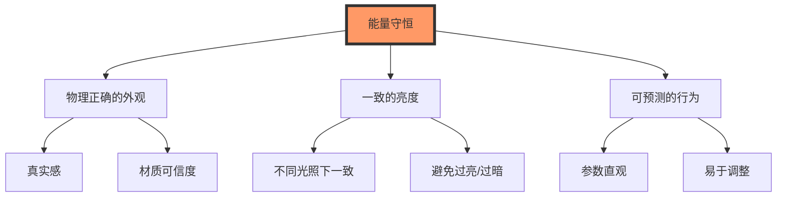

### 10.10 总结

**能量守恒的关键点**：

1. **BRDF 归一化**：
   ```
   ∫ f_r · cos(θ) dω ≤ 1
   ```

2. **漫反射与镜面反射分离**：
   ```
   k_d = (1 - F) · (1 - metallic)
   k_s = F
   ```

3. **多次散射补偿**：
   ```
   f_total = f_single + f_multiple
   ```

4. **透明材质**：
   ```
   F + T = 1
   ```

5. **次表面散射**：
   ```
   ∫∫ S · cos(θ) dA dω ≤ 1
   ```

**验证清单**：
- [ ] BRDF 积分 ≤ 1
- [ ] 漫反射使用 (1 - F)
- [ ] 金属无漫反射
- [ ] 归一化因子正确
- [ ] 透射率 = 1 - 反射率

---

## 参考文献

### 经典论文

1. **Kajiya, J. T.** (1986). "The Rendering Equation". SIGGRAPH '86.
2. **Cook, R. L., & Torrance, K. E.** (1982). "A Reflectance Model for Computer Graphics". ACM TOG.
3. **Schlick, C.** (1994). "An Inexpensive BRDF Model for Physically-based Rendering". Computer Graphics Forum.
4. **Walter, B., et al.** (2007). "Microfacet Models for Refraction through Rough Surfaces". EGSR.
5. **Kulla, C., & Conty, A.** (2017). "Revisiting Physically Based Shading at Imageworks". SIGGRAPH Course.

### 书籍

1. **Physically Based Rendering: From Theory to Implementation** (3rd Edition)
   - Matt Pharr, Wenzel Jakob, Greg Humphreys
   
2. **Real-Time Rendering** (4th Edition)
   - Tomas Akenine-Möller, Eric Haines, Naty Hoffman

3. **Advanced Global Illumination** (2nd Edition)
   - Philip Dutré, Kavita Bala, Philippe Bekaert

### 在线资源

1. **Learn OpenGL - PBR Theory**
   - https://learnopengl.com/PBR/Theory

2. **Google Filament Documentation**
   - https://google.github.io/filament/Filament.html

3. **SIGGRAPH Courses**
   - Physically Based Shading in Theory and Practice

4. **Shadertoy**
   - https://www.shadertoy.com/

---

**版本**: 1.0  
**最后更新**: 2024年  
**作者**: 计算机图形学研究者

本文档提供了渲染方程与光照模型的深入理论分析，适合图形学研究者和高级开发者参考。

